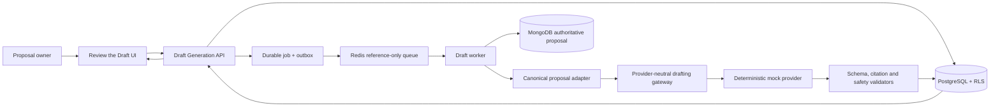
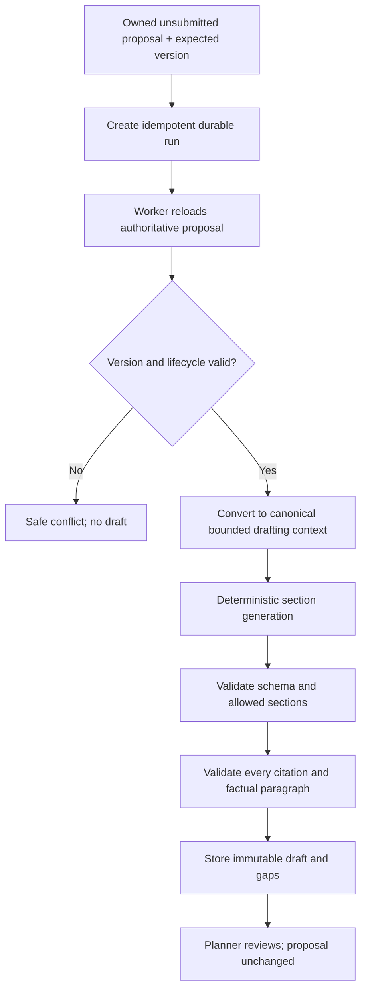
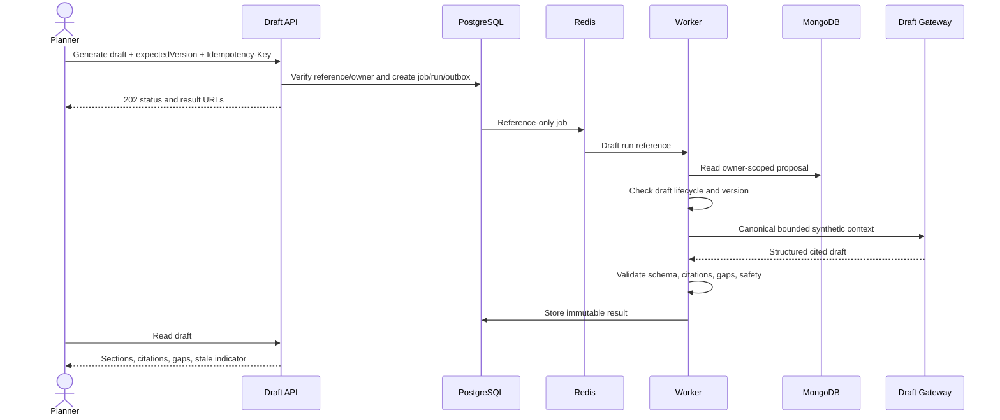
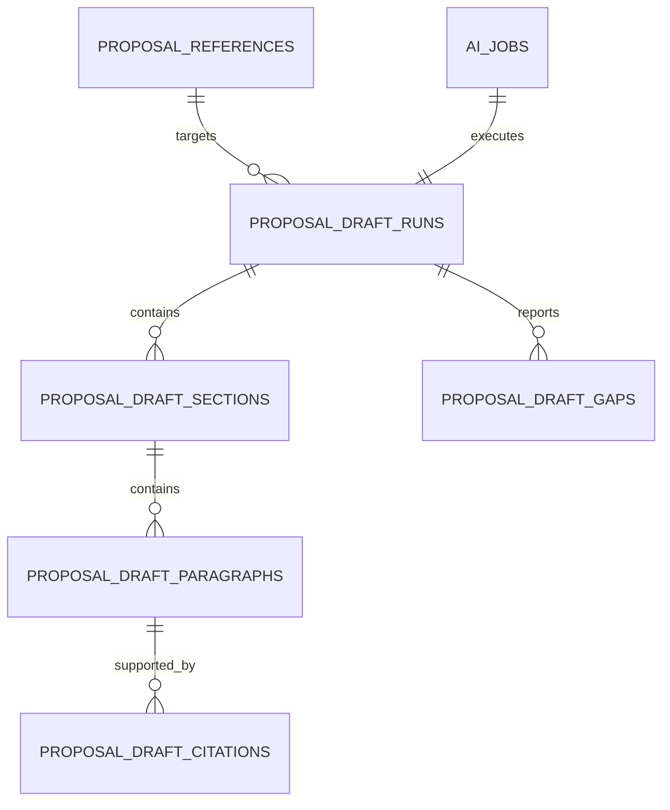

# Slice 2F — Cited AI Proposal Draft Generation and Review

**Status:** Approved for isolated test implementation  
**Environment:** Isolated test only  
**Depends on:** Accepted Slice 2D and formally accepted Slice 2E  
**Provider:** Proposed `mock/deterministic-v1`, synthetic fixtures only  
**Proposal mutation:** Not authorized

## Executive Summary

Slice 2F proposes the first implementation of the target **Review the Draft** step. After a planner has reviewed and applied structured proposal context, the system can generate a read-only, section-based proposal draft from the current version of an owned draft proposal.

Every generated section identifies the proposal fields used as evidence. The draft is stored as immutable candidate intelligence in PostgreSQL and displayed for human review. It does not update MongoDB proposal content, replace form fields, publish, email vendors, or call a live AI provider.

```text
Current owned draft proposal
        ↓
Create durable drafting job
        ↓
Validate proposal version and allowed synthetic policy
        ↓
Generate cited draft sections
        ↓
Validate structure, evidence, and safety
        ↓
Planner reviews read-only draft
```

## Requirement Analysis

### Goals

- Turn structured proposal information into a coherent first draft.
- Reduce manual writing without allowing AI to silently change proposal data.
- Preserve traceability from prose back to proposal fields.
- Identify missing information instead of fabricating facts.
- Establish the foundation for later clarification questions and controlled draft adoption.

### Functional requirements

1. Only the authenticated proposal owner can request or read a draft.
2. The proposal must be an unsubmitted, non-archived draft.
3. The request includes the expected MongoDB proposal version.
4. The initial provider is `mock/deterministic-v1` using fixed synthetic fixtures.
5. The job executes through PostgreSQL outbox, Redis reference-only messages, and the durable worker.
6. The worker reloads the authoritative proposal and rejects a stale version.
7. The output contains versioned sections, headings, body text, and evidence references.
8. Every factual paragraph cites one or more approved canonical proposal paths.
9. Missing or unsupported information produces an explicit gap, never invented prose.
10. Output passes schema, citation, length, prohibited-content, and prompt-injection validation.
11. PostgreSQL stores immutable draft runs, sections, citations, gaps, versions, and checksums.
12. The dashboard shows the draft, evidence, gaps, generation status, and safe recovery state.
13. Repeating the same idempotency key returns the same run.
14. Draft generation never updates the MongoDB proposal.

### Initial draft sections

- Event overview
- Objectives and audience
- Format and experience approach
- Venue and schedule summary
- Production scope summary
- Known requirements
- Open information gaps

Only sections supported by the approved synthetic fixture and current proposal fields contain factual prose.

### Non-functional requirements

- **Security:** tenant RLS, owner scope, version checks, no raw content in queue/logs/telemetry.
- **Explainability:** 100% of factual paragraphs have valid proposal-path citations.
- **Reliability:** durable retries, leases, idempotency, dead-letter recovery, immutable results.
- **Performance:** asynchronous API; mock test target p95 under 15 seconds.
- **Accessibility:** semantic headings, keyboard navigation, announced job status, evidence accessible without hover.
- **Maintainability:** provider, prompt, output schema, proposal reader, validator, and repository are replaceable ports.

### Out of scope

- Live-provider or confidential-data processing.
- DXG knowledge retrieval or pricing retrieval during drafting.
- Applying generated prose to MongoDB.
- Rewriting, tone adjustment, regeneration by free-form instruction, or collaborative editing.
- Clarification-question generation.
- Investment guidance, costing, vendor recommendations, publication, or email.
- Model training or fine-tuning.

## Questions and Assumptions

### Recommended defaults requiring approval

- Test-only `mock/deterministic-v1` and fixed synthetic fixtures.
- Generate from the current MongoDB proposal version only.
- No DXG knowledge retrieval in the first drafting increment.
- No free-form prompt box.
- Maximum 10 sections, 30 paragraphs, 12,000 output characters, and 100 citations.
- Draft retention: 30 days in test.
- A new proposal version makes an older draft visibly stale but does not delete it.
- No “Apply draft” button in Slice 2F.

### Client questions

1. Are the seven initial sections suitable for DXG proposals?
2. Should the draft be written in first person plural (“we”) or neutral RFP language? Recommended: neutral RFP language initially.
3. Should stale drafts remain viewable for comparison? Recommended: yes, clearly labeled.
4. Is 30-day test retention acceptable?
5. Which future sections may use approved DXG knowledge?
6. Which proposal fields are mandatory before draft generation is allowed?

## Proposed Architecture

### Component diagram



### Data flow



### Sequence diagram



## Technical Design

### Architectural patterns

- Provider-neutral gateway and deterministic adapter.
- Immutable generated candidate with human review.
- PostgreSQL-authoritative AI run state; MongoDB-authoritative proposal content.
- Transactional outbox and reference-only queue.
- Optimistic proposal-version validation.
- Versioned prompt/schema/model policy.
- Retrieval-free initial generation to keep provenance bounded.

### Proposed modules

```text
src/modules/proposalDraft/
  application/{createDraftRun,executeDraftRun,readDraftRun}.ts
  domain/{draftPolicy,draftSchema,citations,gaps}.ts
  ports/{proposalReader,draftProvider,draftRepository,draftValidator}.ts
  infrastructure/{postgres,mongo,mock,validation}/
  http/{proposalDraftController,proposalDraftRoute}.ts
```

### Output contract

```json
{
  "schemaVersion": "proposal-draft.v1",
  "proposalId": "mongo-id",
  "proposalVersion": 4,
  "sections": [
    {
      "key": "event_overview",
      "heading": "Event Overview",
      "paragraphs": [
        {
          "text": "Synthetic DXG Conference is planned as an in-person event.",
          "evidencePaths": [
            "/content/event/name",
            "/content/event/format"
          ]
        }
      ]
    }
  ],
  "gaps": [
    {
      "code": "MISSING_EVENT_DATES",
      "paths": ["/content/event/startDate", "/content/event/endDate"]
    }
  ]
}
```

### Validation rules

- Expected version must equal the authoritative proposal version.
- Proposal must be owned, unsubmitted, draft, and non-archived.
- Context includes allowlisted canonical content fields only.
- No system, owner, tenant, audit, publication, contact secret, file URL, or provider credential fields.
- Section keys come from a fixed registry.
- Every non-gap paragraph requires at least one valid evidence path.
- Evidence path must resolve to the exact input snapshot and checksum.
- No citation may reference DXG knowledge in this increment.
- Output size and collection counts are bounded.
- Source text cannot change policy, request tools, or add unapproved sections.

## Database Design

### ER diagram



### Proposed migration `011_proposal_draft_generation`

- `proposal_draft_runs`: tenant, proposal, job, actor, expected version, status, prompt/schema/model versions, checksums, counts, retention.
- `proposal_draft_sections`: run, approved section key, heading, ordinal.
- `proposal_draft_paragraphs`: section, ordinal, generated text, checksum.
- `proposal_draft_citations`: paragraph, canonical proposal path, input value checksum.
- `proposal_draft_gaps`: run, safe code, canonical paths, severity.
- Forced RLS and immutable result/citation triggers.

No table contains provider credentials, arbitrary prompts, Mongo update operators, or knowledge vectors.

## API Specification

### Create draft job

`POST /api/v1/proposals/{proposalId}/draft-jobs`

Headers:

- `Authorization: Bearer ...`
- `Idempotency-Key: ...`

Request:

```json
{
  "expectedProposalVersion": 4,
  "fixture": "synthetic-proposal-draft"
}
```

Response `202`:

```json
{
  "data": {
    "jobId": "uuid",
    "runId": "uuid",
    "status": "queued",
    "statusUrl": "/api/v1/jobs/uuid",
    "resultUrl": "/api/v1/proposals/id/draft-runs/uuid"
  }
}
```

### Read latest draft

`GET /api/v1/proposals/{proposalId}/draft-runs/latest`

Returns the latest retained owned draft plus whether its proposal version is stale.

### Read a draft run

`GET /api/v1/proposals/{proposalId}/draft-runs/{runId}`

Returns metadata, sections, citations, gaps, versions, and stale state.

No apply, rewrite, publish, or arbitrary prompt endpoint exists in Slice 2F.

## Security Review

- Owner authorization and tenant RLS on every API/read/write.
- Mongo owner/tenant/lifecycle/version checks at worker execution time.
- Fixed fixtures and mock provider only; production always fails closed.
- Reference-only queues and content-free telemetry.
- Prompt injection cannot change tools, policies, output schema, or section registry.
- Generated text is rendered as text, never trusted HTML.
- Citation paths are allowlisted and resolved server-side.
- Output cannot mutate proposal, lifecycle, ownership, publication, email, or storage.
- Rate limits on create/read/retry; bounded concurrency and mock budget.
- Logs exclude proposal values, draft text, citations, names, contacts, URLs, and gaps containing user content.

## Performance and Reliability

- API is asynchronous and stateless.
- Durable leases, heartbeat, bounded retry, cancellation, dead-letter recovery, and reconciliation.
- Immutable results support safe repeated reads.
- Same idempotency key cannot create another run.
- Stale proposal version fails before provider execution.
- No draft-result cache initially; immutable results may later use a short private cache.
- Worker scales horizontally; PostgreSQL claim/lease is the serialization boundary.

## Testing Strategy

### Unit

- section registry, output bounds, proposal-path citations, gap rules, prompt-injection fixtures, production fail-closed.

### Integration

- tenant/owner isolation, stale version, lifecycle denial, reference-only queue, idempotency, immutable evidence, no Mongo mutation.

### End to end

- generate cited synthetic draft;
- verify every factual paragraph has valid proposal evidence;
- display missing information as gaps;
- refresh/recovery restores latest result;
- proposal change marks old draft stale;
- another planner cannot read it;
- submitted proposal cannot generate a new draft;
- Mongo proposal content/version remains unchanged;
- no provider, retrieval, publication, or external telemetry call occurs.

## Implementation Roadmap

1. Draft contract, section registry, fixture, and validators.
2. Migration 011 and forced RLS.
3. Owner/version-scoped canonical proposal reader.
4. Durable mock drafting handler and immutable persistence.
5. Authenticated APIs and latest-run recovery.
6. Feature-flagged accessible dashboard review.
7. Security, E2E, regression, runbook, and acceptance evidence.

## Risks and Mitigations

| Risk | Mitigation |
|---|---|
| Unsupported facts appear in prose | Citation required for every factual paragraph; gaps otherwise |
| Draft becomes stale | Expected version at generation and stale badge at read time |
| AI text mistaken for final proposal | Candidate label, human review, no apply/publish endpoint |
| Sensitive content reaches provider | Synthetic fixtures and mock provider only |
| Prompt injection changes behavior | Fixed policy/prompt/schema and no tools/arbitrary prompts |
| Parallel proposal contract drift | Canonical Proposal V1 adapter and contract tests |

## Approval Gate

Implementation must not begin until:

1. DXG formally accepts Slice 2E; and
2. DXG approves the Slice 2F design and explicitly authorizes isolated test implementation.

## Section lifecycle (M3 addendum)

Migration `018_draft_section_lifecycle` adds a human decision overlay and scoped
regeneration on top of the immutable draft artifacts:

- `proposal_draft_section_decisions` records one `accepted`/`rejected` decision
  per `(run, section_key)` with the deciding user and an optional reason;
  decisions are upserts, audited, and only allowed on succeeded runs.
- `proposal_draft_runs.section_scope` + `parent_run_id` support regenerating a
  single section as a NEW run linked to its parent. The parent's sections stay
  immutable; readers overlay the newest succeeded scoped child. `GET
  /draft-runs/latest` always returns the latest FULL draft (scoped children are
  listed under `regenerations` and fetched by id).
- Scoped live runs narrow the structured-output schema so the model can only
  return the requested section; deterministic runs filter after generation.

Endpoints: `PUT .../draft-runs/:runId/sections/:sectionKey/decision` and
`POST .../draft-runs/:runId/sections/:sectionKey/regenerate-jobs` (idempotent,
rate-limited, owner + version guarded like all draft mutations).
