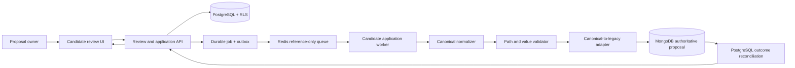
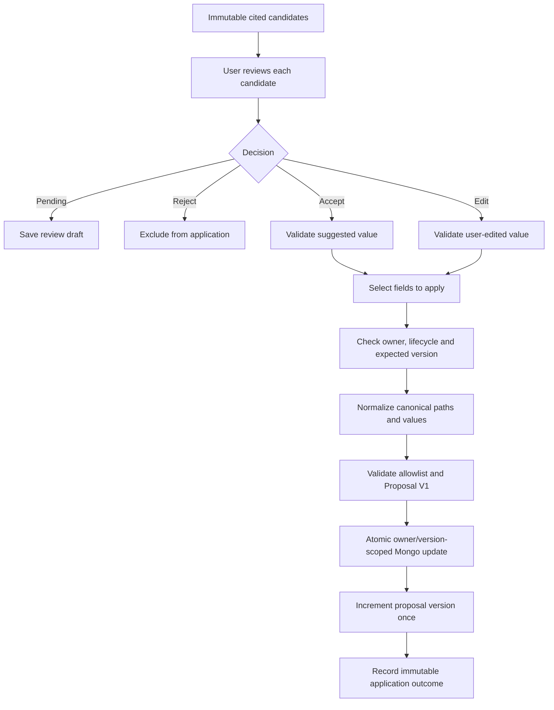
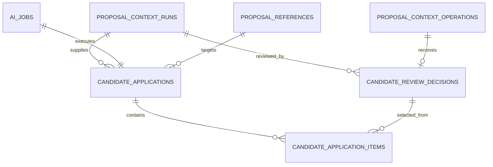

# Slice 2E — Human Review and Controlled Candidate Application

**Status:** Accepted by DXG in isolated test  
**Environment:** Isolated test only  
**Depends on:** Accepted Slice 2D proposal-context extraction  
**Mutation authorization:** Not granted

## Executive Summary

Slice 2E is the proposed bridge between read-only AI suggestions and editable proposal fields. A proposal owner reviews each extracted suggestion, may accept it, edit it, or reject it, and explicitly chooses which accepted values to apply. The system validates paths and values, checks that the proposal has not changed since extraction, applies only selected fields through an owner-scoped atomic MongoDB update, increments the proposal version, and records a durable PostgreSQL application ledger.

No AI makes the application decision. There is no automatic “accept all,” no drafting, no publication, and no background proposal mutation without a user command.

### Mandatory correction before application

Slice 2D validates the structural JSON Pointer pattern but its deterministic fixtures currently contain legacy-shaped names:

| Slice 2D candidate | Canonical Proposal V1 | Legacy Mongo target |
|---|---|---|
| `/content/event/eventName` | `/content/event/name` | `event.eventName` |
| `/content/event/eventFormat` | `/content/event/format` | `event.eventFormat` |
| `/content/event/eventObjectives` | `/content/event/objectives` | `event.eventObjectives` |
| `/content/venueSchedule/numberOfEventRooms` | `/content/venueSchedule/roomCount` | `venueSchedule.numberOfEventRooms` |

Values also require conversion: canonical event format uses `in_person`, `hybrid`, or `virtual`, while the legacy Mongo form uses `In-Person`, `Hybrid`, or `Virtual`.

Directly applying Slice 2D output is therefore prohibited. Slice 2E must first normalize candidates to true canonical paths and values, validate them against Proposal V1, and then use an allowlisted canonical-to-legacy persistence adapter.

## Requirement Analysis

### Goals

- Keep a human in control of every proposal change.
- Reduce retyping by applying explicitly selected, validated suggestions.
- Prevent stale AI output from overwriting newer user edits.
- Preserve citations and a complete review/application audit trail.
- Keep MongoDB authoritative for proposal content and PostgreSQL authoritative for AI review/application records.

### Functional requirements

1. The authenticated proposal owner can read a completed Slice 2D run.
2. Each candidate can be left pending, accepted, edited, or rejected.
3. Rejection is allowed without a mandatory reason; a bounded optional reason may be recorded.
4. Edited values retain links to the original candidate and evidence.
5. Review decisions are stored separately; immutable Slice 2D candidates are never modified.
6. The UI shows current proposal value, suggested value, confidence, evidence count, and conflict state.
7. The owner explicitly selects accepted/edited candidates and chooses **Apply selected fields**.
8. Application requires an idempotency key and expected proposal version.
9. Paths and values are normalized and validated against a versioned allowlist and Proposal V1 contract.
10. Only draft/unsubmitted, active, non-archived proposals may be changed in the initial increment.
11. MongoDB applies all selected fields atomically with owner, tenant, lifecycle, version, and idempotency filters.
12. The proposal version increments exactly once per successful application.
13. PostgreSQL records before/after checksums, selected operation references, outcome, actor, and correlation.
14. Retrying the same application never applies the mutation twice.
15. A stale proposal version returns a conflict and performs no mutation.
16. Applied candidates become read-only; rejected/pending candidates remain unapplied.
17. The response returns changed canonical paths and the new version, not unrestricted Mongo update data.

### Non-functional requirements

- **Security:** tenant RLS, owner authorization, path allowlist, prototype-pollution protection, no arbitrary update operators.
- **Consistency:** atomic Mongo mutation, optimistic concurrency, cross-store idempotency and reconciliation.
- **Reliability:** PostgreSQL outbox and durable reference-only application job.
- **Performance:** review reads p95 under 500 ms; accepted application p95 under 5 seconds in test.
- **Accessibility:** keyboard-operable decisions, explicit labels, announced status/conflicts, no color-only meaning.
- **Observability:** content-free counts, duration, outcome, safe code, versions, and hashed path set only.

### Out of scope

- Automatic candidate application or “accept all.”
- Applying to submitted, published, archived, or deleted proposals.
- AI drafting, rewriting, tone adjustment, or clarification generation.
- Knowledge retrieval during extraction/application.
- Live-provider or confidential-data processing.
- Pricing, investment guidance, publication, production, or external telemetry.

## Questions and Assumptions

### Recommended defaults requiring approval

- Proposal owner only; organization administrators do not override ownership in this increment.
- Review decisions may be saved at any time; unresolved candidates do not block applying other accepted candidates.
- Rejection reason is optional.
- No bulk accept. The user must select each candidate to apply.
- Application is limited to four normalized fixture fields initially.
- Existing non-empty values show a conflict and require explicit overwrite selection.
- Proposal version is mandatory and incremented atomically.
- Candidate values remain retained under the accepted Slice 2D 30-day policy; application audit metadata is retained for one year in test unless DXG chooses otherwise.
- A successful application cannot be automatically undone in Slice 2E; the normal proposal editor can change the value later, with history preserved.

### Client questions

1. Should organization administrators be allowed to apply candidates to another planner's proposal?
2. Should overwriting any non-empty field require a second confirmation?
3. Is optional rejection reason acceptable?
4. Should edited candidate values require a visible “modified from AI suggestion” label? Recommended: yes.
5. Is one-year test retention for application audit records acceptable?
6. Should the first release support only the four fixture fields listed above? Recommended: yes.

## Proposed Architecture

### Component diagram



### Review and application flow



### Sequence diagram

```mermaid
sequenceDiagram
  actor Planner
  participant API as Review API
  participant PG as PostgreSQL
  participant Redis
  participant Worker
  participant Mongo as MongoDB
  Planner->>API: Save candidate decisions
  API->>PG: Upsert separate review decisions
  Planner->>API: Apply selected + expectedVersion + Idempotency-Key
  API->>PG: Create application/job/outbox
  API-->>Planner: 202 status URL
  PG->>Redis: Publish reference-only job
  Redis->>Worker: Application reference
  Worker->>PG: Load selected decisions and immutable evidence
  Worker->>Worker: Normalize and validate path/value allowlist
  Worker->>Mongo: Atomic owner + tenant + draft + version + not-applied update
  alt version/lifecycle conflict
    Mongo-->>Worker: No match
    Worker->>PG: Record safe conflict; no mutation
  else applied
    Mongo-->>Worker: New proposal version
    Worker->>PG: Record applied paths/checksums/version
  end
  Planner->>API: Read job/application result
  API-->>Planner: Outcome and changed paths
```

## Technical Design

### Architectural patterns

- Human-in-the-loop command workflow.
- Immutable candidate plus separate decision records.
- Command/query separation for review versus application.
- Optimistic concurrency using proposal version.
- Transactional Mongo update with a cross-store idempotent saga.
- PostgreSQL outbox and reference-only queue.
- Anti-corruption adapter between canonical Proposal V1 and the legacy Mongo schema.

### Module breakdown

```text
src/modules/candidateApplication/
  application/
    saveCandidateReview.ts
    createApplicationJob.ts
    executeCandidateApplication.ts
    readApplication.ts
  domain/
    reviewDecision.ts
    applicationPolicy.ts
    canonicalMutation.ts
  ports/
    reviewRepository.ts
    proposalMutationPort.ts
    candidateNormalizer.ts
  infrastructure/
    postgres/
    mongo/
    canonicalToLegacy/
  http/
```

### Canonical normalization registry

The registry is versioned, immutable after approval, and deny-by-default:

```text
candidate-normalization.v1
  /content/event/eventName -> /content/event/name
  /content/event/eventFormat -> /content/event/format
  /content/event/eventObjectives -> /content/event/objectives
  /content/venueSchedule/numberOfEventRooms -> /content/venueSchedule/roomCount
```

After normalization, the persistence adapter maps only approved canonical paths to Mongo fields. User-controlled strings can never become Mongo field paths or update operators.

### Validation rules

- Run status must be `succeeded`, retained, tenant-owned, and proposal-owned.
- Candidate must belong to the run and remain checksum-valid.
- Decision: `pending`, `accepted`, `modified`, or `rejected`.
- Modified value is required only for `modified` and must pass the canonical field schema.
- Only accepted/modified candidates may be selected.
- Maximum 25 selected operations per application in the first increment.
- Duplicate or parent/child-conflicting paths are rejected.
- Block `__proto__`, `prototype`, `constructor`, `$`, `.`, array index injection, lifecycle, ownership, tenant, publication, audit, and system paths.
- Expected version must equal current Mongo proposal version.
- Proposal must be owner-scoped, draft/unsubmitted, active, and non-archived.
- Existing non-empty value requires `overwriteConfirmed=true` for that operation.
- Full canonical proposal is validated after an in-memory patch and before Mongo mutation.

## Database Design

### ER diagram



### Proposed migration `010_candidate_review_application`

#### `candidate_review_decisions`

- organization, run, operation, actor
- decision state
- modified value JSON and checksum when applicable
- optional bounded reason
- revision and timestamps
- unique run/operation/actor

#### `candidate_applications`

- organization, proposal reference, run, durable job
- expected and resulting proposal version
- status: queued, validating, applying, applied, conflict, failed
- idempotency key
- selected count, before/after checksums, safe error code
- correlation and retention

#### `candidate_application_items`

- application and review-decision references
- canonical path, original operation reference
- applied value checksum
- overwrite confirmation
- outcome and safe code

All tables use forced tenant RLS. Application outcome/item evidence is immutable. Review decisions use optimistic decision revision rather than destructive candidate updates.

### MongoDB changes

- Add/increment a required integer `version` for proposal mutation concurrency.
- Add a bounded system-only `candidateApplicationIds` ledger or equivalent idempotency marker.
- Perform one `findOneAndUpdate` filtered by tenant, owner, proposal ID, lifecycle, expected version, and absent application ID.
- Use only server-created `$set`, `$inc`, and bounded `$push` operations.

## API Specification

### Save review decisions

`PUT /api/v1/proposals/{proposalId}/context-runs/{runId}/review`

- Authentication: required
- Permission: `proposal:write`
- Authorization: proposal owner
- Request:

```json
{
  "revision": 2,
  "decisions": [
    {"operationId": "uuid", "decision": "accepted"},
    {"operationId": "uuid", "decision": "modified", "value": "Hybrid"},
    {"operationId": "uuid", "decision": "rejected", "reason": "Not confirmed"}
  ]
}
```

- Response: `200` with saved revision and content-free counts.
- Errors: `404` owner/run hidden, `409 REVIEW_REVISION_CONFLICT`, `422 INVALID_REVIEW_DECISION`.

### Read review

`GET /api/v1/proposals/{proposalId}/context-runs/{runId}/review`

- Returns candidate/current-value comparison, decisions, conflicts, evidence metadata, and proposal version.

### Create application job

`POST /api/v1/proposals/{proposalId}/context-runs/{runId}/application-jobs`

- Required header: `Idempotency-Key`
- Request:

```json
{
  "expectedProposalVersion": 3,
  "operationIds": ["uuid-1", "uuid-2"],
  "overwriteConfirmedOperationIds": ["uuid-2"]
}
```

- Response: `202` with job/application/status URLs; idempotent replay returns `200`.

### Read application

`GET /api/v1/proposals/{proposalId}/candidate-applications/{applicationId}`

- Returns safe status, selected count, changed canonical paths, prior/new versions, and safe conflict code.

There is no automatic apply, bulk accept, publish, or rollback endpoint in Slice 2E.

## Security Review

- **Broken access control:** permission plus owner filtering plus PostgreSQL RLS and Mongo tenant filters.
- **Injection:** no client-supplied Mongo paths/operators; strict registry and JSON Schema validation.
- **Prototype pollution:** prohibited segments and immutable safe object construction.
- **Mass assignment:** only selected allowlisted content paths; system/lifecycle/ownership paths unavailable.
- **Race conditions:** expected proposal version and atomic conditional update.
- **Replay:** application idempotency key plus Mongo-applied application marker.
- **Cross-store partial failure:** reconciliation reads Mongo idempotency marker and repairs PostgreSQL outcome.
- **XSS:** candidate/current values rendered as text; no HTML interpretation.
- **CSRF:** existing authenticated same-site Server Action/API protections retained; mutation endpoints require bearer authentication and controlled origins.
- **Sensitive logging:** values, current proposal content, evidence locators, and reasons excluded from logs/telemetry.
- **AI trust:** AI suggestions remain untrusted until normalized, contract-validated, selected, and explicitly applied by a human.

## Performance and Reliability Review

- Bounded review page and operation selection.
- Index decisions by run/operation and applications by proposal/created time/idempotency.
- No cache for mutable review state; short private cache may be used for immutable candidates.
- Durable retries only before/around idempotent application; no blind repeat mutation.
- Reconciler handles Mongo-success/PostgreSQL-failure state.
- Dead-letter entry includes safe diagnostic code only.
- Horizontal worker scaling is safe because Mongo conditional mutation is the serialization point.

## Testing Strategy

### Unit

- Path normalization and deny-by-default behavior.
- Value conversion and canonical field validation.
- decision transitions and revision conflicts.
- protected path, operator, prototype, and parent/child collision rejection.
- content-free telemetry serializer.

### Integration

- owner and tenant isolation in both stores.
- atomic selected-field update and one version increment.
- stale version, lifecycle conflict, and overwrite confirmation.
- same idempotency key applies once; different key can intentionally apply a later review.
- Mongo success followed by PostgreSQL failure reconciles without second mutation.
- immutable candidate/evidence records remain unchanged.

### End to end

- accept two candidates, reject one, edit one, apply selected, and verify only selected values changed.
- refresh/retry recovery.
- concurrent user edit produces conflict and no overwrite.
- another planner cannot review or apply.
- submitted/archived proposal cannot be mutated.
- no live-provider, knowledge retrieval, drafting, publication, or external telemetry call occurs.

## Implementation Roadmap

### Milestone 1 — Contract correction and mapping

- Define and test normalized canonical paths/values.
- Add field-level schema validation and canonical-to-legacy registry.
- Deliverable: mapping ADR and contract tests.
- Complexity: medium; risk: legacy/canonical drift.

### Milestone 2 — Review data foundation

- Migration 010, forced RLS, decision revisions, immutable application ledger.
- Deliverable: migration and repository tests.
- Complexity: medium.

### Milestone 3 — Controlled mutation port

- Mongo proposal version backfill, atomic owner/version/lifecycle update, idempotency marker.
- Deliverable: mutation adapter and concurrency tests.
- Complexity: high; risk: cross-store partial failure.

### Milestone 4 — Durable API/application workflow

- Review APIs, application jobs, worker, reconciliation, safe errors, telemetry.
- Deliverable: authenticated E2E evidence.
- Complexity: high.

### Milestone 5 — Dashboard review experience

- comparison, decisions, edit validation, overwrite confirmation, progress/recovery, accessibility.
- Deliverable: feature-flagged UI and tests.
- Complexity: medium-high.

### Milestone 6 — Acceptance evidence

- Regression, security, concurrency, failure recovery, no-scope-expansion checks.
- Deliverable: client test guide, evidence, and acceptance pack.

## Risks and Mitigations

| Risk | Mitigation |
|---|---|
| Legacy/canonical path mismatch | Mandatory normalization registry and adapter tests before mutation |
| Overwriting newer user edits | Expected proposal version and current-value conflict confirmation |
| Duplicate application | API idempotency plus Mongo application marker |
| Cross-database partial failure | Durable saga and reconciliation; Mongo remains authoritative |
| Arbitrary Mongo update injection | Server-owned deny-by-default mapping; no client paths/operators |
| User trusts AI too readily | Per-field review, citations, confidence, and no bulk accept |
| Submitted proposal changes | Lifecycle filter in the atomic Mongo mutation |
| Audit contains proposal content | Checksums, safe codes, counts, and path hashes only |

## Future Improvements

- Wider approved field registry after real acceptance data.
- Version history and controlled undo.
- Independent review roles for sensitive fields.
- Candidate grouping and conflict explanations.
- Clarification-question generation as a separately approved increment.

## Approval Gate

Implementation must not begin until DXG explicitly approves:

1. controlled proposal mutation in isolated test;
2. the canonical normalization and legacy adapter;
3. optimistic versioning and lifecycle restriction;
4. per-field human selection with no automatic/bulk application;
5. the cross-store idempotency and reconciliation design; and
6. the continued exclusion of drafting, retrieval, live/confidential processing, publication, production, and external telemetry.
