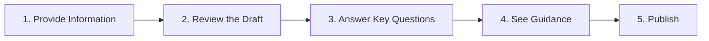
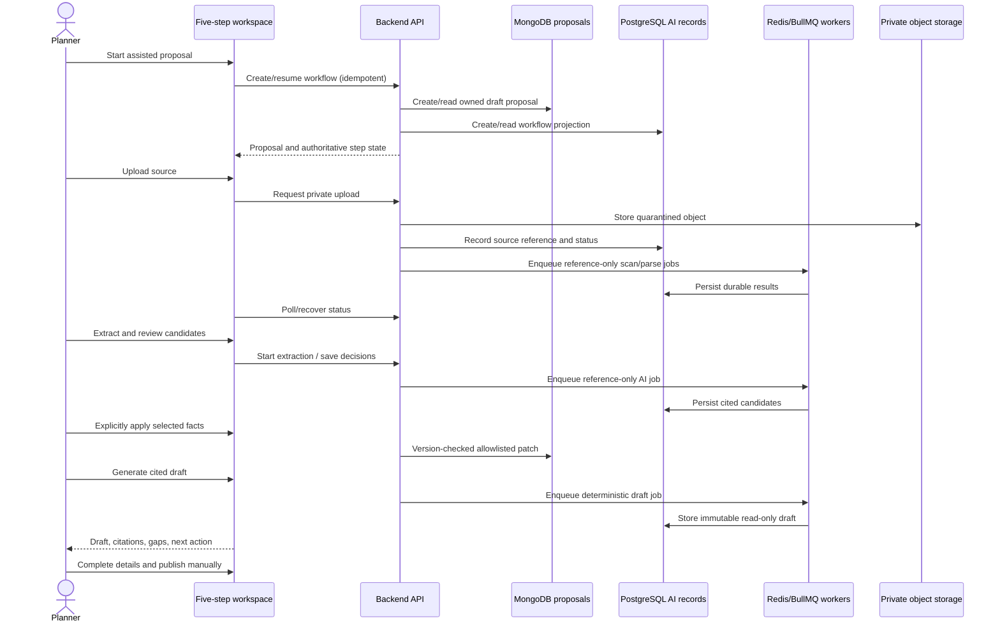
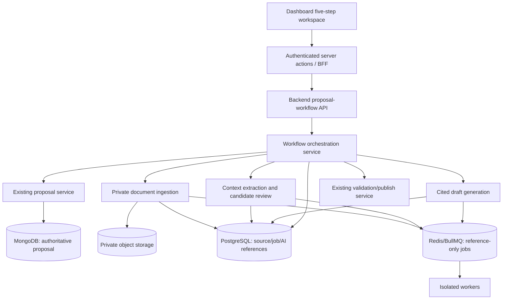

# Slice 3A — Five-Step Proposal Workflow and Multi-Source Intake

**Status:** Proposed design; implementation is not authorized  
**Environment:** Isolated test environment only  
**Purpose:** Turn the accepted AI foundations into one understandable proposal-creation journey without expanding the approved AI or mutation boundaries.

## 1. Executive summary

Slice 3A introduces the user-facing workflow below:



The slice connects existing, accepted capabilities behind a new workflow shell:

- private source upload and durable status recovery;
- proposal-context extraction and cited candidate review;
- controlled application of selected structured candidates;
- cited, read-only proposal draft generation;
- the existing manual proposal editor and existing publication controls.

It does **not** authorize a live model, automatic proposal mutation, knowledge-grounded drafting, generated clarification questions, investment guidance, or automatic publication. Steps whose underlying capability is not yet approved must show a clear “coming in a later approved increment” state rather than simulated results.

## 2. Goals and success criteria

### Goals

1. Give planners one clear entry point for creating a proposal.
2. Reduce navigation between the legacy form and separate AI test panels.
3. Preserve progress across refresh, sign-in renewal, worker restart, and browser return.
4. Allow advanced users to open the full manual editor at any time.
5. Make AI boundaries, evidence, pending work, and user decisions understandable.

### Success criteria

- A planner can create or resume an unsubmitted proposal and enter the five-step workspace.
- The current step and completion state are derived from authoritative backend data, not browser-only state.
- Uploaded sources, extraction runs, review decisions, applications, and draft runs remain recoverable.
- Accepted structured candidates are never applied without an explicit owner action.
- Generated prose remains read-only in Slice 3A.
- Refreshing or reopening the proposal restores the correct workflow state.
- Existing proposal creation, editing, sharing, vendor, and publication paths do not regress.
- Keyboard, focus, labels, status announcements, zoom, and mobile layout meet the existing accessibility baseline.

## 3. Functional requirements

### 3.1 Start or resume

- Create a new unsubmitted proposal using the existing MongoDB proposal service.
- Resume the latest authorized workflow for an existing owned proposal.
- Offer “Create with assistance” and “Edit all details manually.”
- Never create duplicate proposals from a repeated request; creation uses an idempotency key.

### 3.2 Step 1 — Provide Information

Supported in this increment:

- upload an approved file type through private document ingestion;
- enter or paste notes only if stored and scanned through the same private-source boundary;
- reuse an owned previous proposal by reference only, if explicitly selected;
- use the detailed manual editor;
- attach multiple sources to one proposal, with independent status and immutable source versions;
- show upload, quarantine, scanning, parsing, failure, retry, and ready states;
- start cited extraction only for eligible sources or approved synthetic fixtures.

An uploaded source does not silently update the proposal.

### 3.3 Step 2 — Review the Draft

- Show extracted candidate facts with citations, confidence, current values, and conflicts.
- Restore saved review decisions after refresh.
- Apply only individually accepted or edited structured candidates through the accepted Slice 2E boundary.
- Generate and display the accepted Slice 2F read-only cited draft.
- Distinguish current, stale, processing, failed, and superseded runs.
- Keep “Edit all details” available.

### 3.4 Step 3 — Answer Key Questions

Slice 3A may display deterministic gaps already produced by Slice 2F. It must not generate new AI questions.

- Show known missing-information gaps.
- Link each gap to the relevant manual field when a canonical mapping exists.
- Let the planner complete the field manually.
- Recompute step readiness from the new proposal version.
- Label AI-generated prioritization and conversational questioning as a later increment.

### 3.5 Step 4 — See Guidance

- Display only existing deterministic validation results already authorized by the application.
- Do not produce pricing, investment ranges, inferred equipment, or knowledge-based recommendations.
- Explain that investment guidance requires a separately approved increment and data methodology.

### 3.6 Step 5 — Publish

- Hand off to the existing final validation and publication process.
- Require the existing human confirmation and permissions.
- Show unresolved gaps and warnings before handoff.
- Do not auto-publish, change publication rules, or generate/send external messages.

## 4. User and request flow



## 5. Architecture



### Source-of-truth boundaries

| Data | Authority |
|---|---|
| Proposal fields, lifecycle, owner and version | MongoDB |
| Private source bytes | Private object storage |
| Source metadata, processing state, AI runs, citations, reviews and workflow projection | PostgreSQL |
| Temporary reference-only job delivery | Redis/BullMQ |
| Browser state | Presentation only; never authoritative |

## 6. Component responsibilities

- **Five-step workspace:** navigation, progress, recovery, accessible status, manual-mode escape hatch.
- **Workflow orchestration service:** returns a read model assembled from authoritative records; it does not become a second proposal store.
- **Source coordinator:** associates immutable source versions with a proposal and checks scan/parse eligibility.
- **Review coordinator:** reuses Slice 2D/2E owner, version, validation, and mutation controls.
- **Draft coordinator:** reuses Slice 2F durable, immutable, cited read-only drafts.
- **Readiness evaluator:** deterministic policy explaining what is complete, blocked, stale, or unavailable.
- **Existing publication service:** remains the sole publication boundary.

## 7. Proposed data design

PostgreSQL additions should remain projections and references:

### `proposal_workflows`

- `id` UUID primary key
- `organization_id` UUID, required
- `proposal_id` string, required
- `owner_user_id` string, required
- `status` enum: `active`, `completed`, `abandoned`
- `current_step` smallint, constrained 1–5
- `created_at`, `updated_at`
- unique active workflow on `(organization_id, proposal_id)`

### `proposal_workflow_sources`

- `id` UUID primary key
- `workflow_id` UUID foreign key
- `document_id` UUID or previous-proposal reference
- `source_type` allowlisted enum
- `source_version` integer
- `created_at`
- unique immutable association fingerprint

No proposal content is duplicated into these tables. Row-level tenant policies, owner checks, and service-role restrictions follow the accepted PostgreSQL foundation.

## 8. API proposal

| Method | Endpoint | Purpose |
|---|---|---|
| `POST` | `/api/v1/proposals/assisted` | Idempotently create a draft proposal and workflow |
| `GET` | `/api/v1/proposals/:proposalId/workflow` | Return authoritative workflow read model |
| `PATCH` | `/api/v1/proposals/:proposalId/workflow/step` | Record explicit navigation after eligibility validation |
| `POST` | `/api/v1/proposals/:proposalId/sources` | Associate an eligible owned source |
| `GET` | `/api/v1/proposals/:proposalId/sources` | List sources and durable processing states |
| `DELETE` | `/api/v1/proposals/:proposalId/sources/:sourceId` | Detach a source; do not destroy audit history |

Existing document, extraction, review/application, draft, proposal, validation, and publication endpoints remain the capability APIs. The workflow API composes their status and returns links/actions; it does not bypass them.

Every mutation requires authentication, tenant and owner authorization, correlation ID, idempotency where applicable, schema validation, audit metadata, and expected proposal version when proposal state may change.

## 9. Security and privacy

- Deny-by-default tenant and owner authorization on every workflow and source operation.
- Private sources stay quarantined until validation and malware scanning pass.
- No source text, proposal content, filenames, prompts, or generated prose in queue messages, logs, metrics, or traces.
- Canonical IDs are opaque; signed object access remains short-lived and server-authorized.
- Treat uploaded/pasted content as untrusted; preserve prompt-injection isolation.
- Maintain CSRF protection for cookie-authenticated mutations, secure headers, input limits, file allowlists, and output encoding.
- Keep the deterministic mock provider and synthetic fixtures unless a later approval explicitly changes provider/data gates.

## 10. Reliability, performance and observability

- PostgreSQL job/run state remains authoritative; queue messages carry IDs only.
- Idempotent creation and source association prevent duplicate workflows and work.
- UI uses bounded polling/backoff and recovers from the read endpoint after refresh.
- Cache only content-free readiness/reference projections for a short TTL; invalidate on proposal version or job-state change.
- Paginate source history and review items; lazy-load large draft sections.
- Emit allowlisted counters and durations for step entry, completion, failure category, queue latency, and recovery.
- Preserve correlation and causation IDs from UI request through durable worker execution.
- Existing backup and disaster-recovery policies cover MongoDB, PostgreSQL, and object storage; Redis is not a source of truth.

## 11. Frontend module proposal

```text
components/proposal-workflow/
  ProposalWorkflowShell
  WorkflowStepper
  WorkflowStatusSummary
  steps/
    ProvideInformationStep
    ReviewDraftStep
    AnswerKeyQuestionsStep
    SeeGuidanceStep
    PublishStep
  sources/
    SourceList
    SourceStatus
    SourceActions
  shared/
    RecoveryNotice
    EvidenceLink
    ManualEditorLink
```

Existing panels should be adapted behind these components, not copied into a second implementation.

## 12. Testing strategy

- Unit: readiness policies, step eligibility, source association, idempotency and state mapping.
- Contract: workflow read model and action links against shared schemas.
- Integration: Mongo/PostgreSQL reference integrity, tenant isolation, source eligibility, durable recovery.
- E2E: create/resume, multi-source upload, scan failure/retry, extraction/review/application, read-only draft, gaps, manual edit and publish handoff.
- Security: cross-tenant/source access, ownership change, stale version, lifecycle, CSRF, injection, upload limits and content-free telemetry.
- Accessibility: keyboard order, focus restoration, status announcements, error association, zoom and mobile.
- Regression: existing legacy proposal wizard, authentication, sharing, vendor and publication flows.

## 13. Implementation plan

1. Shared workflow/readiness contract and feature flags.
2. PostgreSQL migration, tenant policies and workflow repository.
3. Orchestration/read-model API with owner/lifecycle enforcement.
4. Five-step shell and create/resume entry point.
5. Step 1 multi-source association and durable recovery UI.
6. Adapt accepted Slice 2D–2F panels into Steps 1–3.
7. Gated Guidance state and existing Publish handoff.
8. Accessibility, security, recovery, regression and client evidence.

Rollback disables the new workflow feature flag and retains the current proposal editor. Migrations remain additive; no proposal data is rewritten.

## 14. Risks and mitigations

| Risk | Mitigation |
|---|---|
| Five steps imply unavailable AI capabilities | Clearly label gated states and never fabricate guidance/questions |
| Workflow projection diverges from proposal | Derive readiness from authoritative versioned records; do not copy content |
| Duplicate source processing | Idempotency keys and immutable association fingerprints |
| Users confuse draft prose with applied proposal | Persistent read-only labeling and no apply endpoint |
| Legacy workflow regression | Feature flag, shared components, E2E regression and immediate rollback |
| Multi-source conflicts are silently resolved | Surface conflicts for human review; no automatic winner |

## 15. Decisions required from DXG

1. Approve the five labels and order exactly as shown.
2. Approve assisted and manual entry paths existing together.
3. Approve upload, pasted notes, previous-proposal reference and manual entry as the initial source types.
4. Confirm that Steps 3 and 4 may show only currently approved gaps/validation and explicit gated messaging.
5. Confirm existing publication remains the only Step 5 execution path.
6. Approve the feature-flagged, isolated-test rollout and proposed success criteria.


## M4 addendum — Step 4 guidance

Step 4 is no longer permanently gated. With `GUIDANCE_ENABLED=true`, the
deterministic guidance engine (`src/modules/guidance/`, migration 019
`guidance_reports`) computes completeness per section from the 112 approved
canonical paths plus ~12 rule-based schedule/production/budget/risk checks
(no model calls, every finding carries field paths). Workflow readiness for
step 4 derives from the latest report: available → in_progress (blocking
findings) → complete. Endpoints: `POST /api/v1/proposals/:id/guidance-reports`
and `GET .../guidance-reports/latest`, owner-scoped and audited.
