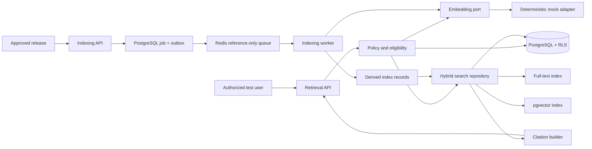
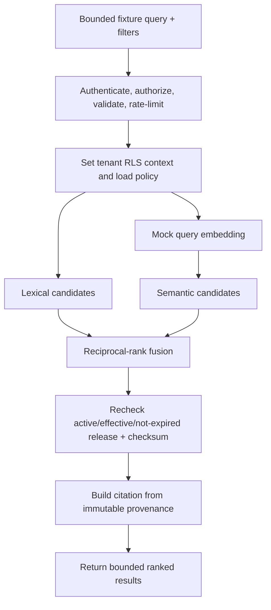
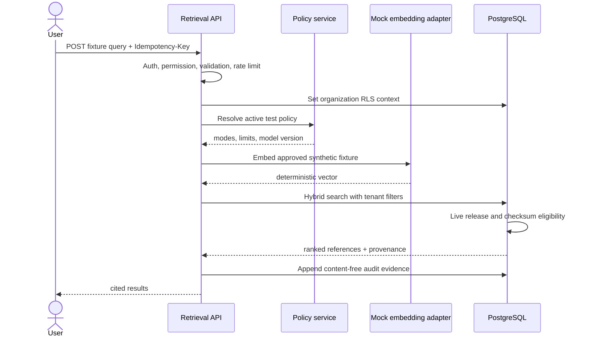
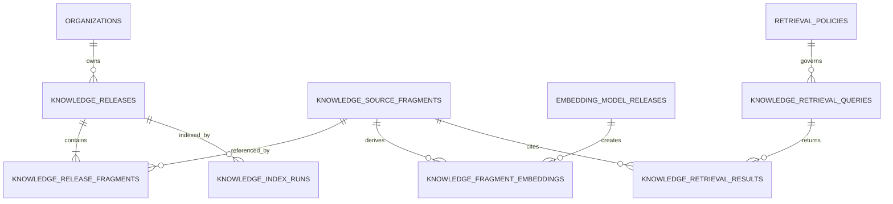

# Slice 2C — Governed Knowledge Retrieval Design

**Status:** Proposed for DXG approval  
**Environment:** Isolated test only  
**Implementation:** Not started; this document is the design gate  
**Depends on:** Slices 1C–1G, 2A, and 2B

## Executive Summary

Slice 2C adds a provider-neutral retrieval layer that finds relevant fragments from approved DXG knowledge releases and returns them with verifiable source citations. It does not draft or modify proposals, train a model, or send knowledge to a live AI provider.

PostgreSQL remains authoritative for release eligibility, tenant scope, provenance, index state, and retrieval evidence. Redis/BullMQ carries reference-only indexing messages. The recommended test design combines PostgreSQL full-text search with `pgvector`, initially using a deterministic mock embedding adapter and synthetic fixtures only.

The controlling rule is checked at query time: a fragment is retrievable only when its release belongs to the authenticated organization, is active and effective, is not expired, and contains the exact approved fragment checksum.

## Requirement Analysis

### Goals

- Retrieve relevant, approved, tenant-scoped DXG knowledge.
- Return a source citation with every result.
- Exclude revoked, expired, superseded, rejected, unapproved, or cross-tenant content.
- Provide deterministic relevance and security evidence before proposal drafting.
- Preserve provider neutrality and avoid live-provider credentials or spend.

### Functional requirements

1. An authorized administrator can request indexing of an active approved release.
2. Indexing is a durable, idempotent background job.
3. The index references immutable fragments and checksums; it is not authoritative content storage.
4. An authorized test user can run a bounded retrieval query when policy and feature flags permit it.
5. Retrieval combines metadata filters, lexical rank, and optional vector similarity.
6. Every result includes release, fragment, source document, checksum, and coordinates.
7. Live release eligibility is joined on every query; a stale index never grants access.
8. Revocation, expiry, or supersession removes eligibility immediately; cleanup may follow asynchronously.
9. Audit and telemetry use content-free allowlisted fields.
10. Synthetic fixtures measure relevance, citations, isolation, revocation, and determinism.

### Non-functional requirements

- **Security:** fail closed, forced RLS, least privilege, bounded inputs, no content in queue messages or telemetry.
- **Reliability:** PostgreSQL-authoritative job/index status, idempotency, bounded retry, dead-letter recovery.
- **Performance:** proposed p95 below 500 ms for up to 100,000 eligible fragments per organization in test.
- **Explainability:** 100% of returned results contain resolvable source evidence.
- **Privacy:** embeddings are classified derived data and inherit source classification.
- **Maintainability:** embedding, lexical search, fusion, eligibility, and evaluation use ports/adapters.

### Out of scope

- Live OpenAI or other external-provider calls.
- Customer/vendor confidential model processing.
- Proposal drafting, rewriting, clarification questions, cost guidance, or auto-application.
- Fine-tuning or training a foundation model.
- Internet search, production provisioning, and the five-step proposal UI.

## Questions and Assumptions

### Recommended defaults requiring approval

- Vector execution uses approved synthetic fixtures only.
- Existing DXG-internal releases may be indexed lexically, but are not embedded in this increment.
- `pgvector` is provisioned only in the isolated PostgreSQL test service.
- Default result limit is 10; maximum is 20.
- Maximum normalized query size is 4,000 UTF-8 bytes.
- Thresholds and weights are versioned policy data.
- `KNOWLEDGE_RETRIEVAL_ENABLED=false` by default.
- Indexing requires `knowledge:approve`; retrieval requires `knowledge:read` and an active test policy.
- Same-admin approval does not weaken retrieval eligibility.

### Open client questions

1. May a future local embedding model process DXG-internal content?
2. Which sources should become searchable first: guidance, schedules, equipment, prior proposals, contracts, or pricing?
3. Should contracts and pricing use a stricter policy?
4. Which market, currency, date, and source-type filters are mandatory?
5. Which DXG examples define a relevant result?
6. What retention applies to embeddings and content-free query evidence?

## Proposed Architecture

### Decision and alternatives

Use hybrid retrieval in PostgreSQL: built-in full-text search, `pgvector` similarity, bounded reciprocal-rank fusion, and a mandatory live eligibility join.

| Option | Benefits | Trade-offs | Decision |
|---|---|---|---|
| Full-text only | Simple and explainable | Misses semantic matches | Keep as baseline/fail-safe |
| PostgreSQL + `pgvector` | Hybrid quality, existing RLS, one data boundary | Extension and vector operations | **Recommended** |
| External vector database | Specialized scale/features | New tenant boundary, sync and cost | Defer until measured need |
| Model fine-tuning | Changes model behavior | Not current, cited retrieval | Reject for this need |

### Component diagram



### Retrieval flow



### Sequence



### Responsibilities

- **Controller:** HTTP decoding and response mapping only.
- **Policy service:** environment, purpose, classification, modes, thresholds, limits, model release.
- **Eligibility repository:** tenant, state, time window, manifest checksum.
- **Embedding port:** normalized fixture text to a versioned vector.
- **Mock adapter:** deterministic, local, fixture-only, no network or credentials.
- **Hybrid repository:** filters, lexical/vector candidates, fusion, top-k.
- **Citation builder:** exact document and source coordinates.
- **Index worker:** eligibility validation, derived index upsert, progress/status.
- **Evaluation runner:** fixed queries and expected citations; content-free scorecard.

## Technical Design

### Stack and patterns

- TypeScript/Node.js, Express, PostgreSQL 16, `pgvector`, BullMQ/Redis, AJV, existing OpenTelemetry.
- Clean/hexagonal boundaries and provider-neutral ports.
- PostgreSQL source of truth, reference-only queue, outbox, immutable release manifest, rebuildable index.
- Policy-as-data with versioned embedding and ranking configuration.

### Module structure

```text
src/modules/knowledgeRetrieval/
  application/{indexKnowledgeRelease,retrieveKnowledge,evaluateRetrieval}.ts
  domain/{eligibility,policy,ranking,types}.ts
  ports/{embeddingProvider,retrievalRepository,retrievalPolicyRepository}.ts
  infrastructure/postgres/
  infrastructure/embeddings/deterministicMockEmbeddingProvider.ts
  infrastructure/ranking/reciprocalRankFusion.ts
  http/{knowledgeRetrievalController,knowledgeRetrievalRoute}.ts
```

### API specification

#### `POST /api/v1/knowledge/releases/{releaseId}/index-jobs`

- Permission: `knowledge:approve`.
- Required header: `Idempotency-Key` (maximum 200 characters).
- Body: `{ "mode": "hybrid", "policyVersion": "test-synthetic-v1" }`.
- Returns `202` for new job or `200` for replay.
- Expected errors: `400`, `401`, `403`, `404`, `409`, `422`, `429`, `503`.

#### `GET /api/v1/knowledge/releases/{releaseId}/index-status`

- Permission: `knowledge:read`.
- Returns status, counts, policy/model versions, timestamps, and safe error code; never vectors.

#### `POST /api/v1/knowledge/retrieval/queries`

- Permission: `knowledge:read`.
- Required header: `Idempotency-Key`.
- Initial API accepts an allowlisted fixture, not arbitrary text.

```json
{
  "fixture": "breakout-room-schedule",
  "filters": {
    "sourceTypes": ["labor_schedule", "operating_guidance"],
    "market": "US",
    "currency": "USD"
  },
  "limit": 10
}
```

```json
{
  "data": {
    "queryId": "uuid",
    "policyVersion": "test-synthetic-v1",
    "results": [{
      "fragmentId": "uuid",
      "releaseId": "uuid",
      "sourceType": "labor_schedule",
      "content": "Approved fragment text",
      "score": 0.91,
      "citation": {
        "documentId": "uuid",
        "checksum": "sha256",
        "coordinates": {"sheet": "Schedule", "row": 18}
      }
    }]
  }
}
```

The response excludes organization IDs, vectors, storage keys, private URLs, and forbidden fragments.

#### `POST /api/v1/knowledge/retrieval/evaluations`

- Permission: `security:admin`.
- Accepts a fixed fixture-set name and returns a durable job reference plus a content-free scorecard.

### Validation and errors

- Fixture allowlist only; filters use bounded enums/arrays; result limit 1–20; canonical UUIDs.
- Returned checksum must equal the release manifest; citations must resolve in the same tenant/release.
- Vector dimension/model release must equal active policy.
- Errors use `application/problem+json` and safe codes such as `KNOWLEDGE_RETRIEVAL_DISABLED`, `RELEASE_NOT_ELIGIBLE`, `INDEX_NOT_READY`, `RETRIEVAL_POLICY_NOT_FOUND`, `CLASSIFICATION_NOT_ALLOWED`, `EMBEDDING_MODEL_MISMATCH`, and `RETRIEVAL_UNAVAILABLE`.

## Database Design

### ER diagram



### Proposed migration `008_knowledge_retrieval`

- Enable `vector` after an explicit environment capability check.
- `embedding_model_releases`: provider/model/version/dimension/checksum/environment/classification policy.
- `knowledge_retrieval_policies`: purpose, classification, modes, weights, threshold, limits, active window.
- `knowledge_index_runs`: release, model/policy, status, counts, safe error, job reference, timestamps.
- `knowledge_fragment_embeddings`: tenant, fragment, release, model release, checksum, vector.
- `knowledge_retrieval_queries`: content-free request metadata, fingerprints, counts, latency, actor/correlation.
- `knowledge_retrieval_results`: query, rank, fragment, release, checksum, bounded scores, eligibility timestamp.

All tenant-owned tables use forced RLS. Query text is not persisted in Slice 2C. Embeddings are derived and rebuildable.

### Indexes and recovery

- GIN on fragment `tsvector`; exact vector scan initially, then HNSW when corpus size warrants it.
- Unique `(release_id, fragment_id, embedding_model_release_id)` and `(organization_id, idempotency_key)`.
- B-tree organization/release/model/status indexes; existing release eligibility index remains authoritative.
- Forward migration plus test-only down migration. Fail if `pgvector` is unavailable; never silently downgrade hybrid policy.
- Backups include policies, evidence, and index records. Restore tests verify RLS, dimensions, checksums, and revocation.

## Security Review

- Forced RLS plus organization predicates prevent broken access control.
- Parameterized SQL and allowlisted filters prevent injection.
- Fragment text is rendered as text, never trusted HTML.
- Mock adapter has no network path, preventing SSRF/provider leakage.
- Retrieved content is evidence, never instruction; future generation must delimit evidence against prompt injection.
- Queries, fragments, vectors, coordinates, storage keys, and raw filters are prohibited from telemetry.
- Embeddings inherit classification, remain encrypted/tenant-scoped, and are never returned.
- Separate rate limits cover indexing, retrieval, and evaluation.
- Every query joins live eligibility, so cleanup latency cannot expose revoked content.
- No provider secret exists in this slice.

## Performance and Reliability

- Apply tenant, release, classification, source type, market, currency, and date filters before ranking.
- Bound each candidate set, fuse only top-k, avoid vector output, set SQL statement timeouts.
- Cache only policy/model metadata for a short TTL; do not cache results initially.
- Stateless APIs and workers scale horizontally; per-release advisory locks prevent duplicate indexing.
- PostgreSQL owns job/index status; Redis carries only IDs, version, correlation, and trace context.
- Bounded retries and dead-letter recovery; revocation is immediate with asynchronous index cleanup.
- Content-free metrics cover duration, counts, no-result rate, safe code, policy version, and mode.

## Testing Strategy

### Unit and integration

- Eligibility states/time windows, filter normalization, fusion/ties, deterministic vectors, citations/checksums.
- RLS cross-tenant denial, manifest-only indexing, forbidden-state exclusion, job idempotency/recovery.
- Model dimension mismatch, safe errors, and telemetry allowlists.

### End-to-end evidence

- Index an approved synthetic release and retrieve expected fragments.
- Resolve every citation to exact coordinates/checksum.
- Prove cross-tenant and revoked-release queries return zero forbidden results.
- Prove repeated runs return identical ranks and IDs.
- Prove content canaries never appear in logs, queue payloads, traces, or metrics.

### Proposed acceptance thresholds

- Citation validity: 100%.
- Tenant/revocation leakage: zero.
- Determinism: identical IDs and ranks.
- Recall@10: at least 0.90 on agreed synthetic fixtures.
- MRR@10: at least 0.80 on agreed synthetic fixtures.
- p95 latency: under 500 ms on the approved test corpus.

## Deployment and Implementation Roadmap

1. **Schema/policy:** migration, extension, RLS, model/policy seeds, repositories. Complexity high.
2. **Indexing:** embedding port, mock adapter, durable job/outbox/worker/idempotency. Complexity high.
3. **Retrieval:** eligibility, search, fusion, citations, APIs, rate limits. Complexity high.
4. **Evaluation/operations:** fixtures, scorecard, E2E, dashboards, runbook, recovery. Complexity medium.
5. **Acceptance evidence:** security, leakage, determinism, relevance, latency, recovery. Complexity medium.

Proposed configuration:

```env
KNOWLEDGE_RETRIEVAL_ENABLED=false
KNOWLEDGE_RETRIEVAL_MODE=hybrid
KNOWLEDGE_EMBEDDING_PROVIDER=mock
KNOWLEDGE_EMBEDDING_MODEL=deterministic-v1
KNOWLEDGE_RETRIEVAL_MAX_RESULTS=20
KNOWLEDGE_RETRIEVAL_QUERY_TIMEOUT_MS=500
```

## Risks and Mitigations

| Risk | Mitigation |
|---|---|
| Plausible but irrelevant results | Hybrid retrieval, filters, thresholds, evaluation; no generation |
| Stale/revoked content | Query-time live eligibility; cleanup is secondary |
| Cross-tenant leakage | Forced RLS, predicates, adversarial E2E |
| Embedding information leakage | Treat as classified derived data; encrypt, isolate, never expose |
| Mock quality overstated | Label as architecture evidence, not production relevance evidence |
| Pricing/contract misuse | Policy block until separately approved |
| Queue/log content leakage | Reference-only schemas and canary tests |
| Index drift | Store and verify checksum/model release against manifest |
| Scale/latency | Top-k bounds, prefilters, timeouts, measured index changes |

## Future Improvements

- Separately approved local/live embedding adapters and classification-specific policies.
- Reranking behind its own policy/provider gate.
- Natural-language queries from proposal intake.
- User feedback captured for evaluation, never silently changing policy.
- Cited proposal drafting in a later slice.

## Success Criteria

Slice 2C is complete only when the isolated test environment proves that synthetic queries return relevant, currently eligible, tenant-scoped fragments with valid citations; forbidden content never appears; jobs recover safely; telemetry remains content-free; and no proposal or live model is invoked.
