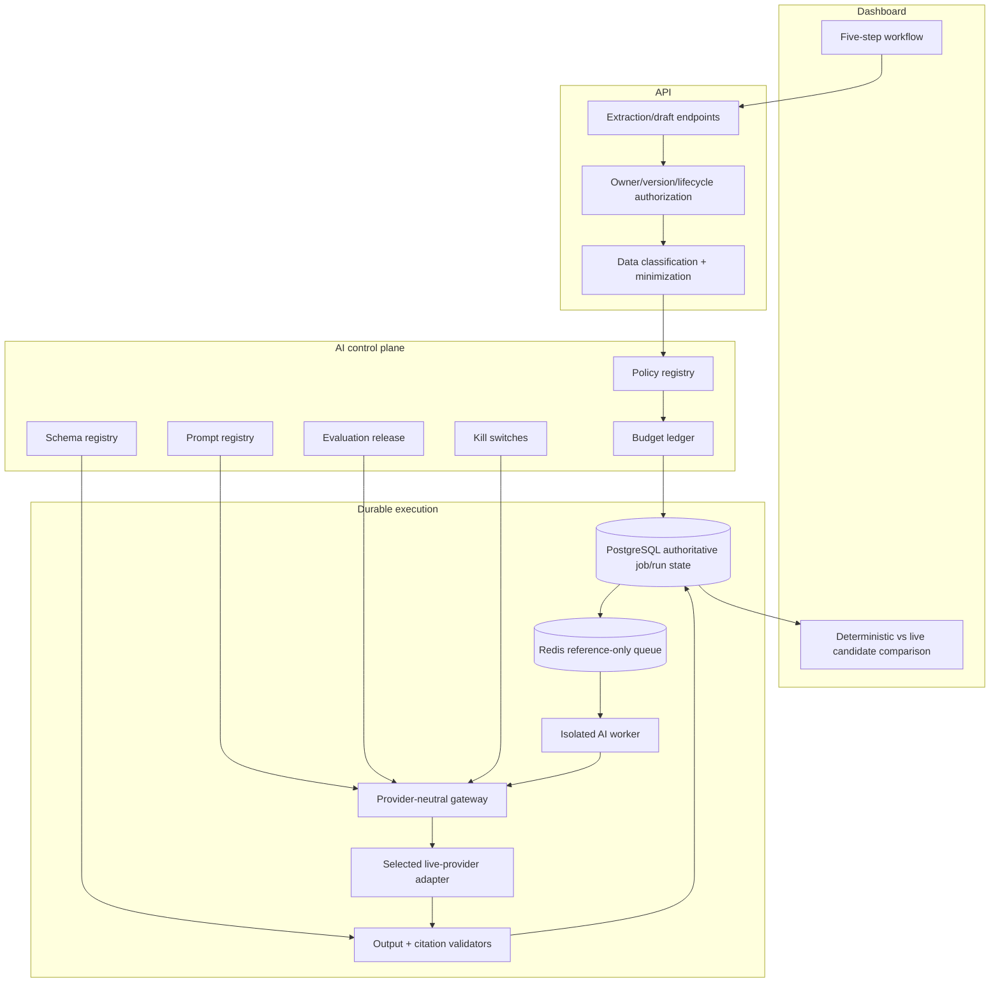

# Slice 3B — Controlled Live-AI Provider Pilot

**Status:** Approved for accelerated isolated-test implementation
**Environment:** Isolated test environment only
**Depends on:** Formally accepted Slices 1F, 2D, 2F and 3A

## 1. Executive summary

Slice 3B introduces the first real model invocation through the existing provider-neutral gateway. It is a bounded evaluation increment, not a production rollout.

The initial pilot generates:

1. cited structured requirement candidates; and
2. cited, read-only proposal draft sections.

Initial execution uses synthetic fixtures only. A later configuration gate may permit individually approved non-confidential DXG test sources after the provider, privacy terms, region and data-classification policy are recorded. Confidential, restricted, pricing, contract and personal data remain denied.

```mermaid
flowchart LR
    U[Authenticated proposal owner] --> API[Proposal intelligence API]
    API --> P[Policy + data classification]
    P --> B[Budget reservation]
    B --> J[Durable reference-only job]
    J --> R[Redacted evidence package]
    R --> G[Provider-neutral gateway]
    G --> A[Approved live adapter]
    A --> V[Schema, citation and safety validation]
    V --> PG[(Immutable PostgreSQL candidate)]
    PG --> UI[Human review only]
```



MongoDB remains authoritative and unchanged by live-generated prose.

## 2. Goals and success criteria

### Goals

- Prove real-model connectivity without weakening accepted security boundaries.
- Compare live output with deterministic baselines on fixed evaluation fixtures.
- Measure extraction accuracy, citation correctness, unsupported claims, latency and cost.
- Expose only validated, cited, read-only candidates to authenticated proposal owners.
- Establish provider, credential, budget and emergency-stop operations before broader data use.

### Success criteria

- 100% of live requests pass policy and budget checks before provider invocation.
- 100% of factual output elements carry valid evidence identifiers.
- Zero proposal mutations or publications originate from the live-provider path.
- Zero prohibited content appears in queues, logs, traces or metrics.
- Cross-tenant, non-owner, stale-version and disallowed-lifecycle tests fail closed.
- Provider timeout, throttling, malformed output and outage scenarios recover safely.
- DXG approves quantitative pilot thresholds before non-confidential data is activated.

## 3. Scope

### Confirmed provider direction

- Initial pilot provider: **OpenAI**.
- The OpenAI API credential is already configured in the ignored backend environment and is not tracked by Git.
- Initial model: **`gpt-5.4-mini`**, pinned through an immutable provider/model release record.
- This model is selected for the pilot because it supports structured outputs and offers a strong cost/quality balance for well-defined extraction and evidence-bound drafting tasks.
- A future **Anthropic Claude** adapter may be added through the same provider-neutral port.
- Claude will require its own credential, immutable provider/model release, contract tests, gold evaluation and explicit activation. It will not be an automatic fallback from OpenAI.

### Included

- One explicitly selected enterprise provider and model deployment.
- Live adapters behind the current `AiProvider` port.
- Operations `extractStructured` and `generateFromEvidence` only.
- Fixed synthetic evaluation fixtures initially.
- Approved non-confidential test sources only through a separate disabled-by-default policy.
- Evidence minimization, redaction and checksum-bound citations.
- Durable jobs, idempotency, timeout/retry, rate and concurrency controls.
- Token/cost metering, reservation, reconciliation and hard budget stops.
- Immutable prompt, schema, policy and evaluation-release identifiers.
- Read-only dashboard comparison of deterministic and live candidates.
- Local/private content-free telemetry and administrative kill switch.

### Excluded

- Confidential, restricted, personal, pricing or contract data.
- DXG knowledge retrieval during generation.
- AI-generated clarification questions.
- Rewriting or tone adjustment.
- Generated-prose application or any new MongoDB mutation path.
- Automatic or assisted publication.
- Provider fallback that changes vendor/model without explicit approval.
- Internet browsing, tools, code execution or arbitrary prompts.
- Production provisioning and external telemetry/alerts.

## 4. Recommended pilot defaults

| Control | Default |
|---|---|
| Environment | Isolated test only |
| Initial data | Fixed synthetic evaluation fixtures |
| Optional next data | Specifically approved non-confidential DXG fixtures |
| Operations | Structured extraction and cited read-only drafting |
| Provider/model | OpenAI `gpt-5.4-mini`; one immutable allowlisted release |
| Training use | Contractually disabled |
| Provider retention | Zero retention where available; otherwise client-approved maximum |
| Region | DXG-approved region; US recommended if no other requirement exists |
| Timeout | 45 seconds |
| Attempts | Maximum 2 for retryable transport/throttle failures |
| Fallback | None |
| Per-user concurrency | 2 live runs |
| Organization concurrency | 5 live runs |
| Per-proposal generation | 10 live runs per hour |
| Input ceiling | 32,000 tokens per run after evidence minimization |
| Output ceiling | 4,000 tokens per run |
| Output | Schema-valid, source-cited and read-only |
| Kill switch | Global, provider, organization and operation levels |

DXG has not imposed a commercial pilot budget ceiling. Spend is therefore monitored and reported rather than blocked by a monthly/daily amount. Technical per-run token ceilings, concurrency/rate limits and emergency kill switches remain mandatory; “no limit” does not permit unbounded requests or uncontrolled provider execution.

## 5. Architecture



### Responsibilities

- **Proposal APIs:** reuse accepted owner, version and lifecycle controls.
- **Data policy service:** classify, minimize and deny prohibited evidence before job creation.
- **Evidence packager:** resolves approved references inside the worker and never places content on Redis.
- **Gateway:** selects only an approved policy/prompt/schema/model release and reserves budget atomically.
- **Provider adapter:** maps the canonical request to one provider SDK/API; it cannot choose policy or mutate proposals.
- **Validator:** enforces schema, size, citations, protected facts and unsupported-claim policy.
- **Evaluation service:** scores fixed gold fixtures and blocks unapproved model/prompt/schema releases.
- **Dashboard:** labels live output, provider/model release, citations, gaps, cost and validation status; output remains read-only.

## 6. Request and sequence flow

```mermaid
sequenceDiagram
    actor Planner
    participant API
    participant PG as PostgreSQL
    participant Q as Redis/BullMQ
    participant W as AI Worker
    participant G as Gateway
    participant L as Live Provider

    Planner->>API: Request live extraction/draft with expected version
    API->>API: Authenticate owner; validate lifecycle and classification
    API->>PG: Create idempotent request/job reference
    PG->>Q: Dispatch IDs only
    Q->>W: Receive reference-only message
    W->>PG: Resolve policy, prompt, schema and approved evidence refs
    W->>G: Execute canonical operation
    G->>PG: Atomically reserve budget
    G->>L: Minimized evidence + structured-output request
    L-->>G: Candidate + provider usage
    G->>G: Validate schema, citations, protected facts and size
    G->>PG: Store immutable candidate; reconcile cost
    API-->>Planner: Read-only cited result or safe error
```

The provider receives no organization/user/proposal identifiers unless technically required and explicitly allowlisted. Evidence uses opaque local IDs; provider-visible text is the minimum required for the approved operation.

## 7. Data classification and provider policy

| Classification | Initial pilot | Optional later in 3B | Notes |
|---|---:|---:|---|
| Synthetic | Allowed | Allowed | Fixed evaluation fixtures |
| Non-confidential DXG | Denied by default | May be enabled | Requires named approved fixtures and provider/privacy approval |
| Internal knowledge | Denied | Denied | Retrieval remains separately gated |
| Confidential client | Denied | Denied | Requires a future confidential-processing increment |
| Restricted | Denied | Denied | Includes secrets and regulated data |
| Pricing/contract | Denied | Denied | Remains outside pilot |
| Personal data | Denied | Denied | Redact or exclude before any later approval |

Every request records a classification decision and policy release. Unknown classification fails closed.

## 8. Provider adapter design

The existing `AiProvider` contract must be expanded without coupling domain logic to a provider:

- canonical operation, evidence and output schema;
- explicit provider deployment reference;
- abort signal/deadline;
- idempotent request fingerprint where supported;
- structured usage and finish reason;
- normalized retryable versus terminal errors;
- provider request ID stored as controlled metadata;
- no logging of prompt, evidence or output content.

Adapters are registered by allowlisted configuration. Provider/model changes require a new immutable model release and evaluation approval. There is no automatic cross-provider fallback.

## 9. Persistence changes

PostgreSQL remains authoritative for AI-domain records. Proposed additive migration `013_live_ai_pilot` adds:

- `ai_provider_releases`: provider, deployment/model, region, status and approved capabilities—no credential values;
- `ai_evaluation_releases`: fixture suite, thresholds, result checksum and approval state;
- `ai_data_policy_releases`: permitted classifications and redaction policy;
- `ai_kill_switches`: scoped enabled/disabled state and audit reason;
- provider-request metadata and normalized usage fields on attempts;
- indexes for organization/status/time, budget reconciliation and evaluation lookup.

Existing immutable prompts, schemas, policies, runs, attempts, validation results, budget ledgers and audit events are reused. MongoDB receives no schema change.

## 10. API changes

Capability endpoints continue to own user intent:

| Method | Endpoint | Purpose |
|---|---|---|
| `POST` | `/api/v1/proposals/:id/live-context-jobs` | Request live cited extraction |
| `POST` | `/api/v1/proposals/:id/live-draft-jobs` | Request live cited read-only draft |
| `GET` | `/api/v1/proposals/:id/live-runs/:runId` | Owner-scoped validated result |
| `GET` | `/api/v1/ai/pilot/status` | Content-free provider/policy/budget readiness |
| `POST` | `/api/v1/ai/pilot/evaluations` | Security-admin synthetic gold-suite run |
| `POST` | `/api/v1/ai/pilot/kill-switch` | Security-admin emergency disable |

All mutations require authentication, authorization, idempotency key, correlation ID, rate limits and validated bodies. Proposal operations require expected proposal version and active draft/unsubmitted lifecycle. No arbitrary-prompt endpoint is created.

## 11. Security review

- **Authorization:** tenant RLS plus proposal-owner checks; administrative provider operations require `security:admin`.
- **Prompt injection:** source content is data, never instructions; fixed system templates and structured outputs only.
- **SSRF:** adapters call only compiled/allowlisted provider hosts; callers cannot supply URLs or deployments.
- **Secrets:** provider credentials reside in the deployment secret manager, never PostgreSQL, `.env` examples, logs or frontend.
- **Injection:** parameterized SQL, strict JSON schemas, canonical enumerations and output encoding.
- **XSS:** generated text is rendered as text, never trusted HTML.
- **CSRF:** existing authenticated mutation protection remains required.
- **Data minimization:** prohibit filenames, account identifiers and unnecessary proposal sections in provider payloads.
- **Logging:** content-free allowlist; no source, prompt, output, token, secret, filename or personal data.
- **Encryption:** TLS to provider; existing encrypted database/object-storage controls.
- **Supply chain:** pin provider SDK, scan dependencies and retain adapter contract tests.
- **Kill switch:** checked immediately before provider invocation; denial is audited.

## 12. Reliability and error handling

- Durable PostgreSQL job/run state and reference-only Redis messages remain unchanged.
- Retry only timeouts, 429 and transient 5xx failures with bounded exponential backoff and jitter.
- Do not retry policy, budget, authentication, schema, citation or safety failures.
- Maximum two provider attempts per run; each attempt has its own usage record.
- Reconcile reserved versus actual cost even when validation rejects output.
- Provider ambiguity returns a safe error and retains the deterministic/manual workflow.
- No automatic provider/model fallback.
- Worker recovery must not duplicate billable requests where provider idempotency is available; otherwise reconcile by request fingerprint and attempt state.

## 13. Performance, caching and rate limits

- Maximum evidence bytes/tokens set per operation and model release.
- Reject oversized evidence before budget reservation.
- Cache no generated output at the gateway layer; immutable successful runs are read by ID.
- Deduplicate identical request fingerprints for the same proposal version/policy release where policy permits.
- Bound API polling and use existing recovery backoff.
- Initial concurrency: 2 per user and 5 per organization.
- Enforce provider RPM/TPM below contracted limits with organization fairness.

## 14. Observability and cost controls

Content-free metrics:

- requests and outcomes by operation/provider/model release;
- policy/budget/rate-limit denials;
- queue wait, provider latency and end-to-end latency;
- input/output token bands and cost micros;
- schema/citation/safety rejection counts;
- retry and kill-switch counts.

Logs and traces carry only allowlisted IDs, pseudonymous organization, release IDs, outcome and safe error codes. Alerts remain local/private during the pilot.

Budgets require:

- a monitoring-only organization ledger while no commercial ceiling is imposed;
- per-run input and output token maximums;
- configurable monthly/daily hard ceilings that may be enabled without code changes;
- atomic reservation before execution;
- reconciliation after every attempt;
- hard stop at exhaustion;
- administrative content-free usage view.

## 15. Evaluation and testing

### Automated

- Adapter contract tests with recorded synthetic responses, never credentials.
- Policy, classification, budget, kill-switch and rate-limit unit tests.
- Schema, citation, protected-fact and unsupported-claim validation tests.
- Tenant/owner/version/lifecycle integration tests.
- Durable retry, crash recovery, idempotency and cost reconciliation tests.
- Prompt-injection, oversized-input, malformed-output, timeout, 429 and provider-outage tests.
- Content-free telemetry canary scans.

### Gold evaluation

Every provider/model/prompt/schema release runs fixed synthetic fixtures measuring:

- structured-field precision/recall;
- citation accuracy;
- unsupported-claim count;
- schema validity;
- draft factual consistency;
- repeatability;
- latency and cost.

Initial release thresholds are: 100% schema validity, 100% valid citation references, zero fabricated protected facts, zero unsupported material claims, at least 90% structured-field precision and recall on gold fixtures, and p95 end-to-end latency no greater than 60 seconds. Critical citation or fabricated protected-fact failures block release regardless of average score.

### Manual acceptance

- Compare deterministic and live outputs without implying either changed MongoDB.
- Refresh/recovery, owner isolation and stale-version behavior.
- Budget exhaustion and kill-switch operation.
- Provider outage produces safe recovery instructions.
- Database snapshot proves proposal version/content unchanged.

## 16. Deployment and rollback

Feature flags are deny-by-default:

```text
LIVE_AI_PILOT_ENABLED=false
LIVE_AI_PROVIDER=<approved value>
LIVE_AI_SYNTHETIC_ENABLED=false
LIVE_AI_NON_CONFIDENTIAL_ENABLED=false
```

Credentials are injected only into the isolated AI worker. API/dashboard processes do not require provider secrets.

Rollout:

1. migration and code with every live flag off;
2. adapter connectivity health check without proposal data;
3. synthetic gold suite;
4. security/budget/failure evidence;
5. authenticated owner UI test;
6. optional named non-confidential fixtures after separate activation approval.

Rollback disables the global kill switch and live flags, drains/marks queued live jobs cancelled, and retains immutable audit/evaluation evidence. Deterministic and manual workflows remain available.

## 17. Risks and mitigations

| Risk | Mitigation |
|---|---|
| Provider receives disallowed data | Classification allowlist, redaction, named fixtures and fail-closed policy |
| Unsupported claims | Evidence-only prompt, citations, schema and protected-fact validator |
| Cost overrun | Preflight estimate, atomic reservation, hard ceilings, concurrency/rate limits |
| Model update changes quality | Pin deployment/release and rerun gold evaluation |
| Duplicate billable calls | Durable attempt state, fingerprints and provider idempotency where supported |
| Vendor lock-in | Canonical provider port and no provider types in proposal domain |
| Users mistake output for approved content | Persistent live-candidate/read-only labels and no apply endpoint |
| Secrets leak | Worker-only secret injection and content-free telemetry |

## 18. Authorization record

DXG authorized accelerated Slice 3B implementation on July 21, 2026 without further client approval gates. OpenAI `gpt-5.4-mini` is the selected provider/model and the backend credential is already provisioned. There is no current commercial spending cap; per-run token ceilings, rate/concurrency limits, content-free usage monitoring and emergency kill switches remain mandatory. Cited requirement extraction and cited read-only proposal drafting are the only enabled live capabilities. Future Claude support remains separately activated.
