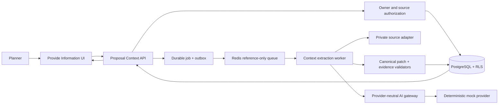
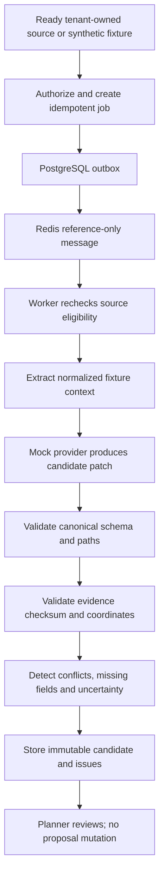
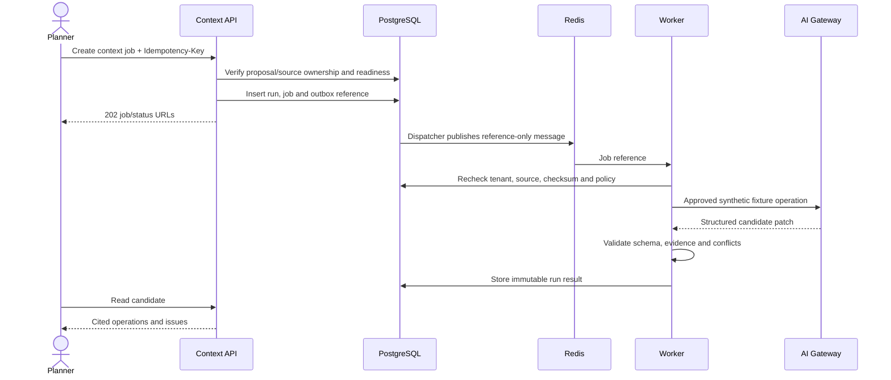
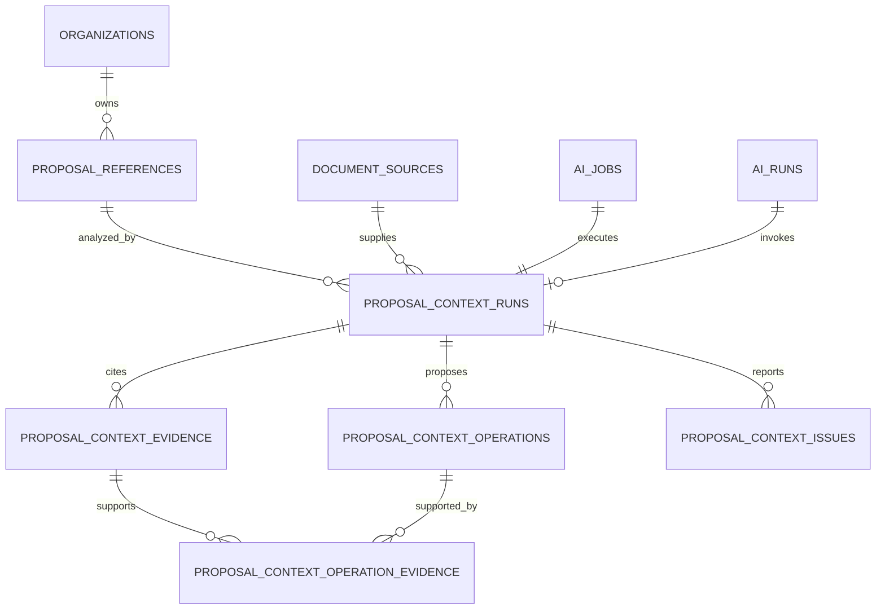

# Slice 2D — Proposal Context and Requirement Extraction

**Status:** Accepted by DXG in isolated test  
**Environment:** Isolated test only  
**Implementation:** Migration, durable execution, APIs, dashboard review, and automated evidence complete  
**Depends on:** Private ingestion, durable jobs, AI gateway, observability, canonical proposal contract, and accepted Slice 2C

## Executive Summary

Slice 2D implements the first part of the target **Provide Information** step. A planner can provide an already scanned private proposal source or an approved synthetic fixture. The system creates a durable extraction job, derives a structured proposal-context candidate, validates every candidate field against the canonical proposal contract, and attaches source evidence to every suggested value.

The result is a review-only candidate. It does not update MongoDB proposal content, generate prose, ask clarification questions, provide cost guidance, publish, or call a live AI provider.

The existing compatibility endpoint `/api/extract-proposal` is explicitly excluded. It performs an in-memory upload and direct live-model call using a broad legacy object. Slice 2D instead uses the approved private-ingestion, durable-job, provider-policy, schema, provenance, budget, and audit boundaries.

## Requirement Analysis

### Goals

- Convert approved input into a structured understanding of the proposed event/RFP.
- Minimize manual data entry while keeping the planner in control.
- Produce canonical, cited candidate fields rather than an untraceable form object.
- Identify missing, conflicting, or uncertain requirements without guessing.
- Establish the input for later draft generation and clarification-question slices.

### Functional requirements

1. A planner selects a ready, tenant-owned private proposal source or an allowlisted synthetic fixture.
2. The API creates an idempotent PostgreSQL-authoritative durable extraction job.
3. Queue messages contain references only.
4. The worker rechecks source status, ownership, purpose, classification, checksum, and retention before processing.
5. Initial execution uses `mock/deterministic-v1` and synthetic fixtures only.
6. Output conforms to `proposal-extraction-patch.v1` and contains canonical JSON Pointer paths.
7. Every candidate operation cites an exact source reference/coordinate and checksum.
8. Unknown, unsupported, conflicting, or low-confidence information becomes an issue—not an invented value.
9. The API exposes run status, candidate patch, evidence, and issues to the authenticated proposal owner.
10. Candidate data is immutable and cannot be automatically applied to MongoDB.
11. Repeated requests with the same idempotency key return the same run/job.
12. Content-free telemetry records operation, status, safe code, versions, counts, and duration.

### Non-functional requirements

- **Security:** owner authorization, tenant RLS, private storage, scan-first, no raw content in queue/logs/metrics.
- **Reliability:** durable retries, leases, cancellation, dead-letter recovery, immutable run evidence.
- **Performance:** initial test target p95 under 30 seconds for approved fixtures; API remains asynchronous.
- **Explainability:** 100% of suggested operations have valid evidence.
- **Maintainability:** extractor, model, schema, provenance, and repository are replaceable ports.
- **Accessibility:** status and candidate review are keyboard/screen-reader usable.

### Out of scope

- Live-provider or confidential-data processing.
- Applying candidates to a proposal.
- Draft narrative or section generation.
- DXG knowledge retrieval during extraction.
- Clarification-question generation.
- Cost/investment guidance, validation scoring, publication, and production.
- Training or fine-tuning a model.

## Questions and Assumptions

### Recommended defaults requiring approval

- Test environment and `mock/deterministic-v1` only.
- Fixed synthetic fixtures; no arbitrary document text is sent to the mock adapter.
- Private proposal sources must be `ready`, but actual non-synthetic content remains blocked from model processing.
- PostgreSQL stores runs, candidate patches, evidence, issues, and references; MongoDB remains authoritative proposal content.
- Maximum 200 patch operations, 200 evidence records, and 100 issues per run.
- Candidate retention: 30 days in test unless DXG specifies otherwise.
- Candidate confidence is one of `high`, `medium`, or `low`; low confidence is never offered as directly applicable.
- No “Accept all” or apply endpoint is included in this slice.

### Client questions

1. Which synthetic examples represent a simple, medium, and complex proposal?
2. Which canonical sections should be extracted first?
3. Should low-confidence candidates be hidden or displayed as questions?
4. Is 30-day candidate retention acceptable?
5. May a later local model process DXG-internal proposal documents?
6. Which conflicts must always block draft generation in the future?

## Proposed Architecture

### Component diagram



### Data flow



### Sequence



## Technical Design

### Architectural patterns

- Clean/hexagonal application boundaries.
- PostgreSQL-authoritative job/run state and reference-only queues.
- Provider-neutral AI gateway with policy-before-execution.
- Immutable, versioned prompt/schema/model releases.
- Canonical extraction-candidate patch rather than a parallel proposal shape.
- Human review before any future proposal mutation.

### Proposed modules

```text
src/modules/proposalContext/
  application/{createContextRun,executeContextRun,readContextRun}.ts
  domain/{eligibility,candidate,issues,types}.ts
  ports/{contextRepository,sourceReader,contextModel,evidenceValidator}.ts
  infrastructure/postgres/
  infrastructure/mock/deterministicContextModel.ts
  infrastructure/validation/canonicalPatchValidator.ts
  http/{proposalContextController,proposalContextRoute}.ts
```

### Proposed APIs

#### Create extraction job

`POST /api/v1/proposals/{proposalId}/context-jobs`

- Permission: `proposal:write`; proposal owner required.
- Required header: `Idempotency-Key`.
- Initial request:

```json
{
  "fixture": "synthetic-conference-medium",
  "sourceId": null
}
```

- Returns `202` with job, run, and status URLs; replay returns `200`.

#### Read context run

`GET /api/v1/proposals/{proposalId}/context-runs/{runId}`

- Permission: `proposal:read`; owner and tenant scope required.
- Returns metadata, versions, status, counts, candidate operations, evidence, and issues.
- Does not return provider request payloads, vectors, storage keys, or private URLs.

#### List context runs

`GET /api/v1/proposals/{proposalId}/context-runs?limit=20`

- Returns bounded metadata only.

No apply endpoint exists in Slice 2D.

### Candidate example

```json
{
  "operations": [
    {
      "op": "add",
      "path": "/event/eventName",
      "value": "Synthetic DXG Leadership Conference",
      "confidence": "high",
      "evidenceIds": ["uuid"]
    }
  ],
  "issues": [
    {
      "code": "MISSING_SHOW_END_TIME",
      "severity": "question",
      "paths": ["/venueSchedule/showEndTime"]
    }
  ]
}
```

### Validation rules

- Canonical UUIDs and owner-scoped proposal/source references.
- Exactly one approved fixture or eligible source reference.
- Initial classification must be `synthetic` for model execution.
- Only `add` and `replace` candidate operations; no `remove`.
- Every path must be allowed by the canonical extraction patch contract.
- Every operation has at least one evidence ID.
- Evidence checksum resolves to the exact source version.
- No operation changes ownership, tenant, lifecycle, publication, audit, or system fields.
- Limits: 200 operations, 200 evidence records, 100 issues, bounded value sizes.

### Error model

Use `application/problem+json` with safe codes including:

- `PROPOSAL_CONTEXT_DISABLED`
- `PROPOSAL_NOT_FOUND`
- `SOURCE_NOT_READY`
- `SOURCE_CLASSIFICATION_NOT_ALLOWED`
- `CONTEXT_POLICY_NOT_FOUND`
- `INVALID_CONTEXT_FIXTURE`
- `INVALID_CANDIDATE_PATCH`
- `MISSING_CANDIDATE_EVIDENCE`
- `EVIDENCE_CHECKSUM_MISMATCH`
- `CONTEXT_RUN_UNAVAILABLE`

## Database Design

### ER diagram



### Proposed migration `009_proposal_context`

- `proposal_context_runs`: tenant, proposal/source/job/AI references, fixture, status, versions, checksums, counts, timestamps, safe error.
- `proposal_context_operations`: canonical path, operation, validated value JSON, confidence.
- `proposal_context_evidence`: source reference, locator/coordinates, checksum, bounded excerpt for synthetic fixtures only.
- `proposal_context_operation_evidence`: immutable many-to-many linkage.
- `proposal_context_issues`: safe code, severity, canonical paths, status.
- Forced RLS and immutable result/evidence triggers.
- Unique tenant/idempotency key and run/ordinal constraints.

MongoDB remains authoritative for proposal content. PostgreSQL stores candidate intelligence and references only.

## Security Review

- Owner authorization plus tenant RLS prevents cross-planner/cross-tenant access.
- Only `ready`, retained, non-deleted, checksum-verified sources are eligible.
- Queue payloads carry IDs, versions, correlation, and trace context only.
- Mock fixtures prevent live/confidential provider exposure.
- Prompt injection text is treated as untrusted source evidence; it cannot request tools or change policies.
- Schema/path/evidence validation occurs after the model and before persistence/display.
- Candidate values render as text, not HTML.
- No candidate can mutate proposal, ownership, publication, or authorization fields.
- Logs exclude document text, candidate values, excerpts, names, emails, URLs, and source coordinates.
- Separate rate limits for create/read/retry operations.

## Performance and Reliability

- Asynchronous API with progress stages: `queued`, `reading_source`, `extracting`, `validating`, `completed`.
- Bounded fixture/source sizes, candidate counts, provider timeout, and attempts.
- PostgreSQL outbox, Redis reference jobs, leases, heartbeats, cancellation, retries, and dead letters.
- Results are immutable and idempotent; failed runs never replace a successful run.
- No candidate-result cache initially; metadata may use short private cache only later.
- Horizontally scalable stateless API and worker processes.

## Testing Strategy

### Unit tests

- Eligibility, fixture allowlist, canonical paths, protected paths, operation/value limits.
- Evidence requirements/checksums, conflict detection, issue severity, telemetry allowlist.
- Production/live/confidential fail-closed rules.

### Integration tests

- Tenant and proposal-owner isolation.
- Reference-only outbox/Redis messages.
- Durable retries, cancellation, dead letter, and idempotency.
- Prompt-injection fixture cannot alter policy or output schema.
- Invalid patch, unsupported path, or missing evidence fails closed.
- MongoDB proposal content remains byte-for-byte unchanged.

### E2E acceptance

- Execute simple, medium, invalid-output, conflict, and prompt-injection synthetic fixtures.
- 100% operations validate against canonical schema and have evidence.
- Zero cross-tenant/owner results.
- Zero proposal mutations.
- Repeated fixtures produce identical operations, issues, and checksums.
- Content canaries do not appear in queue/log/metric/trace output.

## Deployment and Implementation Roadmap

1. **Schema/policy:** migration 009, RLS, immutable tables, prompt/schema/policy releases.
2. **Durable execution:** context job/outbox, worker handler, deterministic model adapter.
3. **Validation:** canonical patch, evidence, conflict, issue validators.
4. **Read APIs:** owner-scoped run/list endpoints and rate limits.
5. **Dashboard foundation:** feature-flagged Provide Information async status and read-only candidate review.
6. **Evidence:** security, RLS, durability, determinism, accessibility, no-mutation, CI.

Proposed backend configuration:

```env
PROPOSAL_CONTEXT_ENABLED=false
PROPOSAL_CONTEXT_PROVIDER=mock
PROPOSAL_CONTEXT_MODEL=deterministic-v1
PROPOSAL_CONTEXT_MAX_OPERATIONS=200
PROPOSAL_CONTEXT_RETENTION_DAYS=30
```

Proposed dashboard configuration:

```env
NEXT_PUBLIC_PROPOSAL_CONTEXT_ENABLED=false
```

## Risks and Mitigations

| Risk | Mitigation |
|---|---|
| Legacy direct model path bypasses controls | New `/api/v1` module; do not call compatibility endpoint |
| Model invents values | Canonical schema, evidence required per operation, uncertainty issues |
| Candidate silently overwrites user content | No apply endpoint and no Mongo mutation |
| Prompt injection | Fixture tests, evidence-as-data framing, no tools/network/policy changes |
| Cross-owner/tenant exposure | Owner checks plus forced RLS and adversarial tests |
| Conflicting sources | Persist conflict issue; do not choose silently |
| Large documents/candidates | Bounded source, operations, evidence, issues, and timeouts |
| Mock results imply production quality | Label as architecture evidence only; real evaluation remains gated |

## Future Improvements

- Approved private-source parsing and local/live model adapters.
- DXG knowledge retrieval as additional cited context.
- User-selectable candidate application with preview, undo, and field-level acceptance.
- AI draft generation, key questions, guidance, and publish validation in later slices.

## Success Criteria

Slice 2D is complete only when synthetic proposal information produces deterministic, canonical, evidence-backed review candidates through the durable provider-neutral path; tenant and owner isolation hold; content-free telemetry is proven; and MongoDB proposal content remains unchanged.
