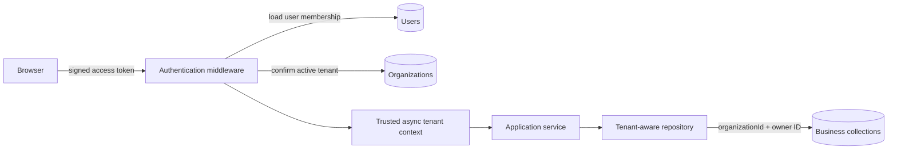

# DXG Organization and Tenant Isolation

## Decision

RFPilot uses an `Organization` as its tenant boundary. A user belongs to one organization through `users.organizationId`. Business records retain their existing owner fields and also carry `organizationId` for defense-in-depth isolation.

The current test tenant is:

- Name: DXG
- Slug: `dxg`
- Database: `dxg_rfp_tool_db`

The database-generated Organization `_id` is the authoritative tenant identifier. Clients must never submit or select this value for authorization.

## Request flow



Authentication rehydrates organization membership from MongoDB on every protected request. This keeps existing tokens compatible after migration and ensures a stale or client-modified tenant claim cannot grant access.

## Tenant-scoped data

The following collections carry `organizationId`:

- users
- proposals
- settings
- email campaigns
- notifications
- vendor responses
- canonical proposal snapshots

New proposals, settings, campaigns, notifications, vendor responses, and administrative users inherit the trusted organization context. Existing `userId`, `proposalOwnerId`, and `proposalId` relationships remain intact.

## Migration

Dry run:

```bash
npm run migrate:dxg-organization -- --run-id=<unique-run-id>
```

Apply only after totals and conflicts are reviewed:

```bash
npm run migrate:dxg-organization -- --apply --run-id=<same-run-id>
```

Rollback preview:

```bash
npm run migrate:dxg-organization -- --rollback-run=<run-id>
```

Rollback apply:

```bash
npm run migrate:dxg-organization -- --rollback-run=<run-id> --apply
```

Each changed document is recorded in `tenantmigrationjournals`, allowing exact rollback. Migration commands use the same `MONGODB_DB_NAME` setting as the application; it defaults to `dxg_rfp_tool_db`.

## Operational configuration

- `MONGODB_URL`: MongoDB connection URL.
- `MONGODB_DB_NAME`: optional database override; default `dxg_rfp_tool_db`.
- `DEFAULT_ORGANIZATION_SLUG`: organization assigned to newly registered accounts; default `dxg`.

The default organization must exist and be active before new customer, Google, or administrative registration is allowed.

## Test migration evidence — 2026-07-16

Run `dxg-test-tenant-20260716` assigned one DXG organization to 5 users, 25 proposals, 10 settings, 11 email campaigns, 72 notifications, and 7 vendor responses. Post-migration verification found zero missing assignments, zero conflicting assignments, zero proposal/owner tenant mismatches, and 130 rollback journal entries.
