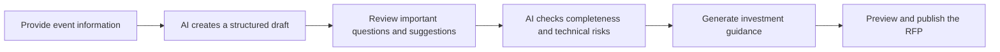
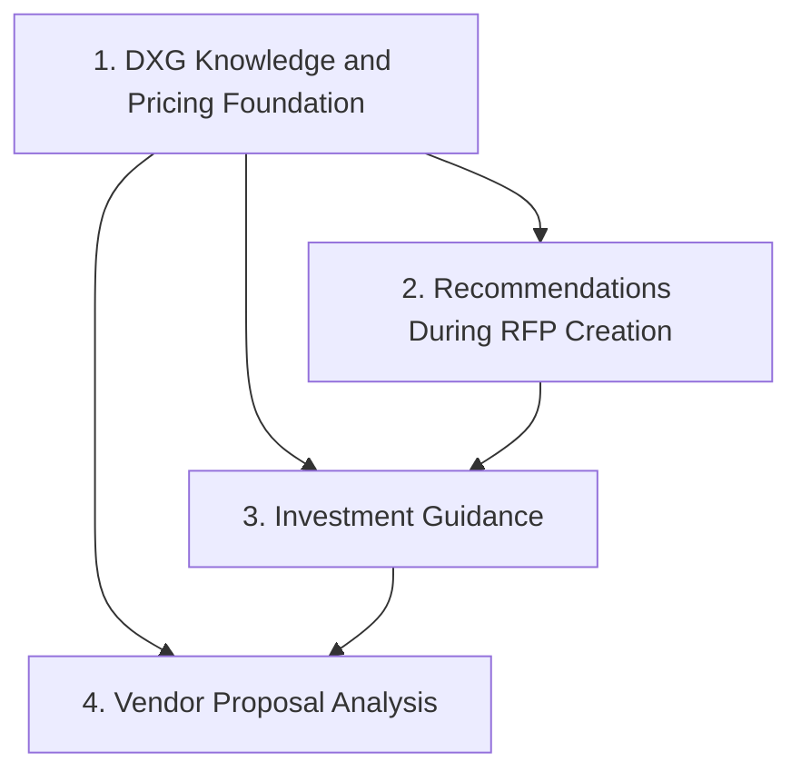
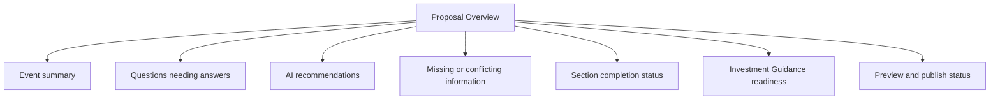
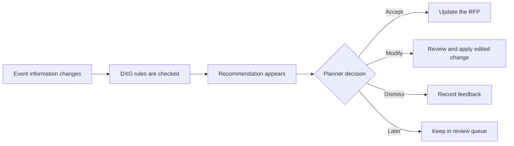
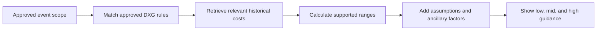
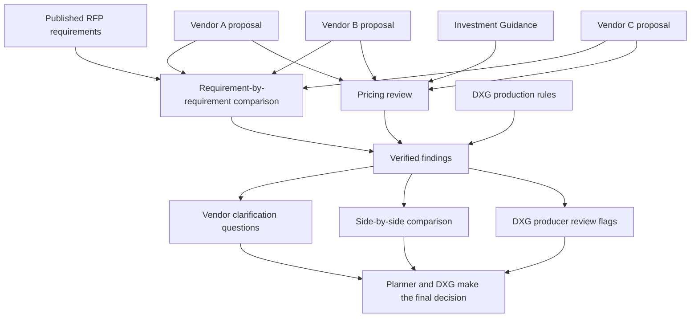
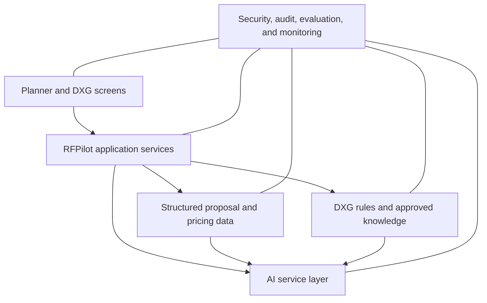
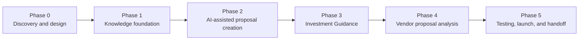

# RFPilot AI Intelligence Layer

## Plain-Language Requirements, User Flow, and Solution Design

**Prepared for:** DXG Agency  
**Prepared by:** Bayshore Team  
**Date:** July 15, 2026  
**Status:** Draft for client confirmation  
**Source:** RFPilot AI Intelligence Layer Scope of Work, Version 1.0, July 13, 2026

> **Purpose of this document**  
> This document explains the proposed RFPilot AI solution in business-friendly language. It is intended to help DXG confirm what the system should do, how planners and producers will use it, and what information or decisions are still needed before development begins.

---

## 1. Executive summary

RFPilot currently helps meeting planners create structured AV requests for proposal (RFPs), send them to vendors, and review vendor responses. The current Proposal Creation flow already allows a planner to upload a document and use AI to prefill some form fields.

The proposed next phase turns this limited document-prefill feature into a full **AI Intelligence Layer** based on DXG's real production experience and historical cost information.

The intended outcome is straightforward:

- Planners complete RFPs faster and with fewer mistakes.
- The system recommends requirements the planner may have missed.
- The planner receives a realistic low, mid, and high investment range before requesting bids.
- Vendor proposals are checked against the RFP and compared with one another.
- DXG producers review important exceptions and judgment calls instead of manually reviewing everything.
- Every important AI recommendation, price, and finding can be traced to an approved source.

### The proposed experience in one sentence

> The planner provides the available event information, AI prepares a structured draft, the planner reviews only important questions and recommendations, and the system validates the RFP before it is published.

---

## 2. What is changing?

### Current approach

The current application uses a long, step-by-step form. Even after AI extracts information from an uploaded file, the planner still needs to move through nearly every section and manually check the fields.

```mermaid
flowchart LR
    A[Upload a document<br/>or start manually] --> B[Event Overview]
    B --> C[Venue and Schedule]
    C --> D[Room Specifications]
    D --> E[Hybrid and Virtual]
    E --> F[Content and Creative]
    F --> G[Video Recording]
    G --> H[Venue Technical Details]
    H --> I[Budget and Proposal]
    I --> J[Uploads and Co-Vendors]
    J --> K[Contact and Submit]
```

### Proposed approach

The redesigned experience focuses the planner on missing, uncertain, conflicting, or high-impact information.

This does **not** remove the detailed form. Experienced planners and DXG producers can still edit every field. The default experience simply avoids making every user review every field.

---

## 3. Current workflow assessment

The current builder has a strong foundation:

- It captures detailed event, venue, room, AV, production, budget, vendor, and contact information.
- It supports document upload and AI-based field extraction.
- It skips some irrelevant sections based on event format.
- It already contains several useful rules and warnings for union venues, production crew, LED walls, power, budget complexity, and co-vendor coordination.
- It supports drafts, copies, editing, publication, preview, and email distribution.

However, several issues make the experience slower than necessary:

1. **The flow is long.** A planner may need to review nine or ten sections even when most information was extracted correctly.
2. **AI results are not transparent.** The planner cannot clearly see where an extracted answer came from or how confident the system is.
3. **Important questions are mixed with routine fields.** The planner must search through the form to identify what still needs attention.
4. **Suggestions are spread throughout the interface.** They do not yet use one approved, versioned DXG knowledge source.
5. **There is no single readiness view.** The planner cannot immediately see whether the RFP is complete enough to publish or price.
6. **Budget tiers are generic.** They do not yet provide the defensible, source-backed investment guidance required by DXG.
7. **Saving should be more automatic.** Progress should be continuously saved and easy to resume.
8. **Validation is inconsistent.** Some sections block progress while other important gaps may remain unnoticed until later.

---

## 4. What the client is asking the AI to do

The Scope of Work describes four connected workstreams.

The first workstream is the foundation. The other three should not rely on generic AI knowledge alone.

### 4.1 DXG knowledge and pricing foundation

The system must organize two types of DXG knowledge:

1. **Historical cost information** from previous contracts, quotes, spreadsheets, PDFs, and exports.
2. **Expert production rules** learned from the DXG founder and other approved experts.

Examples of expert rules may include:

- A ballroom of a certain size and ceiling height normally requires a particular display or audio approach.
- A union venue in a particular market creates specific labor conditions.
- A general session with a particular audience size usually needs a certain crew structure.
- A large LED wall may require additional power, rigging, labor, or load-in time.

DXG must be able to review, correct, approve, update, and roll back this knowledge without depending on a developer.

### 4.2 Recommendations during RFP creation

While the planner completes the RFP, the system should:

- Notice missing or unrealistic requirements.
- Explain why a recommendation applies.
- Show the likely effect on production, risk, or cost.
- Allow the planner to accept, modify, dismiss, or defer the recommendation.
- Insert accepted changes into the structured RFP.
- Record whether recommendations were accepted or dismissed so DXG can improve the rules.

### 4.3 Investment Guidance

Before the RFP is sent to vendors, the system should provide:

- A low, mid, and high estimated range for equipment.
- A low, mid, and high estimated range for labor.
- Ancillary cost factors that are commonly forgotten.
- Assumptions and limitations.
- The source of every supported number.
- Questions the planner should ask the venue when a cost cannot yet be estimated.

Ancillary factors include:

- Trucking and freight.
- Crew travel and per diem.
- Rigging and venue power.
- Union labor conditions.
- Venue exclusivity or in-house AV fees.
- Taxes and service charges.
- Insurance requirements.

If RFPilot does not have enough approved information to support a number, it must say so rather than guess.

### 4.4 Vendor Proposal Analysis

After vendors respond, the system should:

- Check every vendor response against every RFP requirement.
- Mark each requirement as addressed, partially addressed, or missing.
- Compare pricing against RFPilot's guidance and other vendor bids.
- Identify missing or unusually high or low line items.
- Detect likely hidden future costs.
- Flag production risks related to equipment, crew, redundancy, schedules, and load-in assumptions.
- Explain the trade-offs between vendors.
- Generate specific clarification questions for each vendor.
- Identify findings that require DXG producer judgment.

The system will **not** select the winning vendor. The planner and DXG remain responsible for final decisions.

---

## 5. Proposed planner experience

### Step 1 — Start the proposal

The planner may begin in any of these ways:

- Upload an event brief, venue document, RFP, schedule, spreadsheet, or previous quote.
- Paste notes or the contents of an email.
- Answer a short set of guided questions.
- Reuse an earlier proposal.
- Start with the full manual form.

The planner may combine multiple sources.

### Step 2 — AI prepares the first draft

AI reads the available information and creates structured proposal data. Each extracted item should include:

- The proposed answer.
- Where it came from.
- How confident the system is.
- Whether another source disagrees.
- Whether the planner has confirmed it.

Low-confidence information should never be silently treated as confirmed.

### Step 3 — Show one clear review page

Instead of sending the planner directly into the first form section, RFPilot should show a proposal overview.

The main action should be **Review items needing attention**. A secondary action should be **Edit all details**.

### Step 4 — Ask only high-value questions

RFPilot should prioritize questions that materially affect production or cost, such as:

- Expected audience size.
- Room count, room sizes, and session types.
- Event schedule, rehearsal, load-in, and strike times.
- Venue and union status.
- LED wall, projection, audio, lighting, recording, and streaming needs.
- Crew expectations and production complexity.

Answers should update all relevant sections automatically.

### Step 5 — Present DXG recommendations

Each recommendation should answer five simple questions:

1. What is being recommended?
2. Why does it apply to this event?
3. What approved DXG information supports it?
4. What could happen if the planner does not follow it?
5. What will change if the planner accepts it?

### Step 6 — Allow detailed editing

The existing detailed sections remain available for advanced users. They should be reorganized as expandable sections rather than a mandatory linear path.

For events with several rooms, RFPilot should offer a table or bulk-edit mode so planners can copy common requirements across rooms and edit only the differences.

### Step 7 — Generate Investment Guidance

When enough information is available, the planner can generate a structured estimate.

Changing an important event requirement should mark the current guidance as out of date and prompt the planner to recalculate it.

### Step 8 — Run a final quality check

Before publication, RFPilot should check for:

- Missing vendor-critical requirements.
- Conflicting dates, quantities, or room details.
- Unrealistic load-in, rehearsal, or strike schedules.
- Missing crew, equipment, redundancy, or venue coordination.
- Unresolved high-priority recommendations.
- Unsupported pricing or claims.

### Step 9 — Preview and publish

The planner should be able to review the generated RFP, return directly to the source field for corrections, rewrite selected wording, save a draft, export, or publish.

AI rewriting may improve tone and clarity, but it must not silently change approved requirements, quantities, schedules, or pricing.

---

## 6. How vendor analysis will work

The AI should produce structured findings first. A narrative report should then be created only from those checked findings. This reduces the risk of plausible-sounding but unsupported statements.

---

## 7. What the solution contains

The proposed solution can be understood as six connected parts.

### 7.1 Planner and DXG screens

- Proposal workspace.
- Review queue.
- Detailed scope editor.
- Investment Guidance view.
- Proposal comparison and analysis view.
- DXG rule and pricing administration.
- Producer review queue.

### 7.2 RFPilot application services

These services manage proposals, uploaded documents, recommendations, estimates, vendor analysis, approvals, and exports.

### 7.3 Structured proposal and pricing data

Important information should be stored as clearly defined fields, line items, requirements, and findings—not only as generated text.

### 7.4 DXG rules and approved knowledge

This is the protected business knowledge that makes RFPilot different from generic AI. It must remain editable, reviewable, versioned, and owned by DXG.

### 7.5 AI service layer

This layer connects RFPilot to the selected AI provider. Anthropic Claude is the preferred starting point, but the connection should be designed so DXG can change or add providers later.

### 7.6 Security, audit, evaluation, and monitoring

These controls record what happened, why the system produced a result, whether the result passed validation, what it cost, and whether a person needs to review it.

---

## 8. What AI should and should not decide

| AI may assist with | AI must not decide by itself |
|---|---|
| Extracting information from documents | Final vendor award |
| Summarizing documents and requirements | Whether an unsupported price is valid |
| Recommending missing production requirements | Whether a low-confidence fact should be treated as confirmed |
| Drafting clear RFP language | Publishing important unreviewed changes |
| Explaining approved DXG rules | Creating new authoritative DXG rules without approval |
| Identifying possible risks and price anomalies | Replacing DXG judgment on escalated findings |
| Preparing vendor clarification questions | Using customer or DXG data to train third-party models |

---

## 9. Trust and safety requirements

### No fabricated pricing

Every price range must be supported by approved historical information, an approved DXG rule, or both. If support is insufficient, the system must clearly state that it cannot provide a reliable number.

### Explain where important answers came from

Recommendations, prices, and vendor-analysis findings must include traceable supporting information.

### Use confidence and human review

The system should distinguish between:

- High-confidence findings that can be presented normally.
- Medium-confidence findings that require confirmation.
- Low-confidence or high-risk findings that should be reviewed by a DXG producer.

The exact thresholds must be agreed with DXG.

### Protect confidential information

- DXG pricing data and expert knowledge remain DXG property.
- Planner and vendor information must be protected by role and organization.
- Data must be encrypted when stored and transmitted.
- Third-party AI providers must not train their models on submitted data.
- Retention and deletion periods must be agreed and documented.

### Make AI results reviewable

For every important AI result, RFPilot should record:

- The information supplied to the AI.
- The approved knowledge retrieved for that task.
- The instructions and model version used.
- The structured result returned.
- The checks applied to the result.
- The final user or producer decision.

---

## 10. Delivery roadmap

### Phase 0 — Discovery and design

- Review the live application and backend.
- Audit historical data and test files.
- Confirm the proposal data structure.
- Confirm security, hosting, provider, cost, and response-time expectations.
- Define acceptance tests and baseline producer effort.

**Client approval:** technical design, data approach, provider benchmark plan, priorities, timeline, and cost.

### Phase 1 — Knowledge foundation

- Historical-data ingestion and DXG review.
- Expert-rule capture and administration.
- Versioning, approval, and rollback.
- Initial founder knowledge-capture sessions.

**Client approval:** DXG can review and manage rules and approved data independently.

### Phase 2 — AI-assisted Proposal Creation

- Source-based extraction review.
- High-value clarification questions.
- Recommendations with explanations and feedback.
- Readiness and final validation.
- Autosave and exception-based workflow.

**Client approval:** the test RFP can be completed primarily by reviewing exceptions, and DXG approves recommendation quality and tone.

### Phase 3 — Investment Guidance

- Equipment, labor, and ancillary ranges.
- Assumptions, coverage, and provenance.
- Venue questions for unsupported factors.
- In-product and exportable output.

**Client approval:** guidance is directionally correct against the real test event and does not contain unsupported numbers.

### Phase 4 — Vendor Proposal Analysis

- Compliance mapping.
- Price and production analysis.
- Side-by-side comparison.
- Vendor questions and producer escalation.

**Client approval:** the system identifies the material findings found by the DXG founder, avoids fabricated findings, and correctly routes judgment calls.

### Phase 5 — Testing, launch, and handoff

- Evaluation and regression tests.
- Security and operational hardening.
- Monitoring and cost controls.
- Documentation and team training.
- Production deployment.

**Client approval:** DXG can operate the system, maintain rules, and add evaluation cases without contractor dependency.

---

## 11. How success should be measured

| Area | Suggested measure |
|---|---|
| Planner efficiency | Time required to create and publish a complete RFP |
| Producer efficiency | Producer minutes required per RFP and vendor-response cycle |
| Extraction quality | Correct fields, correct sources, and conflicts successfully detected |
| Recommendation quality | DXG expert rating and planner accept/modify/dismiss results |
| Investment quality | Directional accuracy, supported line-item coverage, and ancillary-factor coverage |
| Proposal-analysis quality | Material findings detected, evidence accuracy, and correct escalations |
| Trust | Number of fabricated or unsupported pricing/findings; target should be zero |
| Consistency | Material findings remain consistent across repeated runs and approved releases |
| Operations | Success rate, response time, AI cost per task, and failure-recovery rate |

---

## 12. Important risks and how they will be reduced

| Risk | How it will be reduced |
|---|---|
| Historical pricing is incomplete or inconsistent | Audit and normalize the data, show coverage, use approved expert rules, and state when a number is unsupported |
| DXG expertise is difficult to capture | Schedule structured founder sessions and store rules in an editable approval system |
| AI writes a convincing but unsupported answer | Require structured results, sources, validation, and deterministic pricing before narrative generation |
| Frontend, backend, and AI use different data definitions | Create one shared, versioned proposal data structure |
| Large documents or comparisons time out | Process long-running tasks through background jobs with progress and retry |
| Confidential data appears in the wrong account or AI context | Use organization-level access control, protected retrieval, encryption, and security tests |
| Users trust AI too much | Show sources, confidence, limitations, changes, and required human approvals |
| AI provider cost or quality changes | Use a provider-independent connection and evaluate alternatives with the same real test cases |

---

## 13. Items that are not included

The following items remain outside this project unless approved through written change control:

- Changes to the RFPilot marketing website.
- New non-AI builder, portal, or CRM features that are not necessary for AI integration.
- AI-assisted proposal writing for vendors.
- Automatic selection or awarding of a vendor.
- Ongoing contractor responsibility for DXG knowledge maintenance after handoff.

---

## 14. Questions requiring client confirmation

### Knowledge and pricing

1. What historical contracts, quotes, spreadsheets, and cost data are available?
2. Approximately how many files and years of information exist?
3. Which information may legally be used for AI-supported pricing?
4. Which pricing evidence may be shown to planners, and which must remain visible only to DXG?
5. Who may create, approve, publish, and roll back rules or pricing data?
6. Which current RFPilot warnings are already approved DXG rules?

### Product behavior

7. What information must be present before Investment Guidance is allowed?
8. May a planner publish an RFP with unresolved critical warnings?
9. Should pasted notes/email and reuse of previous proposals be included in the first release?
10. Which recommendations require mandatory planner confirmation?
11. What should trigger automatic review by a DXG producer?

### AI and performance

12. Should Anthropic Claude be treated as the initial baseline provider?
13. Which alternative providers should be tested?
14. What response time is acceptable for extraction, recommendations, estimates, and vendor analysis?
15. What is the target or maximum AI cost per task at expected usage levels?
16. Does reproducibility mean identical wording or materially identical structured findings?

### Security and operations

17. How long should uploaded files, extracted text, AI records, and exports be retained?
18. Which user roles require access to DXG-only knowledge, pricing evidence, and producer-review findings?
19. What backend, hosting, identity, storage, and monitoring services are currently in use?

### Acceptance testing

20. Which real RFP, vendor proposals, actual event cost, and founder analysis will be used as the primary acceptance case?
21. Can DXG provide additional test cases representing different event types, markets, and budgets?
22. What reduction in producer time should be used as the initial target?

---

## 15. Client confirmation checklist

Please confirm each item below or provide comments.

- [ ] The four workstreams correctly reflect DXG's intended product scope.
- [ ] The proposed Proposal Creation flow is acceptable as the target planner experience.
- [ ] Planners should review exceptions by default while retaining full manual editing.
- [ ] Recommendations must be explainable, source-backed, and optional unless specifically designated otherwise.
- [ ] Investment Guidance must never show unsupported numbers.
- [ ] Vendor Proposal Analysis should advise and escalate but never make the award decision.
- [ ] DXG requires a human-editable, versioned rule and pricing administration system.
- [ ] Anthropic Claude may be used as the initial provider baseline, subject to testing and DXG approval.
- [ ] The proposed security, audit, evaluation, and provider-independence principles are acceptable.
- [ ] The proposed delivery phases and approval gates are acceptable.
- [ ] The open questions in Section 14 will be answered during Phase 0 Discovery.

### Approval

**DXG Agency**  
Name / title: __________________________________________  
Decision: ☐ Approved  ☐ Approved with comments  ☐ Revision requested  
Signature: _____________________________________________  
Date: __________________________________________________

**Bayshore Team**  
Name / title: __________________________________________  
Signature: _____________________________________________  
Date: __________________________________________________

### Comments or required revisions

______________________________________________________________________________

______________________________________________________________________________

______________________________________________________________________________

---

## Appendix A — Simple glossary

| Term | Plain-language meaning |
|---|---|
| AI model/provider | The third-party AI service, such as Anthropic Claude, that reads or generates language |
| AI Intelligence Layer | The complete combination of AI, DXG knowledge, pricing data, rules, checks, and user experience |
| Canonical proposal structure | One agreed definition of all proposal fields used by the interface, backend, AI, and exports |
| Confidence | An indication of how certain the system is about an extracted fact or finding |
| Deterministic rule/calculation | Logic that produces a predictable result from approved inputs instead of asking AI to guess |
| Evaluation harness | A repeatable set of test cases used to confirm quality and prevent regressions |
| Knowledge foundation | DXG's approved historical data and expert production rules |
| Provenance | Information showing where a recommendation, number, or finding came from |
| Retrieval | Selecting only the approved knowledge relevant to the current task |
| Structured output | Information returned in defined fields and categories rather than uncontrolled prose |
| Tenant/organization separation | Controls that keep one customer's data from being accessed by another customer |

## Appendix B — Technical implementation summary

This appendix is provided for technical reviewers. It does not change the business requirements above.

### Frontend

- Proposal workspace replacing the mandatory linear wizard as the default view.
- Shared versioned schema and generated types.
- Extraction review with source, confidence, conflict, and approval state.
- Review queue, recommendation diffs, autosave, asynchronous progress, multi-room bulk editing, Investment Guidance, and preview.
- Responsive, keyboard, focus, screen-reader, contrast, and error-recovery verification.

### Backend

- Typed APIs for proposal versions, source documents, extracted facts, recommendations, estimates, analysis findings, approvals, feedback, and exports.
- Background queue and workers for OCR, ingestion, estimation, exports, and multi-proposal analysis.
- Relational storage for structured records, object storage for files, and approved search/retrieval storage for source fragments.
- Rule and pricing administration with draft, review, publish, deprecate, and rollback states.

### AI layer

- Provider-independent model gateway.
- Versioned prompts and structured response schemas.
- Approved-knowledge retrieval with organization-level filtering.
- Evidence and claim validation.
- Stored AI-run records including model, prompt version, inputs, retrieved sources, output, validation, cost, and time.

### Core records

- Proposal and proposal version.
- Source document and source fragment.
- Extracted fact.
- Knowledge rule and rule version.
- Pricing observation and pricing batch.
- Recommendation and feedback.
- Estimate and estimate line item.
- Vendor-analysis finding.
- AI run.
- Evaluation case and result.

