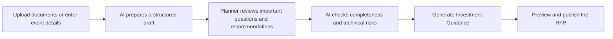

# RFPilot AI Intelligence Layer

## Requirements Confirmation Before Development

**Prepared for:** DXG Agency  
**Prepared by:** Bayshore Team  
**Date:** July 15, 2026  
**Status:** Client review and approval required

---

## 1. Purpose

This short document confirms our understanding of the RFPilot AI project and identifies the decisions and materials required before development begins.

The project goal is to reduce manual work for planners and DXG producers while ensuring that AI recommendations, pricing guidance, and vendor analysis are accurate, explainable, and based on approved DXG knowledge.

---

## 2. Proposed project scope

The project contains four connected workstreams.

### A. DXG Knowledge and Pricing Foundation

- Import historical pricing from contracts, spreadsheets, PDFs, and exports.
- Capture DXG production expertise as structured, editable rules.
- Allow DXG to review, approve, update, version, and roll back data and rules.
- Keep DXG pricing and expert knowledge protected and separate from generic AI knowledge.

### B. AI-Assisted RFP Creation

- Extract event information from uploaded files and notes.
- Show the source and confidence of extracted information.
- Identify missing, conflicting, or unrealistic requirements.
- Ask only the most important clarification questions.
- Provide DXG-backed recommendations that planners can accept, modify, dismiss, or defer.
- Keep the complete manual form available for advanced users.

### C. Investment Guidance

- Generate low, mid, and high equipment and labor ranges.
- Include freight, travel, rigging, power, union labor, venue fees, taxes, service charges, and insurance.
- Explain assumptions and show the source of supported numbers.
- Clearly state when the available data cannot support a reliable number.

### D. Vendor Proposal Analysis

- Check each proposal against every RFP requirement.
- Identify missing, partial, unclear, or conflicting responses.
- Compare vendor prices with RFPilot guidance and other vendor bids.
- Identify production risks and possible hidden costs.
- Generate clarification questions for each vendor.
- Send low-confidence or high-risk findings to a DXG producer for review.

RFPilot will assist the decision process but will **not automatically select or award a vendor**.

---

## 3. Proposed planner workflow

The default experience will focus on items that need attention. Planners and DXG producers will still be able to edit every proposal field when needed.

---

## 4. Requirements that need client confirmation

Please confirm or comment on the following items.

### Knowledge and pricing

1. What historical contracts, quotes, spreadsheets, and pricing files are available?
2. Approximately how many files and years of information exist?
3. Which historical information may be used for pricing analysis?
4. Which pricing details may be shown to planners, and which must remain visible only to DXG?
5. Who at DXG may create, review, approve, publish, and roll back rules or pricing data?
6. Which existing RFPilot recommendations are already approved DXG production rules?

### Investment Guidance

7. What information must a planner provide before RFPilot may generate an estimate?
8. Should estimates be shown by room, equipment category, labor category, event, or all of these?
9. How should RFPilot handle inflation, market differences, seasonal pricing, and negotiated discounts?
10. What level of estimate accuracy will DXG consider acceptable during the first release?

### Recommendations and human review

11. Which recommendations should be optional, and are any recommendations mandatory?
12. What types of findings must always be reviewed by a DXG producer?
13. May a planner publish an RFP with unresolved critical warnings?
14. Who will review low-confidence AI findings?

### AI provider and operating limits

15. May we use Anthropic Claude as the initial preferred provider and compare it with OpenAI?
16. What response time is acceptable for document extraction, estimates, and vendor analysis?
17. Is there a preferred or maximum AI cost per RFP or vendor analysis?

### Security and data retention

18. How long should uploaded documents, AI results, reports, and audit records be retained?
19. Are there data-location, legal, or contractual restrictions we must follow?
20. Which DXG roles may access confidential pricing evidence and cross-client information?

---

## 5. Materials requested from DXG

To begin Discovery and acceptance testing, please provide:

- One real completed RFP.
- All vendor proposals submitted for that RFP.
- The final or actual event cost, if available.
- The DXG founder's manual analysis of those vendor responses.
- A sample of historical contracts, quotes, spreadsheets, and rate information.
- Examples of important DXG production rules and known exceptions.
- A list of team members responsible for knowledge approval and acceptance testing.
- Expected usage: planners, proposals per month, vendor responses per proposal, and document sizes.

Files may be shared in a controlled sample set first. Production-wide data access is not required for the initial Discovery review.

---

## 6. Proposed acceptance criteria

The first production release should be considered successful when:

- Planners can create a complete RFP mainly by reviewing AI-extracted information and exceptions.
- Recommendations reflect approved DXG production knowledge.
- Investment Guidance is directionally correct on the agreed test events.
- Every supported price and important AI claim has traceable evidence.
- RFPilot clearly identifies unsupported pricing instead of guessing.
- Vendor analysis identifies the material findings identified by the DXG founder.
- Low-confidence and high-risk findings are correctly sent for human review.
- DXG producer review time is measurably reduced.
- DXG can maintain rules and pricing data without developer assistance.

---

## 7. Items not included

Unless added through written change approval, this project does not include:

- Changes to the RFPilot marketing website.
- AI-assisted proposal writing for vendors.
- Automatic vendor selection or award decisions.
- Unrelated CRM or proposal-builder features.
- Ongoing contractor ownership of DXG knowledge after handoff.

---

## 8. Approval to proceed

Please select one:

- [ ] **Approved:** The scope and requirements above are correct. Bayshore may finalize the technical plan and begin the approved foundation milestone.
- [ ] **Approved with comments:** Bayshore may proceed after incorporating the comments below.
- [ ] **Revision required:** A follow-up requirements session is required before work begins.

### Client comments

______________________________________________________________________________

______________________________________________________________________________

______________________________________________________________________________

### DXG approval

**Name:** ______________________________________________  
**Title:** _______________________________________________  
**Signature:** __________________________________________  
**Date:** _______________________________________________

### Bayshore acknowledgement

**Name:** ______________________________________________  
**Title:** _______________________________________________  
**Signature:** __________________________________________  
**Date:** _______________________________________________

