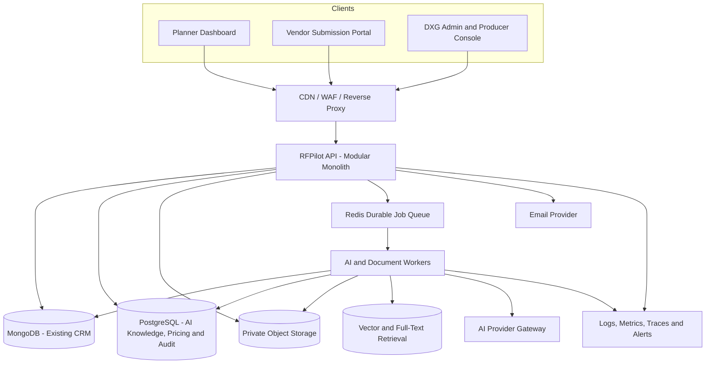
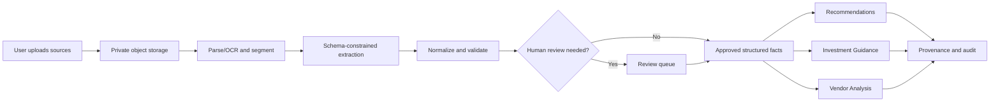
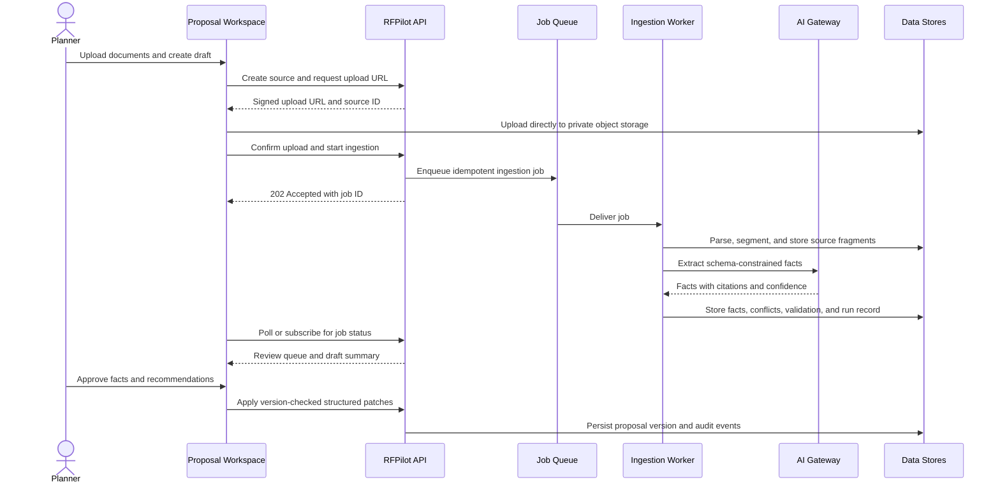
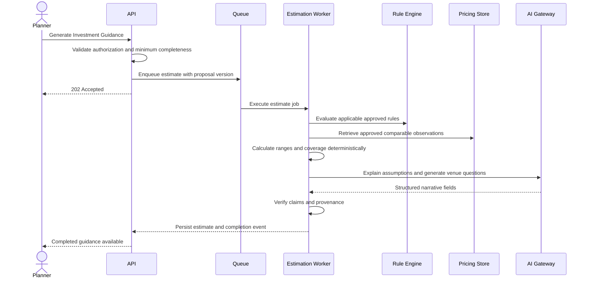
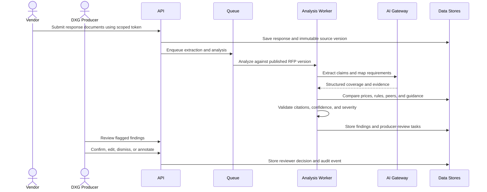
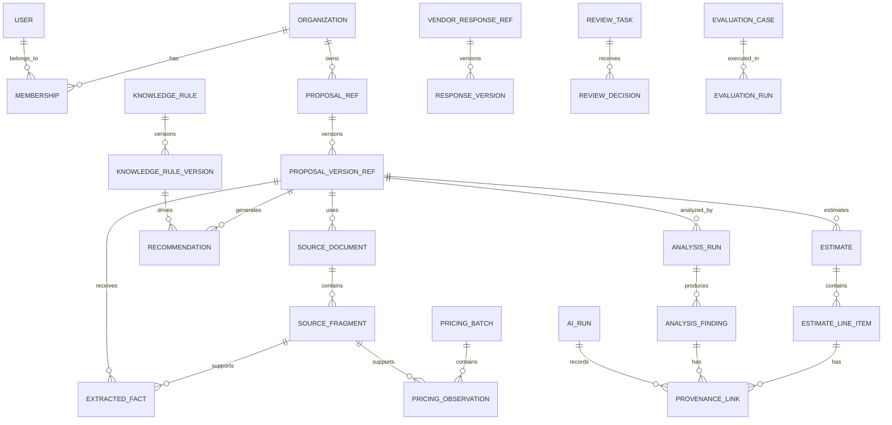
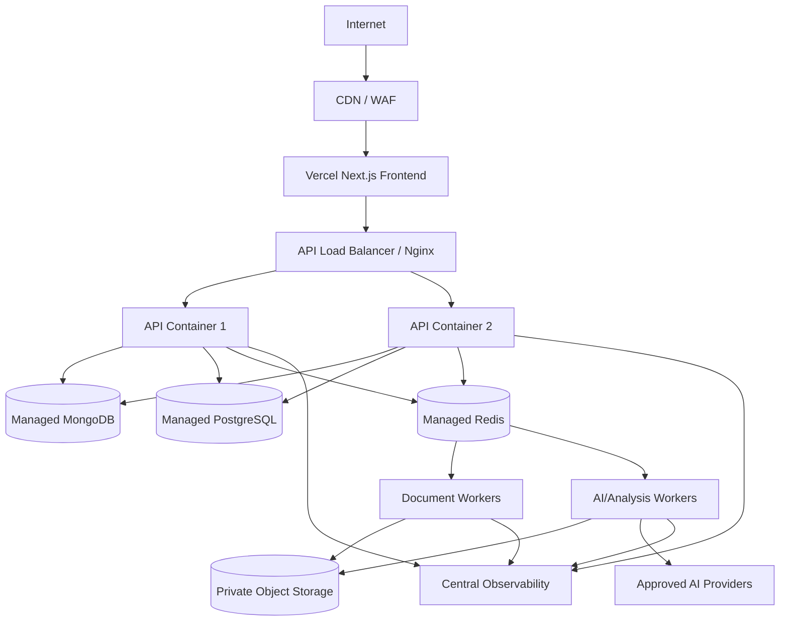

# RFPilot AI Intelligence Layer

## Enterprise Technical Design and Implementation Plan

**Status:** Draft for architecture and requirements approval  
**Prepared for:** DXG Agency  
**Prepared by:** Bayshore Team  
**Date:** July 15, 2026  
**Scope:** Entire RFPilot AI Intelligence Layer  
**Repositories reviewed:** `dxg-rfp-tool-dashboard` and `dxg-rfp-tool-backend`  
**Source requirements:** RFPilot AI Intelligence Layer Scope of Work, Version 1.0, July 13, 2026

> **Approval gate:** This document defines the proposed target architecture. No implementation should begin until DXG and the Bayshore technical team approve the requirements, material assumptions, architecture decisions, security model, API direction, and delivery milestones.

---

# Executive Summary

RFPilot currently consists of a Next.js planner dashboard and an Express/TypeScript backend using MongoDB. It supports authentication, structured proposal creation, AI-assisted document extraction, proposal distribution, vendor-response submission, email tracking, settings, notifications, and dashboard reporting.

The current AI capability is a synchronous OpenAI request that extracts text from one uploaded document and returns a partial proposal object. It does not yet provide durable processing, source citations, field confidence, conflict review, versioned DXG knowledge, pricing provenance, evaluations, Investment Guidance, or vendor-response analysis.

The recommended target is an **incrementally extracted modular platform**, not an immediate microservice rewrite. The existing application remains the product shell. New AI capabilities are added through cleanly separated domain modules and durable background workers:

1. Document Ingestion and Extraction.
2. Knowledge and Rule Management.
3. Contextual Recommendation Engine.
4. Pricing and Investment Guidance Engine.
5. Vendor Proposal Analysis Engine.
6. Human Review, Evaluation, Audit, and AI Operations.

The architecture deliberately separates deterministic business logic from model-generated language. AI may extract, classify, summarize, explain, compare, and draft. Authoritative pricing calculations, permissions, state transitions, approval rules, and provenance validation must be deterministic.

## Principal recommendations

- Maintain the current Next.js frontend and TypeScript backend during initial phases.
- Refactor the backend into a modular monolith with explicit domain boundaries and separate worker processes.
- Introduce PostgreSQL for the new AI knowledge, pricing, provenance, workflow, and audit domains; retain MongoDB for existing proposal/CRM data during staged migration.
- Use a Redis-backed durable queue for ingestion, estimation, analysis, export, and evaluation jobs.
- Store original documents and generated reports in private S3-compatible object storage.
- Use a provider-neutral AI gateway. Benchmark Anthropic Claude against the current OpenAI implementation on DXG test assets before final provider selection.
- Require schema-constrained outputs, source citations, deterministic validation, confidence classification, and human approval at authority boundaries.
- Replace public MongoDB ObjectId access with scoped, revocable public tokens.
- Move from 30-day bearer-only JWTs to short-lived access tokens and rotating refresh sessions.
- Establish an evaluation harness and release gate before any AI feature is considered production-ready.

---

# Requirement Analysis

## 1. Project goals

1. Reduce the number of DXG producer hours required to review each RFP and vendor-response cycle.
2. Embed DXG's production knowledge into RFPilot in a structured, maintainable, and auditable form.
3. Help planners create complete, technically realistic RFPs with less manual effort.
4. Provide defensible low/mid/high investment guidance with line-item provenance.
5. Analyze vendor proposals with requirement coverage, pricing context, production judgment, trade-offs, and vendor questions.
6. Route uncertain or high-risk findings to human experts instead of presenting them as facts.
7. Protect DXG proprietary knowledge and customer/vendor confidential data.
8. Make AI behavior testable, reproducible, observable, and provider-independent.

## 2. Functional requirements

### 2.1 Knowledge and pricing foundation

| ID | Requirement | Priority |
|---|---|---|
| KF-001 | Ingest historical pricing from spreadsheets, PDFs, contracts, and exports | Must |
| KF-002 | Retain source file, fragment location, checksum, extraction version, and approval status | Must |
| KF-003 | Normalize equipment, labor, market, time, currency, and ancillary cost data | Must |
| KF-004 | Present ambiguous extracted facts for DXG review before publication | Must |
| KF-005 | Create, edit, review, publish, deprecate, version, and roll back expert rules | Must |
| KF-006 | Support scheduled founder knowledge-capture sessions and structured rule templates | Must |
| KF-007 | Isolate proprietary DXG evidence from planner-visible explanations | Must |
| KF-008 | Track effective date, author, approver, reason, and superseded version | Must |

### 2.2 AI-assisted Proposal Creation

| ID | Requirement | Priority |
|---|---|---|
| PC-001 | Accept multiple proposal sources: PDF, DOCX, spreadsheet, text, pasted notes, and existing proposal | Must |
| PC-002 | Extract structured facts with citations and confidence | Must |
| PC-003 | Detect conflicts across sources instead of silently choosing a value | Must |
| PC-004 | Show an exception-based review workspace | Must |
| PC-005 | Generate prioritized clarifying questions | Must |
| PC-006 | Preserve detailed manual editing for advanced users | Must |
| PC-007 | Continuously autosave proposal state | Must |
| PC-008 | Validate completeness, consistency, schedule feasibility, and technical risk | Must |
| PC-009 | Draft and rewrite RFP language without silently changing approved facts | Should |
| PC-010 | Support bulk editing and inheritance for multi-room events | Should |

### 2.3 In-build recommendations

| ID | Requirement | Priority |
|---|---|---|
| IR-001 | Evaluate approved rules when relevant proposal facts change | Must |
| IR-002 | Explain the recommendation, evidence, confidence, and impact | Must |
| IR-003 | Support accept, modify, dismiss, defer, and undo | Must |
| IR-004 | Preview a structured field diff before applying a recommendation | Must |
| IR-005 | Record user decision and optional dismissal reason | Must |
| IR-006 | Re-evaluate dependent recommendations when proposal data changes | Must |

### 2.4 Investment Guidance

| ID | Requirement | Priority |
|---|---|---|
| IG-001 | Determine whether an RFP is sufficiently complete for estimation | Must |
| IG-002 | Calculate low/mid/high ranges for equipment and labor | Must |
| IG-003 | Surface trucking, travel, venue power, rigging, exclusivity, union, fees, taxes, and insurance | Must |
| IG-004 | Show assumptions, exclusions, data coverage, and confidence | Must |
| IG-005 | Attach provenance to every supported line item | Must |
| IG-006 | State unsupported or venue-dependent items without guessing | Must/Critical |
| IG-007 | Mark estimates stale when cost-affecting inputs or knowledge versions change | Must |
| IG-008 | Export guidance in a line-item format suitable for later bid comparison | Must |

### 2.5 Vendor Proposal Analysis

| ID | Requirement | Priority |
|---|---|---|
| PA-001 | Extract vendor response documents into structured claims and price lines | Must |
| PA-002 | Map each RFP requirement to addressed, partial, missing, or unclear | Must |
| PA-003 | Compare vendor pricing with guidance and peer proposals | Must |
| PA-004 | Detect missing, anomalous, deferred, or likely hidden cost items | Must |
| PA-005 | Apply approved production rules to equipment, crew, redundancy, and schedule | Must |
| PA-006 | Generate vendor-specific clarification questions | Must |
| PA-007 | Produce side-by-side structured and narrative comparisons | Must |
| PA-008 | Classify severity and confidence and route appropriate findings to DXG | Must |
| PA-009 | Generate client-presentable exports from verified findings | Must |
| PA-010 | Never make an automatic award decision | Must |

### 2.6 Governance and operations

| ID | Requirement | Priority |
|---|---|---|
| GO-001 | Log inputs, retrieved knowledge, prompt/model versions, outputs, and validations | Must |
| GO-002 | Evaluate quality and consistency against versioned test cases | Must |
| GO-003 | Require approval before publishing new knowledge or pricing batches | Must |
| GO-004 | Track model cost, latency, failures, retries, and human escalation | Must |
| GO-005 | Support provider comparison and controlled model/prompt rollout | Must |
| GO-006 | Provide operations, knowledge-editing, and incident runbooks | Must |

## 3. Non-functional requirements

### Security and privacy

- All customer, vendor, pricing, knowledge, prompt, and AI-run data must be tenant-scoped.
- Encryption is required in transit and at rest.
- Third-party providers must contractually and technically exclude submitted data from training.
- Private files must use time-limited signed access, not permanently public URLs.
- Audit records must be append-only for security- and approval-relevant events.
- Logs must exclude credentials, tokens, raw OTPs, full document text, and unnecessary personal information.

### Availability and reliability

- Core proposal CRUD target: 99.9% monthly availability after production hardening.
- AI jobs may be asynchronous and eventually consistent.
- Jobs must be idempotent, retryable, cancelable where safe, and recoverable after worker restart.
- No accepted recommendation, approved pricing fact, or published report may be lost because of a partial failure.

### Performance targets requiring client confirmation

| Operation | Proposed target |
|---|---|
| Standard proposal reads/writes | p95 under 500 ms excluding network |
| Recommendation evaluation | p95 under 2 seconds for deterministic rules |
| Document ingestion | first progress response under 2 seconds; completion usually under 2 minutes |
| Investment Guidance | usually under 60 seconds |
| Single-vendor analysis | usually under 2 minutes |
| Multi-vendor comparison | usually under 5 minutes |
| Job status retrieval | p95 under 300 ms |

### Scalability

- API and worker processes must scale independently.
- Storage, queues, and databases must not depend on local process disk.
- AI operations must use concurrency, quota, and budget controls per organization.
- Pagination is required for every unbounded collection.

### Maintainability

- One versioned canonical contract must drive frontend types, API validation, AI output schemas, exports, and test fixtures.
- Domain logic must be separated from Express controllers and model-provider SDKs.
- Every schema, prompt, rule, and price batch must be versioned.

## 4. Project scope

### In scope

- Current frontend/backend integration changes required for the AI layer.
- Knowledge/pricing ingestion, review, versioning, and administration.
- AI-assisted planner Proposal Creation.
- Contextual DXG recommendations.
- Investment Guidance.
- Vendor proposal extraction and analysis.
- Human review, audit, evaluation, exports, monitoring, documentation, and training.

### Out of scope

- RFPilot marketing website changes.
- Vendor-side AI proposal authoring.
- Automated award decisions.
- Unrelated CRM or builder feature development.
- Ongoing contractor curation of DXG knowledge after handoff.

## 5. Success criteria

- The test RFP can be created mainly by reviewing exceptions instead of manually traversing every field.
- The founder approves the material recommendations and professional tone.
- Investment Guidance is directionally correct and surfaces all applicable ancillary factors.
- Every displayed price has approved provenance or an explicit unsupported status.
- Vendor analysis catches the material findings in the founder baseline with no fabricated findings.
- Low-confidence and high-risk findings are correctly routed to humans.
- Producer review time materially decreases from the measured Phase 0 baseline.
- DXG can manage rules, data batches, and evaluation cases without developer assistance.

---

# Questions & Assumptions

## 1. Assumptions

1. DXG will provide real RFPs, vendor responses, actual cost outcomes, and founder analysis.
2. The founder will attend scheduled knowledge-capture and acceptance sessions.
3. MongoDB remains the existing proposal/CRM store during initial phases.
4. A managed PostgreSQL and Redis service may be added if approved.
5. DigitalOcean Spaces remains the preferred object store unless DXG selects another S3-compatible provider.
6. Anthropic Claude is the preferred provider, but Phase 0 will benchmark it against OpenAI using the same test assets.
7. The frontend remains hosted on Vercel unless deployment findings require a change.
8. Long-running workers run in a persistent container environment, not Vercel Functions.
9. Published proposals and analyses are immutable versions even when an editable working copy continues.
10. Existing users and proposal data must be migrated without service interruption.

## 2. Open questions requiring approval

### Data and knowledge

1. What historical datasets exist, in what formats, quantities, markets, currencies, and date ranges?
2. What licensing or confidentiality restrictions apply to historical contracts?
3. Which source details can planners see, and which must remain DXG-only?
4. Who may draft, approve, publish, deprecate, and roll back rules or pricing batches?
5. Which current frontend suggestions are approved rules versus provisional behavior?

### Product behavior

6. What exact completeness threshold enables Investment Guidance?
7. May planners publish with unresolved critical findings?
8. What recommendation categories may auto-apply, if any?
9. Should prior-proposal reuse and pasted email intake be Phase 2 requirements?
10. What confidence/severity combinations require producer review?

### Scale and service levels

11. Expected organizations, monthly active users, proposals/month, documents/proposal, vendor responses/proposal, and concurrent jobs?
12. Maximum acceptable AI cost per extraction, estimate, vendor analysis, and full comparison?
13. Required regional hosting or data residency?
14. Required RTO, RPO, and retention periods?

### Acceptance

15. Which assets form the initial gold-standard test suite?
16. What producer-time reduction is the initial success target?
17. Does reproducibility require equivalent structured findings or identical prose?

---

# Proposed Architecture

## 1. Architectural approach

### Options considered

| Option | Advantages | Disadvantages | Decision |
|---|---|---|---|
| Extend current controllers directly | Fast initial coding | Increases coupling, synchronous limits, weak testability and governance | Reject |
| Immediate microservices | Strong isolation and independent scaling | High operational complexity and premature distributed-system cost | Reject initially |
| Modular monolith plus independent workers | Clear boundaries, incremental migration, independent AI scaling, lower operational risk | Requires disciplined module ownership | **Recommend** |

The API remains a deployable application, but business capabilities become isolated modules with explicit interfaces. AI-heavy work executes in separate worker processes through durable queues. Modules may later be extracted into services when scale, ownership, or compliance provides evidence for doing so.

## 2. High-level component diagram



## 3. Component responsibilities

| Component | Responsibilities |
|---|---|
| Web applications | Planner, vendor, producer, and knowledge-admin experiences |
| Edge layer | TLS termination, WAF, CORS enforcement, request-size controls, rate limits |
| API | Auth, authorization, proposal state, approvals, query endpoints, job submission |
| Workers | Parsing, OCR, extraction, recommendation refresh, estimation, analysis, exports, evaluations |
| MongoDB | Existing users, proposals, settings, email campaigns, vendor responses during transition |
| PostgreSQL | Organizations, memberships, AI workflow state, facts, rules, price data, provenance, findings, audit |
| Object storage | Original files, normalized artifacts, generated reports, quarantine |
| Retrieval | Approved fragment retrieval with tenant and visibility filtering |
| AI gateway | Provider abstraction, routing, schema enforcement, retries, usage metering |
| Observability | Correlated logs, metrics, traces, audit events, alerts, dashboards |

## 4. Main data flow



## 5. Proposal Creation sequence



## 6. Investment Guidance sequence



## 7. Vendor analysis sequence



## 8. Recommended folder structure

```text
src/
  bootstrap/
    app.ts
    server.ts
    worker.ts
  common/
    auth/
    errors/
    validation/
    observability/
    persistence/
    queue/
    storage/
    ai-gateway/
  modules/
    identity/
    organizations/
    proposals/
    sources/
    extraction/
    knowledge/
    pricing/
    recommendations/
    investment-guidance/
    vendor-responses/
    proposal-analysis/
    reviews/
    evaluations/
    exports/
    notifications/
  jobs/
    ingestion/
    recommendation-refresh/
    estimation/
    vendor-analysis/
    exports/
    evaluations/
  api/
    routes/
    middleware/
    openapi/
  migrations/
  tests/
    unit/
    integration/
    contract/
    e2e/
```

Each module contains domain entities, use cases, ports/interfaces, adapters, validators, and tests. Express handlers translate HTTP requests only; they do not contain business logic.

---

# Technical Design

## 1. Current-state technical assessment

### Verified stack

- Frontend: Next.js 16, React 19, TypeScript, Tailwind CSS.
- Backend: Node.js, Express 4, TypeScript.
- Database: MongoDB with Mongoose.
- Authentication: signed JWT bearer tokens.
- AI extraction: OpenAI `gpt-4o`, synchronous request, JSON response.
- Parsing: `pdf-parse`, Mammoth, plain UTF-8 text/CSV.
- Files: Multer temporary/memory uploads and DigitalOcean Spaces.
- Messaging: Nodemailer/Resend dependencies; SMTP flows implemented.
- Realtime: in-process WebSocket notification server.
- Scheduling: in-process 12-hour cron interval.
- Deployment artifacts: Vercel configuration and DigitalOcean/PM2/Nginx guidance.

### Current technical-debt risks

1. Most proposal subdocuments use `Schema.Types.Mixed`, preventing reliable validation and indexing.
2. Proposal contracts are duplicated and inconsistent across frontend and backend.
3. AI extraction is synchronous, limited to 40,000 characters, has no OCR fallback, citations, confidence, job durability, prompt versioning, or stored run record.
4. Model and prompt are hard-coded in a controller.
5. `cors()` accepts any origin.
6. Public proposal reads use guess-resistant but unscoped MongoDB IDs and return full proposal details without checking published/open state.
7. Public view increments can be abused and generate notification amplification.
8. Vendor upload currently accepts any MIME type.
9. JWT access tokens default to 30 days with no rotation or server-side revocation.
10. OTP records appear to store plaintext OTP values.
11. Request validation is controller-specific rather than contract-driven.
12. Error bodies may expose internal error messages.
13. No application-level rate limiting, secure-header middleware, CSRF strategy, idempotency, or structured audit layer is present.
14. In-process cron and WebSockets do not safely scale across multiple instances.
15. Compiled `dist` contains unrelated legacy artifacts, increasing supply-chain and deployment ambiguity.

## 2. Technology decisions

| Area | Recommendation | Rationale |
|---|---|---|
| Runtime | Current Node.js LTS and TypeScript strict mode | Preserves team skills and frontend contract sharing |
| API framework | Express initially; evaluate Fastify during refactor | Express minimizes migration risk; Fastify offers schemas/performance but is not required for AI workloads |
| API contract | OpenAPI 3.1 plus JSON Schema/Zod-derived validation | Contract generation, SDKs, validation, documentation |
| Existing CRM store | MongoDB retained initially | Avoids risky whole-product migration |
| AI domain store | PostgreSQL 16+ | Strong relational integrity, versioning, provenance, analytics, and transactional workflows |
| Vector retrieval | `pgvector` initially | Keeps structured and semantic retrieval together; separate vector DB only if scale requires it |
| Queue/cache | Managed Redis with BullMQ | Mature TypeScript ecosystem, delayed jobs, retry, concurrency, job events |
| Object storage | Private S3-compatible storage | Durable files, signed URLs, lifecycle rules, versioning |
| AI provider | Provider gateway; Claude baseline plus OpenAI benchmark | Meets provider-independence and client selection requirements |
| Observability | OpenTelemetry, structured JSON logs, managed metrics/traces/errors | Vendor-neutral correlation and operations |
| Deployment | Containers on managed app/Kubernetes-ready platform; separate API and worker deployments | Independent scaling and reliable background work |

**Implemented Slice 1A decision:** [ADR-001](./RFPilot_AI_ADR_001_Canonical_Proposal_Contract.md) selects JSON Schema 2020-12 as the canonical `proposal.v1` source, generated TypeScript types, deterministic legacy adapters, an allowlisted public projection, and evidence-bound AI candidate patches. The [field reconciliation](./RFPilot_AI_Canonical_Proposal_Contract_v1_Analysis.md) records current drift and normalization rules.

**Implementation evidence (July 16, 2026):** both repositories now contain synchronized canonical, public, and extraction-patch schemas; generated TypeScript contracts; Ajv runtime validators; schema-hash manifests; compatibility/public-projection adapters; and contract tests. A workspace verifier proves byte-for-byte contract alignment. The backend has begun its `src/` modular boundary with lint-enforced inward dependencies. ADR-002 adds a dry-run-first, non-destructive Mongo snapshot migration with stable hashes, review routing, idempotency, checkpoint batching, safe output, and exact-run rollback. No production migration or read cutover has been executed; those remain approval gates.

## 3. Architectural patterns

- Modular monolith.
- Clean/hexagonal architecture at module boundaries.
- Domain-driven module decomposition without excessive tactical complexity.
- Command/query separation for long-running operations, not full event sourcing.
- Transactional outbox for reliable domain events.
- Saga/state-machine orchestration for multi-step AI workflows.
- Repository and provider-adapter patterns.
- Strategy pattern for model/provider selection and pricing methods.
- Specification pattern for rule conditions and eligibility checks.
- Optimistic concurrency through version numbers/ETags.

## 4. Service/module responsibilities

### Identity and Organizations

Users, organizations, memberships, roles, sessions, service accounts, invitations, and tenant context.

### Proposal Domain

Canonical proposal versions, section updates, validation, readiness, publishing, public-share tokens, and change history.

### Source/Ingestion Domain

Upload sessions, file scanning, parsing, OCR, fragment coordinates, checksums, classifications, retention, and deletion.

### Knowledge Domain

Rule authoring, structured conditions/actions, examples, review, approval, effective dating, versioning, rollback, and visibility.

### Pricing Domain

Ingestion batches, normalized observations, units/currencies, markets, date normalization, quality flags, approvals, and comparable selection.

### Recommendation Domain

Rule evaluation, recommendation lifecycle, structured patches, dependency tracking, feedback, dismissal, and stale-state handling.

### Investment Guidance Domain

Completeness gating, cost mapping, comparable retrieval, deterministic range calculation, ancillary factors, coverage, provenance, and export.

### Proposal Analysis Domain

Requirement snapshots, response extraction, compliance mapping, price comparisons, production rules, findings, questions, comparisons, and exports.

### Review and Evaluation Domain

Human queues, assignments, decisions, annotations, gold cases, scoring, regression runs, and release gates.

### AI Gateway

Provider adapters, model policy, prompt registry, schema responses, retry/fallback, token/cost metering, privacy controls, and run records.

## 5. Validation rules

- Validate all HTTP inputs against versioned schemas before controllers.
- Reject unknown fields for security-sensitive commands.
- Normalize dates to ISO dates/timestamps and store timezone explicitly.
- Store numeric attendance, dimensions, counts, duration, and monetary values as numeric fields with units; do not use display strings as source-of-truth.
- Require currency and valuation/effective date for pricing observations.
- Require source and approval status before pricing data or knowledge can be used in production.
- Require published proposal version for vendor analysis.
- Require at least one evidence reference for every substantive recommendation, estimate line, or analysis finding.
- Reject AI output that fails schema, citation, tenant, or claim validation.
- Require optimistic version match when applying AI-generated patches.

## 6. Authentication flow

### Recommended flow

1. User authenticates through password/OTP or verified OIDC provider.
2. Server issues a 5–15 minute access token and an opaque rotating refresh token.
3. Refresh token is stored hashed in a session table with device, expiry, rotation chain, and revocation state.
4. Web client stores the refresh session in a `Secure`, `HttpOnly`, `SameSite=Lax/Strict` cookie.
5. Access tokens contain subject, organization, membership role, session ID, audience, issuer, and token ID.
6. Password change, account block, suspicious rotation, or admin revocation invalidates sessions.
7. Admin and producer operations may require step-up authentication.

## 7. Authorization model

Use organization-scoped RBAC with resource ownership and selected attribute checks.

| Role | Representative access |
|---|---|
| Planner | Own organization proposals, sources, estimates, vendor responses, exports |
| Organization Admin | Planner access plus members, settings, retention, organization policy |
| DXG Producer | Assigned or permitted proposal reviews and evidence-safe analysis details |
| Knowledge Editor | Draft rules and pricing batches |
| Knowledge Approver | Publish/deprecate/rollback approved knowledge |
| DXG Admin | Cross-organization operational access with audited purpose |
| Super Admin | Break-glass/platform administration; no routine data browsing |
| Vendor | Submit/update response through scoped, expiring proposal token only |

Every query includes organization/resource scope. UI hiding is not authorization.

## 8. Configuration and environment variables

Configuration is validated at startup and divided into non-secret configuration and secret references.

```text
APP_ENV
APP_VERSION
API_PORT
PUBLIC_API_URL
FRONTEND_ORIGINS
DATABASE_MONGO_URL
DATABASE_POSTGRES_URL
REDIS_URL
OBJECT_STORAGE_ENDPOINT
OBJECT_STORAGE_REGION
OBJECT_STORAGE_BUCKET
OBJECT_STORAGE_ACCESS_KEY       # secret
OBJECT_STORAGE_SECRET_KEY       # secret
JWT_ISSUER
JWT_AUDIENCE
JWT_SIGNING_KEY                 # secret or KMS reference
GOOGLE_CLIENT_ID                # same OAuth audience in frontend and backend
AI_DEFAULT_PROVIDER
ANTHROPIC_API_KEY               # secret
OPENAI_API_KEY                  # secret
AI_MAX_COST_USD_PER_JOB
AI_MAX_CONCURRENCY_PER_TENANT
SMTP_HOST
SMTP_PORT
SMTP_USER
SMTP_PASSWORD                   # secret
OTEL_EXPORTER_OTLP_ENDPOINT
ERROR_TRACKING_DSN              # secret
ENCRYPTION_KEY_REFERENCE        # KMS reference
```

No application should start in production with placeholder secrets or an invalid allowed-origin list.

## 9. Event and queue architecture

### Queues

| Queue | Jobs |
|---|---|
| `source-ingestion` | scan, parse, OCR, segment, classify |
| `structured-extraction` | proposal facts, pricing observations, vendor response claims |
| `recommendation-refresh` | evaluate impacted rules and invalidate stale recommendations |
| `investment-guidance` | calculate and explain estimates |
| `proposal-analysis` | compliance, pricing, production findings, comparison |
| `document-export` | RFP, guidance, analysis reports |
| `evaluation` | offline benchmark and regression suites |
| `notifications` | email/in-app delivery |

### Job rules

- Client supplies or server creates an idempotency key.
- Job references immutable input versions.
- Exponential backoff with jitter for retryable failures.
- Provider rate limits and timeouts are retryable; validation failures are not.
- Dead-letter state includes safe diagnostic data and operator action.
- Jobs emit progress but do not place sensitive document text in Redis.
- Cancellation is cooperative and recorded.
- Completion writes result and outbox event in one transaction.

## 10. File storage strategy

- Direct-to-object-storage uploads through short-lived signed URLs.
- Separate quarantine and approved buckets/prefixes.
- Antivirus/malware scanning before processing.
- Content-type detection from bytes, not client MIME alone.
- Original filename stored as metadata but never used as the object key.
- Immutable object version/checksum referenced by jobs.
- Server-side encryption and bucket public access disabled.
- Signed download URLs with short expiration and content-disposition controls.
- Lifecycle policies enforce retention and deletion.

## 11. AI provider design

The gateway exposes provider-independent operations such as `extractStructured`, `classify`, `summarize`, and `generateFromEvidence`. The request includes purpose, data classification, schema, evidence, model policy, timeout, and cost budget.

### Provider selection evaluation

| Criterion | Measurement |
|---|---|
| Quality | Founder-scored findings on real assets |
| Structured reliability | Schema-valid completion rate |
| Evidence adherence | Supported-claim precision and citation correctness |
| Long context | Full RFP plus multi-proposal coverage |
| Consistency | Material result agreement across repeat runs |
| Privacy | Contract and API data-use terms |
| Cost | Cost per operation at projected volume |
| Latency | p50/p95 completion time |

No automatic cross-provider fallback may transmit data to a provider that is not approved for that data classification.

---

# Database Design

## 1. Persistence strategy

### Options

| Option | Assessment |
|---|---|
| MongoDB only | Lowest initial infrastructure, but weak relational integrity for versions, provenance, approvals, pricing dimensions, and audits |
| Full PostgreSQL migration | Strong final consistency but high delivery and migration risk before AI value is proven |
| MongoDB plus PostgreSQL transition | Preserves current product while providing a fit-for-purpose AI foundation |

**Recommendation:** use MongoDB for current CRM records during phased delivery and PostgreSQL for the new AI intelligence domain. The integration uses stable IDs, an outbox, and reconciliation jobs. A later ADR can decide whether proposals also migrate to PostgreSQL.

**Implemented transition control:** [ADR-002](./RFPilot_AI_ADR_002_Non_Destructive_Proposal_Migration.md) preserves legacy proposals and writes immutable canonical snapshots only after an approved dry-run. The [migration runbook](./RFPilot_AI_Canonical_Proposal_Migration_Runbook.md) defines prerequisites, batching, reconciliation, apply, rollback, and the separate production cutover gate.

## 2. ER diagram



## 3. Core tables

### Identity and tenancy

| Table | Important columns |
|---|---|
| `organizations` | id, name, status, data_region, settings, created_at |
| `memberships` | organization_id, user_id, role, status, created_at |
| `sessions` | id, user_id, refresh_hash, rotation_family, expires_at, revoked_at, device |

### Proposal references and sources

| Table | Important columns |
|---|---|
| `proposal_refs` | id, organization_id, mongo_proposal_id, current_version, status |
| `proposal_version_refs` | id, proposal_ref_id, version, schema_version, content_hash, published_at |
| `source_documents` | id, organization_id, object_key, checksum, media_type, size, classification, status, retention_until |
| `source_fragments` | id, source_document_id, locator JSON, text_ciphertext/text_ref, embedding, metadata |
| `extracted_facts` | id, proposal_version_id, field_path, value JSON, source_fragment_id, confidence, status, extraction_run_id |

### Knowledge and pricing

| Table | Important columns |
|---|---|
| `knowledge_rules` | id, organization_id/null, stable_key, category, visibility |
| `knowledge_rule_versions` | id, rule_id, version, condition JSON, action JSON, rationale, status, effective_at, created_by, approved_by |
| `pricing_batches` | id, source_document_id, name, status, currency_policy, submitted_by, approved_by |
| `pricing_observations` | id, batch_id, category, item_code, market, unit, quantity, unit_cost_minor, currency, observed_on, normalized_cost_minor, quality_status |

### Recommendations and guidance

| Table | Important columns |
|---|---|
| `recommendations` | id, proposal_version_id, rule_version_id, status, severity, confidence, rationale, patch JSON, fingerprint, stale_at |
| `recommendation_feedback` | recommendation_id, actor_id, action, modified_patch, reason, created_at |
| `estimates` | id, proposal_version_id, pricing_snapshot_id, status, currency, low/mid/high totals, coverage, assumptions, stale_at |
| `estimate_line_items` | id, estimate_id, category, description, unit, quantity, low/mid/high, support_status, confidence |

### Vendor analysis

| Table | Important columns |
|---|---|
| `response_version_refs` | id, vendor_response_id, version, content_hash, submitted_at |
| `requirements` | id, proposal_version_id, stable_key, section, text, structured_requirement JSON, criticality |
| `analysis_runs` | id, proposal_version_id, estimate_id, input_hash, status, model_policy, completed_at |
| `analysis_findings` | id, analysis_run_id, response_version_id, requirement_id, type, status, severity, confidence, title, detail, question, review_state |

### Governance

| Table | Important columns |
|---|---|
| `ai_runs` | id, organization_id, operation, provider, model, prompt_version, input_hash, retrieved_refs, output_ref, validation, tokens, cost, latency, status |
| `provenance_links` | id, subject_type, subject_id, source_type, source_id, claim_path, visibility |
| `review_tasks` | id, organization_id, subject_type, subject_id, reason, priority, assignee, status, due_at |
| `review_decisions` | id, review_task_id, actor_id, decision, comment, before JSON, after JSON |
| `audit_events` | id, organization_id, actor, action, resource, resource_id, purpose, metadata, occurred_at, hash_chain |
| `evaluation_cases` | id, name, asset_version, expected JSON, rubric_version, status |
| `evaluation_runs` | id, case_id, release_candidate, metrics JSON, result, reviewed_by |

## 4. Indexes

- All tenant tables: `(organization_id, id)` and tenant-specific query indexes.
- `source_documents(checksum, organization_id)` unique where deduplication is allowed.
- `source_fragments(source_document_id, fragment_order)`.
- Vector HNSW/IVFFlat index after corpus sizing; full-text GIN index for hybrid retrieval.
- `extracted_facts(proposal_version_id, field_path, status)`.
- `knowledge_rule_versions(rule_id, version)` unique and `(status, effective_at)`.
- `pricing_observations(category, market, observed_on)` plus item/unit-specific composite indexes.
- `recommendations(proposal_version_id, status, severity)` and unique active fingerprint.
- `estimates(proposal_version_id, created_at desc)`.
- `analysis_findings(analysis_run_id, response_version_id, severity, review_state)`.
- `ai_runs(organization_id, operation, created_at desc)`.
- `audit_events(organization_id, occurred_at desc)` with time partitioning when volume requires.

## 5. Constraints

- Monetary values stored as integer minor units plus ISO 4217 currency.
- Version uniqueness per parent.
- Published/approved versions immutable.
- Provenance required for supported pricing and substantive findings.
- Tenant IDs immutable and enforced by repository policy and, where practical, PostgreSQL Row-Level Security.
- Soft deletion does not bypass retention or legal-hold policy.
- State transitions enforced by application and database constraints where possible.

## 6. Migration strategy

1. Create canonical schema and IDs without changing existing behavior.
2. Backfill `proposal_refs` for MongoDB proposals.
3. Dual-write version references through an outbox.
4. Reconcile counts/hashes and alert on drift.
5. Enable AI modules by organization feature flag.
6. Migrate selected mixed fields into canonical numeric/unit types.
7. Remove obsolete legacy fields only after read-path verification and rollback window.

Migrations are forward-only, reversible through compensating migrations, tested against production-like snapshots, and executed with backups.

## 7. Backup, recovery, and partitioning

- MongoDB managed snapshots and point-in-time restore where available.
- PostgreSQL continuous WAL archiving plus daily snapshots.
- Object-storage versioning and lifecycle-protected backups.
- Redis is not a source of truth; jobs are reconstructable from persisted workflow state.
- Quarterly restoration tests.
- Proposed initial targets: RPO 15 minutes, RTO 4 hours; client confirmation required.
- Partition `audit_events`, `ai_runs`, and high-volume job history by month after measured thresholds, not prematurely.

---

# API Specification

## 1. API conventions

- Base path: `/api/v1` for new APIs.
- JSON uses camelCase externally and explicit versioned schemas.
- `Authorization: Bearer <access-token>` for authenticated API calls.
- `Idempotency-Key` required for create/start-job commands.
- `If-Match` or `expectedVersion` required for conflicting updates.
- Cursor pagination for large/changeable collections; limit default 25, maximum 100.
- Asynchronous operations return `202 Accepted` with a job resource.
- Error format follows RFC 9457 Problem Details with a correlation ID.

```json
{
  "type": "https://api.rfpilot.example/problems/validation-error",
  "title": "Validation failed",
  "status": 422,
  "code": "VALIDATION_ERROR",
  "detail": "One or more fields are invalid.",
  "instance": "/api/v1/proposals/123/estimates",
  "correlationId": "01J...",
  "errors": [{ "path": "venue.city", "message": "Required" }]
}
```

## 2. Common status codes

| Code | Meaning |
|---|---|
| 200 | Successful read/update |
| 201 | Resource created |
| 202 | Asynchronous operation accepted |
| 204 | Successful deletion/action with no body |
| 400 | Malformed request |
| 401 | Missing/invalid authentication |
| 403 | Authenticated but unauthorized |
| 404 | Resource not found within caller scope |
| 409 | Duplicate/idempotency or state conflict |
| 412 | Version/ETag precondition failed |
| 413 | Payload/file too large |
| 415 | Unsupported media type |
| 422 | Valid request shape but domain validation failed |
| 429 | Rate or quota exceeded |
| 500 | Unexpected server error |
| 502/503 | Provider or dependency unavailable |

## 3. Identity and session endpoints

| Method and endpoint | Description | Authentication |
|---|---|---|
| `POST /auth/login` | Password login | Public, rate-limited |
| `POST /auth/oidc/:provider` | Verified OIDC exchange | Public, rate-limited |
| `POST /auth/refresh` | Rotate refresh session | Refresh cookie |
| `POST /auth/logout` | Revoke current session | Session |
| `GET /me` | Current user, organization, roles | Access token |
| `GET /sessions` | List user's active sessions | Access token |
| `DELETE /sessions/:id` | Revoke session | Owner/admin |

### Login example

```http
POST /api/v1/auth/login
Content-Type: application/json

{"email":"planner@example.com","password":"<redacted>"}
```

```json
{
  "data": {
    "accessToken": "<short-lived-token>",
    "expiresIn": 900,
    "user": {"id":"usr_123","name":"Planner","organizationId":"org_123","roles":["planner"]}
  }
}
```

## 4. Proposal and source endpoints

| Method and endpoint | Description | Auth | Key validation |
|---|---|---|---|
| `POST /proposals` | Create proposal draft | Planner | Idempotency; schema version |
| `GET /proposals` | List scoped proposals | Planner | Cursor, status, search limits |
| `GET /proposals/:id` | Get workspace projection | Member | Organization/resource scope |
| `PATCH /proposals/:id` | Apply structured patch | Editor | Expected version; allowed paths |
| `POST /proposals/:id/publish` | Publish immutable version | Editor | Readiness policy |
| `GET /proposals/:id/versions` | List versions | Member | Pagination |
| `POST /proposals/:id/share-tokens` | Create scoped public/vendor token | Owner | Purpose, expiry, permissions |
| `DELETE /share-tokens/:id` | Revoke token | Owner/admin | Ownership |
| `POST /proposals/:id/sources/upload-session` | Create signed upload | Editor | Type, size, classification |
| `POST /sources/:id/complete` | Confirm object upload | Editor | Checksum, object exists |
| `POST /sources/:id/ingestion-jobs` | Start processing | Editor | Source ready; idempotency |
| `GET /sources/:id` | Source metadata/status | Member | Scope |
| `DELETE /sources/:id` | Request deletion | Owner/admin | Retention/legal hold |

### Create ingestion job

```http
POST /api/v1/sources/src_123/ingestion-jobs
Authorization: Bearer <token>
Idempotency-Key: 626f...
Content-Type: application/json

{"proposalId":"prp_123","operations":["extractProposalFacts","extractRequirements"]}
```

```json
{
  "data": {
    "jobId": "job_123",
    "status": "queued",
    "statusUrl": "/api/v1/jobs/job_123"
  }
}
```

## 5. Extraction review endpoints

| Method and endpoint | Description | Auth |
|---|---|---|
| `GET /proposals/:id/extracted-facts` | List proposed facts/conflicts | Editor/reviewer |
| `POST /extracted-facts/:id/approve` | Approve a fact | Editor |
| `POST /extracted-facts/:id/reject` | Reject with reason | Editor |
| `POST /proposals/:id/extracted-facts/bulk-decide` | Bulk review | Editor |
| `GET /proposals/:id/review-items` | Unified questions/conflicts/recommendations | Member |

Decision requests require `expectedProposalVersion`. Applying an approved fact records the source value, resulting field patch, actor, and audit event.

## 6. Recommendation endpoints

| Method and endpoint | Description | Auth |
|---|---|---|
| `POST /proposals/:id/recommendation-jobs` | Refresh impacted recommendations | Editor/system |
| `GET /proposals/:id/recommendations` | Filter by status/severity/section | Member |
| `GET /recommendations/:id` | Detail, evidence, patch, impact | Member |
| `POST /recommendations/:id/accept` | Apply proposed patch | Editor |
| `POST /recommendations/:id/modify` | Apply validated modified patch | Editor |
| `POST /recommendations/:id/dismiss` | Dismiss with optional reason | Editor |
| `POST /recommendations/:id/defer` | Keep for later review | Editor |
| `POST /recommendations/:id/undo` | Compensating patch if version-safe | Editor |

## 7. Investment Guidance endpoints

| Method and endpoint | Description | Auth |
|---|---|---|
| `POST /proposals/:id/estimates` | Start estimate job | Editor |
| `GET /proposals/:id/estimates` | List estimate versions | Member |
| `GET /estimates/:id` | Full structured guidance | Member |
| `GET /estimates/:id/provenance` | Evidence-safe provenance view | Role-filtered |
| `POST /estimates/:id/approve` | Producer/planner confirmation | Authorized reviewer |
| `POST /estimates/:id/exports` | Generate client export | Member |

### Start estimate request

```json
{
  "proposalVersion": 7,
  "currency": "USD",
  "scenario": "base",
  "includeAncillaryFactors": true
}
```

### Estimate response summary

```json
{
  "data": {
    "id": "est_123",
    "status": "completed",
    "proposalVersion": 7,
    "currency": "USD",
    "totals": {"low":85000,"mid":112000,"high":149000},
    "coverage": 0.82,
    "lineItems": [
      {
        "category":"labor",
        "description":"Show crew",
        "range":{"low":28000,"mid":35000,"high":44000},
        "supportStatus":"supported",
        "confidence":"high",
        "provenanceCount":12
      }
    ],
    "unsupportedFactors":[{"factor":"venuePower","question":"Please request the venue power rate card."}],
    "stale":false
  }
}
```

Dollar values in actual APIs should use minor units or decimal strings; the simplified example is illustrative.

## 8. Vendor response and analysis endpoints

| Method and endpoint | Description | Auth |
|---|---|---|
| `GET /public/vendor-submissions/:token/context` | Get limited submission context | Scoped token |
| `POST /public/vendor-submissions/:token/upload-session` | Upload vendor files | Scoped token |
| `POST /public/vendor-submissions/:token` | Submit/update response | Scoped token + idempotency |
| `GET /proposals/:id/vendor-responses` | List responses | Proposal member |
| `GET /vendor-responses/:id` | Response detail | Proposal member |
| `POST /vendor-responses/:id/analysis-jobs` | Start/restart analysis | Reviewer/system |
| `POST /proposals/:id/comparison-jobs` | Consolidated comparison | Reviewer |
| `GET /analysis-runs/:id` | Analysis status/result | Reviewer |
| `GET /analysis-runs/:id/findings` | Filter findings | Reviewer |
| `POST /findings/:id/decisions` | Confirm/edit/dismiss/escalate | Producer/reviewer |
| `POST /analysis-runs/:id/exports` | Generate report | Reviewer |

## 9. Knowledge administration endpoints

| Method and endpoint | Description | Auth |
|---|---|---|
| `POST /knowledge/rules` | Create draft rule | Knowledge editor |
| `GET /knowledge/rules` | Search/filter rules | Knowledge roles |
| `GET /knowledge/rules/:id` | Rule and versions | Knowledge roles |
| `POST /knowledge/rules/:id/versions` | Create new draft version | Knowledge editor |
| `POST /knowledge/rule-versions/:id/submit` | Submit for approval | Editor |
| `POST /knowledge/rule-versions/:id/approve` | Publish version | Approver, separation of duties |
| `POST /knowledge/rules/:id/rollback` | Publish prior version as new current | Approver |
| `POST /pricing/upload-sessions` | Upload historical data | Pricing editor |
| `POST /pricing/batches` | Create ingestion batch | Pricing editor |
| `GET /pricing/batches/:id/observations` | Review normalized rows | Pricing roles |
| `POST /pricing/batches/:id/approve` | Publish approved batch | Pricing approver |
| `POST /pricing/batches/:id/reject` | Reject batch | Pricing approver |

## 10. Jobs, reviews, evaluations, and audit endpoints

| Method and endpoint | Description | Auth |
|---|---|---|
| `GET /jobs/:id` | Job status and safe progress | Resource member |
| `POST /jobs/:id/cancel` | Cancel if supported | Job initiator/admin |
| `GET /review-tasks` | Assigned review queue | Reviewer |
| `POST /review-tasks/:id/assign` | Assign task | Review manager |
| `POST /review-tasks/:id/decisions` | Complete decision | Assignee |
| `POST /evaluations/runs` | Execute evaluation suite | AI operator |
| `GET /evaluations/runs/:id` | Results and regressions | AI operator/approver |
| `GET /audit-events` | Search audit trail | Auditor/admin |
| `GET /ai-usage` | Cost, tokens, latency, error metrics | Admin/AI operator |

## 11. Current endpoint compatibility

Existing `/api/*` endpoints remain temporarily available behind compatibility adapters. New clients use `/api/v1`. High-risk current behavior—especially public proposal-by-ID access and unrestricted vendor upload types—must be corrected before AI production rollout. Deprecation headers and migration dates will be documented.

---

# Security Review

## 1. OWASP Top 10 assessment and controls

| Risk | Current observation | Required control |
|---|---|---|
| Broken access control | Public proposal lookup returns full proposal by ObjectId; broad user APIs rely on controller checks | Scoped tokens, deny-by-default RBAC/ABAC, tenant repository guards, access tests |
| Cryptographic failures | JWT secret validation exists; long token lifetime; OTP appears plaintext | Short access tokens, rotating sessions, hashed OTP/refresh values, KMS-backed secrets |
| Injection | Mongoose reduces some risk; mixed objects and dynamic updates increase risk | Contract allowlists, operator sanitization, parameterized SQL, reject dangerous keys |
| Insecure design | AI trust and provenance not modeled | Threat modeling, authority boundaries, evidence requirements, human review |
| Security misconfiguration | `cors()` open, no Helmet, internal errors may be returned | Explicit origins, secure headers, production-safe errors, config validation |
| Vulnerable components | Legacy compiled artifacts and dependencies | Lockfile scanning, Dependabot/Renovate, SBOM, signed images, remove stale artifacts |
| Authentication failures | 30-day bearer token, no refresh rotation/revocation | Session model, brute-force controls, optional MFA, admin step-up |
| Integrity failures | No signed release/evaluation gate or durable job integrity | CI provenance, artifact signing, schema validation, outbox, checksum verification |
| Logging/monitoring failures | Console/Morgan logs; no structured security audit | Central structured logs, redaction, alert rules, append-only audit |
| SSRF | Uploaded/reference URLs and future fetchers create risk | URL allow policy, DNS/IP validation, egress proxy, block private/link-local networks |

## 2. Specific controls

### Input validation

- Byte-based file detection, size/page limits, decompression-bomb protection.
- Reject Mongo keys containing `$`/`.` and unknown update paths.
- Sanitize rendered rich text and never render generated HTML unsafely.
- Validate outbound URLs and redirects against allowlists.

### XSS and content safety

- React escaping by default.
- Sanitized Markdown renderer with raw HTML disabled.
- Content Security Policy with nonces and restricted frame/object sources.
- Download untrusted documents as attachments from an isolated origin.

### CSRF

- If cookie-authenticated mutations are introduced, use SameSite cookies, origin checks, and CSRF tokens where required.
- Bearer API requests still require strict CORS and must not place access tokens in query strings.

### Rate limiting

Proposed defaults, subject to load testing:

| Scope | Limit |
|---|---|
| Login/OTP | 5 attempts/15 minutes per account and IP; progressive delay |
| Public share reads | 60/minute per IP/token |
| Vendor submissions | 10/hour per token/IP plus file quotas |
| Standard authenticated API | 300/minute per user/org |
| AI job creation | Per-plan concurrency and daily budget |
| Admin/knowledge mutations | 60/minute plus audit |

Use Redis token buckets and return `Retry-After`.

### Secrets and keys

- Managed secret store or KMS references; no secrets in repository or image.
- Separate credentials by environment and service.
- Rotation runbook and dual-key transition.
- Log secret access and deny secrets to frontend/runtime jobs that do not need them.

### Secure headers

- HSTS, CSP, `X-Content-Type-Options`, `Referrer-Policy`, permissions policy, frame restrictions, and safe cache policy.
- CORS limited to configured frontend origins, methods, and headers.

### AI-specific security

- Treat documents and retrieved text as untrusted data, never system instructions.
- Separate instructions from evidence structurally.
- Prevent prompt-injection content from changing tool permissions, retrieval scope, or output schema.
- Do not permit models to execute arbitrary URLs, SQL, code, emails, or state changes.
- Validate citations and ensure cited fragments belong to the caller's permitted scope.
- Apply data-classification policy before provider transmission.

## 3. Threat-model review gates

Perform formal threat modeling before Phase 2, Phase 3, and Phase 4. Security acceptance includes SAST, dependency scan, secret scan, DAST, authorization matrix tests, file-upload abuse tests, tenant-isolation tests, and external penetration testing before general availability.

---

# Performance Review

## 1. Expected bottlenecks

1. Large PDF parsing/OCR and table extraction.
2. Model latency and provider rate limits.
3. Multi-proposal context size and repeated document processing.
4. Pricing comparable selection and normalization.
5. Vector retrieval quality/latency as corpus grows.
6. Large exports.
7. MongoDB queries against mixed/unindexed fields.
8. Notification amplification and public view tracking.

## 2. Database optimization

- Replace mixed query-critical fields with typed canonical fields.
- Query projections only; never return full source/AI-run records to list screens.
- Use cursor pagination for audit, findings, facts, and pricing observations.
- Precompute proposal readiness and analysis summaries when source versions change.
- Analyze query plans in CI/performance environments and production slow-query logs.
- Use read replicas only after consistency expectations are defined.

## 3. API optimization

- Asynchronous job initiation instead of holding HTTP connections.
- ETags for stable/versioned reads.
- Field projections or dedicated workspace summary endpoint.
- Batch decision endpoints for extraction review.
- Response compression for JSON/Markdown; avoid compressing already-compressed files.
- Stream exports and direct object-store downloads.

## 4. Caching strategy

| Cache | Key/invalidation |
|---|---|
| Published rule snapshot | Knowledge release/version; immutable |
| Retrieval results | Tenant + corpus version + normalized query hash |
| Proposal summary | Proposal version; immutable per version |
| Estimate/comparison | Input hash + rule/pricing/model-policy versions |
| Public proposal | Share token + published version; short TTL; purge on revoke |
| Provider response reuse | Only for identical safe deterministic inputs and approved policy |

Do not cache permissions without short TTL/versioning. Never cache sensitive cross-tenant responses under shared keys.

## 5. Scaling

- Horizontally scale stateless API instances.
- Scale worker pools by queue depth, provider quota, CPU/memory profile, and job type.
- Separate OCR/document workers from model-orchestration workers.
- Use bounded concurrency and backpressure rather than unlimited parallelism.
- CDN only for public/static frontend assets and approved public exports.
- Vertical scaling is acceptable for early database/workers but must not replace query/concurrency design.

## 6. Load and capacity planning

Phase 0 must capture expected workload. Load tests model peak login, proposal reads, upload-session creation, job polling, simultaneous ingestion, and multi-vendor analysis. Cost/load tests use stub providers first and a controlled provider test budget second.

---

# Implementation Roadmap

No milestone begins until its documentation and entry criteria are approved.

## Milestone 0 — Discovery and baseline

**Objective:** Validate current state, data, scale, acceptance assets, and architecture decisions.

**Tasks**

- Authenticated live UX and accessibility audit.
- Backend/infrastructure/deployment inventory.
- Historical-data audit and classification.
- Canonical schema workshop.
- Founder baseline analysis of test RFP/responses.
- Producer-time baseline measurement.
- Provider benchmark design.
- Threat model and data-flow classification.

**Deliverables:** approved ADRs, schemas, data inventory, threat model, test suite plan, estimates, and roadmap.  
**Dependencies:** access to environments and test assets.  
**Complexity:** High.  
**Risks:** hidden data quality, incomplete infrastructure knowledge.

## Milestone 1 — Platform and security foundation

**Objective:** Establish production-grade contracts, tenancy, jobs, storage, observability, and audit.

**Tasks:** canonical schema package; `/api/v1`; short session model; organization RBAC; PostgreSQL; Redis queue; private upload flow; structured errors; rate limits; observability; outbox; feature flags.

**Deliverables:** deployable API/worker foundation and migration adapters.  
**Dependencies:** Milestone 0 ADRs.  
**Complexity:** High.  
**Risks:** identity migration and dual-store consistency.

## Milestone 2 — Knowledge and pricing foundation

**Objective:** Allow DXG to ingest, review, approve, version, and operate knowledge.

**Tasks:** ingestion pipeline; source fragments; pricing normalization; rule editor; approval workflow; rollback; corpus release snapshots; founder sessions.

**Deliverables:** initial approved corpus and admin tooling.  
**Dependencies:** storage, jobs, schema, roles.  
**Complexity:** Very high.  
**Risks:** source inconsistency and rule ambiguity.

## Milestone 3 — AI-assisted Proposal Creation

**Objective:** Replace full-form review with source-grounded exception review.

**Tasks:** multi-source intake; citations/confidence/conflicts; review queue; prioritized questions; autosave; recommendation lifecycle; detailed/manual mode; readiness; final validation.

**Deliverables:** approved planner workflow on test RFPs.  
**Dependencies:** Milestones 1–2.  
**Complexity:** Very high.  
**Risks:** extraction mapping and user trust.

## Milestone 4 — Investment Guidance

**Objective:** Produce defensible source-backed ranges.

**Tasks:** cost mapping; comparable selection; range methods; ancillary factors; coverage; stale detection; explanations; provenance; export; founder evaluation.

**Deliverables:** accepted guidance on gold test assets.  
**Dependencies:** approved pricing corpus and complete proposal versions.  
**Complexity:** Very high.  
**Risks:** inadequate comparable data and false precision.

## Milestone 5 — Vendor Proposal Analysis

**Objective:** Reduce producer review to flagged findings.

**Tasks:** response extraction; requirement map; pricing comparison; production rules; questions; narrative comparison; producer review; export.

**Deliverables:** accepted analysis on vendor test set.  
**Dependencies:** published RFP requirements, guidance, knowledge rules.  
**Complexity:** Very high.  
**Risks:** long-context coverage and material-finding recall.

## Milestone 6 — Hardening and handoff

**Objective:** Achieve operational readiness and DXG independence.

**Tasks:** evaluation release gate; load/security/DR testing; cost budgets; dashboards/alerts; runbooks; training; staged rollout; production review.

**Deliverables:** production deployment, runbooks, training, support transition.  
**Dependencies:** completed feature milestones.  
**Complexity:** High.  
**Risks:** insufficient test diversity and operational ownership.

---

# Testing Strategy

## 1. Test pyramid

### Unit tests

- Rule conditions/actions and dependency calculation.
- Pricing normalization and range calculation.
- Completeness and validation policies.
- Authorization decisions and state machines.
- Provider adapters with fixtures.
- Patch generation/application and stale detection.

### Integration tests

- PostgreSQL/Mongo/Redis/object-storage adapters.
- Transactional outbox and worker retry/idempotency.
- Upload scanning and parser integrations.
- Email, signed URLs, session rotation, and audit persistence.
- AI gateway against deterministic mock provider.

### Contract tests

- OpenAPI request/response conformance.
- Shared frontend/backend schema compatibility.
- Provider structured-output fixtures.
- Event payload compatibility.

### End-to-end tests

- Upload to reviewed proposal draft.
- Recommendation accept/modify/dismiss/undo.
- Investment Guidance generation and stale recalculation.
- Vendor submission through analysis and producer decision.
- Knowledge draft through approval, release, and rollback.
- Tenant isolation and share-token revocation.

## 2. AI evaluation strategy

AI evaluation is separate from ordinary pass/fail tests.

| Capability | Metrics |
|---|---|
| Extraction | Field precision/recall, citation accuracy, conflict recall, schema validity |
| Recommendations | Expert correctness, relevance, evidence accuracy, actionability, unsafe suggestion rate |
| Investment | Directional accuracy, coverage, ancillary recall, unsupported-number count |
| Analysis | Material finding precision/recall, evidence accuracy, severity/confidence calibration, escalation accuracy |
| Narrative | Professional tone, factual consistency with structured findings, unsupported-claim count |
| Consistency | Material structured agreement across repeat runs/releases |

Every model, prompt, schema, rule release, or retrieval change runs the gold suite. Critical fabricated pricing/finding failures block release.

## 3. Load and stress tests

- Sustained standard API load at projected peak plus safety margin.
- Burst upload-session and job-creation traffic.
- Maximum file sizes/page counts and malformed files.
- Queue backlog, worker termination, Redis failover, and provider throttling.
- Concurrent multi-vendor analyses.
- Database connection exhaustion and slow queries.
- Cost-budget enforcement under abusive AI requests.

## 4. Security tests

- SAST, secret scanning, dependency/SBOM/container scanning.
- DAST against staging.
- Authentication brute force, refresh replay, role escalation.
- IDOR/BOLA and cross-tenant access matrix.
- Malicious files, MIME spoofing, zip bombs, stored XSS.
- NoSQL/SQL injection, SSRF, open redirect, CSRF/CORS.
- Prompt injection and cross-tenant retrieval leakage.
- Signed URL expiry and revoked share tokens.
- External penetration test before general availability.

## 5. Acceptance tests

DXG founder reviews outputs against real assets. Acceptance requires material-finding coverage, no fabricated findings or prices, correct ancillary factors, correct escalation, and directionally correct ranges. Producer-time reduction is measured rather than inferred.

---

# Deployment Strategy

## 1. Environments

- Local: containerized dependencies and mock providers.
- Development: shared integration environment with synthetic data.
- Staging: production-like, isolated provider accounts and sanitized test assets.
- Production: separate credentials, networks, databases, storage, queues, and budgets.

No production data is copied into lower environments without approved anonymization.

## 2. Deployment architecture



The existing single DigitalOcean droplet may serve early non-production work, but production AI workers and stateful dependencies should use managed services or a multi-node platform. API and workers must not depend on a single PM2 process or local upload directory.

## 3. CI/CD

**Implementation status (July 16, 2026):** Milestone 1 Slice 1A added pull-request CI workflows to both repositories. The frontend gate runs contract drift checks, locked install, ESLint, strict type-check, 186 Jest tests, and the production build; the backend gate runs contract drift checks, zero-warning linting for new modules, locked install, strict type-check, migration CLI validation, 128 Node tests, and compilation. Proposal, settings, notifications, dashboard, vendor-response, all email workflows, administration (including signed-in admin profile/password/avatar), account/profile management, all authentication workflows, document parsing, prompt selection, compatibility-output validation, and OpenAI invocation now cross application ports. Authentication uses account, OTP, delivery, cryptographic generator, clock, password-hasher/verifier, Google identity-verifier, and access-token ports. Google login verifies the signed ID token and configured audience before account access. Extraction uses immutable prompt `legacy-proposal-extraction.v1`, passes its identifier to the model adapter, validates legacy partial-form output against an explicit AJV schema, and rejects invalid output before display. Canonical cited patches, provider routing/budgets, and asynchronous execution remain later approved AI milestones rather than being falsely claimed by this compatibility endpoint. A final controller dependency audit finds no direct model/provider imports; remaining Mongoose controller use is identifier syntax validation. Legacy public proposal/tracking identifiers remain compatibility authorization pending Workstream 1B scoped tokens. The backend lock file is no longer ignored. The production workflow requires validation, performs a fast-forward-only update, installs the lock, builds source, prunes development dependencies, and then restarts. Non-production migration execution, security scans/remediation, immutable artifacts, integration environments, AI evaluations, canary release, and automated rollback remain planned work. See the [Slice 1A evidence record](./RFPilot_AI_Milestone_1_Slice_1A_Status.md).

1. Format/lint/type check.
2. Unit, integration, and contract tests.
3. Migration validation.
4. SAST, dependency, secret, license, and container scans.
5. Build immutable signed images and SBOM.
6. Deploy ephemeral/integration environment.
7. E2E and AI mock evaluations.
8. Deploy staging; run gold AI evaluation within budget.
9. Approval gate for migrations and AI release policy.
10. Canary production release by organization feature flag.
11. Automated rollback for service health; AI policy rollback for quality regression.

## 4. Monitoring and logging

### Metrics

- API request rate/error/latency by route and tenant class.
- Queue depth, age, throughput, retries, failures, dead letters.
- Provider request count, latency, token use, cost, throttles, schema failures.
- Retrieval latency, evidence count, empty retrieval, citation validation failures.
- Recommendation decisions, estimate coverage, escalation rate, producer review time.
- Database pool, query latency, storage, replication, Redis memory/eviction.

### Logs

- Structured JSON with timestamp, level, service, environment, trace ID, correlation ID, safe tenant/resource IDs, event, duration, and error code.
- Never log tokens, passwords, OTPs, full prompts/documents, raw vendor pricing, or sensitive personal data.
- Security audit events stored separately with longer retention and restricted access.

### Tracing

OpenTelemetry traces connect browser request, API, queue enqueue, worker execution, retrieval, provider request, database writes, and notification. AI spans record metadata and costs but not sensitive content.

### Alerts

- Availability/error-budget burn.
- Growing queue age/dead letters.
- Provider throttling or cost anomaly.
- Citation/schema validation regression.
- Cross-tenant authorization failure signals.
- Backup/replication failures.
- Critical evaluation regression.

## 5. Reliability and error handling

- Typed error taxonomy: validation, authentication, authorization, conflict, dependency, quota, retryable job, permanent job, internal.
- User messages are safe and actionable; internal cause remains in correlated logs.
- Circuit breakers and bounded retries for providers.
- Bulkheads per provider/job type/tenant.
- Graceful degradation: manual proposal editing remains available when AI is unavailable.
- AI outage must not block viewing or editing existing proposals.

## 6. Disaster recovery

- Multi-zone managed databases where available.
- PostgreSQL PITR, Mongo snapshots/PITR, versioned object storage.
- Infrastructure as code and documented secret restoration.
- Queue reconstruction from persisted workflow records.
- Quarterly restore test and annual regional-failure exercise.
- Initial proposed RPO 15 minutes/RTO 4 hours; final values require client approval.

---

# Risks & Mitigations

| Risk | Impact | Mitigation |
|---|---|---|
| Historical data lacks consistency | Unsupported or misleading guidance | Data profiling, approval, quality score, explicit coverage and unsupported status |
| Expertise cannot be fully expressed as rules | Generic or incomplete advice | Founder sessions, examples/counterexamples, hybrid rules plus reviewed AI classification |
| AI generates plausible unsupported content | Critical trust failure | Evidence-bound structured outputs, deterministic calculations, validators, release-blocking evaluations |
| Dual databases increase complexity | Consistency and operational overhead | Clear ownership, outbox, stable IDs, reconciliation, staged migration ADR |
| Current public access exposes excessive data | Confidentiality breach | Scoped expiring tokens, published projections, revocation, rate limits |
| Multi-vendor context becomes too large | Missed findings and high cost | Per-document extraction, structured intermediate results, hierarchical comparison |
| Provider changes price/quality | Budget or product instability | Gateway, gold benchmarks, budgets, caching, approved routing |
| Users over-trust AI | Incorrect RFP or decision | Confidence, provenance, diffs, warnings, mandatory human gates |
| Producer review becomes a new bottleneck | Goal not achieved | Severity queues, calibration, assignment/SLA metrics, feedback-based rule improvement |
| Scope expands into vendor writing/award | Delivery risk and liability | Enforce SOW boundaries and written change control |
| Legacy mixed schemas block analysis | Data drift and bugs | Canonical schema, generated contracts, progressive migrations, contract tests |
| Single-instance deployment fails | Outage/job loss | Managed state, multi-instance API, durable queues, separate workers, DR tests |

---

# Future Improvements

These items should be considered only after the foundational workstreams meet acceptance criteria:

1. Organization-specific approved knowledge overlays.
2. Venue intelligence profiles and rate-card integrations.
3. Market and inflation indices for time normalization.
4. Scenario planning and value-engineering alternatives.
5. Negotiation support based on verified findings.
6. Automated draft vendor-question emails requiring planner approval.
7. Portfolio analytics across event types, markets, and vendors.
8. Active-learning dashboards based on reviewed feedback without training third-party models on confidential data.
9. Separate analytics warehouse when operational reporting exceeds transactional workloads.
10. Service extraction when measured scale or team ownership justifies it.

---

# Operational Documentation Plan

The following documents are mandatory deliverables and must be updated with every material architecture or operational change.

## 1. Installation and local development

The local-development guide will define:

1. Supported Node.js and package-manager versions.
2. Required local containers: MongoDB, PostgreSQL, Redis, and S3-compatible storage emulator.
3. Safe development environment variables and mock-provider configuration.
4. Database migration and seed commands using synthetic data only.
5. API, worker, and frontend startup commands.
6. Local email capture, object-storage, queue, and OpenTelemetry inspection.
7. Unit, integration, E2E, and evaluation test commands.

The repository should provide an `.env.example` containing names and safe placeholders only. A bootstrap command should validate tools and configuration without silently installing global dependencies.

## 2. Environment setup

Each environment requires an owner, purpose, data classification, URLs, service accounts, secret references, provider account/budget, database/storage resources, observability destination, retention policy, and deployment approval policy. Production credentials must never be shared with staging or development.

## 3. Deployment and CI/CD guide

The deployment guide will cover infrastructure provisioning, migrations, compatibility windows, canary/feature-flag rollout, AI policy release, smoke tests, rollback, database restore, and emergency provider disablement. Every deployment records application version, schema version, prompt release, knowledge release, and pricing snapshot.

## 4. API usage guide

OpenAPI 3.1 is the source of truth. Generated documentation includes authentication, idempotency, pagination, optimistic concurrency, asynchronous jobs, error format, webhooks/events if added, examples, deprecation policy, and client SDK generation.

## 5. Troubleshooting guide

Runbooks will include:

- API unavailable or elevated errors.
- Database connection or replication failure.
- Queue backlog, stuck jobs, repeated retries, and dead letters.
- Object upload, malware scan, OCR, or parser failures.
- Provider timeout, throttling, schema failure, and cost-budget rejection.
- Missing or cross-tenant retrieval evidence.
- Incorrect recommendation or pricing incident.
- Failed export or notification.
- Authentication/session incident.
- Backup restore and disaster recovery.

Each runbook defines symptoms, dashboards, safe diagnostics, mitigation, escalation owner, recovery verification, and post-incident actions.

## 6. Maintenance guide

The maintenance guide defines ownership and cadence for dependency updates, database maintenance, index review, key rotation, access review, retention cleanup, backup restoration tests, prompt/model evaluation, knowledge/pricing publication, cost review, security patching, and capacity planning.

## 7. Architecture synchronization

Architecture Decision Records are required for material changes. The diagrams, OpenAPI specification, database schema, threat model, data inventory, runbooks, and evaluation rubric must be updated in the same pull request as the implementation change. Documentation drift is treated as a release defect.

---

# Approval Record

Approval confirms the requirements interpretation and target architecture, not the final commercial estimate. Material changes after approval require an Architecture Decision Record and, where scope is affected, written change control.

## Required approvals

- [ ] DXG approves functional scope and success criteria.
- [ ] DXG approves assumptions or provides corrections.
- [ ] DXG approves the modular-monolith plus worker architecture.
- [ ] DXG approves adding PostgreSQL and Redis to the platform.
- [ ] DXG approves the proposed identity, authorization, and public-token changes.
- [ ] DXG approves the provider benchmark rather than a provider-specific hard dependency.
- [ ] DXG approves the security, retention, RTO, and RPO direction.
- [ ] DXG identifies test assets, knowledge approvers, and acceptance reviewers.
- [ ] Bayshore engineering approves feasibility, dependencies, and milestone entry criteria.

**DXG representative:** ______________________________  
**Decision:** Approved / Approved with comments / Revision requested  
**Date:** __________________  

**Bayshore technical lead:** __________________________  
**Decision:** Approved / Approved with comments / Revision requested  
**Date:** __________________
