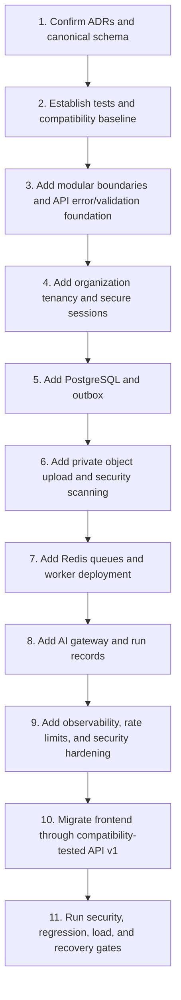

# RFPilot AI Intelligence Layer

## Milestone 1 Readiness and Gap Assessment

**Assessment type:** Read-only repository assessment  
**Repositories assessed:** `dxg-rfp-tool-dashboard`, `dxg-rfp-tool-backend`  
**Milestone:** Platform, Security, and Delivery Foundation  
**Implementation authorization at assessment time:** Not granted  
**Assessment date:** July 15, 2026

> **Progress note — July 16, 2026:** Milestone 1 was subsequently authorized. Canonical contracts, repository quality gates, modular controller boundaries, and the initial DXG organization/tenant migration have been implemented. This document remains the historical baseline; current evidence is maintained in the Milestone 1 authorization and slice status records.

---

# 1. Executive conclusion

The current RFPilot application provides a usable product foundation, but it is **not ready to safely host the complete AI Intelligence Layer without Milestone 1 platform work**.

The existing frontend and backend should be reused rather than rewritten. However, the AI program requires substantial foundational additions in contracts, tenancy, authentication, file security, background processing, persistence, observability, testing, and delivery operations.

## Readiness summary

| Area | Current readiness | Recommendation |
|---|---|---|
| Existing proposal/CRM functions | Moderate | Preserve behind compatibility adapters |
| Canonical proposal contract | Low | Reconcile and version before new AI work |
| API design and validation | Low | Add `/api/v1`, OpenAPI, schema validation, typed errors |
| Authentication | Low–moderate | Replace long-lived bearer-only session design |
| Authorization and tenancy | Low | Introduce organizations, memberships, and resource scoping |
| File storage | Moderate for assets, low for confidential AI sources | Add private direct uploads, malware scan, checksums, retention |
| Background jobs | Not ready | Introduce durable Redis queue and workers |
| AI provider integration | Prototype-level | Move from controller-bound synchronous OpenAI call to gateway/jobs |
| AI knowledge/pricing persistence | Not present | Add PostgreSQL AI-domain foundation |
| Observability and audit | Low | Add structured telemetry and append-only audit |
| Automated backend tests | Not present | Establish unit/integration/contract/security coverage |
| Deployment resilience | Low–moderate | Separate stateless API and durable workers from local process state |

**Overall decision:** Milestone 1 is required and should be estimated as a substantial foundation milestone, not treated as incidental refactoring inside feature development.

---

# 2. Evidence reviewed

## Backend

- Express/TypeScript application and route/controller structure.
- MongoDB/Mongoose models for users, proposals, vendor responses, settings, campaigns, notifications, and OTPs.
- JWT generation and authentication middleware.
- Multer upload flows and DigitalOcean Spaces adapter.
- Synchronous OpenAI proposal extraction controller.
- In-process cron and WebSocket notification implementation.
- Vercel, PM2, Nginx, and DigitalOcean deployment artifacts.
- Package dependencies and available scripts.
- Automated backend test-file inventory.

## Frontend

- Next.js/React package configuration.
- Proposal Creation state, validation, extraction merge, workflow, and type definitions.
- Existing component tests.
- Server actions and backend integration surface.

---

# 3. Existing capabilities to preserve

| Capability | Current evidence | Preservation strategy |
|---|---|---|
| Proposal CRUD and lifecycle | Proposal routes/controllers and Mongo model | Wrap with domain service and compatibility API |
| Planner authentication | JWT login, signup, OTP, Google flow | Migrate sessions without removing user accounts |
| Proposal extraction UX | Upload screen and extraction server action | Replace backend execution while preserving entry experience initially |
| Detailed proposal fields | Existing multi-section components | Map into canonical schema and advanced editor |
| Conditional workflow | In-person/hybrid branching | Preserve as domain-derived visibility rules |
| Vendor submissions | Public vendor-response routes and uploads | Replace public identity/security model while preserving submission use case |
| Email campaigns/tracking | Campaign models/controllers | Preserve with privacy and redirect hardening |
| DigitalOcean Spaces adapter | Existing S3-compatible upload utility | Reuse provider adapter after making storage private and lifecycle-aware |
| Proposal list pagination | Existing page/limit/sort implementation | Preserve temporarily; introduce cursor patterns for new large collections |
| User/admin roles | Customer/admin/super-admin roles | Migrate into organization memberships and granular roles |
| Frontend component tests | 13 test files | Retain and expand around canonical contracts and new workflows |

---

# 4. Milestone 1 gap matrix

## 4.1 Backend structure and contracts

| Backlog task | Current state | Gap | Required outcome | Risk |
|---|---|---|---|---|
| M1.1 Modular backend | Routes call large controllers directly | Business logic, HTTP, database, email, storage, and AI are coupled | Domain modules with application services and adapters | High |
| M1.1 Strict TypeScript | TypeScript is used, but controllers rely heavily on `any`/mixed structures | Compile-time guarantees do not cover critical data | Incremental strict mode and typed boundaries | Medium |
| M1.2 Canonical proposal schema | Frontend, backend model, extraction prompt, and `types/proposal.ts` differ | AI may emit fields that cannot be safely stored or rendered | One versioned schema with compatibility mapping | Critical |
| M1.2 Typed proposal persistence | Most proposal subdocuments are `Schema.Types.Mixed` | Weak validation, indexing, migration, and auditability | Typed canonical fields or versioned canonical content record | Critical |
| M1.3 OpenAPI | No OpenAPI/Swagger dependency or specification found | APIs are documented manually and can drift | OpenAPI 3.1 source of truth | High |
| M1.3 Runtime validation | Validation is handwritten per controller/component | Inconsistent errors and unknown-field handling | Shared schema validation at boundaries | Critical |
| M1.3 Error contract | Controllers return varied JSON and internal error text | Client complexity and possible information exposure | Typed RFC 9457-style safe errors | High |
| M1.3 Idempotency/concurrency | No idempotency or ETag/version control found | Duplicate jobs, overwritten AI/user edits | Idempotency records and optimistic versions | Critical |

## 4.2 Authentication, authorization, and tenancy

| Backlog task | Current state | Gap | Required outcome | Risk |
|---|---|---|---|---|
| M1.5 Secure sessions | JWT defaults to 30 days; logout returns success without revocation | Stolen tokens remain valid; no rotation | Short access tokens plus rotating, revocable refresh sessions | Critical |
| M1.5 OTP protection | OTP schema stores an `otp` string | At-rest OTP exposure risk | Hash OTPs and enforce attempt limits | High |
| M1.6 Organizations | User has optional company text but no organization/membership model | No true multi-tenant boundary | Organizations, memberships, scoped roles | Critical |
| M1.6 Resource authorization | Several controllers scope by user; admin roles exist | No centralized organization/resource policy | Deny-by-default authorization service and repository guards | Critical |
| M1.8 Public proposals | Unauthenticated `GET /api/proposals/:id` returns full proposal by ObjectId | Public data exposure and weak revocation | Purpose-scoped expiring token and safe published projection | Critical |
| M1.8 Vendor identity | Vendor links may use email and tracking ID query parameters | Email is not a secure authorization mechanism | Scoped vendor submission token | Critical |

## 4.3 Security controls

| Backlog task | Current state | Gap | Required outcome | Risk |
|---|---|---|---|---|
| M1.7 CORS | `app.use(cors())` | Any origin accepted | Explicit environment-validated origins | High |
| M1.7 Secure headers | No Helmet/CSP evidence found | Missing common browser defenses | HSTS, CSP, type/referrer/frame/permissions policies | High |
| M1.7 Rate limiting | No rate-limit dependency or middleware found | Login, OTP, public views, uploads, and AI may be abused | Redis-backed limits by IP, user, token, org, operation | Critical |
| M1.7 Input sanitization | Mixed object updates and broad `$set` patterns exist | NoSQL operator/path injection and overposting risk | Contract allowlists and dangerous-key rejection | Critical |
| M1.7 Error safety | Many 500 responses include `error.message` | Internal details may reach clients | Safe public errors with correlation ID | Medium–high |
| M1.12 Vendor file filter | Vendor upload intentionally accepts any MIME | Malware and executable upload risk | Approved types, byte detection, scan, quarantine | Critical |
| M1.12 Extraction upload | Memory upload up to 20 MB | Memory pressure and no malware workflow | Direct private upload and worker processing | High |
| Logging privacy | OTP and recipient email logging is present | Sensitive information can enter logs | Structured redacted logging and log policy | Critical |

## 4.4 Data, queues, and storage

| Backlog task | Current state | Gap | Required outcome | Risk |
|---|---|---|---|---|
| M1.9 PostgreSQL | No PostgreSQL dependency or configuration | No relational AI knowledge/provenance workflow store | Managed PostgreSQL, migrations, pooling, backups | High |
| M1.10 Durable queues | No Redis/BullMQ dependency | AI work is synchronous; cron is process-local | Durable queues, worker deployments, job state | Critical |
| M1.11 Outbox | No durable domain-event/outbox pattern | Cross-store and notification writes may diverge | Transactional outbox and reconciliation | High |
| M1.12 Object uploads | Temp disk and Spaces upload utility exist | Local/serverless mismatch; files may lack private lifecycle metadata | Direct private signed uploads with checksums | Critical |
| Cron reliability | `setInterval` runs in the API process | Duplicate/missed jobs under scaling/restart | Scheduled durable jobs with leader-safe behavior | High |
| WebSocket scaling | In-process WebSocket server | Multi-instance delivery requires shared state | Redis pub/sub or managed realtime; event persistence | Medium |

## 4.5 AI, observability, testing, and delivery

| Backlog task | Current state | Gap | Required outcome | Risk |
|---|---|---|---|---|
| AI gateway | OpenAI `gpt-4o` is hard-coded in extraction controller | No provider abstraction, policy, prompt registry, usage metering | Provider-neutral AI gateway | Critical |
| AI processing | One synchronous request, text truncated at 40,000 characters | No durable long-document or multi-stage processing | Jobs, segmentation, structured intermediate results | Critical |
| AI provenance | AI result returned directly; no run record/citations/confidence | Cannot reproduce or audit | AI runs, evidence, validation, costs, model/prompt versions | Critical |
| M1.13 Logging | Console and Morgan dev output | No correlated structured logs or redaction guarantees | JSON logs, correlation/trace IDs, redaction | High |
| M1.13 Metrics/traces | No OpenTelemetry or monitoring dependency found | No job/provider/cost/quality visibility | Metrics, distributed tracing, alerts | Critical |
| M1.13 Audit | No dedicated append-only audit model | Approvals and overrides are not defensibly reviewable | Immutable audit events and role-restricted queries | Critical |
| M1.14 Backend tests | No backend `test` script/dependency or test files found | High regression and migration risk | Unit, integration, contract, auth, file, queue tests | Critical |
| M1.14 CI security | No verified CI workflow in assessed files | No automated quality/security release gate | CI/CD tests, scans, SBOM, signed images, canary | High |
| Deployment | Vercel and single-process PM2/DigitalOcean paths coexist | Ambiguous production model; workers/local files conflict | Explicit API/worker deployment architecture | Critical |

---

# 5. Recommended implementation order inside Milestone 1

The following order minimizes rework and prevents feature teams from building on unstable contracts.

## Why schema and tests come first

The current proposal model and AI prompt are not structurally aligned. Building ingestion, recommendations, pricing, or analysis before resolving this creates duplicate migrations and unsafe AI patches. A baseline test harness is required before refactoring controllers or authentication.

## Why tenancy precedes knowledge ingestion

DXG knowledge and customer data require different visibility. Organization and role boundaries must exist before source fragments, pricing observations, or AI-run evidence are introduced.

## Why queues precede production AI workflows

Long document extraction, OCR, estimates, and multi-vendor analysis cannot depend on synchronous HTTP lifetimes or one API process. Durable workers are a functional requirement, not only an optimization.

---

# 6. Migration and compatibility plan

## Stage 1 — Establish evidence

- Freeze a regression snapshot of existing proposal, auth, vendor, email, settings, and dashboard behavior.
- Add API contract tests around current frontend server actions.
- Record current response shapes and authorization expectations.

## Stage 2 — Introduce foundation alongside current behavior

- Add `/api/v1`, shared schema, safe errors, correlation IDs, and module services.
- Existing routes call the same services through compatibility adapters.
- Add PostgreSQL references without moving proposal content immediately.

## Stage 3 — Migrate security boundaries

- Create organizations/memberships from existing users.
- Introduce rotating sessions while accepting existing access tokens during a short controlled window.
- Replace public proposal/vendor links with new scoped tokens; retain legacy links only during a documented migration period.

## Stage 4 — Migrate files and async work

- New uploads use private object storage.
- Existing cloud assets remain readable through controlled adapters.
- New AI operations use durable jobs; legacy extraction endpoint becomes a compatibility wrapper.

## Stage 5 — Frontend migration

- Move server actions to `/api/v1` incrementally behind feature flags.
- Verify one organization at a time.
- Remove legacy routes only after telemetry confirms no consumers.

---

# 7. Prerequisites for estimation

The following inputs materially affect schedule and cost and must be confirmed before a reliable Milestone 1 estimate:

| Input | Why it matters |
|---|---|
| Approved PostgreSQL/Redis/hosting choices | Determines infrastructure and operations work |
| Current production environment inventory | Determines migration and deployment complexity |
| Active user/proposal/vendor volumes | Determines capacity, indexes, and rollout strategy |
| Existing database size and data quality | Determines backfill and migration effort |
| Required SSO/MFA behavior | Determines identity scope |
| Required regions, retention, RPO, and RTO | Determines service tiers and recovery work |
| CI/CD and source-control policies | Determines delivery automation |
| Security testing requirements | Determines external services and lead time |
| Legacy-link compatibility period | Determines public-token migration effort |
| Team composition and availability | Determines parallelism and schedule |

---

# 8. Proposed Milestone 1 delivery slices

These slices are planning units, not authorization to implement.

| Slice | Outcome | Dependencies | Complexity |
|---|---|---|---|
| 1A — Contract baseline | Canonical schema, compatibility tests, API conventions | Approved schema workshop | High |
| 1B — Security identity | Organizations, memberships, sessions, authorization | 1A and identity ADR | Very high |
| 1C — Data/event foundation | PostgreSQL, migrations, proposal references, outbox | Infrastructure approval | High |
| 1D — Secure source platform | Private uploads, scanning, checksums, retention | 1B–1C, storage approval | High |
| 1E — Async execution | Redis, queues, workers, job APIs | 1C and worker hosting | High |
| 1F — AI operations base | Provider gateway, prompt registry, AI runs, cost controls | 1E and provider approval | High |
| 1G — Observability and delivery | Logs, metrics, traces, audit, CI/CD, canary | All slices | High |
| 1H — Compatibility rollout | Frontend migration, regression, security/load/recovery tests | 1A–1G | Very high |

---

# 9. Milestone 1 evidence required for completion

| Requirement | Authoritative evidence |
|---|---|
| Canonical contract | Versioned schema, generated types, compatibility mapping, passing contract tests |
| Tenant isolation | Authorization matrix and cross-tenant integration/security tests |
| Secure sessions | Rotation/revocation/replay tests and session audit evidence |
| API v1 | OpenAPI document, validation tests, generated docs, compatibility tests |
| PostgreSQL foundation | Migrations, constraints, backup/PITR evidence, restore test |
| Durable jobs | Restart/retry/idempotency/dead-letter/cancellation tests |
| Private files | Scan, checksum, signed URL, expiry, retention, and unauthorized-access tests |
| AI gateway | Provider-contract tests, schema validation, run/cost records, privacy policy enforcement |
| Observability | Dashboards, correlated traces, redaction tests, alert demonstrations |
| Audit | Append-only records for auth, approval, override, and public-token events |
| CI/CD | Passing quality/security gates, SBOM, signed artifact, canary and rollback evidence |
| Compatibility | Existing frontend workflows pass regression/E2E tests |

---

# 10. Readiness decision

## Current status

**Milestone 1 is technically necessary but not yet authorized.**

## Conditions to authorize implementation

- [ ] Architecture choices in `RFPilot_AI_Milestone_0_Decision_Register.md` are approved.
- [ ] Infrastructure and provider budgets are approved.
- [ ] Security/privacy decisions required for development are approved.
- [ ] Named engineering and client owners are assigned.
- [ ] A production-environment inventory is available.
- [ ] Milestone 1 slices, estimate, schedule, and acceptance evidence are approved.

## Recommended immediate action

Run the [Phase 0 Approval Workshop](./RFPilot_AI_Phase_0_Approval_Workshop_Pack.md) using this assessment and the decision register. The outcome should be a signed [Milestone 1 Implementation Authorization Record](./RFPilot_AI_Milestone_1_Authorization_Record.md) plus assigned owners and dates—not a general verbal instruction to “start AI development.”

Use the [AI Provider Benchmark and Acceptance Protocol](./RFPilot_AI_Provider_Benchmark_and_Acceptance_Protocol.md) to approve the benchmark method before any confidential DXG/client assets are submitted to a provider. Provider approval remains a prerequisite for the AI operations workstream.
