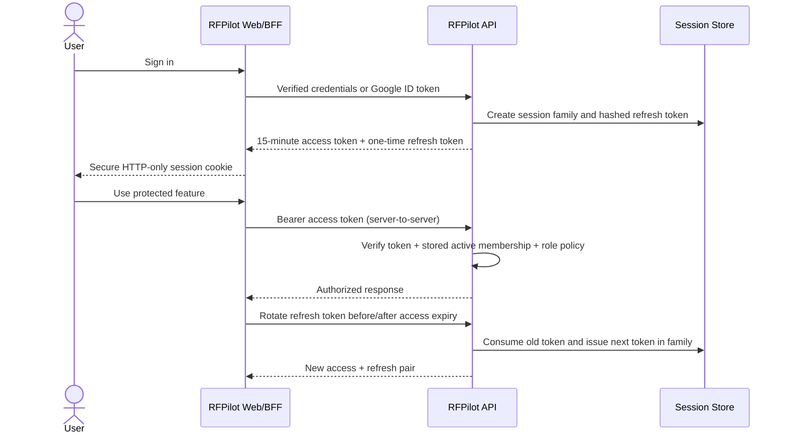

# RFPilot AI Intelligence Layer

## Slice 1B Security Increment — Approval Pack

**Proposed scope:** Secure sessions, organization RBAC, and tokenized public access  
**Status:** Approved July 16, 2026; implementation in progress  
**Applies to:** `dxg-rfp-tool-dashboard` and `dxg-rfp-tool-backend`  
**Production release:** Excluded

---

# 1. Plain-language outcome

This increment closes the highest-risk access-control gaps before confidential DXG knowledge or AI jobs are introduced:

1. A stolen sign-in token stops working quickly and active sessions can be revoked.
2. Every protected action requires both an active DXG membership and an allowed role.
3. Public proposal and vendor links no longer treat a MongoDB record ID, email address, or campaign tracking ID as permission.
4. Existing users keep their accounts and can transition without an unexpected forced password reset.
5. All security-sensitive creation, refresh, revocation, denial, and public-token events are auditable.

# 2. Current risks being corrected

| Current behavior | Risk | Required replacement |
|---|---|---|
| Backend access tokens may last 30 days | A stolen token remains useful too long | 15-minute access token plus rotating refresh session |
| Logout does not revoke backend access | A copied token survives logout | Server-side session revocation |
| Frontend session may expose the backend access token in session data | Browser code can obtain a reusable API credential | Server-only BFF token handling and HTTP-only cookies |
| Roles are broad user-level strings | No granular organization authority | Organization membership roles and centralized policy |
| Public proposal URL contains a proposal ID | Identifier acts as authorization | Opaque, scoped, expiring, revocable share token |
| Vendor link may depend on tracking ID/email | Recipient identity is weak and leaks through URLs | Opaque vendor-submission grant |
| OTP value is stored directly | Database access reveals active verification codes | Hashed challenge, attempts, expiry, and one-time consumption |

# 3. Proposed request and session flow

The browser does not receive a backend bearer or refresh token through client-visible session JSON. Existing server actions move behind one server-only authenticated API client/BFF helper so refresh and retry behavior is consistent.

# 4. Session design

## Access token

- Signed JWT, default lifetime 15 minutes.
- Required claims: issuer, audience, subject/user ID, organization ID, session ID, token ID, role/version, issued-at, and expiry.
- Verification uses an explicit algorithm allowlist and rejects missing/incorrect issuer or audience.
- Authorization still reloads active organization membership; claims are not the sole authority.

## Refresh session

- 256-bit opaque random token; only a SHA-256 hash is stored.
- Default absolute lifetime 30 days and idle lifetime 7 days.
- Rotated on every successful refresh.
- Reuse of a consumed token revokes the entire session family and creates a high-severity audit event.
- Logout revokes the current session; “sign out all devices” revokes all user sessions.
- Password reset, account blocking, membership removal, or organization deactivation revokes affected sessions.

## Compatibility

- Existing valid users are not deleted or required to reset passwords.
- Legacy 30-day tokens receive a short, explicitly configured migration window; after that deadline they are rejected.
- Rollout uses an organization feature flag and server-side compatibility metrics.
- The test environment is migrated and verified before any production release request.

# 5. Organization membership and RBAC

The existing `users.organizationId` remains the compatibility membership for DXG. A versioned membership record is introduced so later organizations can support multiple users, roles, invitations, suspension, and role history.

| Role | Primary authority |
|---|---|
| Planner | Create and manage owned proposals; view owned vendor responses |
| Organization admin | Manage organization members and settings |
| DXG producer | Review operational recommendations and vendor-analysis findings |
| Knowledge editor | Draft knowledge/pricing records but cannot publish |
| Knowledge approver | Approve/reject and publish governed knowledge releases |
| DXG admin | Organization-wide administration and reporting |
| Super admin | Platform administration through audited break-glass policy only |

Policies are deny-by-default. Every decision uses organization, resource, action, role, ownership, resource state, and—where relevant—approval separation. A user cannot approve their own governed knowledge change unless DXG explicitly authorizes that exception later.

# 6. Public proposal and vendor tokens

## Proposal share grant

- Opaque random token; only its hash is stored.
- Scoped to one organization, proposal, purpose, and safe public projection.
- Requires proposal state `submitted`, active, open, and not archived.
- Has explicit expiry and optional maximum-use limit.
- Revocable individually and invalidated when the proposal closes or is archived.
- Public response never includes internal tenant metadata, source references, drafts, or private uploads.

## Vendor submission grant

- Opaque random token bound to one proposal, recipient/campaign context, and `vendor:submit` purpose.
- Does not place recipient email in the public URL.
- Allows check/create/update only within its scope and expiry.
- Attachment policy, MIME detection, malware scanning, and quarantine remain part of the separately delivered secure-file slice; until then, the existing upload path cannot be accepted for confidential production use.

## Tracking separation

Email open/click identifiers remain analytics identifiers only. They do not grant proposal-read or vendor-submit authority.

# 7. API surface proposed

| Method and endpoint | Purpose | Authentication |
|---|---|---|
| `POST /api/v1/auth/login` | Create access/refresh session | Credentials |
| `POST /api/v1/auth/google` | Create session after provider verification | Google ID token |
| `POST /api/v1/auth/refresh` | Rotate refresh session | HTTP-only refresh cookie/token |
| `POST /api/v1/auth/logout` | Revoke current session | Active session |
| `POST /api/v1/auth/logout-all` | Revoke all user sessions | Active session + recent authentication |
| `GET /api/v1/auth/sessions` | List active devices/sessions | Active session |
| `DELETE /api/v1/auth/sessions/{id}` | Revoke one session | Self or authorized admin |
| `POST /api/v1/proposals/{id}/shares` | Create proposal share grant | Authorized proposal owner/admin |
| `GET /api/v1/public/proposals/{token}` | Read safe published proposal | Proposal share grant |
| `DELETE /api/v1/proposal-shares/{id}` | Revoke share grant | Authorized proposal owner/admin |
| `POST /api/v1/proposals/{id}/vendor-grants` | Create vendor submission grant | Authorized proposal owner/admin |
| `GET /api/v1/public/vendor-grants/{token}` | Resolve safe vendor context | Vendor submission grant |
| `POST /api/v1/public/vendor-grants/{token}/responses` | Submit/update response | Vendor submission grant |

Legacy `/api` routes remain behind compatibility adapters during migration and may not bypass the new authorization services.

# 8. Data records

- `OrganizationMembership`: organization, user, roles, status, version, invited/activated/suspended timestamps.
- `RefreshSession`: user, organization, session family, current token hash, expiry, idle expiry, client metadata, revoked/reuse timestamps.
- `PublicAccessGrant`: organization, resource, purpose, token hash, expiry, max uses, use count, revoked state, policy version.
- `SecurityAuditEvent`: append-only actor, organization, action, target, decision, reason, correlation ID, timestamp, and safe metadata.

Token material, OTP values, passwords, raw confidential content, and complete authorization headers must never appear in logs or audit metadata.

# 9. Security and failure behavior

- Generic authentication failures prevent account enumeration.
- Rate limits apply by IP, email hash, session, user, organization, grant, and operation as appropriate.
- Refresh and grant mutations are atomic and idempotent where retry is possible.
- Clock skew is bounded and tested.
- Database failure fails closed; it never falls back to JWT claims alone.
- A compromised refresh family, blocked user, inactive organization, removed role, expired grant, or revoked grant returns a typed denial without resource existence leakage.
- CSRF protection applies to cookie-authenticated mutations; SameSite, Secure, and HTTP-only cookie attributes are environment validated.

# 10. Implementation slices

| Order | Increment | Deliverable | Approval/checkpoint |
|---:|---|---|---|
| 1 | Contracts and persistence | Session, membership, grant, audit schemas and migrations | Schema/migration review |
| 2 | Backend secure sessions | Login/refresh/logout/revocation and OTP hashing | Security tests and test migration |
| 3 | Frontend BFF migration | Server-only token handling, refresh/retry, no client token exposure | Auth regression/E2E review |
| 4 | Authorization policy | Role matrix, centralized policy, repository enforcement | Cross-role/cross-tenant matrix |
| 5 | Proposal share grants | Safe public read, lifecycle, revocation | Public projection/security review |
| 6 | Vendor grants | Scoped vendor check/submit/update | Upload and authorization review |
| 7 | Compatibility and rollout | Legacy-route adapters, metrics, feature flags, rollback | Demonstration and acceptance |

# 11. Acceptance evidence

- Unit tests for token claims, hashing, rotation, expiry, revocation, replay, and grant policy.
- Integration tests with MongoDB for atomic rotation and tenant/resource scoping.
- Authorization-matrix tests for every role/action combination and cross-tenant denial.
- E2E tests for credential login, Google login, refresh, logout, logout-all, blocked user, role removal, proposal share, expiry/revocation, and vendor submission.
- Security tests for CSRF, token leakage, fixation, replay, enumeration, open redirects, NoSQL injection, and rate-limit behavior.
- Migration reconciliation and exact rollback evidence from the test environment.
- Local and clean-runner CI, architecture synchronization, and client demonstration.

# 12. Rollback

- Feature flags keep new session and public-token paths disabled until verified.
- Session rollout can return to compatibility mode during the approved migration window without deleting accounts.
- Grant rollout leaves legacy links available only while the compatibility flag is explicitly enabled.
- Database migrations are additive first; destructive cleanup is deferred until a later approved release.
- Any cross-tenant exposure, token-reuse defect, unauthorized public read/write, or unrecoverable session failure triggers immediate disablement and incident review.

# 13. Decisions requested

Approve or amend these defaults:

1. 15-minute access token; 7-day idle and 30-day absolute refresh session.
2. Server-only BFF token handling; no backend bearer/refresh token in browser-visible session JSON.
3. The seven-role organization matrix listed above.
4. Opaque hashed proposal-share and vendor-submission grants.
5. MongoDB additive records during Milestone 1, with migration to the approved PostgreSQL identity/audit foundation when Workstream 1E is delivered.
6. Test-environment implementation only; production remains a separate release approval.

**Approval statement:** “DXG accepts the Slice 1A and tenant-foundation evidence and authorizes the Slice 1B Security Increment using the defaults in this approval pack.”

**Recorded decision:** Approved by the user in the workspace thread on July 16, 2026 using the approval statement above.
