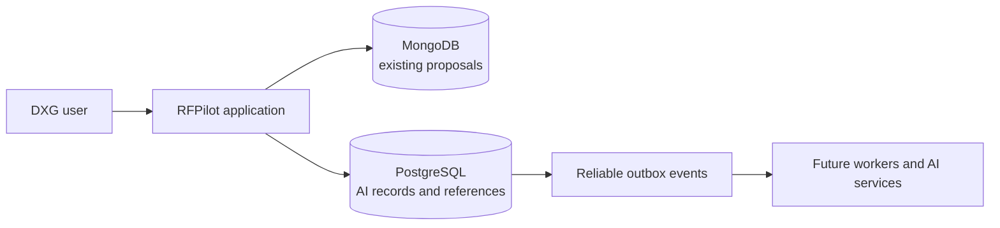
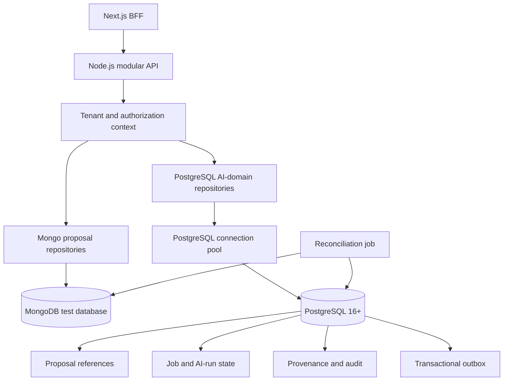
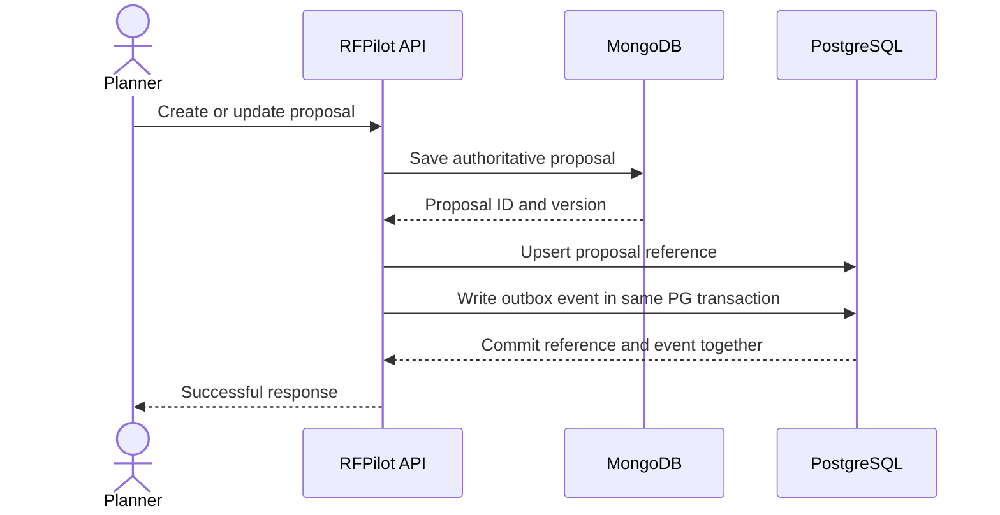

# RFPilot AI Intelligence Layer

## Slice 1C Data Foundation — Client Approval Pack

**Status:** Approved for test-environment implementation July 16, 2026  
**Authorization received:** Preparation only, July 16, 2026  
**Implementation:** Authorized and in progress  
**Production change:** Not authorized

## 1. Plain-language purpose

RFPilot currently keeps operational proposal data in MongoDB. The AI layer needs a separate, strongly governed data foundation for knowledge, pricing, evidence, AI runs, approvals, audit history, and reliable background work.

Slice 1C adds PostgreSQL without moving or deleting existing proposals. PostgreSQL stores stable references to MongoDB proposals and a transactional outbox that reliably records work to be processed later.

## 2. Proposed scope

### Included

- PostgreSQL 16+ development/test foundation and connection pooling.
- Version-controlled, repeatable, reversible migrations.
- Organization and user references aligned to existing MongoDB identifiers.
- Proposal-reference records pointing to MongoDB proposals; proposal content remains in MongoDB.
- AI job, AI run, provenance, audit, and transactional-outbox foundation tables.
- Tenant-aware repository boundaries and PostgreSQL Row-Level Security where practical.
- Health checks, structured database errors, migration checks, reconciliation, backup, and restore runbooks.
- Local/test verification and CI migration evidence.

### Excluded

- Moving existing proposal content out of MongoDB.
- Redis/BullMQ worker delivery; that is Slice 1E.
- Knowledge ingestion and embeddings.
- AI provider calls or proposal generation.
- Production provisioning or deployment.
- Destructive MongoDB changes.

## 3. Proposed architecture

The application remains a modular monolith. PostgreSQL access is introduced through ports and repositories so business logic does not depend directly on a database library.

## 4. Initial data model

| Record | Purpose | Important controls |
|---|---|---|
| `organizations` | Relational tenant reference | Stable external Mongo ID; active state |
| `users` | Relational actor reference | Stable external Mongo ID; organization scope |
| `proposal_references` | Points to the authoritative Mongo proposal | Unique tenant + Mongo proposal ID; no proposal duplication |
| `ai_jobs` | Durable requested-work state | Idempotency key, status, attempts, timestamps |
| `ai_runs` | Provider/model/prompt execution record | Versions, cost/usage, result status; no secret values |
| `provenance_records` | Evidence and source lineage | Source type, checksum, location, version |
| `audit_events` | Append-only business/security history | Tenant, actor, action, target, correlation ID |
| `outbox_events` | Reliable future event delivery | Aggregate, event type/version, payload, attempts, publish state |
| `migration_journal` | Migration and reconciliation evidence | Run ID, checksum, counts, outcome |

All tenant-owned tables include `organization_id`. Foreign keys, unique constraints, check constraints, and indexes enforce correctness before application logic runs.

## 5. Data and request flow

Because MongoDB and PostgreSQL cannot share one transaction, the design uses idempotent reference writes, reconciliation, checksums, and repairable states. PostgreSQL transactions guarantee that its reference and outbox event commit together.

## 6. Migration sequence

1. Add PostgreSQL configuration, connection pool, health check, and secret validation.
2. Add migration tooling and an empty-schema migration test.
3. Create tenant/reference, job/run, provenance/audit, and outbox tables.
4. Seed PostgreSQL tenant/user references from MongoDB using dry-run-first tooling.
5. Backfill proposal references in pages with checkpoints and checksums.
6. Reconcile MongoDB counts, ownership, IDs, and versions against PostgreSQL.
7. Enable dual-reference writes behind a test-only feature flag.
8. Exercise rollback and restore procedures.
9. Submit evidence before any later worker or AI feature consumes these tables.

No migration deletes or rewrites MongoDB proposal content.

## 7. Outbox behavior

- An outbox event is written in the same PostgreSQL transaction as its related relational change.
- Every event has a globally unique ID, organization, aggregate ID, event type, schema version, timestamp, and idempotency key.
- Payloads contain identifiers and minimum required metadata, not confidential proposal bodies.
- Publishing supports locking, retry counters, exponential backoff, and dead-letter state in the later worker slice.
- Consumers must be idempotent; duplicate delivery is safe.

## 8. Security and privacy

- TLS connections and managed secret storage outside source control.
- Least-privilege application, migration, read-only, and backup database roles.
- Tenant filtering in repositories, with Row-Level Security defense in depth.
- Parameterized SQL only; validated identifiers cannot become SQL fragments.
- No passwords, bearer tokens, OTPs, provider keys, or raw confidential documents in outbox/audit payloads.
- Sensitive database errors are logged internally with correlation IDs and returned as generic API errors.
- Migration and administrative actions are audited.

## 9. Reliability, performance, and operations

- Bounded connection pool sized for the deployment platform.
- Indexes on organization, external IDs, status, creation time, idempotency keys, and unpublished outbox state.
- Keyset pagination for growing audit/outbox tables.
- Statement and transaction timeouts; slow-query monitoring.
- PostgreSQL automated backups and point-in-time recovery for managed environments.
- Restore rehearsal with recorded recovery time and recovery point results.
- Health checks distinguish application health, PostgreSQL readiness, and migration version.

## 10. Acceptance evidence

- Fresh database migrates from zero to current version and rolls back according to policy.
- Reapplying migrations is deterministic and safe.
- Cross-tenant reads/writes fail in repository and integration tests.
- Duplicate proposal-reference and idempotency keys are rejected or resolve idempotently.
- Outbox record and related relational state commit or roll back together.
- MongoDB-to-PostgreSQL backfill dry run, apply, post-check, and rollback preview reconcile exactly.
- Database outage fails safely and does not corrupt MongoDB proposal operations.
- Backup and restore runbook is exercised in the test environment.
- Local and clean-runner CI pass migration, unit, integration, security, and build gates.

## 11. Rollback

- Keep all new behavior behind `POSTGRES_FOUNDATION_ENABLED` and `PROPOSAL_REFERENCE_DUAL_WRITE_ENABLED` flags.
- Disable dual-reference writes without changing MongoDB proposal behavior.
- Roll back additive application behavior before any schema rollback.
- Preserve migration journals and outbox evidence.
- Do not drop populated tables during an incident; restore or forward-fix after review.
- MongoDB remains the authoritative proposal store throughout Slice 1C.

## 12. Options and recommendation

| Option | Advantages | Disadvantages |
|---|---|---|
| Continue only with MongoDB | Lowest immediate infrastructure effort | Weak fit for governed relationships, approvals, provenance, outbox, and analytics |
| Move everything to PostgreSQL now | One long-term database | High migration risk and delays AI value |
| Keep MongoDB and add PostgreSQL for AI domains | Preserves the working product while adding relational governance | Requires reference reconciliation and two-database operations |

**Recommendation:** keep MongoDB authoritative for proposals and add PostgreSQL for the AI intelligence domain, references, provenance, workflows, audit, and outbox.

## 13. Decisions required before implementation

DXG should confirm:

1. PostgreSQL 16+ is approved for the AI-domain foundation.
2. MongoDB remains authoritative for proposal content during this phase.
3. Managed PostgreSQL is preferred for shared test/staging/production; local development may use Docker.
4. PostgreSQL full-text and `pgvector` extensions may be enabled later but are not required by Slice 1C.
5. PostgreSQL IDs use UUIDv7 where supported; Mongo IDs remain stored as validated 24-character external identifiers.
6. Outbox payloads carry identifiers and minimal metadata, never full confidential proposal content.
7. Test-environment implementation only; production provisioning remains separately approved.

## 14. Approval statement

> DXG approves the Slice 1C data-foundation design and authorizes test-environment implementation using the defaults in this approval pack. MongoDB remains authoritative for proposal content, PostgreSQL stores AI-domain records and references, and production provisioning remains separately gated.

**Recorded decision:** Approved by DXG in the workspace thread on July 16, 2026 using the statement above.
