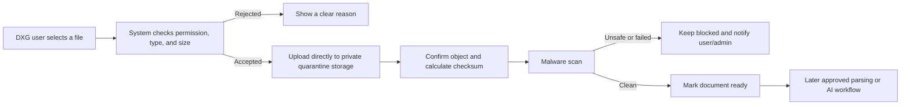
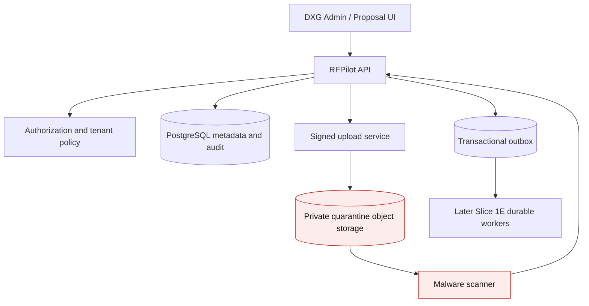
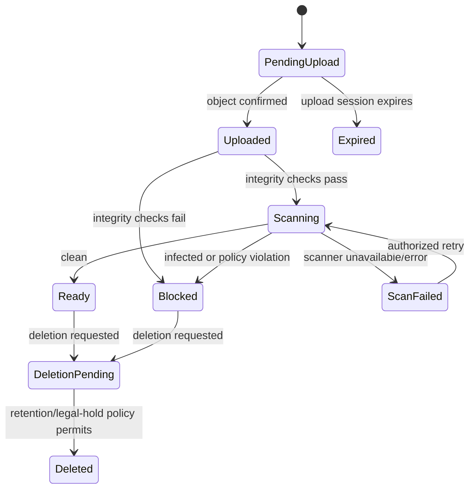

# RFPilot AI Intelligence Layer

## Slice 1D — Private Document Ingestion Approval Pack

**Audience:** DXG business and technical stakeholders  
**Decision requested:** Approve test-environment implementation  
**Prepared:** July 19, 2026  
**Production deployment:** Not included

## 1. Executive summary

Slice 1D creates the secure front door for documents that will later support AI-assisted proposals. An authorized DXG user can upload a document, but the application will not treat it as usable until it has been privately stored, validated, malware-scanned, checksummed, and recorded with its origin and retention status.

This increment does **not** train an AI model, extract business facts, publish knowledge, or send documents to an AI provider. Those activities remain separately approval-gated. Slice 1D only establishes a secure and auditable ingestion foundation.

## 2. Business outcome

After this increment, DXG can safely receive proposal-related source documents without exposing them through public URLs or allowing unverified files into later AI workflows.

Success means:

- Only authorized users can initiate, view, or delete uploads for their organization.
- Every file remains private and tenant-isolated.
- File type, size, checksum, and object integrity are verified.
- Every file is quarantined until malware scanning passes.
- Duplicate uploads can be identified by checksum.
- The system records who uploaded the file, where it came from, and its lifecycle.
- Failed or unsafe files cannot proceed to parsing or AI processing.
- Deletion and retention actions are traceable and recoverable within the agreed policy.

## 3. User flow

The user sees understandable states: **Uploading**, **Checking**, **Scanning**, **Ready**, **Blocked**, **Failed**, or **Deleted**. A blocked file never silently proceeds.

## 4. Scope

### Included

- Organization-scoped upload permissions.
- Short-lived signed upload sessions to private S3-compatible object storage.
- Quarantine-first storage and non-public object access.
- File extension, declared MIME type, detected content type, and size validation.
- SHA-256 checksum and duplicate detection within the organization.
- Malware scan orchestration and recorded scanner result/version.
- Source and file provenance metadata.
- Status APIs and audit events.
- Configurable retention date, deletion request, and legal-hold-ready metadata.
- Retry-safe completion and scanning operations.
- Test-environment security, isolation, failure, and recovery evidence.

### Excluded

- OCR, parsing, document summarization, requirement extraction, embeddings, or vector search.
- AI training or fine-tuning.
- Sending confidential content to an AI provider.
- Knowledge approval and publishing.
- Production storage provisioning or migration.
- Public document sharing.

## 5. Proposed architecture

### Responsibilities

| Component | Responsibility |
|---|---|
| Web application | Select files, show progress/status, explain failures, allow permitted deletion |
| API | Authenticate, authorize, validate metadata, issue upload session, confirm completion, expose status |
| PostgreSQL | Store tenant-scoped document metadata, versions, checksums, scan results, retention state, and audit references |
| Object storage | Store original bytes privately under organization-scoped keys |
| Scanner | Inspect quarantined bytes and return clean, infected, error, or unavailable |
| Transactional outbox | Reliably record future processing work without losing events |

Slice 1D may execute scanning through a bounded internal adapter. Slice 1E will add the durable Redis/BullMQ worker platform; the outbox prevents today’s design from coupling the API to the future queue.

## 6. Document lifecycle

Only `Ready` documents are eligible for later parsing. State transitions are server-controlled and audited.

## 7. Data design

MongoDB remains authoritative for proposal content. PostgreSQL stores the ingestion domain and references.

| Record | Important fields |
|---|---|
| `document_sources` | ID, organization ID, optional proposal reference, purpose, confidentiality, uploader, status, retention date, legal-hold flag |
| `document_objects` | Source ID, private object key, original/safe filename, byte size, declared/detected MIME, SHA-256, storage version |
| `document_scan_results` | Object ID, scanner, signature/version, status, timestamps, safe diagnostic code |
| `document_events` | Source ID, event type, actor, correlation ID, timestamp, non-sensitive metadata |

All tenant tables use forced PostgreSQL Row-Level Security. Checksums are indexed for organization-scoped duplicate lookup. Object keys are generated by the server and do not contain customer filenames.

## 8. Proposed API surface

All endpoints use `/api/v1`, authenticated organization context, runtime validation, correlation IDs, and RFC 9457 error responses.

| Method and endpoint | Purpose | Key controls |
|---|---|---|
| `POST /proposals/:id/sources/upload-session` | Create source and short-lived upload permission | Editor role, proposal scope, allowlist, size limit, idempotency key |
| `POST /sources/:id/complete` | Confirm upload | Ownership, object existence, size/type/checksum verification |
| `POST /sources/:id/scan` | Request or safely retry scan | Idempotency, valid state, rate limit |
| `GET /sources/:id` | Read metadata and lifecycle status | Tenant and resource scope |
| `GET /proposals/:id/sources` | List proposal sources | Tenant scope, cursor pagination |
| `DELETE /sources/:id` | Request policy-controlled deletion | Owner/admin permission, retention and hold checks |

Signed upload permissions are single-object, short-lived, content-length constrained, and cannot list or read the storage bucket.

## 9. Security and privacy controls

- Deny-by-default authorization and forced tenant isolation.
- Private bucket/container with public access disabled.
- TLS in transit and provider-managed encryption at rest; customer-managed keys remain a production decision.
- Server-generated object keys and sanitized display filenames.
- Allowlisted formats validated by file signature, not extension alone.
- Limits for file size, decompressed size, archive depth, page count, and processing time to reduce denial-of-service and archive-bomb risk.
- Quarantine until a current malware scan succeeds; fail closed when scanning is unavailable.
- No raw document content, signed URLs, credentials, or malware details in logs.
- Short signed-URL lifetime, rate limits, idempotency, and replay resistance.
- Audit trail for upload, completion, scan, access, retry, block, and deletion events.
- SSRF-resistant storage/scanner integration with fixed approved endpoints.

## 10. Reliability, observability, and recovery

- Upload completion is idempotent; repeated requests return the same safe result.
- Database metadata and outbox events are committed atomically.
- Orphan-object reconciliation identifies uploads whose metadata or completion callback was lost.
- Scanner timeouts use bounded retries and remain blocked on exhaustion.
- Metrics cover upload attempts, bytes, validation failures, scan latency/results, orphan count, and deletion backlog without exposing document content.
- Alerts cover scanner unavailability, unusual rejection/infection rates, storage errors, and reconciliation drift.
- Test restore verifies metadata-to-object reconciliation. Object versioning/recovery settings will follow the selected test storage provider.

## 11. Recommended test-environment defaults

These defaults are proposed for confirmation and may be changed before implementation:

| Decision | Recommended default |
|---|---|
| Storage | Private S3-compatible test bucket/container; separate quarantine prefix and least-privilege service identity |
| Initial formats | PDF, DOCX, XLSX, CSV, and plain text |
| Maximum file size | 50 MB per file |
| Upload URL lifetime | 15 minutes |
| Duplicate policy | Warn and link to existing source; do not silently create another stored copy |
| Scan policy | Fail closed; only a recorded clean result becomes `Ready` |
| Scanner | ClamAV-compatible adapter for test, replaceable by a managed scanner without API/data-model changes |
| Default retention | Retain until DXG defines a formal retention schedule; allow authorized deletion unless legal hold applies |
| AI/provider access | Disabled in Slice 1D |

## 12. Implementation increments and evidence

1. **Contracts and metadata:** schemas, migrations, RLS, lifecycle rules, validation, and audit events.
2. **Private upload:** storage adapter, signed upload session, completion verification, and UI progress.
3. **Safety gate:** checksum, duplicate detection, malware scanner adapter, quarantine, and fail-closed transitions.
4. **Retention and operations:** deletion workflow, reconciliation, metrics, alerts, and runbook.
5. **Verification:** unit, integration, tenant-isolation, malicious-file simulation, failure/retry, backup/restore, UI E2E, and clean-runner CI evidence.

Rollback disables new upload-session creation, preserves existing private objects and metadata for audit/recovery, drains in-flight checks safely, and reverses database changes only through reviewed migrations. No destructive cleanup occurs automatically.

## 13. Acceptance criteria

- Cross-organization attempts cannot create, read, scan, or delete another tenant’s source.
- Public or unsigned object access is denied.
- Unsupported, oversized, mismatched, or malicious files never reach `Ready`.
- A scanner outage fails closed and provides a retryable user-visible status.
- The same completion or scan request is safe to repeat.
- Checksum duplicate behavior matches the approved policy.
- Deletion respects retention and legal-hold metadata and is audited.
- Logs and traces contain no document content, secrets, or signed URLs.
- Migration, rollback/recovery, reconciliation, dependency, test, build, and clean-runner CI gates pass.
- Architecture, API, operations, and user guidance match the delivered behavior.

## 14. Decisions requested from DXG

Please confirm or amend:

1. The proposed initial file formats and 50 MB maximum.
2. Whether duplicates should be warned/linked, rejected, or stored as separate versions.
3. The test scanner default and whether DXG requires a managed scanning vendor.
4. The retention period and legal-hold owner. The current safe default retains files until policy is confirmed.
5. Whether uploads may be linked only to proposals, or also to a reusable organization knowledge library.
6. Which roles may upload, retry, download, and delete documents.
7. Whether test documents may contain confidential/customer information. The recommendation is synthetic or sanitized data until production security approval.

## 15. Authorization statement

To approve the recommended defaults and authorize implementation, DXG may reply:

> DXG approves the Slice 1D private-document-ingestion design and authorizes test-environment implementation using the defaults in this approval pack. Documents must remain private and quarantined until validation and malware scanning pass; AI processing, production provisioning, and confidential-provider access remain separately gated.

