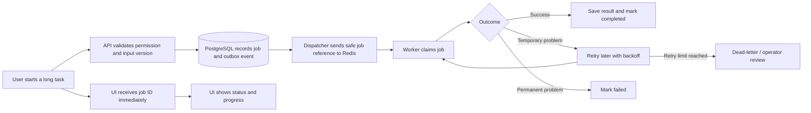
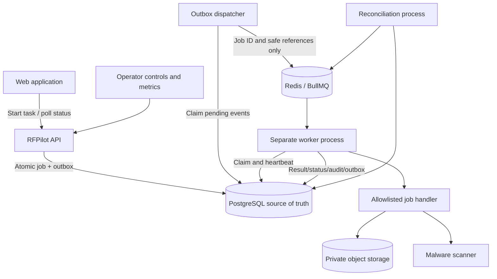
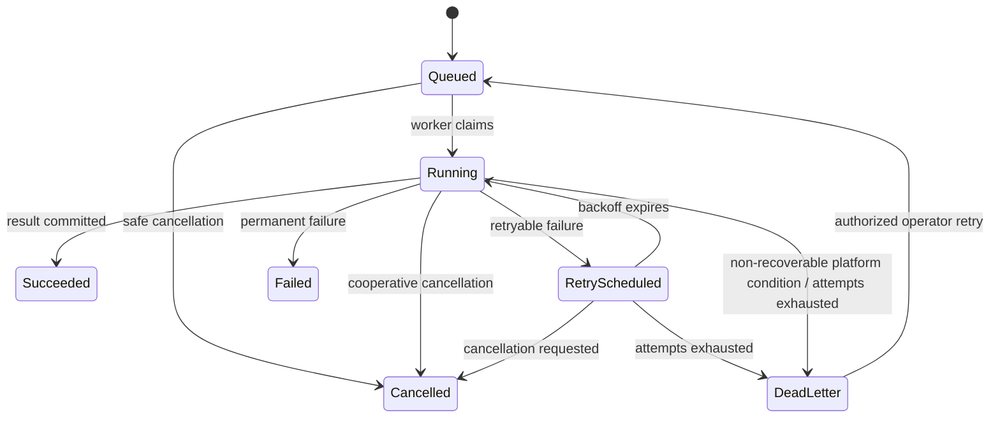

# RFPilot AI Intelligence Layer

## Slice 1E — Durable Background Jobs Approval Pack

**Audience:** DXG business and technical stakeholders  
**Decision requested:** Approve test-environment implementation  
**Prepared:** July 19, 2026  
**Production deployment:** Not included

## 1. Executive summary

Some RFPilot operations—document scanning, parsing, future AI drafting, proposal analysis, and report generation—can take seconds or minutes. Running them inside a normal web request makes the user wait and risks losing work if the API or dependency restarts.

Slice 1E introduces a durable job platform. The API records requested work in PostgreSQL, Redis/BullMQ delivers that work to separate workers, and the user receives a job ID immediately. The job can report progress, retry temporary failures, survive worker restarts, be cancelled where safe, and enter a recoverable dead-letter state after repeated failure.

Redis will coordinate delivery but will **not** be the source of truth. PostgreSQL remains the authoritative job record, so the queue can be reconstructed after Redis loss.

This slice does not authorize AI-provider calls, document parsing/OCR, production infrastructure, or automatic proposal changes.

## 2. Business outcome

After Slice 1E:

- Long-running work no longer blocks normal API requests.
- Users can see `Queued`, `Running`, `Retrying`, `Completed`, `Failed`, `Cancelled`, or `Needs operator attention`.
- Repeating the same request does not repeat the business action.
- Temporary outages retry automatically with bounded delays.
- Permanent failures stop safely and explain the next action without exposing confidential content.
- Operators can inspect, retry, cancel, or recover permitted jobs with a complete audit trail.
- Worker or Redis restarts do not silently lose authoritative work.

## 3. Plain-language flow



## 4. Scope

### Included

- Redis 7-compatible connection and health/readiness checks.
- BullMQ queues, separate worker bootstrap, graceful shutdown, bounded concurrency, and backpressure.
- PostgreSQL-authoritative job lifecycle, attempts, progress, cancellation request, safe errors, timestamps, and immutable input reference/version.
- Transactional-outbox dispatcher with claiming, retry, deduplication, and reconciliation.
- Idempotent job creation and idempotent worker completion.
- Exponential backoff with jitter and explicit retryable/permanent error classification.
- Dead-letter state, authorized retry/requeue, and operator audit events.
- Job status, list, cancellation, and administrative recovery APIs.
- Queue metrics, structured safe logs, readiness checks, alerts, and runbook.
- Conversion of Slice 1D malware scanning into the first durable job handler, proving a real workload without enabling parsing or AI.
- Local and test-environment restart, Redis-loss, duplicate-delivery, cancellation, retry, and recovery evidence.

### Excluded

- AI gateway or AI-provider calls; those remain Slice 1F.
- OCR, parsing, summarization, extraction, recommendations, pricing, or proposal drafting.
- Production Redis provisioning or production deployment.
- Raw document text or confidential payloads in Redis.
- General-purpose arbitrary job execution.
- User-authored code, shell commands, dynamic modules, or unapproved network destinations.
- WebSocket/SSE real-time delivery; initial status uses polling, with real-time updates considered later.

## 5. Proposed architecture



### Component responsibilities

| Component | Responsibility |
|---|---|
| API | Authenticate, authorize, validate, create idempotent job, return `202` and status URL |
| PostgreSQL | Authoritative job state, immutable input reference, attempts, cancellation, safe errors, audit and outbox |
| Outbox dispatcher | Publish committed work to BullMQ with locking, deduplication, bounded retry, and recovery |
| Redis/BullMQ | Deliver jobs, delay retries, coordinate worker leases, and expose ephemeral queue state |
| Worker | Claim, heartbeat, enforce cancellation, run an allowlisted handler, and persist terminal state |
| Handler | Execute one typed operation through existing ports; never trust queue payload as authorization |
| Reconciler | Republish missing queue entries and repair recoverable PostgreSQL/Redis drift |
| Operator API/runbook | Inspect safe diagnostics and perform authorized retry/cancel/dead-letter recovery |

## 6. Job lifecycle



PostgreSQL controls transitions. BullMQ state cannot independently mark a business job successful.

## 7. Idempotency and delivery guarantees

The system uses **at-least-once delivery** with idempotent consumers. Exactly-once delivery cannot be guaranteed across PostgreSQL, Redis, storage, scanners, and future providers; claiming it would create unsafe assumptions.

- Every create command requires `Idempotency-Key`, scoped by organization and operation.
- The same key plus the same immutable input returns the existing job.
- Reusing the same key with different input returns `409 Conflict`.
- Redis job ID equals the stable PostgreSQL job ID.
- A worker acquires a database lease before executing.
- Completion and its result/outbox event commit atomically in PostgreSQL.
- Side effects use their own stable idempotency keys.
- Duplicate delivery, worker restart, and dispatcher retry are expected and tested.

## 8. Data design

Slice 1C already created `ai_jobs` and `outbox_events`. Slice 1E will evolve them through a reversible migration.

| Record | Required information |
|---|---|
| Job | Organization, type, status, immutable input reference/version/hash, idempotency key, priority, progress, cancellation state, attempt limits, timing, correlation ID |
| Attempt | Job, attempt number, worker ID, lease/heartbeat, start/end, outcome, safe diagnostic code, retry decision |
| Outbox event | Job reference, event type/version, publish state, lock, attempts, next availability, safe payload |
| Dead-letter record | Job, exhaustion reason, last safe diagnostic, operator state, recovery history |
| Audit event | Actor/system, action, decision, job ID, correlation ID, non-sensitive metadata |

All tenant-owned tables use forced PostgreSQL RLS. Redis contains job IDs, tenant-safe routing fields, input version identifiers, and correlation IDs—never access tokens, signed URLs, raw documents, prompts, proposal bodies, vendor content, or personal data.

## 9. Queue design

The platform supports the target queues, but Slice 1E activates only the foundation and `source-security` handler.

| Queue | Slice 1E state | Future purpose |
|---|---|---|
| `source-security` | Active | Malware scan and secure-source transitions |
| `source-ingestion` | Reserved | Parsing, OCR, segmentation |
| `structured-extraction` | Reserved | Versioned structured facts |
| `recommendation-refresh` | Reserved | Deterministic/AI recommendations |
| `investment-guidance` | Reserved | Estimate workflow |
| `proposal-analysis` | Reserved | Compliance/pricing/vendor analysis |
| `document-export` | Reserved | Report generation |
| `evaluation` | Reserved | Offline quality benchmarks |
| `notifications` | Reserved | Email/in-app delivery |

Separate queue names and worker entrypoints prevent a heavy future OCR task from starving security scans.

## 10. Retry, timeout, cancellation, and dead-letter defaults

| Policy | Recommended test default |
|---|---|
| Maximum attempts | 5 total attempts |
| Backoff | Exponential with full jitter: approximately 5s, 30s, 2m, 10m |
| Scan execution timeout | 60 seconds per attempt |
| Worker lease | 90 seconds with 15-second heartbeat |
| Stalled-job recovery | Requeue after lease expiry; maximum 2 stall recoveries before dead-letter |
| Concurrency | 2 source-security jobs per worker; configurable by environment |
| Cancellation | Cooperative; queued/retry-wait jobs cancel immediately, running handler checks before side effects and completion |
| Progress | Integer 0–100 plus allowlisted stage code; throttled to avoid excessive writes |
| Dead-letter retention | 30 days in active operator view; PostgreSQL history follows audit/retention policy |
| Completed Redis entries | Remove after 24 hours or 1,000 jobs; PostgreSQL history remains authoritative |
| Failed Redis entries | Keep 7 days or 5,000 jobs for diagnosis; PostgreSQL remains authoritative |

Validation, authorization, unsupported type, checksum mismatch, malware detection, and schema errors are permanent business outcomes—not infrastructure retries. Timeouts, transient network failures, dependency unavailability, and rate limits may retry.

## 11. API design

All endpoints use `/api/v1`, session-bound authentication, organization/resource authorization, runtime validation, correlation IDs, RLS, and RFC 9457 errors.

| Method and endpoint | Purpose | Authorization |
|---|---|---|
| `POST /sources/:id/scan-jobs` | Queue malware scan and return `202` | Proposal editor; source must be `uploaded` or retryable |
| `GET /jobs/:id` | Get safe status, progress, timestamps, and result reference | Resource member |
| `GET /jobs` | List scoped jobs with cursor filters | Member; organization scoped |
| `POST /jobs/:id/cancel` | Request safe cancellation | Initiator, owner, or admin |
| `POST /admin/jobs/:id/retry` | Recover failed/dead-letter job | Security/admin role; reason required |
| `GET /admin/queues/health` | Safe queue/worker health summary | Security/admin role |

Example start response:

```json
{
  "data": {
    "jobId": "019...",
    "status": "queued",
    "statusUrl": "/api/v1/jobs/019...",
    "created": true
  }
}
```

The existing synchronous scan endpoint remains disabled or test-only after cutover; compatibility behavior must not allow duplicate synchronous and queued execution.

## 12. Security and privacy review

- Redis uses TLS, authentication, private networking/IP allowlisting, separate environment credentials, and disabled dangerous commands where supported.
- Queue names and job types are allowlisted; no dynamic code execution.
- Worker authorization is re-established from PostgreSQL state, not trusted from queue payload.
- Forced RLS applies to job, attempt, dead-letter, audit, and outbox reads/writes.
- Payload size limits prevent Redis memory abuse.
- Safe diagnostic codes replace raw dependency messages and document content.
- Logs exclude Redis credentials, payload content, tokens, signed URLs, documents, and personal data.
- Operator retry/cancel actions require reason, role, organization scope, rate limit, and append-only audit.
- Worker egress is restricted to approved PostgreSQL, Redis, storage, scanner, and later provider endpoints.
- Deserialization accepts only versioned runtime-validated contracts.
- Job creation, polling, cancellation, and administrative recovery are rate-limited.

## 13. Reliability and recovery

- API commits job and outbox atomically before returning success.
- Dispatcher uses `FOR UPDATE SKIP LOCKED` and renewable locks so multiple instances are safe.
- Reconciliation compares authoritative queued/retry jobs with Redis and republishes missing entries.
- Worker shutdown stops new claims, completes or safely releases current leases, and records interrupted attempts.
- Redis flush/restart test proves queue reconstruction from PostgreSQL.
- Worker-kill test proves lease expiry and idempotent retry.
- PostgreSQL outage pauses claiming/completion; workers do not claim success only in Redis.
- Scanner outage produces bounded retry and eventual dead-letter/operator recovery.
- Redis is backed up only for operational convenience; disaster recovery reconstructs from PostgreSQL.

## 14. Performance and scalability

- Job creation target: return `202` within 500 ms locally/test, excluding network variance.
- Job status target: p95 under 300 ms.
- Use cursor pagination; never list unbounded jobs.
- Batch outbox dispatch with bounded size and lock time.
- Scale API, dispatcher, and workers independently.
- Autoscaling inputs: oldest queued age, ready count, active count, processing latency, error/retry rate, and dependency quota.
- Per-organization concurrency and quota controls prevent a single tenant from monopolizing workers.
- Redis eviction policy must not evict active BullMQ keys; memory alerts precede capacity exhaustion.

## 15. Observability and operations

Metrics:

- Jobs created, queued, active, succeeded, cancelled, failed, retried, stalled, and dead-lettered.
- Oldest queued age, queue wait, execution latency, end-to-end latency, dispatcher lag, and reconciliation drift.
- Worker heartbeat, concurrency saturation, Redis connections/memory/evictions, and dependency latency/errors.

Every log/trace uses job ID, correlation ID, organization pseudonymous ID, job type, attempt, and safe outcome. It must not include business payload content.

Alerts are required for growing oldest-job age, no healthy workers, outbox lag, dead letters, repeated stalls, Redis memory/eviction risk, reconciliation drift, and sustained dependency failure.

## 16. Deployment and rollback

Test rollout order:

1. Apply PostgreSQL migration with queue feature disabled.
2. Provision isolated Redis and least-privilege credentials.
3. Deploy worker and dispatcher with claiming disabled; verify health.
4. Enable dispatch for one organization and `source-security` only.
5. Queue controlled clean/EICAR/outage fixtures and compare with Slice 1D results.
6. Verify restart, Redis flush/reconstruction, duplicate delivery, cancellation, dead-letter, and recovery.
7. Expand only after evidence review.

Rollback disables new job creation and dispatch, drains or cancels controlled test work, preserves PostgreSQL job/audit history, and returns document scanning to the explicitly approved Slice 1D compatibility path if required. Redis can be discarded and reconstructed. No proposal or document data is destructively migrated.

## 17. Testing and acceptance criteria

- Duplicate create requests return one PostgreSQL job and one effective side effect.
- Same idempotency key with different input returns `409`.
- Cross-tenant job reads, cancellation, retry, and queue health access are denied.
- Queue payload contains no confidential document/proposal content, token, credential, or signed URL.
- Clean scan succeeds through the worker; EICAR blocks without retrying as infrastructure failure.
- Scanner outage retries with bounded backoff and reaches dead-letter after the configured limit.
- Authorized operator recovery succeeds after dependency restoration and is audited.
- Worker termination produces lease recovery without duplicate business effect.
- Redis restart/flush reconstructs queued work from PostgreSQL.
- Cancellation works for queued/retry states and is cooperative for running work.
- PostgreSQL outage never produces Redis-only authoritative success.
- Queue depth, age, attempts, stalls, dead letters, and worker health are observable.
- Migration apply/rollback/reapply, backup/restore, full CI, dependency audit, and clean-runner CI pass.
- Documentation matches delivered API, schema, deployment, security, recovery, and operating behavior.

## 18. Risks and mitigations

| Risk | Mitigation |
|---|---|
| Duplicate delivery | PostgreSQL lease, stable job/side-effect idempotency keys, idempotent handlers |
| Redis loss | PostgreSQL authority, outbox, reconciliation and reconstruction test |
| Retry storm | Error classification, exponential jitter, circuit breaking, concurrency and organization quotas |
| Stuck worker | Heartbeats, expiring lease, graceful shutdown, stall limits and alerts |
| Confidential data in Redis/logs | Reference-only payload contract, size/schema enforcement, redaction tests |
| Dead letters ignored | Alerts, operator queue, ownership/SLA, audited recovery runbook |
| Cancellation during side effect | Cooperative checkpoints and idempotent completion; document unsafe cancellation boundaries |
| One tenant monopolizes capacity | Per-organization quotas, fair scheduling and bounded concurrency |
| Queue and database disagree | Transactional outbox plus periodic reconciliation |

## 19. Decisions requested from DXG

Please confirm or amend:

1. Managed Redis/BullMQ as the approved queue technology.
2. The retry, lease, concurrency, and retention defaults in Section 10.
3. `source-security` malware scanning as the first real durable handler.
4. Polling as the initial status mechanism; WebSocket/SSE remains later work.
5. Organization administrators and security administrators as dead-letter recovery roles.
6. Redis contains references and operational metadata only, never raw customer content.
7. Production Redis provisioning remains separately gated.

## 20. Authorization statement

To authorize test-environment implementation using the recommended defaults, DXG may reply:

> DXG approves the Slice 1E durable-job design and authorizes test-environment implementation using the defaults in this approval pack. PostgreSQL remains authoritative for job state, Redis/BullMQ carries reference-only queue messages, source-security scanning is the first active handler, and AI processing and production provisioning remain separately gated.

