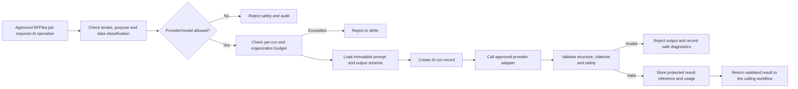
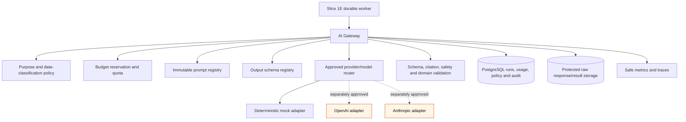
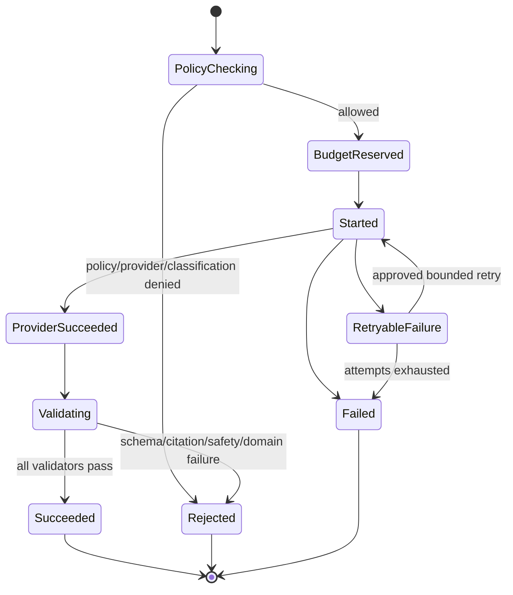

# RFPilot AI Intelligence Layer

## Slice 1F — Provider-Neutral AI Gateway Approval Pack

**Audience:** DXG business, privacy, security, product, and technical stakeholders  
**Decision requested:** Approve test-environment implementation with deterministic mock-provider execution by default  
**Prepared:** July 19, 2026  
**Live-provider and production processing:** Not included

## 1. Executive summary

Slice 1F creates the governed doorway through which future RFPilot AI capabilities will operate. Instead of proposal features calling OpenAI, Anthropic, or another vendor directly, every AI request will pass through one provider-neutral gateway that checks permission, data classification, provider eligibility, prompt/schema versions, budget, timeout, and output validity.

The gateway records what was requested, which approved versions were used, what the provider reported for usage, what validation occurred, and whether the result was accepted or rejected. AI output remains untrusted until schema, citation, safety, and domain validation pass.

The recommended first implementation uses a deterministic mock provider and synthetic fixtures. It proves policy enforcement, structured outputs, run records, budget controls, retries, and redaction without sending content to an external AI provider. Enabling OpenAI, Anthropic, or any other live provider requires a separate provider/account/data-classification approval gate.

## 2. Business outcome

After Slice 1F:

- Future AI features use one consistent security and quality boundary.
- DXG can change an approved provider/model without rewriting proposal workflows.
- The system refuses an AI request when the provider, data classification, budget, prompt, schema, or purpose is not approved.
- Every accepted output is linked to an immutable run record and exact prompt/schema/model policy.
- Provider errors and malformed outputs cannot silently update proposals.
- Costs and token usage are measured and capped before uncontrolled spending occurs.
- No silent fallback sends data to a different provider.
- Reviewed outcomes may improve internal evaluation assets, but are not automatically used to train third-party models.

## 3. Plain-language request flow

## 4. Scope

### Included

- Provider-neutral operations and adapter contracts.
- Deterministic mock provider for all automated/test execution.
- Versioned prompt registry with immutable releases and checksums.
- Versioned JSON Schema output registry with runtime validation.
- Provider/model policy by environment, purpose, operation, and data classification.
- Explicit no-silent-fallback policy.
- Per-run, daily organization, and monthly organization budget reservation/enforcement.
- PostgreSQL AI run, attempt, policy-decision, usage, cost, validation, and audit records.
- Structured output parsing, maximum-size enforcement, schema validation, citation-reference validation hooks, and safe diagnostic taxonomy.
- Timeout, rate-limit, retry, and circuit-breaker interfaces integrated with Slice 1E durable jobs.
- Secret-reference configuration; no provider keys stored in PostgreSQL, Redis, source control, logs, or API responses.
- Administrative read-only run/cost/policy APIs and safe test execution API.
- Provider-contract, privacy-policy, redaction, schema, budget, retry, and audit tests.
- Documentation for later OpenAI and Anthropic adapters without activating them.

### Excluded

- Live OpenAI, Anthropic, or other external-provider calls by default.
- Real DXG, customer, vendor, pricing, contract, or proprietary documents submitted to a provider.
- Production provider accounts, credentials, budgets, or deployment.
- Proposal drafting, knowledge extraction, recommendations, pricing, Investment Guidance, or vendor analysis features.
- Automatic application of AI output to MongoDB proposals.
- Fine-tuning, external training, autonomous agents, web browsing, arbitrary tools, code execution, or provider-managed retrieval.
- Cross-provider fallback unless separately approved for the exact data classification and purpose.

## 5. Proposed architecture

### Component responsibilities

| Component | Responsibility |
|---|---|
| Calling worker | Supplies authorized job, purpose, immutable input/evidence references, classification, and budget context |
| Policy engine | Decides whether the operation/provider/model/classification combination is allowed |
| Budget service | Atomically reserves estimated cost and reconciles actual usage |
| Prompt registry | Returns one immutable approved system/task prompt release |
| Schema registry | Returns one immutable output JSON Schema and validator |
| Router | Selects only an explicitly approved provider/model; never silently falls back |
| Provider adapter | Translates neutral request/response contracts without owning business policy |
| Validation pipeline | Treats output as untrusted and rejects invalid, unsupported, oversized, or unsafe results |
| Run repository | Records lifecycle, versions, policy decisions, usage, cost, latency, validation, and safe errors |
| Protected storage | Stores raw responses only when policy requires it, encrypted and access-controlled |

## 6. Provider-neutral operations

Slice 1F defines contracts but activates only controlled test operations.

| Operation | Purpose | Slice 1F execution |
|---|---|---|
| `extractStructured` | Produce schema-constrained facts from approved evidence | Mock/synthetic only |
| `classify` | Select from an approved closed taxonomy | Mock/synthetic only |
| `summarizeEvidence` | Summarize cited approved evidence | Contract and mock only |
| `generateFromEvidence` | Produce cited narrative using allowed sources | Contract and mock only |

Provider adapters never receive database credentials, storage credentials, user tokens, authorization rules, or unrestricted tool access.

## 7. Neutral request and response contracts

Each request includes:

- Organization and durable job/run IDs.
- Approved operation and purpose.
- Data classification.
- Prompt release ID and checksum.
- Output schema release ID and checksum.
- Evidence references and protected content supplied through a bounded in-memory request—not public URLs.
- Provider/model policy ID.
- Maximum input/output size, timeout, sampling policy, and cost budget.
- Correlation ID and idempotency key.

Each successful response includes:

- Structured output accepted by the requested schema.
- Evidence/citation references where the operation requires them.
- Exact provider and immutable model identifier.
- Provider request identifier when safely retainable.
- Input/output/cache token counts where reported.
- Actual or conservatively calculated cost in integer micros.
- Latency, retry count, finish reason, and validation release.
- Protected raw-response reference when retention policy permits.

## 8. Data-classification and provider policy

Recommended classifications:

| Classification | Example | Default Slice 1F policy |
|---|---|---|
| `synthetic` | Generated fixtures with no real customer/vendor content | Mock provider allowed |
| `public` | Material intentionally public and approved for the operation | Mock allowed; live provider separately gated |
| `customer_confidential` | Event plans, contacts, proposal content | External processing denied |
| `vendor_confidential` | Vendor responses, pricing, contracts | External processing denied |
| `dxg_proprietary` | Historical pricing, rules, methods | External processing denied |
| `security_sensitive` | Credentials, tokens, findings, malware details | AI processing denied |

Policy uses an allowlist. Absence of a matching active policy means deny. Policy changes are versioned, reviewed, audited, and effective-dated.

No fallback is permitted in the initial implementation. A later fallback may be configured only when both providers are approved for the exact environment, purpose, operation, classification, region, retention, and budget.

## 9. Prompt and schema governance

- Prompt releases are immutable after publication.
- Every release records stable ID, semantic version, checksum, purpose, operation, owner, approval state, effective dates, variables, and maximum input/output bounds.
- System instructions are separate from untrusted document/evidence content.
- Evidence is delimited and cannot change permissions, provider policy, schema, budget, or tool access.
- Variables are allowlisted and runtime-validated; no free-form template evaluation.
- Output schemas are immutable JSON Schema releases with deterministic validators.
- Unknown output properties are rejected unless explicitly permitted.
- Prompt/schema updates create new releases and must pass contract and regression tests.
- Rollback selects the prior approved release; historical run records retain their original versions.

## 10. Run lifecycle

A provider returning HTTP success does not make an AI run successful. Only validated output reaches `succeeded`.

## 11. Database design

Slice 1C created `ai_runs`; Slice 1F evolves it and adds governed registries.

| Record | Important information |
|---|---|
| `ai_provider_policies` | Environment, operation, purpose, classification, provider/model, region, retention, active dates, approval |
| `prompt_releases` | Stable key/version, content checksum, protected content reference, variables, approval, effective dates |
| `output_schema_releases` | Stable key/version, schema checksum/content, approval, effective dates |
| `ai_runs` | Job, policy, provider/model, prompt/schema versions, lifecycle, idempotency, correlation, latency, tokens, cost, protected response reference |
| `ai_run_attempts` | Attempt, provider request reference, timing, safe outcome, retry classification |
| `ai_validation_results` | Validator/version, outcome, safe codes, counts; no raw confidential output |
| `ai_budget_accounts` | Organization/environment/period limits, reserved and consumed cost micros |
| `ai_budget_ledger` | Atomic reservation, reconciliation, release, and adjustment records |
| `audit_events` | Policy, prompt/schema publication, budget override, execution decision, and administrative access |

All tenant-owned tables use forced PostgreSQL RLS. Money/cost uses integer micros; token counts and limits are non-negative integers. Append-only ledgers and audits reject mutation.

## 12. Budget and quota controls

Recommended test defaults:

| Control | Default |
|---|---|
| Mock-provider cost | Deterministic configured synthetic cost for enforcement tests |
| Per-run hard limit | USD 1.00 equivalent (`1,000,000` micros) |
| Daily organization limit | USD 10.00 equivalent |
| Monthly organization limit | USD 100.00 equivalent |
| Maximum concurrent AI runs | 2 per organization |
| Maximum provider attempts | 2 total attempts for a run |
| Reservation | Estimate before call; atomic reservation required |
| Reconciliation | Charge actual reported/calculated cost; release unused reservation |
| Exceeded behavior | Reject before provider call with safe `AI_BUDGET_EXCEEDED` |
| Override | Disabled by default; later security/budget administrator action with reason and audit |

These test limits do not authorize purchasing provider capacity. Live-provider budgets require an approved account, pricing snapshot, owner, alert thresholds, and expiry/review date.

## 13. Retry, timeout, and fallback

| Condition | Policy |
|---|---|
| Timeout, 429/rate limit, temporary 5xx/network error | Retryable within durable-job and run attempt limits |
| Invalid credentials, policy denial, budget denial | Permanent; no retry |
| Invalid structured output | One same-provider repair/retry only if approved; otherwise reject |
| Citation/safety/domain validation failure | Permanent rejected output unless operation policy explicitly permits same-provider retry |
| Context/input too large | Permanent until deterministic preprocessing changes the immutable input version |
| Different provider fallback | Disabled; requires separate explicit policy approval |

Recommended mock/test timeout is 30 seconds. Future live-provider task timeouts are operation-specific and capped by the parent durable job.

## 14. Security and privacy review

- Credentials come from environment secret references or an approved secret manager and are never persisted with runs.
- Provider adapters use fixed HTTPS endpoints; user input cannot choose a URL, deployment, model, or region.
- Egress is allowlisted; redirects, proxies, and SSRF destinations are restricted.
- Runtime contracts cap input, evidence count, output bytes, nesting depth, and string lengths.
- Prompt-injection content is data, never system instruction, policy, schema, or tool authorization.
- Tools, browsing, code execution, file-system access, and arbitrary function calling are disabled.
- Logs/traces use IDs, versions, classification, token/cost/latency, and safe codes—not raw prompts, evidence, or outputs.
- Protected raw responses are encrypted, tenant-scoped, access-audited, retained only by policy, and excluded from ordinary support access.
- Provider data-use terms must prohibit training on submitted data before any real asset is permitted.
- Retention, abuse monitoring, processing region, subprocessors, and deletion behavior require documented approval.
- AI output is HTML/Markdown-escaped at display boundaries and never executed.
- Budget, concurrency, and rate limits reduce denial-of-wallet abuse.

## 15. API design

All endpoints use `/api/v1`, runtime validation, tenant authorization/RLS, correlation IDs, cursor pagination, and RFC 9457 problems.

| Method and endpoint | Purpose | Authorization |
|---|---|---|
| `POST /ai/test-runs` | Execute approved mock/synthetic contract test through durable job | AI tester/admin; idempotency required |
| `GET /ai/runs/:id` | Read safe run metadata and validation state | Authorized resource member |
| `GET /ai/runs` | List scoped runs and cost summaries | Admin/approved analyst |
| `GET /ai/policies` | View effective provider/model policies | Admin/security |
| `GET /ai/prompts` | View metadata/checksums, not protected prompt content | Admin/AI reviewer |
| `GET /ai/schemas` | View approved schema metadata | Admin/AI reviewer |
| `GET /ai/budgets` | View limits, reservations, usage, and remaining amount | Admin/budget owner |

Publishing or changing policy, prompt, schema, and budget records remains migration/configuration controlled in Slice 1F. A later governed admin UI may add maker/checker workflows.

## 16. Reliability, observability, and recovery

- Run creation, budget reservation, and audit/outbox state commit atomically.
- Provider idempotency identifiers are used where supported; retries retain one RFPilot run ID and distinct attempts.
- Provider usage is reconciled even when validation rejects output.
- Interrupted runs release or reconcile stale reservations through a bounded recovery process.
- Circuit breakers prevent retry storms during sustained provider failure.
- Prompt/schema/policy caches are keyed by immutable checksum and short-lived; permission decisions are not broadly cached.
- Provider failure does not lose the parent durable job, source, proposal, or audit history.
- Rollback disables gateway execution and selects the previous approved prompt/schema/policy release without deleting run evidence.

Metrics cover requests, policy/budget denials, latency, tokens, estimated/actual cost, retries, timeouts, provider errors, schema/citation/safety failures, and circuit state. Metrics and traces contain no raw content.

## 17. Deployment approach

1. Apply PostgreSQL migration with `AI_GATEWAY_ENABLED=false`.
2. Seed immutable mock provider policy, prompt, and schema test releases.
3. Run provider-contract and policy tests entirely offline/deterministically.
4. Enable mock gateway only for the isolated test organization and `synthetic` classification.
5. Execute budget, retry, timeout, invalid-output, injection, redaction, and recovery fixtures through Slice 1E jobs.
6. Verify tenant isolation, backup/restore, migration rollback/reapply, full CI, and clean-runner CI.
7. Submit evidence for Slice 1F acceptance.

Live-provider adapter enablement, credentials, network egress, benchmark assets, and budget remain a separate written gate after provider privacy and commercial review.

## 18. Testing and acceptance criteria

- Application modules depend on the neutral gateway port, not OpenAI/Anthropic SDKs.
- Mock provider returns deterministic contract fixtures without network access.
- Missing or inactive policy denies before adapter invocation.
- Confidential/security-sensitive classifications deny external-provider routing.
- No silent provider/model/region fallback occurs.
- Same idempotency key and input/version returns one run; conflicting reuse returns `409`.
- Budget reservation is atomic under concurrency and prevents overrun before invocation.
- Actual usage reconciles reservation, including rejected output.
- Structured output exceeding size or failing schema is rejected before persistence/use.
- Required citations reference only the allowed evidence set.
- Prompt-injection fixtures cannot change policy, schema, budget, provider, or tools.
- Logs, traces, queue messages, audit metadata, and error responses contain no raw confidential inputs/outputs or secrets.
- Provider timeout/throttle retry is bounded; permanent errors do not retry.
- Run record contains exact provider/model, policy, prompt/schema checksums, validation, token/cost, latency, correlation, and attempts.
- Cross-tenant run/policy/budget access returns no data.
- Migration apply/rollback/reapply, backup/restore, full CI, dependency audit, and remote clean-runner pass.
- Existing proposal and document workflows remain unchanged when the gateway flag is off.

## 19. Risks and mitigations

| Risk | Mitigation |
|---|---|
| Confidential data sent without approval | Deny-by-default classification policy and mock-only initial enablement |
| Provider uses submitted data for training | Contract/account review prerequisite; no real assets until accepted |
| Hallucinated or malformed output | Structured schemas, citations, safety/domain validation, human review downstream |
| Prompt injection | Instruction/data separation, no tools, policy outside prompt, adversarial tests |
| Unexpected cost | Atomic reservations, hard limits, concurrency/rate limits, alerts and circuit breakers |
| Provider outage or degradation | Durable jobs, bounded retry, circuit breaker, no unsafe fallback |
| Provider model changes | Immutable model identifiers, benchmark/release gate, versioned policy |
| Sensitive logs | Central redaction, reference-only telemetry, automated leakage tests |
| Gateway becomes provider-specific | Neutral ports/contracts and provider contract-test suite |
| Invalid result updates proposal | Gateway only returns validated candidates; proposal application remains later human-controlled work |

## 20. Decisions requested from DXG

Please confirm or amend:

1. Mock-provider-only execution as the Slice 1F default.
2. External provider processing denied for all real/confidential classifications until a separate provider approval.
3. No automatic cross-provider fallback.
4. The budget, concurrency, attempt, and timeout defaults in Sections 12–13.
5. `synthetic`, `public`, `customer_confidential`, `vendor_confidential`, `dxg_proprietary`, and `security_sensitive` as the initial classifications.
6. Raw provider responses stored only in protected storage when policy requires them, not ordinary PostgreSQL/logs.
7. Reviewed feedback may update internal evaluation datasets only through approval; it is not automatically sent for third-party training.
8. Live OpenAI/Anthropic accounts, credentials, legal/privacy review, benchmark assets, and spend require a later written authorization.

## 21. Authorization statement

To authorize implementation within these limits, DXG may reply:

> DXG approves the Slice 1F provider-neutral AI gateway design and authorizes test-environment implementation using the defaults in this approval pack. Initial execution must use the deterministic mock provider and synthetic fixtures only; live-provider calls, confidential-data processing, provider credentials/spend, production provisioning, and proposal auto-application remain separately gated.

