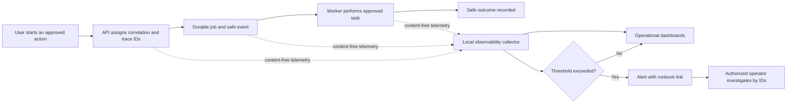
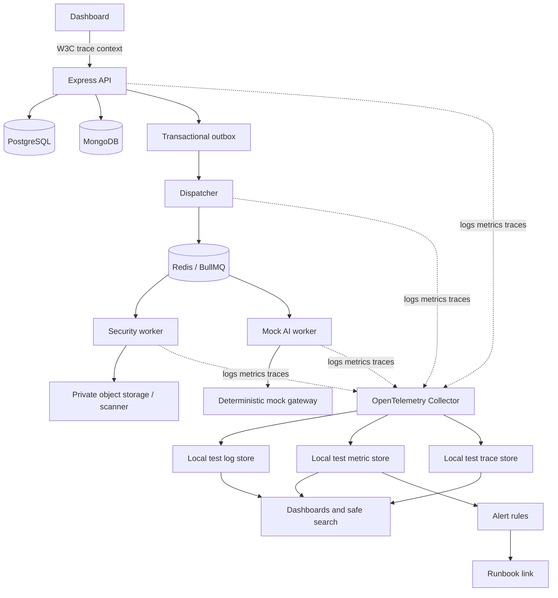
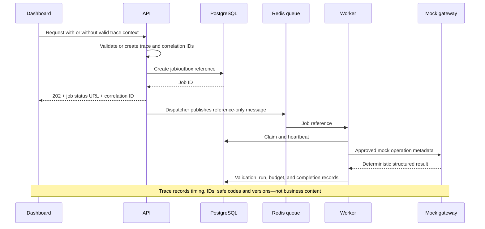

# RFPilot AI Intelligence Layer

## Slice 1G — Observability and Operations Approval Pack

**Prepared:** July 19, 2026  
**Decision requested:** Approve test-environment implementation using content-free telemetry and a vendor-neutral local collector  
**Prerequisite:** Slice 1F accepted as the provider-neutral AI gateway foundation

## 1. Executive summary

Slice 1G makes the platform foundation operable. It allows DXG to answer, without opening proposal or document content:

- Is the API available and responding normally?
- Are uploads, security scans, queues, workers, and mock AI runs completing?
- Where did a failed request or job stop?
- Are retries, dead letters, database pressure, or Redis pressure increasing?
- Are AI policy, validation, concurrency, or budget controls denying requests as designed?
- Did an authorized person retry, cancel, or inspect an operational record?

The design uses structured JSON logs, OpenTelemetry-compatible traces and metrics, operational dashboards, alert rules, append-only audit records, and incident runbooks. Telemetry contains identifiers and safe outcomes—not proposal text, uploaded documents, prompts, model output, vendor pricing, access tokens, signed links, credentials, email addresses, or other business payloads.

This increment does not enable a real AI provider, process confidential documents through AI, redesign the proposal frontend, create AI drafts, generate questions or guidance, purchase an observability service, or deploy to production.

## 2. Plain-language operating flow

The dotted path carries operational facts only. Proposal and document content remains in its authoritative private system and does not travel through the telemetry pipeline.

## 3. Business outcomes

After Slice 1G, DXG should be able to:

1. Follow one request across API, PostgreSQL outbox, Redis queue, worker, storage/security scan, and mock AI gateway by correlation or trace ID.
2. See service health, error rate, latency, queue backlog, oldest-job age, retries, dead letters, worker health, mock-AI validation, and synthetic budget status.
3. Receive test alerts for conditions that require action.
4. Open the correct runbook from an alert and perform safe, authorized diagnostics.
5. Distinguish user/input failures, policy denials, dependency failures, retryable failures, and internal defects.
6. Demonstrate through automated tests that telemetry does not contain prohibited content or secrets.

## 4. Scope

### Included

- Shared correlation-ID and trace-context handling for approved `/api/v1` paths.
- Structured JSON application and worker logs.
- Central redaction and field allowlisting.
- OpenTelemetry instrumentation for HTTP, PostgreSQL, Redis/BullMQ, workers, private storage/scanning boundaries, and the mock AI gateway.
- Application metrics with bounded labels.
- Test dashboards and alert-rule definitions.
- Existing append-only audit events extended where operational decisions require them.
- Health/readiness separation for API, PostgreSQL, Redis, dispatcher, workers, scanner, and mock gateway.
- Runbooks for API errors, database problems, queue backlog/dead letters, worker outage, scan failure, mock-gateway failure, policy/budget denial, suspected telemetry leakage, and rollback.
- Automated telemetry contract, redaction, cardinality, tenant-isolation, failure, and recovery tests.

### Excluded and separately gated

- Live AI providers, their credentials, traffic, cost, or confidential-data access.
- Real customer, vendor, DXG-proprietary, or security-sensitive content in AI tests.
- User-behavior/product analytics, session replay, heatmaps, or marketing tracking.
- Full proposal contents or personal data in dashboards.
- A production monitoring vendor, paid account, external notification channel, or production retention policy.
- Production provisioning, on-call staffing commitments, and production SLO contracts.
- AI drafting, questions, recommendations, guidance, proposal mutation, or frontend redesign.
- The broader CI/CD workstream: SAST, license/secret/container scanning, SBOM signing, canary deployment, and automated production rollback.

## 5. Architecture

### Recommended test default

- Applications emit OpenTelemetry Protocol through a local/private collector.
- Structured logs go to stdout and the local test collector.
- The telemetry backend is replaceable. Applications depend on OpenTelemetry contracts rather than a named vendor SDK.
- If no collector is configured, business requests continue safely; telemetry export failure is rate-limited and surfaced through local health diagnostics without recursively flooding logs.
- No external telemetry SaaS export is authorized in Slice 1G.

## 6. Telemetry contract

### Allowed common fields

| Category | Examples |
|---|---|
| Event identity | timestamp, severity, service, environment, event name, application version |
| Correlation | trace ID, span ID, correlation ID, request ID |
| Safe resource identity | job ID, run ID, source ID, organization pseudonym—not organization name |
| Operation | normalized route template, HTTP method, job type, AI operation, worker type |
| Outcome | success/failure/denied/rejected, HTTP status class, safe error code |
| Performance | duration, queue wait, attempt number, bounded sizes/counts |
| AI metadata | mock provider/model ID, prompt/schema/policy version, tokens, synthetic cost, validation result |

### Prohibited fields

- Authorization, refresh, public-access, submission, OTP, or password material.
- Cookies, API keys, provider keys, connection strings, secret references, or signed URLs.
- Request/response bodies, uploaded file bytes, extracted document text, prompt content, or raw AI output.
- Proposal content, event notes, vendor bids/pricing, email bodies, names, email addresses, phone numbers, or postal addresses.
- Raw database statements containing values or unrestricted query parameters.
- Stack traces or dependency messages returned to clients.

Telemetry uses an allowlist. Unknown fields are dropped rather than logged optimistically. Query strings are excluded by default. Route templates such as `/api/v1/ai/runs/:runId` are recorded instead of raw paths.

## 7. Logging design

- One shared logger interface for API, dispatcher, and workers.
- JSON in test/staging; human-readable local development may be explicitly enabled.
- Severity levels: `debug`, `info`, `warn`, `error`, `fatal`.
- Safe error taxonomy: validation, authentication, authorization, not-found, conflict, rate/quota, policy, dependency, retryable-job, permanent-job, internal.
- Central serializers accept only approved error code, class, dependency category, and retryability. Raw error messages are not exported unless mapped to an approved safe message.
- Repeated identical exporter/dependency failures are sampled or rate-limited.
- Successful high-volume health checks are not logged individually.
- Security and approval audit events remain separate from operational logs and append-only in PostgreSQL.

Recommended test retention defaults:

| Record | Default |
|---|---|
| Operational logs | 14 days |
| Distributed traces | 7 days |
| Metrics | 30 days |
| PostgreSQL security/audit events | Existing database retention; deletion policy remains separately approved |

These are test defaults, not production retention authorization.

## 8. Tracing and request flow

- Incoming trace context is validated; malformed or untrusted baggage is discarded.
- Tenant identity is never accepted from trace baggage.
- Correlation ID is returned in API responses and RFC 9457 errors.
- Span attributes use stable, bounded names and values.
- Sensitive data is never added as a span event.
- Trace sampling defaults to 100% for errors/test fixtures and a configurable bounded rate for successful test traffic.

## 9. Metrics and cardinality controls

### Initial metrics

| Area | Metrics |
|---|---|
| API | request count, duration, status class, rate-limit rejection, active requests |
| PostgreSQL | pool use/wait, transaction duration/failure, migration version, safe query-operation duration |
| Redis/jobs | queued/active/completed/failed/cancelled/dead-letter, oldest age, wait time, attempts, stalls, outbox lag, reconciliation drift |
| Workers | readiness, heartbeat age, active work, concurrency saturation, execution duration, safe failure code |
| Document security | uploaded/quarantined/ready/blocked/scan-failed counts and scan duration; no file names |
| Mock AI gateway | request/outcome, policy/budget/concurrency denial, latency, tokens, synthetic cost, schema/citation failure, attempts |
| Security | authentication/authorization denial counts, suspicious rate-limit activity, public-grant denial; no actor PII |

Labels may include service, environment, normalized route, method, status class, operation, job type, provider (`mock`), safe error code, and tenant class. They must not include user ID, email, raw organization ID, proposal ID, job ID, run ID, trace ID, URL, or free text. IDs belong in logs/traces for controlled lookup, not metric labels.

## 10. Dashboards

### Platform health

- API availability, traffic, latency percentiles, and error rate.
- PostgreSQL, MongoDB, Redis, scanner, dispatcher, and worker readiness.
- Database pool pressure and Redis memory/eviction indicators.

### Durable operations

- Job volume by approved type and outcome.
- Queue depth, oldest queued age, wait/execution/end-to-end duration.
- Retry, stall, failure, and dead-letter trends.
- Worker availability and concurrency saturation.
- Outbox backlog and reconciliation drift.

### AI foundation

- Mock AI runs by operation and validated outcome.
- Policy, budget, concurrency, schema, and citation denials.
- Prompt/schema/policy release versions in use.
- Mock token counts, synthetic cost, latency, and attempt count.

### Security and audit

- Authentication/authorization denial trends.
- Rate-limit and public-access denial signals.
- Authorized cancellation, retry, recovery, and policy-related decisions.
- Telemetry redaction-test and audit-integrity status.

Dashboards show aggregates and safe identifiers only. They are operational views, not proposal-content or employee-performance dashboards.

## 11. Initial test alert defaults

| Alert | Proposed test threshold | Severity |
|---|---|---|
| API elevated errors | More than 5% server errors for 5 minutes with at least 20 requests | High |
| API latency | p95 above 2 seconds for 10 minutes, excluding long-running async work | Medium |
| No healthy worker | Zero healthy workers for an enabled queue for 2 minutes | High |
| Oldest queued job | Older than 5 minutes | High |
| Dead letter | Any new dead-letter job | High |
| Outbox lag | Oldest unpublished event older than 2 minutes | High |
| Repeated stalls | Three or more stalls in 15 minutes | High |
| Redis eviction | Any eviction while durable jobs are enabled | Critical |
| Database pool pressure | More than 80% utilized for 10 minutes | Medium |
| Mock validation regression | More than 10% unexpected validation failures over 20 runs | High |
| Budget denial | Any unexpected synthetic-budget denial | Medium |
| Telemetry leakage test | Any prohibited canary detected | Critical and release-blocking |

Test alerts remain inside the approved test environment. Slack, email, PagerDuty, Teams, or other external notification delivery requires a separate destination and access approval.

## 12. Audit versus telemetry

Operational telemetry helps diagnose system behavior and may be sampled or expire. Audit records are authoritative evidence of security and administrative decisions and are not sampled.

Append-only audits cover:

- Session/security-sensitive administrative actions.
- Document-source deletion and security-scan decisions.
- Job create, cancel, retry, and dead-letter recovery.
- AI run allow/deny decisions and budget/policy outcomes.
- Future policy, prompt, schema, and budget publication when those administration APIs are authorized.

Audit reads require `security:admin`, organization scope, RLS, pagination, and access logging. A general audit-search UI is not part of this slice unless separately approved.

## 13. Health and graceful degradation

- **Liveness** answers whether a process is running; it does not require every dependency.
- **Readiness** answers whether a process can safely accept its assigned work.
- API health reports dependency categories and safe status, never connection details.
- Worker readiness is queue/job-type specific.
- Telemetry-export failure must not block manual proposal viewing/editing or corrupt jobs.
- When the AI gateway is disabled or unhealthy, existing manual proposal functionality remains available.
- Critical authoritative-state failures such as PostgreSQL unavailability fail closed for durable AI work.

## 14. Runbooks

Each runbook contains symptoms, dashboard links, safe diagnostic queries, immediate containment, authorized recovery, escalation owner placeholder, verification, rollback, and post-incident evidence.

Initial runbooks:

1. API unavailable or elevated 5xx rate.
2. PostgreSQL unavailable or pool exhausted.
3. Redis unavailable, eviction, or queue reconstruction.
4. Queue backlog, stuck job, repeated retry, or dead letter.
5. Dispatcher/worker unavailable or lease recovery.
6. Private-storage, scanner, or quarantine failure.
7. Mock AI gateway policy, budget, schema, citation, or execution failure.
8. Authentication/authorization or public-access incident.
9. Suspected sensitive data in telemetry.
10. Disable observability export and roll back Slice 1G.

## 15. Security and privacy review

- OWASP-sensitive headers, credentials, bodies, and query values are excluded before serialization.
- Telemetry export endpoints are fixed configuration, never user-controlled; this prevents an SSRF-style destination choice.
- Collector traffic remains inside the approved test network and uses authentication/TLS when it crosses a host boundary.
- Dashboard access uses least privilege; public dashboards are prohibited.
- Trace baggage and log fields cannot change tenant context, authorization, provider policy, budget, or job behavior.
- Automated canary-secret and PII fixtures verify absence across logs, spans, metrics, alerts, and error responses.
- Debug logging of payload bodies is prohibited even during incidents.
- Metrics use bounded label values to prevent denial through cardinality explosion.

## 16. Implementation plan

1. Define shared telemetry contracts, safe field allowlists, error taxonomy, and redaction tests.
2. Add correlation-ID middleware and safe RFC 9457 correlation output.
3. Add structured logger adapters to API, dispatcher, security worker, and mock-AI worker.
4. Add OpenTelemetry SDK and OTLP exporter behind `OBSERVABILITY_ENABLED=false`.
5. Instrument HTTP, database, queue, worker, scanner/storage boundaries, and mock gateway.
6. Add bounded application metrics and health/readiness checks.
7. Provision an isolated local/test collector and local telemetry stores.
8. Add dashboards, alert rules, and runbook links as version-controlled configuration.
9. Execute redaction, failure, sampling, cardinality, trace-continuity, tenant-isolation, and recovery tests.
10. Submit test evidence for Slice 1G acceptance.

Rollback disables telemetry export and new instrumentation through configuration while preserving authoritative database/job/audit state. Instrumentation removal is not required to restore business function.

## 17. Acceptance criteria

- One correlation/trace path connects API submission, outbox dispatch, Redis, worker, and mock AI completion.
- Logs are valid structured JSON and contain only allowlisted fields.
- Prohibited canary tokens, PII, proposal text, prompt text, output, file content, URLs, and secrets are absent from every telemetry surface.
- Queue messages remain reference-only.
- Metrics have bounded labels and do not use tenant/user/resource/trace IDs as labels.
- Dashboards expose API, dependencies, jobs, workers, document security, mock AI controls, and security signals.
- Test alerts fire and resolve for controlled failure/recovery fixtures and link to the correct runbook.
- Telemetry collector outage does not break manual proposal use, durable-state integrity, or job recovery.
- PostgreSQL/Redis/worker failure remains visible with safe diagnostic codes.
- Audit events remain append-only, tenant-scoped, unsampled, and separate from operational telemetry.
- Observability disabled mode preserves all existing application behavior.
- Full backend/frontend CI and existing workflow regressions pass.
- Migration/rollback documentation, environment variables, retention, dashboards, alerts, and runbooks match the implementation.

## 18. Risks and mitigations

| Risk | Mitigation |
|---|---|
| Sensitive content leaks into telemetry | Allowlist serializers, body/query exclusion, canary leakage tests, restricted access |
| Metrics overload the backend | Bounded labels, aggregation, sampling, batch export, resource limits |
| Collector outage affects users | Non-blocking bounded exporter, circuit/rate limit, graceful degradation |
| Too many alerts | Severity, minimum-volume gates, duration windows, runbook ownership, tuning evidence |
| Too little data to diagnose failures | Required trace continuity and safe error taxonomy tests |
| IDs enable unauthorized cross-tenant lookup | Pseudonymous tenant identity, RLS, role-restricted logs, no content in telemetry |
| Vendor lock-in | OpenTelemetry/OTLP contracts and replaceable collector/backend |
| Monitoring mistaken for product completion | Explicit scope: this operates the foundation; it does not build the five-step proposal UX |

## 19. Decisions requested from DXG

Please confirm or amend:

1. Vendor-neutral OpenTelemetry/OTLP architecture.
2. Local/private test collector only; no external telemetry SaaS.
3. Content-free allowlist telemetry contract and prohibited-field list.
4. Test retention defaults: logs 14 days, traces 7 days, metrics 30 days.
5. Initial dashboard set and alert thresholds.
6. No external alert destination in this increment.
7. `security:admin` for restricted operational/audit access.
8. Telemetry exporter failure degrades safely and does not block manual proposal functionality.
9. Broader CI/CD hardening and production SLO/on-call commitments remain separately gated.

## 20. Approval statement

> DXG approves the Slice 1G observability and operations design and authorizes test-environment implementation using the defaults in this approval pack. Telemetry must use content-free allowlisted fields and a local/private OpenTelemetry collector; external telemetry services, real-provider processing, confidential-data AI processing, production provisioning, external alert delivery, user-facing AI proposal functionality, and broader CI/CD hardening remain separately gated.
