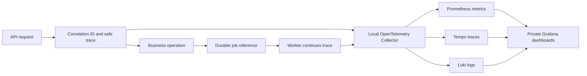

# RFPilot AI Intelligence Layer

## Milestone 1 — Slice 1G Observability and Operations Status

**Status date:** July 19, 2026  
**Implementation state:** Implemented in the test environment; DXG acceptance pending  
**Authorized boundary:** Content-free allowlisted telemetry through a local/private OpenTelemetry stack only

## Delivered

- Correlation IDs on API requests, structured operational logs, bounded metrics, and distributed traces.
- A strict telemetry allowlist that excludes request bodies, proposal/document content, prompts, model outputs, credentials, tokens, email addresses, job IDs, run IDs, and raw tenant identifiers.
- Stable tenant pseudonyms generated with an environment-specific HMAC key.
- Trace-context propagation from API/background dispatch to durable workers using reference-only queue messages.
- Local/private OpenTelemetry Collector, Prometheus, Tempo, Loki, and Grafana deployment bound to loopback interfaces.
- Dashboards and local alert rules for API health, dependency failures, durable jobs, AI-gateway outcomes, latency, and telemetry-export health.
- Health reporting and graceful degradation when the collector is unavailable; business operations do not depend on telemetry availability.
- Operator runbooks for API/dependency failures, durable jobs, and the AI gateway.
- Automated privacy, endpoint-policy, correlation, logging, metric-cardinality, and safe-error tests.

## Operational flow

Only operational metadata from the explicit allowlist enters this flow. Proposal content and other sensitive payloads remain in their authoritative stores and are not copied into telemetry.

## Verification evidence

| Check | Result |
|---|---|
| Full backend quality gate | Passed: contracts, zero-warning lint, TypeScript, migration command checks, 172 tests, and production build |
| Local/private topology | Passed: Collector, Prometheus, Tempo, Loki, and Grafana ran locally with published ports bound to loopback |
| Logs, metrics, and traces | Passed: all three signal types were exported and queryable locally |
| Cross-process trace continuity | Passed: request span `http.test.submit` and worker span `job.ai_gateway_test` appeared in the same trace |
| Content/privacy canaries | Passed after hardening: no secret, email, proposal-content, high-cardinality ID, or command-argument canary appeared in Loki, Tempo, or Prometheus |
| Collector outage | Passed: the business operation completed successfully while the Collector was stopped |
| Endpoint restriction | Passed: non-local telemetry destinations are rejected by configuration validation |
| Automated observability tests | Passed: redaction, allowlisting, bounded metric labels, pseudonymization, safe error codes, and correlation behavior |
| Production dependency audit | Passed: zero critical production dependency vulnerabilities |

During verification, automatic OpenTelemetry resource detection was found to include process command arguments. This was treated as a privacy failure: automatic detection was disabled, only explicit safe resource attributes are now emitted, existing local telemetry volumes were purged, and the complete canary test was repeated successfully.

## Activation controls

1. Use only the supplied local/private test stack or another explicitly approved private Collector.
2. Set a unique test-environment telemetry HMAC key through secret management; never commit it.
3. Enable telemetry only in approved test services.
4. Keep automatic instrumentation and resource detection disabled unless a later privacy review explicitly approves them.
5. Run the privacy-canary and collector-outage checks before each environment promotion.
6. Keep dashboards and alert delivery private; no external alert destination is configured or authorized.

## Boundaries retained

This increment does **not** authorize or deliver:

- External telemetry or alerting services.
- Real AI-provider calls or provider credentials/spend.
- Confidential-data AI processing.
- Production provisioning or deployment.
- User-facing AI proposal creation functionality.
- Broader CI/CD hardening beyond the existing repository quality gates.

## Acceptance requested

DXG is asked to confirm that Slice 1G meets the approved test-environment observability and operations design. Acceptance would close Slice 1G only; every retained boundary above remains separately gated.
