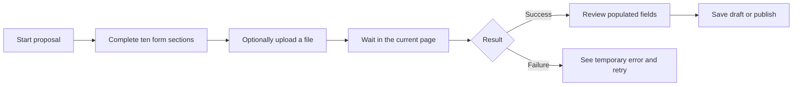
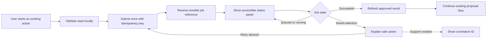
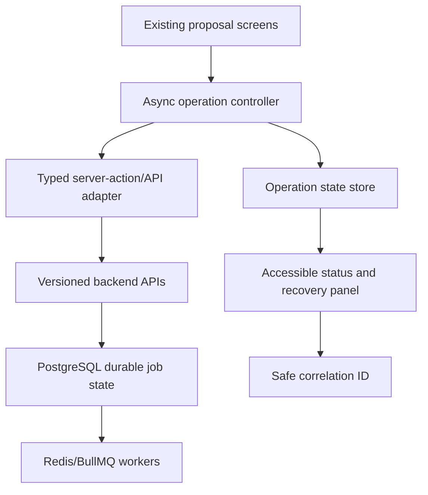
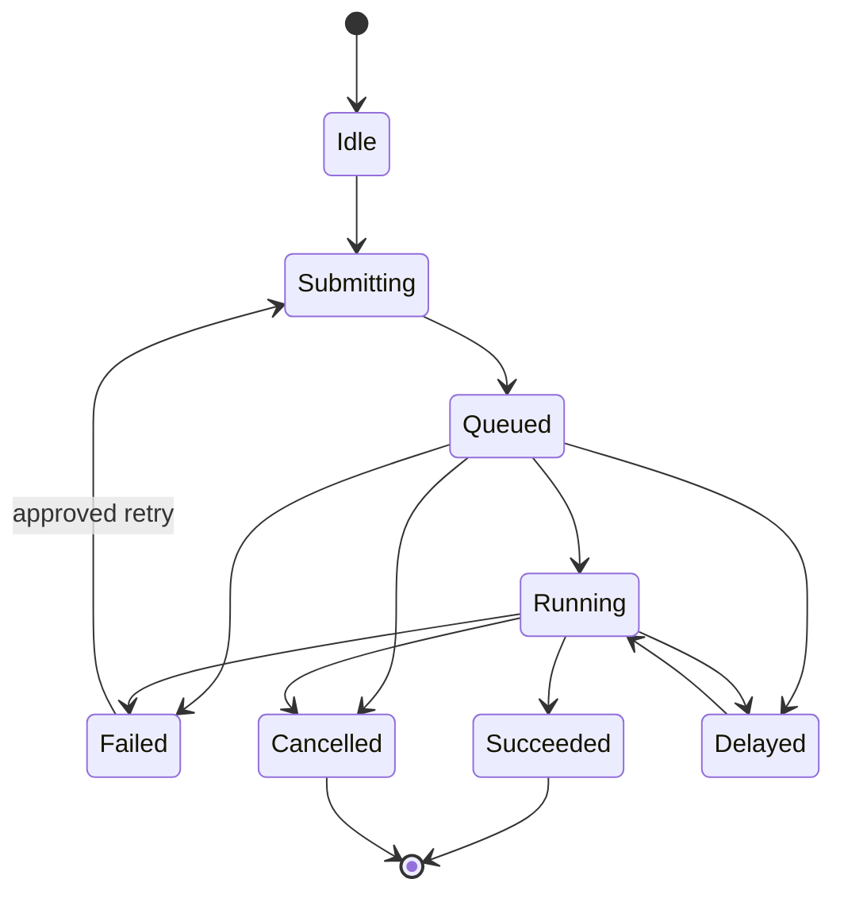

# RFPilot AI Intelligence Layer

## Slice 1H — Frontend Compatibility and Async-Status UX Approval Pack

**Prepared:** July 19, 2026  
**Decision requested:** Accept Slice 1G evidence and authorize Slice 1H test-environment implementation  
**Prerequisite:** Slice 1G acceptance  
**Implementation boundary:** Compatibility, recovery, accessibility, and status visibility only

## 1. Executive summary

Slice 1H connects the existing dashboard safely to the Milestone 1 platform foundation without enabling the future AI proposal workflow.

Today, proposal creation is a long, ten-part form. It can upload a document and attempt extraction, but users do not receive a durable, recoverable view of background processing. Errors are mainly transient messages, and a refresh can make it unclear whether work is still running, failed, or completed.

This increment will preserve the current proposal experience while adding a reusable status and recovery layer for approved background operations. It also establishes an accessibility baseline and proves that existing login, proposal, email-link, vendor-link, upload, and publish workflows remain compatible with the secured backend.

Slice 1H does not deliver the target five-step AI journey. It creates the safe frontend foundation that future increments will use.

## 2. Current user journey

### Current compatibility risks

- The proposal editor is a large client component with many responsibilities and a broad data model.
- Background work is presented as a page-local action rather than a durable job with a recoverable state.
- Refresh, navigation, worker delay, and dependency outage behavior are not consistently explained to the user.
- A transient toast is insufficient for failures requiring retry, support, or a correlation ID.
- The ten-step navigation increases cognitive load, but redesigning it into the future five-step AI flow is outside this slice.
- Keyboard, focus, screen-reader, responsive, zoom, and error-summary behavior require an explicit acceptance baseline.

## 3. Proposed Slice 1H experience

The status panel will use plain language:

| System state | User message | Available action |
|---|---|---|
| Queued | “Your file is waiting to be checked.” | Leave page safely |
| Running | “We’re checking your file.” | Continue waiting or leave |
| Succeeded | “Your file is ready.” | Continue current workflow |
| Retryable failure | “We couldn’t finish this check.” | Retry once safely |
| Permanent failure | “This file could not be processed.” | Replace file or contact support |
| Cancelled | “Processing was cancelled.” | Start again |
| Delayed | “This is taking longer than expected.” | Keep waiting or return later |

No proposal, document, prompt, or model content will be exposed in URLs, browser logs, analytics, telemetry, or error details.

## 4. Scope

### Included

- Typed frontend adapters for the approved versioned backend contracts.
- Reusable async-operation state model: idle, submitting, queued, running, succeeded, failed, cancelled, and delayed.
- Status polling with bounded backoff, visibility-aware pausing, timeout messaging, and cleanup on unmount.
- Idempotency keys for user-triggered background actions to prevent duplicate work.
- Safe retry and recovery behavior based on backend retryability, not guessed from error text.
- Correlation ID presentation for support without displaying stack traces or sensitive details.
- Accessible live-region announcements, focus management, status semantics, error summaries, and keyboard operation.
- Regression coverage for authentication, refresh/logout, proposal CRUD, draft/publish, private uploads, emailed proposal links, and vendor-submission links.
- Responsive and 200% zoom verification for supported proposal screens.
- Feature flags and rollback to the current synchronous-compatible presentation where safe.
- Frontend architecture and operator/support documentation.

### Excluded and separately gated

- The redesigned five-step journey: Provide Information, Review the Draft, Answer Key Questions, See Guidance, and Publish.
- Real-model calls, AI drafting, requirement extraction from confidential documents, DXG knowledge retrieval, clarification questions, recommendations, or investment guidance.
- Automatic application of extracted or generated changes to a proposal.
- New AI content editing, rewriting, tone adjustment, or smart suggestions.
- External telemetry, session replay, product analytics, heatmaps, or external alert delivery.
- Production provisioning, production rollout, broad CI/CD hardening, or destructive migration.
- Material visual rebranding or replacement of the detailed proposal data model.

## 5. Frontend architecture

### Responsibilities

| Component | Responsibility |
|---|---|
| Existing proposal screens | Continue current proposal editing, saving, and publishing behavior |
| API adapter | Validate versioned responses and normalize safe errors |
| Async controller | Submit once, poll status, stop polling, retry, cancel locally, and refresh results |
| Operation state store | Hold only safe references and presentation state; no uploaded bytes or extracted content |
| Status panel | Explain progress, recovery, and support information accessibly |
| Backend | Remain authoritative for job state, authorization, tenancy, and retryability |

## 6. State and request rules

- The backend is authoritative; the browser never marks a job successful by elapsed time.
- Polling defaults to 2 seconds, backs off to 10 seconds, pauses in a hidden tab, and resumes with an immediate status check.
- HTTP `202` means accepted, not completed.
- `401` triggers the existing controlled session-refresh behavior; repeated authentication failure returns the user to sign-in without an infinite loop.
- `403` is never retried automatically.
- `404` presents an unavailable/expired state without revealing cross-tenant existence.
- `409` presents the backend conflict and preserves user input.
- `429` and retryable `5xx` responses respect `Retry-After` when supplied.
- Retry reuses the approved operation identity/idempotency rules so double-clicks and network retries do not create duplicate work.
- Browser persistence may store only job reference, operation type, start time, and proposal reference where approved; never tokens, file contents, extracted text, or raw errors.

## 7. Accessibility baseline

Slice 1H targets WCAG 2.2 AA behavior for changed screens:

- Every action is keyboard reachable and has a visible focus state.
- Progress updates use a polite live region; critical failures use an assertive announcement sparingly.
- Focus moves to the error summary after a failed submission and returns logically after retry.
- Status is not communicated by color alone.
- Loading indicators include meaningful text and do not trap focus.
- Reduced-motion preferences are respected.
- Forms preserve labels, descriptions, required state, and field-level error relationships.
- Changed workflows work at 200% zoom and supported mobile widths without two-dimensional scrolling for ordinary text content.

## 8. Security and privacy controls

- Continue server-side session and authorization enforcement; UI hiding is not authorization.
- Do not place access grants, refresh tokens, uploaded content, or sensitive error data in client logs or telemetry.
- Validate response contracts before rendering backend data.
- Render error codes through a fixed safe-message catalogue.
- Accept only same-origin or allowlisted navigation targets; prevent open redirects.
- Preserve scoped, expiring emailed-proposal and vendor-submission links.
- Never trust tenant, proposal owner, retryability, completion, or publish authority from client state.
- Disable automatic submission and proposal mutation.
- Use CSP-compatible components and avoid unsafe HTML rendering.

## 9. Verification plan

| Test layer | Required evidence |
|---|---|
| Unit | State transitions, polling/backoff, cleanup, safe errors, retry rules, status announcements |
| Contract | Frontend generated contracts match backend versioned contracts |
| Integration | 202/status/success/failure/cancel/session-expiry and dependency-outage behavior |
| E2E | Login, refresh, logout, proposal create/edit/draft/publish, upload/status/recovery, emailed proposal link, vendor submission link |
| Accessibility | Automated checks plus keyboard, focus, screen reader smoke test, reduced motion, 200% zoom |
| Security | Cross-tenant denial, expired/revoked links, XSS payload rendering, URL validation, no sensitive browser logging |
| Performance | Polling remains bounded; no duplicate submissions; no material proposal-page regression |
| Recovery | Refresh during queued/running work, worker restart, Redis/collector outage, retryable and permanent failures |

## 10. Acceptance criteria

- Existing approved frontend workflows pass regression tests against the secured test backend.
- A user can refresh or leave during an approved background operation and later recover its authoritative status.
- Duplicate clicks and transient network retries do not create duplicate jobs.
- All terminal states provide a safe, understandable next action.
- Authentication expiry and authorization denial do not create polling loops or leak resource existence.
- Changed screens meet the defined accessibility baseline.
- No sensitive content appears in browser logs, URLs, errors, or observability signals.
- The current proposal editor remains usable and reversible behind feature flags.
- No separately gated AI or production capability is enabled.

## 11. Delivery sequence

1. Freeze and test the frontend/backend compatibility contracts.
2. Introduce the shared async state model and safe API adapter.
3. Add the accessible status/recovery panel behind a test-only feature flag.
4. Integrate the panel with one approved durable operation as a vertical slice.
5. Add refresh, delay, failure, retry, session-expiry, and worker-restart tests.
6. Run the complete existing-workflow regression and accessibility review.
7. Demonstrate evidence to DXG and request Slice 1H acceptance.

## 12. Risks and mitigations

| Risk | Mitigation |
|---|---|
| Large existing editor creates regression risk | Add shared infrastructure without restructuring the full form; protect with regression tests and flags |
| Polling overloads the API | Bounded exponential backoff, visibility pause, server retry hints, and one poller per operation |
| Duplicate user actions create duplicate work | Idempotency keys, disabled repeat action while submitting, backend conflict handling |
| Users mistake “accepted” for “finished” | Separate queued/running/succeeded language and authoritative status checks |
| Status accessibility is overlooked | Treat focus, announcements, keyboard, zoom, and reduced motion as acceptance requirements |
| Scope drifts into the future AI workflow | Keep extraction/drafting/guidance and five-step redesign explicitly gated |

## 13. Client decisions requested

DXG is asked to approve these defaults:

1. Slice 1G evidence is accepted.
2. Slice 1H may be implemented in the test environment only.
3. The first vertical slice will demonstrate durable async status/recovery using synthetic or otherwise already-approved non-AI processing.
4. The current proposal editor remains the default; new status behavior is feature-flagged.
5. Polling with bounded backoff is the initial transport. Server-sent events or WebSockets are deferred until scale evidence justifies them.
6. WCAG 2.2 AA is the accessibility target for changed screens.
7. All AI proposal functionality and every other excluded item remain separately gated.

## 14. Suggested authorization statement

> DXG accepts the Slice 1G observability and operations implementation and test-environment evidence and approves Slice 1H frontend compatibility and async-status UX implementation in the test environment using the defaults in this approval pack. The current proposal workflow must remain available behind feature flags, backend job state remains authoritative, and changed screens must meet the stated accessibility and recovery criteria. The redesigned five-step AI proposal journey, real-model processing, confidential-data AI processing, DXG knowledge retrieval, AI drafting, clarification questions, investment guidance, proposal auto-application, external telemetry/alerts, production provisioning, and broader CI/CD hardening remain separately gated.
