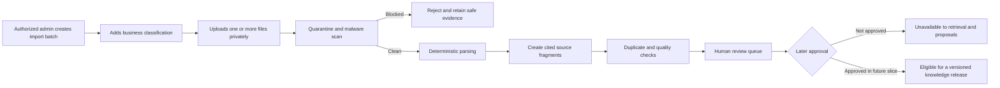
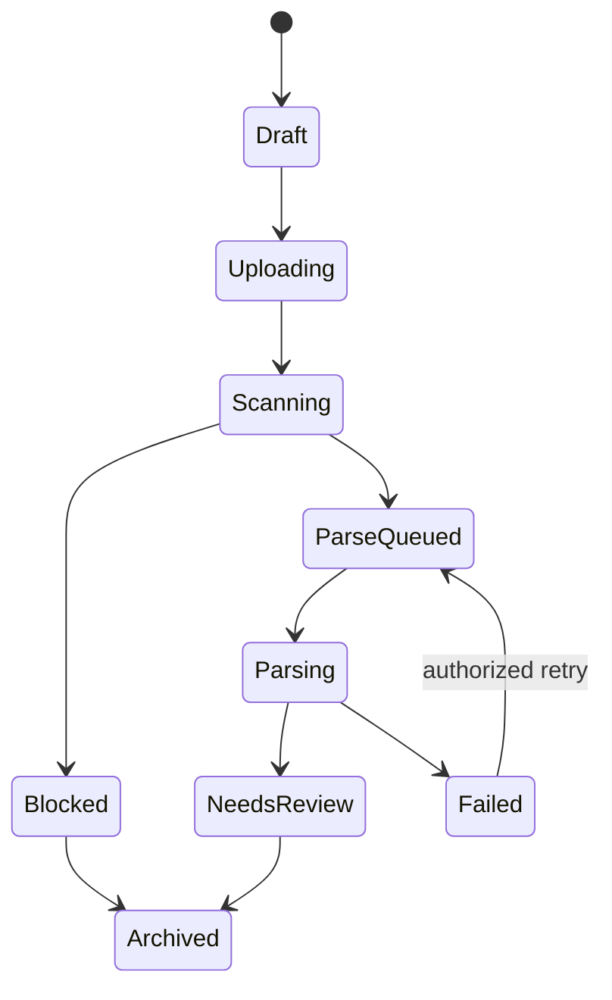
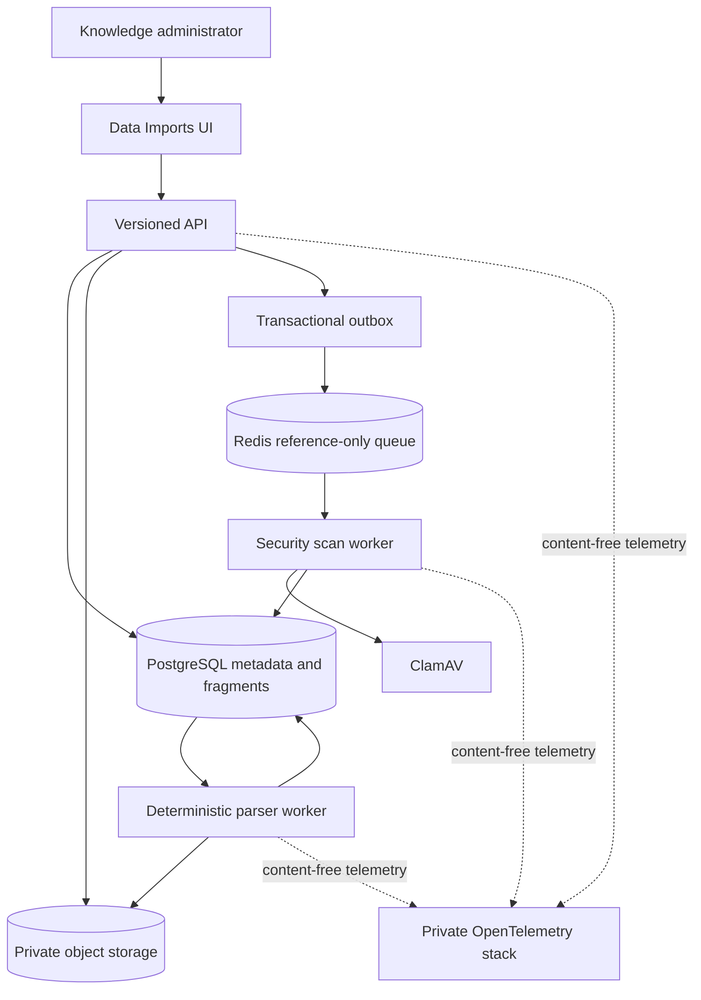
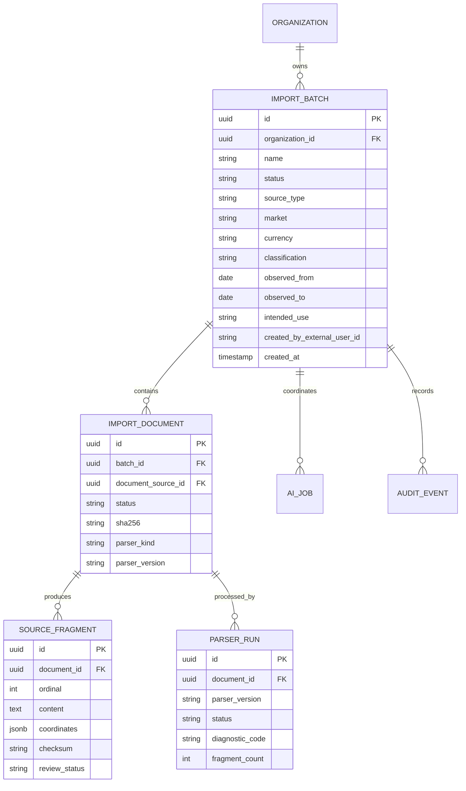

# RFPilot AI Intelligence Layer

## Milestone 2 — Slice 2A Knowledge Source Ingestion Approval Pack

**Prepared:** July 19, 2026  
**Decision requested:** Authorize test-environment implementation of the deterministic knowledge-ingestion foundation  
**Prerequisite:** Milestone 1 Slices 1A–1H accepted within their test-environment boundaries  
**Proposed boundary:** Private admin uploads, malware scanning, deterministic parsing, provenance, review status, and audit only

## 1. Executive summary

Slice 2A gives authorized DXG administrators a controlled place to upload historical knowledge sources such as contracts, price sheets, prior proposals, equipment lists, labor schedules, and operating guidance.

This increment does not “train” an AI model. Uploaded files remain private, are quarantined and scanned, and are converted into traceable source fragments using deterministic parsers. The resulting data is held for human review. It is not automatically used in proposals, retrieval, pricing guidance, or model prompts.

This is the first step toward DXG knowledge retrieval and the five-step proposal journey, but it does not enable either capability.

## 2. Plain-language workflow

The final approval/publication step is shown for context. Publishing knowledge, retrieval, AI use, and proposal use are not included in this slice.

## 3. Business outcome

After Slice 2A, DXG should be able to:

1. Create an import batch describing why the data is being supplied.
2. Upload multiple supported files into private quarantine.
3. See upload, scan, parsing, duplicate, and review-readiness status.
4. Trace every parsed fragment to its file and page, sheet, row, or text range.
5. Identify unsupported, infected, empty, duplicate, or failed sources safely.
6. Remove or archive a draft batch without losing required audit evidence.
7. Demonstrate that unreviewed data cannot be retrieved by AI or applied to proposals.

## 4. Scope

### Included

- “Data Imports” administration navigation and permission checks.
- Import-batch creation with name, description, source type, market, currency, effective/observed dates, confidentiality, intended use, and notes.
- Multiple private source files per batch.
- Existing signed-upload, quarantine, checksum, content-type validation, malware scanning, durable jobs, correlation, and observability foundations.
- Deterministic native parsing for PDF text, DOCX, CSV, XLSX, and plain text.
- Page, sheet, row, cell-range, and character-range provenance where supported.
- Immutable source fragments and parser-version evidence.
- File and fragment checksum duplicate detection.
- Safe parsing diagnostics and manual-review status.
- Tenant isolation, RLS, permission enforcement, audit events, rate limits, and feature flags.
- Admin status UI with accessible progress and recovery behavior.
- Automated and browser test-environment evidence.

### Excluded and separately gated

- OCR for scanned/image-only documents unless separately approved with its security and cost boundary.
- AI/model-based extraction, summarization, classification, embeddings, or enrichment.
- Sending any uploaded content to an external AI provider.
- Structured pricing observations, normalization, confidence scoring, conflict resolution, or pricing snapshots.
- Human approval/publication workflow, knowledge releases, deprecation, or rollback.
- Full-text or vector retrieval and `pgvector` embeddings.
- Use of imported data in proposal drafting, questions, guidance, vendor analysis, or investment estimates.
- Training, fine-tuning, or updating any foundation model.
- Production storage, production processing, production retention, or production rollout.

## 5. Data classification and intended use

Each batch requires an explicit classification:

| Classification | Example | Slice 2A handling |
|---|---|---|
| Internal | DXG operating guidance | Private test storage and deterministic parsing |
| Customer confidential | Historical customer contract | Private/quarantined; deterministic parsing only if DXG confirms test use is authorized |
| Vendor confidential | Vendor quote or rate sheet | Private/quarantined; deterministic parsing only if DXG confirms contractual permission |
| Restricted | Credentials, regulated data, highly sensitive legal material | Rejected unless a separate policy explicitly permits it |
| Synthetic | Test fixtures | Preferred for initial E2E and acceptance |

Classification does not grant AI-provider permission. A separate future policy must authorize each provider, data class, purpose, retention setting, and model-training exclusion.

## 6. Where data is stored

| Data | Authoritative store | Notes |
|---|---|---|
| Original uploaded file | Private S3-compatible storage | Quarantine prefix until clean; never public |
| Batch and document metadata | PostgreSQL | Tenant-scoped, RLS-protected |
| File checksum and scan evidence | PostgreSQL | Used for integrity and duplicate checks |
| Immutable parsed fragments | PostgreSQL | Text plus exact source coordinates; not proposal content |
| Job state and attempts | PostgreSQL | Authoritative durable state |
| Queue messages | Redis/BullMQ | References only; never file or fragment contents |
| Audit events | PostgreSQL | Append-only administrative/security evidence |
| Proposal content | MongoDB | Remains authoritative and unchanged |
| Operational telemetry | Local/private observability stack | Allowlisted metadata only; no source text |

## 7. State model

- A batch cannot become `NeedsReview` while any required file is pending, infected, unavailable, or unparsed.
- A blocked file never enters a parser.
- `NeedsReview` does not mean approved or retrievable.
- No state in Slice 2A makes content available to proposal AI.

## 8. Architecture

## 9. Roles and permissions

Recommended test defaults:

| Action | Knowledge editor | Knowledge approver | Security admin |
|---|---:|---:|---:|
| View batches and safe status | Yes | Yes | Yes |
| Create/edit draft batch | Yes | Yes | No by default |
| Upload/remove draft file | Yes | Yes | No by default |
| Retry deterministic parse | Yes | Yes | Yes for incident recovery |
| View parsed source content | Yes | Yes | No by default |
| View scan security evidence | Limited safe result | Limited safe result | Yes |
| Publish for retrieval | No | No in Slice 2A | No |

Existing generic admin status must not silently grant knowledge-content access. Explicit organization membership roles are required.

## 10. Proposed data model

### Key constraints

- Every row includes or inherits an organization boundary enforced by RLS.
- Batch names are non-empty and bounded; IDs are server generated.
- Currency uses ISO 4217 when supplied; market values use an approved bounded vocabulary or explicit `other` value.
- Date ranges must be valid and cannot be inferred silently.
- Fragment coordinates and checksum are required.
- Fragment content is immutable; reparsing creates a new parser run and fragment set/version.
- Duplicate checks never delete automatically.
- No table or status in this slice represents published/approved knowledge.

## 11. Proposed APIs

All endpoints require authenticated organization membership, runtime validation, rate limits, safe errors, and audit where applicable.

| Method | Endpoint | Purpose | Permission |
|---|---|---|---|
| `POST` | `/api/v1/knowledge/import-batches` | Create draft batch | `knowledge:edit` |
| `GET` | `/api/v1/knowledge/import-batches` | List tenant batches | `knowledge:read` |
| `GET` | `/api/v1/knowledge/import-batches/:batchId` | Batch, documents, safe progress | `knowledge:read` |
| `PATCH` | `/api/v1/knowledge/import-batches/:batchId` | Edit draft metadata | `knowledge:edit` |
| `POST` | `/api/v1/knowledge/import-batches/:batchId/upload-sessions` | Create private source upload | `knowledge:edit` |
| `POST` | `/api/v1/knowledge/import-documents/:documentId/complete` | Complete validation and queue scan | `knowledge:edit` |
| `POST` | `/api/v1/knowledge/import-documents/:documentId/parse-jobs` | Queue deterministic parse | `knowledge:edit` |
| `GET` | `/api/v1/knowledge/import-documents/:documentId/fragments` | Paginated cited fragments | `knowledge:read` |
| `DELETE` | `/api/v1/knowledge/import-documents/:documentId` | Remove eligible draft source | `knowledge:edit` |
| `POST` | `/api/v1/knowledge/import-batches/:batchId/archive` | Archive draft/review batch | `knowledge:edit` |

No approve, publish, retrieve, embed, model-run, or proposal-application endpoint is included.

## 12. Parsing design

Initial deterministic adapters:

| Format | Parser behavior | Provenance |
|---|---|---|
| PDF | Native text extraction only; image-only pages flagged | Page and text range |
| DOCX | Paragraphs, headings, and tables | Document part/table/row/cell |
| CSV | Encoding and delimiter validation; bounded rows/columns | Row and column |
| XLSX | Workbook/sheet limits; values and table regions | Sheet, row, column/cell range |
| TXT | Encoding validation and bounded segmentation | Line/character range |

Security limits include maximum bytes, pages, sheets, rows, columns, cells, text length, archive entries, decompressed size, parse duration, and fragment count. Formulas are treated as untrusted text/value input and never executed. External spreadsheet links and macros are not followed or executed.

## 13. Duplicate handling

- Exact file duplicates use SHA-256 within the organization.
- Exact fragment duplicates use normalized-content checksum with parser version.
- Similarity/semantic duplicate detection is deferred because it would require a separately approved algorithm/model boundary.
- An exact duplicate produces a warning and link to the existing source; it does not automatically merge or delete records.

## 14. Security and privacy

- OWASP controls from Milestone 1 remain active.
- Uploads remain private and quarantined until validation and malware scanning pass.
- Parser workers have read access only to clean approved object references and write access only to tenant-scoped parsing records.
- ZIP-based formats are protected against path traversal, archive bombs, excessive entries, macros, and external relationships.
- CSV/spreadsheet content is escaped when exported to prevent formula injection.
- Source content is never written to logs, traces, queue messages, URLs, or browser persistence.
- Signed upload URLs are short-lived and never stored in PostgreSQL or telemetry.
- Deletion follows retention and legal-hold state; audit evidence is preserved.
- Imported instructions are data, never trusted system instructions or tool permissions.

## 15. Reliability and operations

- PostgreSQL is authoritative for batch, document, parser-run, fragment, and job state.
- Transactional outbox connects state changes to Redis delivery.
- Jobs are idempotent by document checksum, parser release, and requested operation.
- Retries are limited to safe transient failures.
- Permanent format/security failures require corrected input rather than endless retry.
- Worker restart, Redis loss, and duplicate delivery must not duplicate fragments.
- Failed parser releases can be rolled back operationally; immutable earlier fragments remain traceable.
- Metrics use bounded labels and content-free telemetry.

## 16. Test and acceptance evidence

### Automated

- Schema, validation, lifecycle, and state-transition tests.
- Tenant and permission isolation.
- Upload, quarantine, clean, infected, scanner-outage, and deletion tests.
- Parser fixtures for every supported format.
- Empty, corrupt, encrypted, macro-enabled, oversized, archive-bomb, formula-injection, and external-link fixtures.
- Exact file and fragment duplicate tests.
- Provenance-coordinate validation.
- Idempotency, retry, worker restart, Redis loss, and dead-letter recovery.
- Log/trace/metric canary leakage tests.
- API contract, frontend regression, accessibility, and production build gates.

### Browser E2E

1. Knowledge editor creates a synthetic import batch.
2. Editor uploads multiple clean synthetic files and sees recoverable status.
3. Infected fixture is blocked and never parsed.
4. Clean files parse into fragments with visible citations.
5. Refresh during scan/parse recovers status without duplicate work.
6. Unauthorized and cross-tenant users cannot see batch existence or content.
7. Unreviewed fragments cannot be retrieved or used by proposal features.
8. Keyboard, focus, live status, error summary, 200% zoom, and responsive layout pass.

## 17. Delivery sequence

1. Migration and tenant/RLS model for batches, documents, parser runs, and fragments.
2. Knowledge permissions and backend application boundaries.
3. Batch CRUD and private multi-file upload integration.
4. Security-scan orchestration using the accepted durable-job foundation.
5. Deterministic parser ports/adapters and guarded resource limits.
6. Immutable fragment/provenance persistence and duplicate checks.
7. Feature-flagged Data Imports admin UI and accessible async status.
8. Automated security/recovery tests and browser E2E evidence.
9. DXG demonstration and Slice 2A acceptance request.

## 18. Defaults requiring confirmation

| Decision | Proposed test default |
|---|---|
| Initial data | Synthetic fixtures first; real DXG files require explicit classification and rights confirmation |
| Supported formats | PDF native text, DOCX, CSV, XLSX, TXT |
| OCR | Deferred |
| AI/model processing | Disabled |
| Retrieval/proposal use | Disabled |
| Maximum file size | Existing 50 MB private-upload limit, plus stricter parser resource limits |
| Batch files | Maximum 20 files per test batch |
| Initial roles | `knowledge:read`, `knowledge:edit`; publication role deferred |
| Storage | Existing private test MinIO/S3-compatible boundary |
| Job system | PostgreSQL authoritative, Redis reference-only |
| Retention | Existing test defaults; production policy deferred |

## 19. Risks and mitigations

| Risk | Mitigation |
|---|---|
| Historical documents contain confidential or unlicensed data | Require classification, intended use, and rights confirmation before upload |
| Users believe upload means AI training | UI and policy state explicitly that no model training or provider use occurs |
| Malicious documents attack parsers | Quarantine, scan-first, sandbox/resource limits, non-execution, adversarial fixtures |
| Poor PDF/spreadsheet structure creates unreliable fragments | Preserve citations, expose diagnostics, require human review, defer OCR/AI inference |
| Duplicate data biases future retrieval | Exact checksum detection now; reviewed semantic deduplication later |
| Scope drifts into pricing or proposal AI | No extraction, publication, retrieval, or proposal-use APIs in this slice |

## 20. Client questions

Before real DXG files are uploaded, DXG should identify:

1. Which source categories may be used: contracts, quotes, prior proposals, equipment lists, labor sheets, guidance, or others?
2. Which files contain customer/vendor confidentiality restrictions?
3. Does DXG have the contractual right to process each source for internal knowledge purposes?
4. Who receives `knowledge:read` and `knowledge:edit` in the test environment?
5. What test retention period is required for originals and parsed fragments?
6. Are password-protected or scanned/image-only files common enough to justify a later OCR/decryption workflow?

These questions do not block implementation with synthetic fixtures and the defaults above. They block ingestion of affected real files.

## 21. Suggested authorization statement

> DXG approves Milestone 2 Slice 2A deterministic knowledge-source ingestion and authorizes test-environment implementation using the defaults in this approval pack. Initial execution must use synthetic fixtures; real DXG files require explicit classification and processing-rights confirmation. Files must remain private and quarantined until validation and malware scanning pass. PostgreSQL remains authoritative for batch, provenance, fragment, audit, and job state; Redis carries reference-only messages; MongoDB remains authoritative for proposal content. OCR, AI/model processing, embeddings, structured pricing extraction, approval/publication, retrieval, use in proposals, model training/fine-tuning, external providers, production provisioning, and broader retained gates remain separately authorized.
