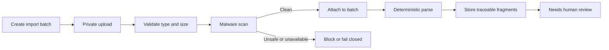

# RFPilot AI — Milestone 2, Slice 2A Status

**Increment:** Organization Knowledge Ingestion Foundation  
**Environment:** Isolated test environment only  
**Status:** Implemented; automated and authenticated-admin verification complete; awaiting DXG acceptance  
**Date:** 19 July 2026

## Executive outcome

Slice 2A now provides a tenant-isolated path for authorized DXG users to create a knowledge import batch, upload private source files, validate and malware-scan them, deterministically parse supported content, and store traceable source fragments for human review.

This increment builds the governed knowledge foundation needed by the future proposal workflow. It does **not** make the uploaded content available to an AI model, train a model, perform semantic retrieval, draft proposal content, or automatically change a proposal.

## Delivered scope

- Feature-flagged **Knowledge Sources** interface in the DXG admin application for creating and viewing import batches.
- Required metadata: source type, classification, intended use, and optional market/date/currency context.
- Private, tenant-scoped upload using short-lived signed storage access.
- Quarantine until file validation and malware scanning succeed.
- Durable `knowledge_parse` job support with PostgreSQL as authoritative job state.
- Deterministic parsers for approved test formats and immutable, source-coordinate-aware fragments.
- Batch/document lifecycle states, duplicate checksum observation, audit events, and tenant row-level security.
- Parser/storage failure recovery: a failed parse now moves the document and batch to `failed` instead of leaving them indefinitely in `parsing`.
- Synthetic end-to-end verifier exposed as `npm run verify:knowledge-ingestion`.

## Verified lifecycle

The isolated synthetic verification produced:

| Evidence | Result |
|---|---:|
| Source security state | `ready` |
| Final batch state | `needs_review` |
| Parser fragments persisted | 3 |
| Parser run persisted | Yes |
| Exact duplicates observed | 0 |

The evidence record is retained in the test database under batch ID `019f79d2-0ff7-7061-8f90-25457d49e7c4`.

## Quality evidence

- Backend contracts, lint, type-check, migrations, tests, and production build: **passed**.
- Backend automated tests: **179 passed, 0 failed**.
- Frontend contracts, lint, type-check, tests, and production build: **passed**.
- Frontend automated tests: **199 passed, 0 failed**.
- Admin production build includes the feature-flagged `/knowledge-sources` route; the proposal dashboard no longer exposes organization-level imports.
- Existing frontend lint warnings remain non-blocking and are not introduced as Slice 2A acceptance claims.

## Security and data handling controls

- PostgreSQL tenant row-level security applies to batches, documents, parser runs, and fragments.
- Private storage remains authoritative for source binaries; PostgreSQL stores governed metadata and extracted fragments.
- Source files remain quarantined until integrity validation and malware scanning pass.
- Restricted classification is rejected in this increment.
- Fragment update/delete is prevented by a database trigger.
- Queue messages contain references only; source contents are not placed in Redis messages.
- No document contents, storage URLs, credentials, or proposal text are included in telemetry evidence.

## Explicit exclusions and gates

Acceptance of Slice 2A does not authorize or claim delivery of:

- live AI-provider calls or provider credentials/spend;
- confidential-data AI processing;
- embedding generation, vector storage, or semantic retrieval;
- knowledge approval/publishing workflows beyond `needs_review`;
- AI proposal drafting, requirement extraction, clarification questions, guidance, or auto-application;
- production provisioning or migration;
- external telemetry or alerts.

## Remaining review item

DXG confirmed authenticated admin upload, security scanning, and deterministic parsing of `RFPilot Schedule Example Sheet For Testing (2) (1).xlsx`. The workbook produced reviewable source fragments and completed the remaining user-session verification. No Slice 2A functional verification item remains open.

## Acceptance requested

> DXG accepts the Slice 2A organization-knowledge-ingestion implementation and its isolated test-environment evidence and authorizes preparation of the next governed increment. This acceptance does not authorize live-provider processing, confidential-data AI processing, semantic retrieval, AI drafting, proposal auto-application, or production provisioning.
