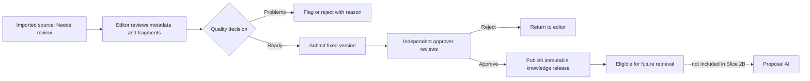
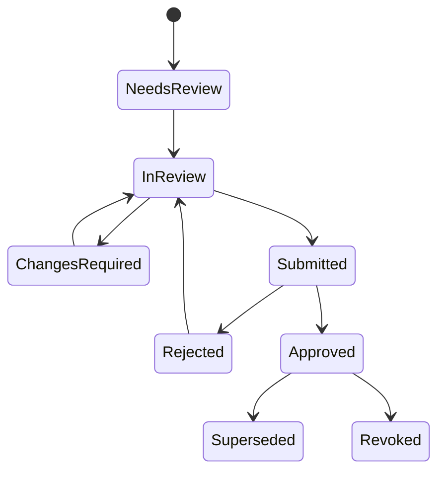
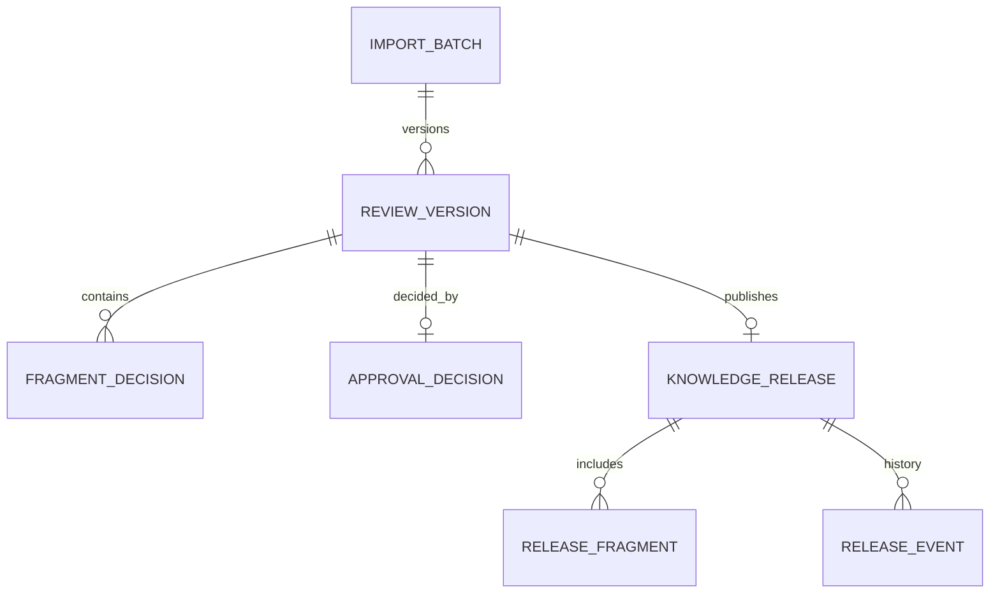

# RFPilot AI Intelligence Layer

## Milestone 2 — Slice 2B Knowledge Review and Approval Pack

**Prepared:** July 19, 2026  
**Decision requested:** Accept Slice 2A and authorize test-environment implementation of governed knowledge review and publication  
**Prerequisite evidence:** Private XLSX upload, malware scan, deterministic parse, and `needs_review` transition confirmed through the admin application  
**Boundary:** Human review, four-eyes approval, versioning, publication eligibility, audit, and rollback only

## 1. Executive summary

Slice 2A safely imports private DXG source documents but intentionally stops at **Needs review**. Slice 2B adds the human governance required before any source can be considered trustworthy organizational knowledge.

An editor will review extracted fragments, correct classification metadata, flag or reject unsuitable material, and submit a fixed version for approval. A different authorized approver will accept or reject that version. Approval creates an immutable knowledge release that is **eligible for a future retrieval increment**, but Slice 2B does not create embeddings, call an AI model, retrieve content for a proposal, or draft proposal text.

## 2. Plain-language workflow

## 3. Goals and success criteria

- Every extracted fragment is reviewable with its workbook sheet/row, page, or text coordinates.
- Editors can accept, reject, or flag fragments and must give a reason for rejection/flagging.
- Submission freezes a version so approval cannot race with later edits.
- The submitting editor cannot approve the same version.
- Only `knowledge_approver`, `organization_admin`, or `dxg_admin` can approve.
- Approval creates an immutable, tenant-scoped release manifest containing only accepted fragments.
- Rejection returns actionable comments without exposing source content in notifications or logs.
- Superseded or revoked releases immediately become ineligible for future retrieval.
- Every decision records actor, time, reason, source version, and correlation ID.
- No unapproved fragment is returned by any release-eligibility query.

## 4. Included scope

- Admin batch detail page that remains usable after refresh.
- Paginated document and fragment review with provenance.
- Fragment states: `unreviewed`, `flagged`, `accepted`, `rejected`.
- Bulk accept/reject with explicit confirmation and bounded selection size.
- Required review comments for flags and rejections.
- Submit-for-approval validation and immutable review version.
- Independent approval/rejection with separation of duties.
- Versioned release manifest, approval evidence, supersession, revocation, and rollback to a prior approved release.
- Effective/expiry dates for time-sensitive sources.
- Tenant RLS, audit events, rate limits, optimistic concurrency, idempotency, and content-free telemetry.
- Feature flags and test-environment automated/E2E evidence.

## 5. Explicit exclusions

- Embeddings, vector databases, semantic/full-text retrieval, reranking, or retrieval evaluation.
- Live AI-provider calls or sending document content outside the private environment.
- AI classification, summarization, extraction, rewriting, or proposal drafting.
- Pricing normalization and commercial recommendation logic.
- Automatic approval, automatic publication, or editor self-approval.
- Training or fine-tuning a model with DXG data.
- Production provisioning, production data migration, and external notifications.

## 6. Roles and authorization

| Action | Knowledge editor | Knowledge approver | Organization/DXG admin |
|---|---:|---:|---:|
| View tenant knowledge | Yes | Yes | Yes |
| Review/label fragments | Yes | Yes | Yes |
| Submit version | Yes | Yes | Yes |
| Approve own submission | No | No | No |
| Approve another user's submission | No | Yes | Yes |
| Reject with reason | No | Yes | Yes |
| Revoke approved release | No | No | Yes |
| View another tenant | No | No | No |

Platform administration alone does not bypass organization membership or tenant isolation.

## 7. Proposed state model

- `Submitted` versions are immutable.
- Any edit after rejection creates or updates a new draft version.
- `Approved` means eligible for future retrieval; it does not mean retrieval exists.
- Revocation is immediate and requires a reason.

## 8. Data model changes

Proposed PostgreSQL records:

- `knowledge_review_versions`: immutable submitted snapshot, status, version number, submitter, timestamps, effective/expiry dates, optimistic version.
- `knowledge_fragment_decisions`: review version, fragment, decision, bounded reason, reviewer, timestamp.
- `knowledge_approval_decisions`: approve/reject action, independent actor, reason, correlation ID.
- `knowledge_releases`: immutable approved release identifier, source version, state, effective/expiry dates, approver.
- `knowledge_release_fragments`: accepted fragment references and checksums only.
- `knowledge_release_events`: publish, supersede, revoke, and restore audit history.

Original source files and parsed fragments remain unchanged and authoritative within their existing stores.

## 9. Proposed APIs

| Method | Endpoint | Purpose | Permission |
|---|---|---|---|
| `GET` | `/api/v1/knowledge/import-batches/:id/review` | Load documents, progress, fragments, and decisions | `knowledge:read` |
| `PATCH` | `/api/v1/knowledge/fragments/:id/review` | Accept, reject, or flag one fragment | `knowledge:write` |
| `POST` | `/api/v1/knowledge/review-versions/:id/bulk-decisions` | Apply bounded bulk decisions | `knowledge:write` |
| `POST` | `/api/v1/knowledge/import-batches/:id/submit` | Validate and freeze review version | `knowledge:write` |
| `POST` | `/api/v1/knowledge/review-versions/:id/approve` | Approve independent submission | `knowledge:approve` |
| `POST` | `/api/v1/knowledge/review-versions/:id/reject` | Reject with required reason | `knowledge:approve` |
| `GET` | `/api/v1/knowledge/releases` | List tenant releases and lifecycle | `knowledge:read` |
| `POST` | `/api/v1/knowledge/releases/:id/revoke` | Revoke an approved release | `organization:manage` |

No endpoint in this slice returns proposal recommendations or performs AI retrieval.

## 10. Validation defaults

- Review reason: required for `flagged`, `rejected`, approval rejection, revocation; 3–1,000 characters.
- Bulk decision: maximum 100 fragments per request.
- Every fragment in a submitted version must be accepted or rejected; flagged/unreviewed fragments block submission.
- At least one accepted fragment is required.
- Approver ID must differ from submitter ID.
- Approval uses the submitted version/checksum and fails with `409` if stale.
- Effective date defaults to approval time; expiry remains optional but is recommended for schedules, pricing, policies, and availability.
- An active release is excluded when expired, revoked, superseded, or outside its effective window.

## 11. Security and reliability

- RLS on every new table; organization ID is derived from the authenticated membership, never request input.
- Source content is escaped in the UI and never placed in logs, telemetry, queue messages, URLs, or notifications.
- CSRF/session controls, rate limiting, runtime schemas, safe errors, correlation IDs, and idempotency apply to mutations.
- Approval and release creation occur in one PostgreSQL transaction.
- Immutable submitted snapshots prevent time-of-check/time-of-use approval errors.
- Append-only audit records support investigation and rollback.
- Pagination and bounded bulk actions prevent oversized reads/writes.
- No background queue is required for human decisions; future indexing will consume release references through an outbox.

## 12. Test and acceptance evidence

- Role matrix and cross-tenant denial tests.
- Editor self-approval denial.
- Incomplete/flagged review submission denial.
- Stale-version conflict and idempotent retry tests.
- Approval transaction and immutable release verification.
- Revocation/supersession eligibility tests.
- Refresh recovery and paginated review UI tests.
- Accessibility: keyboard operation, labels, focus, status announcements, and confirmation dialogs.
- Full backend/admin CI and authenticated test-environment E2E.
- Demonstration that unapproved, rejected, expired, and revoked fragments never enter a release manifest.

## 13. Implementation sequence

1. PostgreSQL migration, RLS, constraints, and rollback migration.
2. Review/approval domain model and repositories.
3. Version submission, approval, release, revocation, and audit services.
4. Versioned APIs and permission enforcement.
5. Admin review and approval interface.
6. Automated security, lifecycle, integration, accessibility, and E2E verification.
7. Client evidence pack and acceptance gate before retrieval work.

## 14. Decision requested

Approve the test defaults above or provide changes for roles, separation of duties, review reasons, effective/expiry policy, bulk limit, and release revocation authority.

### Proposed authorization statement

> DXG accepts the Slice 2A organization-knowledge-ingestion implementation and authenticated admin test evidence and authorizes test-environment implementation of Slice 2B Knowledge Review and Approval using the defaults in this approval pack. Only independently approved, current, tenant-scoped release fragments may become eligible for future retrieval. Embeddings, semantic retrieval, live-model processing, confidential-data AI processing, pricing normalization, proposal drafting, proposal auto-application, and production provisioning remain separately gated.
