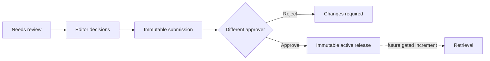

# RFPilot AI — Milestone 2, Slice 2B Status

**Increment:** Knowledge Review, Independent Approval, and Versioned Release  
**Environment:** Isolated test environment only  
**Status:** Implemented and automatically verified; authenticated admin UI confirmation pending  
**Date:** 19 July 2026

## Delivered outcome

Slice 2B adds the human governance boundary between parsed private sources and future AI retrieval eligibility. Editors can review source-coordinate-aware fragments, submit an immutable version, and a different authorized approver can approve or reject it. Approval creates an immutable tenant-scoped release manifest; it does not create embeddings or expose content to a model.

## Delivered controls

- PostgreSQL migration `007_knowledge_review_approval` with rollback, constraints, indexes, and forced tenant RLS.
- Persistent paginated review workspace in the DXG admin application.
- Fragment accept, reject, and flag decisions with required reasons where applicable.
- Complete-review validation and at-least-one-accepted-fragment validation.
- Immutable submitted review checksum and optimistic state enforcement.
- Separation of duties: submitter self-approval is denied.
- Dedicated `knowledge:approve` enforcement for approval/rejection.
- Transactional immutable release manifest containing accepted fragment references/checksums only.
- Effective/expiry support, supersession state, revocation endpoint, release events, and audit records.
- Feature flag `KNOWLEDGE_REVIEW_ENABLED`; local test override enabled only in `.env.local`.
- No release-to-retrieval, AI-provider, or proposal integration.

## Lifecycle evidence

The isolated verifier demonstrated:

| Evidence | Result |
|---|---:|
| Reviewed fragments | 3 |
| Complete submission | Passed |
| Submitter self-approval | Denied |
| Independent approval | Passed |
| Release state | `active` |
| Release manifest fragment count | 3 |
| AI retrieval enabled | No |

Evidence identifiers:

- Review version: `019f7a13-f622-71c9-9a05-d9ab3b74a30b`
- Release: `019f7a13-f67c-768f-9750-fe1343b60566`

## Quality evidence

- PostgreSQL migrations `001`–`007`: applied in the isolated test database.
- Backend contracts, lint, type-check, migration checks, tests, and build: passed.
- Backend tests: **183 passed, 0 failed**.
- Admin type-check and production build: passed.
- Admin production route `/knowledge-sources`: present.
- Deterministic E2E command: `NODE_ENV=test KNOWLEDGE_REVIEW_ENABLED=true npm run verify:knowledge-review`.

## Retained gates

- Embeddings, vector storage, semantic/full-text retrieval, reranking, and retrieval evaluation.
- Live-provider calls, credentials, spend, or sending content outside the private environment.
- Confidential-data AI processing.
- AI summarization, classification, extraction, drafting, guidance, or proposal auto-application.
- Pricing normalization or recommendations.
- Production provisioning, migration, external notifications, telemetry, or alerts.

## Manual acceptance check

1. Restart the backend so `.env.local` is loaded.
2. Open **Admin → Knowledge → Review and approval queue**.
3. Select `Event Schedule Example`.
4. Start review and verify pagination across its 314 fragments.
5. Accept/reject/flag test fragments and confirm decisions survive refresh.
6. Resolve all flags/unreviewed fragments and submit.
7. Confirm the submitter cannot approve.
8. Sign in as a different authorized approver and approve or reject.
9. Confirm approval shows a release while the UI states that retrieval is not connected.

## Acceptance requested

> DXG accepts the Slice 2B knowledge-review, independent-approval, and versioned-release implementation and its test-environment evidence. This acceptance does not authorize embeddings, retrieval, live-model processing, confidential-data AI processing, pricing normalization, proposal drafting, proposal auto-application, or production provisioning.
