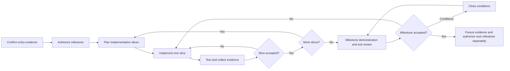

# RFPilot AI Intelligence Layer

## Approval-Gated Milestone Execution Playbook

**Status:** Program operating procedure  
**Applies to:** Milestones 1–6 across frontend, backend, data, AI, infrastructure, and operations  
**Current program state:** Milestone 1 authorized and in progress  
**Last updated:** July 15, 2026

---

# 1. Purpose

This playbook defines how Bayshore and DXG move from an approved design to production safely. It ensures that each milestone starts with explicit authority, delivers reviewable increments, produces objective evidence, updates the architecture, and requires acceptance before the next milestone begins.

The [Implementation Backlog](./RFPilot_AI_Implementation_Backlog.md) defines what is built. This playbook defines how that work is controlled and accepted.

# 2. Governing principles

1. No implementation begins without the milestone entry gate and written authorization.
2. Approval is limited to the recorded milestone, slices, environments, data classes, and providers.
3. Security, tenant isolation, provenance, human authority, and deterministic pricing are invariants—not optional refinements.
4. Each slice must be demonstrable, testable, observable, reversible, and documented.
5. AI output quality is evaluated with approved assets and rubrics, not subjective demos alone.
6. Architecture documents are updated in the same change that changes architecture or contracts.
7. A milestone is complete only after evidence review and written acceptance.
8. Approval of one milestone does not imply approval of the next.

# 3. Program lifecycle

# 4. Roles and decision rights

| Role | Responsibility | Cannot delegate without record |
|---|---|---|
| DXG executive sponsor | Scope, budget, material risk, milestone go/no-go | Final business authorization |
| DXG product owner | Workflow, acceptance criteria, user-visible behavior | Product acceptance |
| DXG production/pricing expert | Rules, estimates, findings, quality gold standard | Domain acceptance |
| DXG security/privacy approver | Data class, provider, access, retention, security exceptions | Confidential-data authorization |
| Bayshore technical lead | Architecture integrity, technical readiness, delivery evidence | Technical recommendation |
| Bayshore delivery owner | Schedule, dependencies, condition tracking, meeting records | Official status record |
| Engineering leads | Slice design, implementation, tests, review, documentation | Code-quality evidence |
| AI lead | Evaluation design, provider configuration, run evidence, quality recommendation | AI release recommendation |
| Operations owner | Environments, deployment, monitoring, recovery, incident readiness | Operational readiness evidence |

# 5. Milestone entry procedure

Before work begins, the delivery owner must create a milestone control record from the [Milestone Status and Acceptance Template](./RFPilot_AI_Milestone_Status_and_Acceptance_Template.md).

## Mandatory entry evidence

- Approved scope, exclusions, and acceptance criteria.
- Approved architecture and recorded alternatives.
- Named product, technical, security, domain, and delivery owners.
- Approved data classes, environments, regions, providers, and retention behavior.
- Required client assets available or assigned with dates.
- Dependencies complete or explicitly accepted as conditions.
- Estimate, schedule, staffing, budget, and risks approved.
- Test/evaluation plan and evidence locations agreed.
- Rollback or disablement mechanism defined.
- No unresolved critical blocker.

The authorizing parties record one of: Approved, Approved with Conditions, Revision Required, or Not Approved.

# 6. Slice planning procedure

Each milestone is split into the smallest independently reviewable vertical slices that produce useful evidence without violating architecture boundaries.

Every slice record includes:

- Objective and user/system outcome.
- In-scope and out-of-scope behavior.
- Repositories, services, modules, schemas, endpoints, events, jobs, and screens affected.
- Dependencies and migration order.
- Security and tenant-isolation impact.
- Data classification and retention impact.
- AI/provider impact and evaluation cases, when applicable.
- Acceptance criteria and tests.
- Observability and audit requirements.
- Deployment, feature flag, compatibility, and rollback plan.
- Required document updates.
- Reviewer and approver.

# 7. Implementation procedure

For each authorized slice:

1. Confirm the approved control record and dependencies.
2. Create/update API, schema, event, and UI contracts before behavior implementation where contracts change.
3. Implement using clean module boundaries and tenant-aware authorization.
4. Add validation, failure handling, idempotency, audit, logs, metrics, and traces with the behavior.
5. Add unit, integration, contract, E2E, security, and AI-evaluation coverage appropriate to the risk.
6. Update architecture, API, database, deployment, runbook, and user documentation in the same delivery unit.
7. Review code and evidence independently.
8. Deploy only to the authorized environment behind the approved flag or access boundary.
9. Demonstrate acceptance paths, failure paths, recovery, and rollback.
10. Record result and obtain slice acceptance before closing it.

# 8. Evidence requirements

Evidence must be reproducible and point to immutable or versioned artifacts.

| Evidence class | Examples |
|---|---|
| Requirements | Decision IDs, acceptance criteria, approved UX behavior |
| Code | Commit/PR reference, reviewer, affected components |
| Contracts | OpenAPI, JSON Schema, events, migrations, compatibility record |
| Quality | Test commands, reports, coverage by requirement, accessibility results |
| Security | Threat update, authorization matrix, scan results, adversarial cases |
| AI | Dataset/prompt/schema/model versions, run IDs, rubric scores, critical defects |
| Operations | Deployment record, dashboards, alerts, SLOs, backup/recovery evidence |
| UX | Screens/flows, usability results, error and empty states |
| Documentation | Updated source-of-truth documents and runbooks |

“Tests passed” is insufficient unless the evidence identifies which acceptance requirements those tests cover.

# 9. Documentation synchronization matrix

| Change type | Required synchronized artifacts |
|---|---|
| Scope/workflow | Client requirements, plain-language flow, backlog, acceptance record |
| Architecture/component boundary | Technical design, ADR, deployment view, backlog |
| API contract | OpenAPI, validation schema, client integration notes, tests |
| Database/entity | ERD, migration plan, retention/backup plan, data dictionary |
| Event/job | Event catalog, queue policy, retry/idempotency/dead-letter runbook |
| Security/privacy | Threat model, data-flow inventory, authorization matrix, decision register |
| AI behavior | Prompt/schema registry, benchmark cases, quality thresholds, model card/run record |
| User-visible behavior | UX specification, accessibility criteria, support documentation |
| Operations | Environment/deployment guide, alerts, runbooks, DR record |

The technical lead verifies synchronization before slice acceptance. Material architecture changes require an ADR and approval before implementation continues.

# 10. Change-control procedure

A change is material when it affects scope, business authority, architecture, data use, provider use, security posture, cost, schedule, acceptance criteria, or production behavior.

## Required change record

1. Requested change and business reason.
2. Current approved behavior.
3. Proposed behavior and alternatives.
4. Impact on users, architecture, data, security, cost, schedule, tests, and operations.
5. Migration and rollback implications.
6. Documents and decisions that must change.
7. Technical and product recommendation.
8. Required approvers and recorded decision.

Work on the affected scope pauses until the change is approved. Unaffected authorized work may continue when isolation is documented.

# 11. Defect and risk rules

## Immediate stop conditions

- Cross-tenant or unauthorized data exposure.
- Invented authoritative price or fabricated material finding.
- Confidential data sent to an unapproved provider or region.
- Authentication/authorization bypass.
- Data loss or an untested destructive migration path.
- AI or document content changing permissions or executing unauthorized actions.
- Production release without required approval or rollback controls.

On a stop condition: disable the affected flag/path, preserve evidence, notify named owners, assess scope, remediate, rerun the affected/full regression suites, and obtain renewed approval.

# 12. Milestone exit review

The exit review must include:

- Demonstration of every required outcome.
- Requirement-to-evidence matrix.
- Test, security, accessibility, AI-quality, and operational reports.
- Open defects, risks, accepted limitations, and technical debt.
- Migration, rollback, backup, and recovery evidence.
- Cost and performance results against approved targets.
- Documentation synchronization confirmation.
- Product, domain, technical, security, and operations recommendations.

The milestone decision is Accepted, Accepted with Closure Conditions, Rejected/Remediate, or Rolled Back.

# 13. Milestone-specific approval sequence

| Milestone | Starts only after | Primary acceptance decision |
|---|---|---|
| 1 — Platform/security foundation | Phase 0 authorization signed | Secure, observable, recoverable foundation accepted |
| 2 — Knowledge/pricing foundation | Milestone 1 accepted; DXG sources/governance approved | Approved knowledge/pricing records are traceable and publishable |
| 3 — AI Proposal Creation | Milestone 2 accepted; extraction/drafting benchmark gate passed | Planner creates an accurate proposal with less effort and full control |
| 4 — Investment Guidance | Milestone 3 accepted; pricing methodology/gold case approved | Guidance is reproducible, evidence-backed, and never invents price |
| 5 — Vendor Analysis | Milestone 4 accepted; vendor gold set and founder rubric approved | Material findings are supported, useful, and producer-controlled |
| 6 — Hardening/rollout/handoff | Milestones 1–5 accepted; pilot authority granted | Security, quality, reliability, operations, and adoption gates pass |

# 14. Production release control

Production release requires a separate release record even after milestone acceptance. It must state tenant/organization scope, enabled features, provider/model versions, data classes, rollout percentage, support owner, monitoring window, rollback trigger, and approving parties.

Pilot and production flags default off. A provider/model, prompt, rule release, pricing release, schema, or retrieval-corpus change that can materially alter output must pass the relevant regression/evaluation gate before activation.

# 15. Current next action

Obtain explicit client acceptance of the completed [Slice 1A evidence](./RFPilot_AI_Milestone_1_Slice_1A_Status.md) and [Slice 1B tenant increment](./RFPilot_AI_Milestone_1_Slice_1B_Tenant_Status.md), then obtain separate authorization for the next Slice 1B security increment: short-lived/refresh sessions, granular organization RBAC, and scoped public proposal/vendor tokens. Milestone 2 remains unauthorized until the complete Milestone 1 exit review is accepted.
