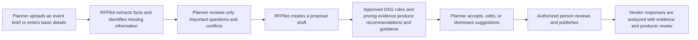

# RFPilot AI Intelligence Layer

## Phase 0 Client Approval Workshop Pack

**Status:** Prepared for client review  
**Meeting objective:** Reach the decisions required to authorize Milestone 1 safely  
**Recommended duration:** 90 minutes  
**Last updated:** July 15, 2026

---

# 1. What DXG is being asked to approve

This meeting does not approve the complete production launch. It approves the scope, operating boundaries, technical foundation, and controlled start of Milestone 1.

DXG is asked to confirm that RFPilot will:

1. Use AI to prepare drafts, extract facts, explain recommendations, and analyze vendor responses.
2. Keep people responsible for final proposal content, publication, pricing policy, and vendor decisions.
3. Build estimates from approved historical evidence and deterministic calculations—not invented AI prices.
4. Retain source evidence and citations so important outputs can be reviewed.
5. Protect DXG, customer, and vendor information through tenant isolation, private storage, access control, and audit records.
6. Begin with the platform and security foundation before releasing AI-assisted workflows.

# 2. Plain-language target experience

# 3. Required attendees and authority

| Role | Purpose | Name |
|---|---|---|
| DXG executive sponsor | Scope, budget, and go/no-go authority | |
| DXG product owner | Workflow and acceptance decisions | |
| DXG founder/production expert | Production rules, pricing, and quality | |
| DXG security/privacy approver | Data, provider, retention, and access decisions | |
| DXG knowledge/pricing owner | Content publication and governance | |
| Bayshore technical lead | Architecture and delivery commitment | |
| Bayshore AI lead | Provider benchmark and AI quality | |
| Bayshore delivery owner | Schedule, dependencies, and change control | |

If an authorized decision-maker is absent, record the item as pending rather than assuming approval.

# 4. Pre-meeting materials

Send these documents at least two business days before the workshop:

- [Client requirements confirmation](./RFPilot_AI_Client_Requirements_Confirmation.md)
- [Plain-language client confirmation](./RFPilot_AI_Client_Confirmation_Plain_Language.md)
- [Technical architecture design](./RFPilot_AI_Intelligence_Layer_Technical_Design.md)
- [Implementation backlog](./RFPilot_AI_Implementation_Backlog.md)
- [Milestone 0 decision register](./RFPilot_AI_Milestone_0_Decision_Register.md)
- [Milestone 1 readiness assessment](./RFPilot_AI_Milestone_1_Readiness_Assessment.md)
- [AI provider benchmark protocol](./RFPilot_AI_Provider_Benchmark_and_Acceptance_Protocol.md)

DXG should also provide, or identify an owner and delivery date for:

- One completed RFP and its vendor responses.
- The corresponding final event cost.
- The founder's expected findings and vendor questions.
- Representative historical contracts, quotes, and pricing spreadsheets.
- At least ten example production rules, including exceptions.
- Expected users, proposals, files, and vendor responses per month.
- Applicable customer, vendor, legal, privacy, and residency restrictions.
- Current production infrastructure and read-only discovery access.

# 5. Workshop agenda

| Time | Topic | Required outcome |
|---:|---|---|
| 0–10 min | Goals and success measures | Confirm business outcome and baseline measurements |
| 10–25 min | Scope and user workflow | Approve four workstreams, exclusions, and human authority |
| 25–40 min | DXG data and knowledge | Approve allowed sources, visibility, ownership, and governance |
| 40–55 min | Product decisions | Confirm estimates, recommendations, escalations, and publishing behavior |
| 55–70 min | Architecture and security | Approve platform direction, hosting assumptions, access, retention, and recovery |
| 70–80 min | AI provider and quality | Approve benchmark method, data eligibility, reviewers, budget, and release defects |
| 80–90 min | Authorization and actions | Confirm conditions, owners, dates, and Milestone 1 decision |

# 6. Decisions required in the meeting

## A. Scope and authority

- [ ] Approve the four workstreams: Knowledge Foundation, Proposal Creation, Investment Guidance, and Vendor Proposal Analysis.
- [ ] Confirm the objective: reduce planner effort and shift producer work toward exception review.
- [ ] Confirm exclusions: no vendor AI authoring, automatic vendor award, unrelated CRM replacement, or unapproved marketing-site work.
- [ ] Confirm that AI assists but does not control authoritative pricing, publication, or vendor selection.
- [ ] Approve written change control for material scope changes.

## B. Data and governance

- [ ] Identify which historical contracts, quotes, spreadsheets, and RFPs may be used.
- [ ] Approve data classifications and planner/DXG visibility boundaries.
- [ ] Name knowledge and pricing editors and approvers.
- [ ] Confirm retention, deletion, residency, and audit requirements.
- [ ] Confirm that reviewed feedback improves RFPilot rules and evaluations; it does not automatically train a public/general model.

## C. Product behavior

- [ ] Confirm required fields for an initial useful estimate.
- [ ] Approve “unsupported/venue-dependent—ask this question” instead of guessed prices.
- [ ] Approve accept, modify, dismiss, defer, and undo recommendation actions.
- [ ] Decide which risks block publishing, require acknowledgement, or permit an authorized override.
- [ ] Confirm vendor analysis provides findings and questions, not an automatic award decision.

## D. Architecture and operations

- [ ] Approve a modular backend with independent background workers.
- [ ] Approve staged MongoDB retention plus managed PostgreSQL for the AI domain.
- [ ] Approve Redis/BullMQ for jobs and caching.
- [ ] Approve private object storage and persistent container hosting.
- [ ] Approve `/api/v1` evolution with compatibility adapters.
- [ ] Approve proposed RPO of 15 minutes and RTO of 4 hours, or record alternatives.

## E. AI quality and provider use

- [ ] Approve benchmarking Anthropic and OpenAI on identical authorized assets.
- [ ] Approve no-training, retention, region, and confidentiality prerequisites.
- [ ] Assign blind DXG reviewers and a benchmark budget.
- [ ] Approve critical release defects, including invented prices, fabricated findings, and cross-tenant disclosure.
- [ ] Approve that provider choice may differ by operation only when measured value justifies the complexity.

# 7. Decisions that may remain conditional

Milestone 1 can be approved with explicit conditions when the condition has an owner, deadline, scope limit, and consequence. Examples include final production hosting selection, completion of provider benchmarks, or delivery of later gold datasets.

The following cannot be silently deferred:

- Authority to use confidential data.
- Development/staging region and retention constraints.
- Identity of the approving parties.
- Security ownership and incident contacts.
- Milestone 1 budget and staffing.
- A safe development provider policy, even if only synthetic data is initially allowed.

# 8. Meeting decision record

| Area | Decision | Conditions | Owner | Due date |
|---|---|---|---|---|
| Scope and success | | | | |
| Human/AI authority | | | | |
| Historical data use | | | | |
| Knowledge/pricing governance | | | | |
| Product behavior | | | | |
| Architecture | | | | |
| Security/privacy | | | | |
| AI benchmark/provider | | | | |
| Budget/staffing/schedule | | | | |

# 9. Workshop exit options

## Approved

All mandatory gates are met. Sign the Milestone 1 authorization.

## Approved with conditions

Every condition has a named owner, due date, affected scope, and stop/go consequence. Sign the authorization with the conditions attached.

## Revision required

Do not begin implementation. Assign owners and dates for missing decisions, update the affected documents, and schedule a focused approval follow-up.

# 10. Immediate actions after approval

1. Bayshore synchronizes approved decisions into the technical design, decision register, and backlog.
2. DXG and Bayshore sign the Milestone 1 authorization record.
3. Delivery owners confirm repository access, branch strategy, environments, secrets, and acceptance evidence.
4. Engineering begins Milestone 1 only, in the approved implementation slices.
5. Each slice is demonstrated, tested, documented, and accepted before the next gated milestone.
