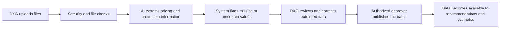
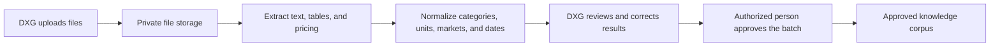
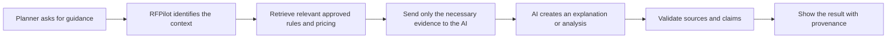
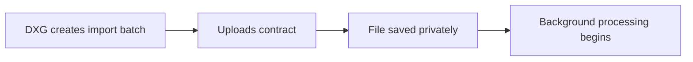
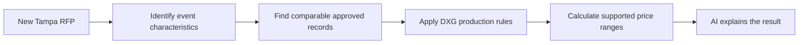
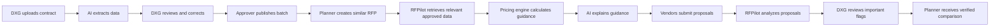
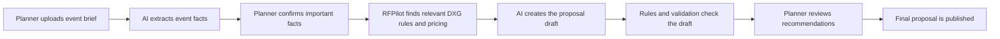
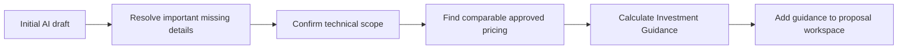

# Review proposal creation flow

> Review the **dxg-rfp-tool-dashboard** project located at:
>
> `/Users/swoptechnologies/Desktop/rfp/dxg-rfp-tool-dashboard/`
>
> We are redesigning the **Proposal Creation** flow to make it faster, more intuitive, and AI-assisted.
>
> I have attached a document provided by the client. Carefully review both the existing application and the client's document, then:
>
> 1. Analyze the current proposal creation workflow and identify pain points or areas that can be simplified.
> 2. Review the client's document to determine whether they have any explicit or implicit requirements, expectations, or ideas related to AI-powered features.
> 3. Summarize all AI-related requirements mentioned by the client, including any opportunities where AI could improve the user experience even if they are not explicitly requested.
> 4. Propose a new AI-assisted proposal creation flow that minimizes manual work while maintaining flexibility for advanced users.
> 5. Recommend specific AI capabilities (e.g., proposal drafting, content generation, requirement extraction, document summarization, auto-completion, validation, rewriting, tone adjustment, and smart suggestions) that would provide the most value.
> 6. Outline the required frontend, backend, and AI architecture changes needed to implement the new workflow.
>
> The final output should include:
>
> - A summary of the current workflow.
> - Client AI requirements (explicit and inferred).
> - UX improvement recommendations.
> - A proposed AI-assisted proposal creation flow.
> - Technical implementation recommendations.
> - Any risks, assumptions, or open questions that should be clarified with the client.
>
> User context
>
> Attachments:
> - RFPilot-AI-Scope-of-Work.pdf: `~/Downloads/RFPilot-AI-Scope-of-Work.pdf`

<details><summary>2 previous messages</summary>

> I’m using the Product Design audit workflow because this is a flow-level UX review, and I’ll inspect the client PDF plus the running/local implementation before forming recommendations. I’ll keep the work read-only and evidence-based.
>
> <details><summary>Explored 16 files, 5 searches, 2 lists, ran 4 commands, called a tool</summary>
>
> <details><summary>Explored 6 files</summary>
>
> - Read `~/.codex/plugins/cache/openai-curated-remote/product-design/0.1.50/skills/audit/SKILL.md`
> - Read `~/.codex/plugins/cache/openai-curated-remote/product-design/0.1.50/references/critical-overrides.md`
> - Read `~/.codex/plugins/cache/openai-curated-remote/product-design/0.1.50/skills/index/SKILL.md`
> - Read `~/.codex/plugins/cache/openai-curated-remote/product-design/0.1.50/skills/user-context/SKILL.md`
> - Read `~/.codex/plugins/cache/openai-bundled/browser/26.602.40724/skills/control-in-app-browser/SKILL.md`
> - Read `~/.codex/plugins/cache/openai-curated-remote/product-design/0.1.50/skills/audit/references/design-audit-framework.md`
>
> </details>
>
> - Ran `python3 scripts/user_context_preflight.py`
>
> <details><summary>Explored a search, a list</summary>
>
> - Listed files in `0.1.50`
> - Searched for `user_context_preflight|communication-protocol|package.json$|README|AGENTS.md`
>
> </details>
>
> - Ran `python3 scripts/user_context_preflight.py`
>
> - Ran `pwd; rg --files -g 'AGENTS.md' -g '!node_modules' -g 'package.json' -g 'README*' -g 'vite.config.*' -g 'next.config.*' -g 'src/**' -g 'app/**' -g 'pages/**' | sed -n '1,260p'`
>
> <details><summary>Explored 2 files, a search, a list</summary>
>
> - Listed files
> - Searched for `(^components/|^lib/|^types/|^utils/)`
> - Read `./package.json`
> - Read `./README.md`
>
> </details>
>
> - Ran `pdftotext -layout '/Users/swoptechnologies/Downloads/RFPilot-AI-Scope-of-Work.pdf' /tmp/rfpilot-sow.txt && wc -l /tmp/rfpilot-sow.txt && sed -n '1,360p' /tmp/rfpilot-sow.txt`
>
> <details><summary>Explored 13 files, 2 searches</summary>
>
> - Read `./components/proposals/ProposalsProcess.tsx/TemplateSelection.tsx`
> - Read `./components/proposals/ProposalsCreateProcess.tsx`
> - Read `./components/proposals/ProposalsProcess.tsx/ProcessList.tsx`
> - Read `./components/proposals/AddNewProposal.tsx`
> - Read `./components/proposals/ProposalsProcess.tsx/BudgetProposalPreferences.tsx`
> - Read `./components/proposals/ProposalsProcess.tsx/ContactInfo.tsx`
> - Read `./components/proposals/ProposalsProcess.tsx/EventForm.tsx`
> - Read `./components/proposals/ProposalsProcess.tsx/UploadsReferenceMaterials.tsx`
> - Read `./components/proposals/ProposalsProcess.tsx/RoomAndProductionStep.tsx`
> - Read `./app/actions/proposals.ts`
> - Read `./types/proposal.ts`
> - Searched for `activeStep|validate|extractProposalFromFile|AddProposalUpload|handleNext|setActiveStep|templateId|autosave|localStorage|recommend|AI|ai` in `AddNewProposal.tsx`
> - Read `./components/proposals/AddNewProposal.tsx`
> - Read `./components/proposals/AddProposalUpload.tsx`
> - Searched for `export async function extract|extractProposal` in `proposals.ts`
>
> </details>
>
> MCP tool call
>
> node_repl.js
>
> ```json
> {
>   "title": "Connect to the app preview",
>   "code": "var { setupBrowserRuntime } = await import(\"/Users/swoptechnologies/.codex/plugins/cache/openai-bundled/browser/26.602.40724/scripts/browser-client.mjs\"); await setupBrowserRuntime({ globals: globalThis }); globalThis.browser = await agent.browsers.get(\"iab\"); nodeRepl.write(await browser.documentation());"
> }
> ```
>
> Error: tool call error: tool call failed for `node_repl/js`
>
> Caused by:
>     Mcp error: -32602: js: codex/sandbox-state-meta: missing field `sandboxPolicy`
>
> <details><summary>Explored 8 files, a search</summary>
>
> - Read `./components/proposals/AddNewProposal.tsx`
> - Read `./components/proposals/AddNewProposal.tsx`
> - Read `./app/actions/proposals.ts`
> - Read `./components/proposals/AddProposalUpload.tsx`
> - Searched for `Industry|suggest|recommend|typically|Tip:|advisory|warning|AI|confidence|provenance|estimate|investment|range` in `proposals`
> - Read `./components/proposals/AddNewProposal.tsx`
> - Read `./components/proposals/ProposalsProcess.tsx/ProcessList.tsx`
> - Read `./app/actions/proposals.ts`
> - Read `~/.codex/plugins/cache/openai-curated-remote/product-design/0.1.50/references/critical-overrides.md`
>
> </details>
>
> </details>
</details>

## Executive summary

The existing builder already has a useful AI starting point: users can upload a PDF, DOC/DOCX, or CSV and AI attempts to prefill the proposal form. It also contains several hard-coded “smart” suggestions for crew, power, union markets, and budgets.

The main problem is that AI currently behaves like a one-time importer. After extraction, users still face a long, mostly linear 9–10-step intake form with limited visibility into extraction confidence, missing information, readiness, pricing implications, or why recommendations were made.

The redesign should turn Proposal Creation into an AI-assisted review process:

> Upload or describe the event → AI builds a structured draft → user reviews exceptions and decisions → AI validates scope and estimates investment → user approves and publishes.

This is substantially faster than requiring users to inspect every field while still preserving a detailed manual editor for advanced users.

## Current workflow

The implementation begins with an optional document-upload screen. If a file is supplied, it is posted to an authenticated `/api/extract-proposal` endpoint and the returned partial object is normalized into the form schema. Users then move through a sequential builder:

| Step | Current behavior                                   | General health                                                                    |
| ---- | -------------------------------------------------- | --------------------------------------------------------------------------------- |
| 0    | Upload PDF, DOC/DOCX, or CSV, or continue manually | Good foundation, but extraction results are opaque                                |
| 1    | Event Overview                                     | Healthy, conventional form                                                        |
| 2    | Venue & Schedule                                   | Useful contextual rules, but little required validation                           |
| 3    | Room Specifications and production crew            | Powerful but high-effort and dense                                                |
| 4    | Hybrid & Virtual, conditionally skipped            | Good conditional routing                                                          |
| 5    | Content & Creative                                 | Useful, but another full manual section                                           |
| 6    | Video Recording                                    | Useful conditional content, still form-heavy                                      |
| 7    | Venue & Technical                                  | Some smart power and technical warnings                                           |
| 8    | Budget & Proposal preferences                      | Has static tiers and rule-driven warnings, but not defensible investment guidance |
| 9    | Uploads & Co-Vendors                               | Detailed but likely premature for many users                                      |
| 10   | Contact & Submit                                   | Validates contact fields and creates the live proposal                            |

Relevant implementation evidence:

- The 10-section navigation is defined in [ProcessList.tsx](./dxg-rfp-tool-dashboard/components/proposals/ProposalsProcess.tsx/ProcessList.tsx:8).
- AI extraction is currently a single backend request returning partial proposal data in [proposals.ts](./dxg-rfp-tool-dashboard/app/actions/proposals.ts:615).
- Extracted content is directly merged into form state in [AddNewProposal.tsx](./dxg-rfp-tool-dashboard/components/proposals/AddNewProposal.tsx:1713).
- Step gating and validation are implemented in [AddNewProposal.tsx](./dxg-rfp-tool-dashboard/components/proposals/AddNewProposal.tsx:1679).
- Existing rule-like suggestions can be found in [RoomAndProductionStep.tsx](./dxg-rfp-tool-dashboard/components/proposals/ProposalsProcess.tsx/RoomAndProductionStep.tsx:160), [VenueTechnicalRequirements.tsx](./dxg-rfp-tool-dashboard/components/proposals/ProposalsProcess.tsx/VenueTechnicalRequirements.tsx:189), and [BudgetProposalPreferences.tsx](./dxg-rfp-tool-dashboard/components/proposals/ProposalsProcess.tsx/BudgetProposalPreferences.tsx:348).

### Primary pain points

1. **Too many mandatory page transitions.** Even a well-populated upload still sends users through every applicable section.

2. **No extraction review.** Users cannot see which values came from the source, which were inferred, which are uncertain, or which remain missing.

3. **Manual verification is scattered.** A user must inspect the entire builder instead of reviewing only uncertain or consequential fields.

4. **Recommendations are inconsistent.** Existing suggestions are distributed across components and hard-coded in frontend logic. They do not have shared provenance, versioning, feedback tracking, or consistent accept/dismiss behavior.

5. **No readiness model.** The interface does not provide a consolidated “ready to publish” assessment, missing-requirement list, or technical risk summary.

6. **Budget selection precedes real guidance.** Static budget tiers can imply precision without the historical-data provenance required by the client.

7. **Limited draft resilience.** Draft saving is exposed near the end, rather than continuous autosave throughout the workflow.

8. **Weak validation consistency.** Some sections block progress; others explicitly have no blocking validation. Errors largely appear only after Continue is pressed.

9. **Technical duplication risk.** Proposal types appear both inside `AddNewProposal.tsx` and in `types/proposal.ts`, and their structures differ. AI integration will amplify schema-drift problems.

10. **Accessibility and responsive risks.** The fixed 80%/20% layout, permanently tall sidebar, small helper text, custom cards, and icon controls need keyboard, focus, zoom, screen-reader, and mobile testing.

## Client AI requirements

### Explicit requirements

The client’s July 13, 2026 Scope of Work requires four connected capabilities.

**Knowledge and pricing foundation**

- Ingest historical DXG data from spreadsheets, PDFs, contracts, and exports.
- Extract and normalize equipment, labor, market, and ancillary cost data.
- Require DXG review before ingested data becomes authoritative.
- Encode producer heuristics as structured, human-editable rules.
- Version data and rules with change history and rollback.
- Conduct formal knowledge-capture sessions with the DXG founder.

**Industry Experience Suggestions**

- Trigger recommendations based on the current builder section and inputs.
- Detect missing, inconsistent, or unrealistic requirements.
- Explain recommendations in plain language.
- Let planners accept, dismiss, or ignore suggestions.
- Insert accepted suggestions into the structured RFP.
- Capture accept/dismiss feedback.

**Investment Guidance Engine**

- Produce low/mid/high equipment and labor ranges.
- Account for audience, rooms, complexity, market, dates, and duration.
- Surface freight, travel, per diem, venue power, rigging, exclusivity, union labor, service charges, taxes, and insurance.
- State when a cost cannot be supported.
- Attach provenance to every range.
- Provide in-product and exportable line-item output.

**Proposal Analysis Engine**

- Map vendor responses requirement by requirement.
- Identify full, partial, and missing coverage.
- Compare prices against guidance and competing bids.
- Detect anomalous, omitted, or deferred costs.
- Apply production judgment to equipment, crew, redundancy, schedule, and load-in assumptions.
- Produce narrative side-by-side comparisons and vendor questions.
- Classify confidence and escalate appropriate findings.
- Export a client-presentable report.

### Cross-cutting AI requirements

- Preferred provider: Anthropic Claude, subject to DXG’s final decision.
- Provider-neutral knowledge architecture.
- No third-party training on DXG or client data.
- Reproducible output with logged inputs, retrieved knowledge, prompts, and model configuration.
- Provenance for every substantive claim.
- No fabricated pricing.
- Consistent results measured through an evaluation harness.
- Professional “senior producer” tone.
- Human decision-making remains final.
- Vendor-side AI writing and automated award decisions are explicitly out of scope.

## Inferred expectations and opportunities

The document also implies that the product needs:

- A structured RFP canonical schema, not free-form generated documents.
- Field-level confidence and source references for document extraction.
- Human-review queues based on risk and confidence.
- A completeness/readiness score.
- Incremental recommendations when dependent fields change.
- Conflict detection across dates, rooms, attendance, schedules, budgets, and technical selections.
- Evidence-linked explanations: “why this was suggested” and “what changes if accepted.”
- Feedback-driven rule refinement without silently training on customer content.
- Separate deterministic calculation and rule services from language generation.
- Cost and latency monitoring per AI operation.
- Safe reprocessing when rules, data, prompts, or models change.

Useful additions not explicitly requested include conversational event intake, reusable organization/event profiles, proposal-section drafting, rewriting and tone adjustment, requirement deduplication, smart defaults from similar approved projects, and an AI-generated venue-question checklist.

## Recommended UX model

Replace “wizard first” with a progressive review workspace.

### 1. Start proposal

Offer four clear entry paths:

- Upload existing event documents.
- Paste event notes or an email.
- Describe the event conversationally.
- Start manually or reuse a previous proposal.

The user should be able to combine sources instead of selecting only one.

### 2. AI intake and structured extraction

Process documents asynchronously and show meaningful status. Produce:

- Extracted facts.
- Source citations, including document/page or spreadsheet row.
- Confidence per field.
- Conflicts between sources.
- Missing critical information.
- Assumptions requiring confirmation.

Do not silently insert low-confidence values.

### 3. Draft overview

Land on a single proposal workspace rather than Step 1.

The main screen should show:

- Event summary.
- Completion/readiness.
- Critical questions.
- Recommendations requiring a decision.
- Sections generated or populated.
- Investment-guidance availability.
- “Review only flagged items” as the primary path.
- “Edit all details” for advanced users.

### 4. Clarification interview

Ask a small number of high-value questions, one decision group at a time. Questions should be prioritized by downstream impact—for example, attendance, room dimensions, show schedule, venue/union status, LED requirements, and streaming complexity.

Answering a question should update all related sections.

### 5. Industry Experience Suggestions

Display contextual recommendation cards with:

- Recommendation.
- Plain-language reasoning.
- Confidence.
- Source rule or historical basis.
- Impact on scope, risk, and estimated cost.
- Accept, modify, dismiss, and “ask me later.”

Accepted recommendations should produce a visible field-level diff before application.

### 6. Proposal review workspace

Organize the detailed form into collapsible sections with status labels:

- Complete.
- Needs confirmation.
- Missing information.
- Conflict detected.
- Optional.

Provide table and bulk-edit modes for multi-room events. Advanced users retain full direct editing.

### 7. Investment guidance

Once minimum required information exists, generate:

- Low/mid/high ranges by equipment, labor, and ancillary factor.
- Assumptions and exclusions.
- Confidence and corpus coverage.
- Venue questions needed to improve the estimate.
- Traceable evidence for every number.

A change in scope should mark estimates stale and offer recalculation.

### 8. Final AI quality check

Before publishing, run a deterministic and AI-assisted validation covering:

- Missing vendor-critical requirements.
- Contradictory dates or quantities.
- Unrealistic schedules.
- Crew/equipment gaps.
- Unresolved recommendations.
- Unsupported claims or costs.
- Accessibility and professional-writing checks on generated content.

Users should publish with warnings only after explicitly acknowledging them.

### 9. Preview and publish

Show the generated RFP beside the structured input, with:

- Edit source field.
- Rewrite selected text.
- Adjust tone or level of detail.
- Export.
- Save draft.
- Publish/send.

## Highest-value AI capabilities

Recommended priority:

1. **Source-grounded requirement extraction** with field confidence and citations.
2. **Clarifying-question generation** prioritized by cost and production impact.
3. **Contextual expertise suggestions** backed by versioned DXG rules.
4. **Completeness, consistency, and technical feasibility validation.**
5. **Defensible investment guidance** with provenance.
6. **Structured proposal drafting** from approved data, not unconstrained generation.
7. **Summarization** of venue documents, event briefs, prior quotes, and contracts.
8. **Requirement rewriting** for clarity, specificity, tone, and vendor comparability.
9. **Smart completion** based on event context and approved organization defaults.
10. **Vendor-response analysis**, comparisons, anomaly detection, and follow-up questions.

Tone adjustment and generic copy generation are useful, but materially less valuable than extraction, production guidance, validation, and pricing intelligence.

## Technical implementation

### Frontend

- Refactor `AddNewProposal.tsx` into a proposal-workspace shell with independently saved sections.
- Move all proposal definitions to one versioned shared schema.
- Add an extraction-review interface with source, confidence, conflict, and approval state.
- Add recommendation cards with accept/modify/dismiss actions and diffs.
- Add readiness, estimate status, unresolved-question count, and review queue.
- Implement autosave, optimistic updates, resume state, and stale-result indicators.
- Support asynchronous AI jobs with progress, cancellation, retry, and failure recovery.
- Add accessible focus movement, live-region announcements, keyboard controls, and responsive section navigation.
- Retain detailed manual mode and multi-room bulk editing.

### Backend

Introduce domain services instead of embedding AI calls directly in proposal CRUD:

- Document ingestion and malware/file validation.
- OCR and document parsing.
- Canonical extraction and normalization.
- Proposal validation.
- Recommendation orchestration.
- Pricing and ancillary-cost calculation.
- Knowledge/rule management.
- Provenance and audit logging.
- Evaluation and feedback collection.
- Export generation.

Suggested entities include:

- `knowledge_rule`, `rule_version`
- `pricing_observation`, `pricing_batch`
- `source_document`, `source_fragment`
- `extracted_fact`
- `recommendation`, `recommendation_feedback`
- `estimate`, `estimate_line_item`, `provenance_reference`
- `ai_run`, `prompt_version`, `model_configuration`
- `review_flag`, `evaluation_case`, `evaluation_result`

AI operations should run through a queue rather than blocking Next.js/Vercel request lifetimes.

### AI and knowledge architecture

Use a layered architecture:

1. **Canonical schema and deterministic validation**
2. **Versioned expert-rule engine**
3. **Structured historical pricing store**
4. **Retrieval service with access-control filtering**
5. **Provider-neutral model gateway**
6. **Schema-constrained generation**
7. **Claim/provenance verifier**
8. **Human-review and evaluation layer**

Pricing calculations should remain deterministic wherever possible. The language model can extract, classify, explain, and draft, but it should not invent or independently calculate authoritative prices.

Every output should retain:

- Tenant and proposal identifiers.
- Source document fragments.
- Retrieved rule/data versions.
- Prompt version.
- Model/provider/version and parameters.
- Structured response.
- Validation results.
- Confidence.
- Cost, token usage, and latency.

Use tenant-scoped encryption and retrieval, strict RBAC, retention controls, redaction where appropriate, and provider settings that prohibit training.

## Delivery sequence

1. Canonical schema, document extraction review, and audit logging.
2. Knowledge/rule administration and recommendation feedback.
3. In-build recommendations and final readiness validation.
4. Investment guidance with provenance.
5. Vendor proposal analysis and producer escalation.
6. Evaluation harness, monitoring, operational documentation, and hardening.

Do not start with a broad chatbot. The foundational schema, corpus, rules, provenance, and evaluations determine whether the AI is trustworthy.

## Risks, assumptions, and open questions

- What historical data exists, at what volume, and how consistently are line items categorized?
- Can historical contracts be used for inference under their confidentiality terms?
- What exact evidence should planners be allowed to see versus DXG staff only?
- Who approves new rules and pricing batches?
- What constitutes “sufficiently complete” for investment guidance?
- How should market, seasonality, inflation, negotiated discounts, and venue-specific pricing be normalized?
- Does “reproducible” mean identical prose or materially identical structured findings?
- What confidence thresholds trigger planner warnings versus DXG escalation?
- What response-time target applies to extraction, recommendations, estimates, and multi-proposal analysis?
- What production volume and acceptable AI cost per proposal should drive provider selection?
- Should planners be able to publish while critical recommendations remain unresolved?
- Which current hard-coded frontend suggestions are approved DXG rules, and which are provisional UI logic?
- Where will rule and corpus administration live, and which staff roles may edit or approve them?
- How long should source files, prompts, and AI-run logs be retained?
- Does the existing backend already implement extraction with a model, deterministic parsing, or both? Only the frontend integration is visible in this repository.

Evidence limitation: I completed a code-based workflow review and reviewed the entire client Scope of Work. The in-app browser connection was unavailable in this environment, so I could not produce a valid screenshot-based visual or interaction audit. Consequently, accessibility and visual-layout observations above are risks requiring live verification, not confirmed defects.

> please write technical documentation, requirement analysis, and archtecture design so that I can sent to client for confirmation.

<details><summary>6 previous messages</summary>

> I’ll turn the analysis into a polished client-facing document with clear confirmation points, scope boundaries, requirements, proposed UX, architecture, phased delivery, and open decisions. I’m using the Documents workflow so the final `.docx` is rendered and visually checked before handoff.
>
> <details><summary>Explored 5 files</summary>
>
> - Read `~/.codex/plugins/cache/openai-primary-runtime/documents/26.601.10930/skills/documents/SKILL.md`
> - Read `~/.codex/plugins/cache/openai-primary-runtime/documents/26.601.10930/skills/documents/tasks/create_edit.md`
> - Read `~/.codex/plugins/cache/openai-primary-runtime/documents/26.601.10930/skills/documents/references/design_presets.md`
> - Read `~/.codex/plugins/cache/openai-primary-runtime/documents/26.601.10930/skills/documents/tasks/verify_render.md`
> - Read `~/.codex/plugins/cache/openai-primary-runtime/documents/26.601.10930/skills/documents/references/header_templates.md`
>
> </details>
>
> The document will be framed as a “requirements and architecture confirmation” package—not a sales proposal—so the client can approve requirements, correct assumptions, and record decisions before implementation. I’ll separate confirmed SOW requirements from recommended enhancements and explicitly preserve the stated out-of-scope items.
>
> <details><summary>Created a file, explored a search, ran 7 commands</summary>
>
> - Wrote `./build_rfpilot_client_document.py` (+567 -0)
>
> - Ran `python3 build_rfpilot_client_document.py`
>
> <details><summary>Explored a search</summary>
>
> - Searched for `dependency loader|workspace.*depend|python-docx|artifact_tool` in `openai-primary-runtime`
>
> </details>
>
> - Ran `env | rg 'CODEX|WORKSPACE|PYTHON|VIRTUAL|NODE_MODULE'`
>
> - Ran `which -a python3 python; ls -la /Users/swoptechnologies/.codex | sed -n '1,120p'; rg --files /Users/swoptechnologies/.codex | rg '/(python|python3)$|site-packages/docx/__init__.py$' | sed -n '1,80p'`
>
> - Ran `which uv rye poetry; /opt/homebrew/bin/python3 -m pip list | rg 'docx|reportlab|Pillow'; /usr/bin/python3 -m pip list | rg 'docx|reportlab|Pillow'`
>
> - Ran `python3 -m pip install --target /tmp/rfpilot-docx-deps python-docx`
>
> - Ran `python3 -m pip install --target /tmp/rfpilot-docx-deps python-docx`
>
> - Ran `PYTHONPATH=/tmp/rfpilot-docx-deps python3 build_rfpilot_client_document.py`
>
> </details>
>
> The full client package is drafted. It includes requirement IDs, acceptance criteria, the target creation workflow, layered architecture, core data entities, AI processing pipelines, frontend/backend changes, security controls, delivery gates, risks, and a sign-off section. I’m at the render-and-layout review now.
>
> <details><summary>Ran 5 commands</summary>
>
> - Ran `env TMPDIR=/private/tmp PYTHONPATH=/tmp/rfpilot-docx-deps python3 /Users/swoptechnologies/.codex/plugins/cache/openai-primary-runtime/documents/26.601.10930/skills/documents/render_docx.py RFPilot_AI_Requirements_and_Architecture_Confirmation.docx --output_dir /tmp/rfpilot-docx-render --emit_pdf`
> - Ran `python3 -m pip install --target /tmp/rfpilot-docx-deps pdf2image`
> - Ran `env TMPDIR=/private/tmp PYTHONPATH=/tmp/rfpilot-docx-deps python3 /Users/swoptechnologies/.codex/plugins/cache/openai-primary-runtime/documents/26.601.10930/skills/documents/render_docx.py RFPilot_AI_Requirements_and_Architecture_Confirmation.docx --output_dir /tmp/rfpilot-docx-render --emit_pdf`
> - Ran `PYTHONPATH=/tmp/rfpilot-docx-deps python3 /Users/swoptechnologies/.codex/plugins/cache/openai-primary-runtime/documents/26.601.10930/skills/documents/scripts/a11y_audit.py RFPilot_AI_Requirements_and_Architecture_Confirmation.docx; PYTHONPATH=/tmp/rfpilot-docx-deps python3 /Users/swoptechnologies/.codex/plugins/cache/openai-primary-runtime/documents/26.601.10930/skills/documents/scripts/heading_audit.py RFPilot_AI_Requirements_and_Architecture_Confirmation.docx; PYTHONPATH=/tmp/rfpilot-docx-deps python3 /Users/swoptechnologies/.codex/plugins/cache/openai-primary-runtime/documents/26.601.10930/skills/documents/scripts/table_geometry.py RFPilot_AI_Requirements_and_Architecture_Confirmation.docx --audit`
> - Ran `PYTHONPATH=/tmp/rfpilot-docx-deps python3 /Users/swoptechnologies/.codex/plugins/cache/openai-primary-runtime/documents/26.601.10930/skills/documents/scripts/table_geometry.py RFPilot_AI_Requirements_and_Architecture_Confirmation.docx; ls -lh RFPilot_AI_Requirements_and_Architecture_Confirmation.docx`
>
> </details>
</details>

Created the client-ready requirements and architecture confirmation document:

[Download RFPilot AI Requirements and Architecture Confirmation](./RFPilot_AI_Requirements_and_Architecture_Confirmation.docx)

It includes requirements analysis, proposed UX workflow, architecture, data model, security, acceptance criteria, delivery phases, risks, open questions, and client sign-off.

Structural, accessibility, heading, and table-geometry checks passed. Visual rendering could not be completed because LibreOffice is unavailable in the environment.

> please make it another version with proper diagram and flow, and make sure it can understand by non technical person. and generate the file in md or pdf format.

<details><summary>2 previous messages</summary>

> I’ll create a second, simpler client-facing version in Markdown. It will use plain language, visual Mermaid flowcharts, a responsibility map, phased roadmap, and a short approval checklist—while keeping technical detail in a concise appendix.
>
> <details><summary>Created a file, explored 2 searches</summary>
>
> - Wrote `./RFPilot_AI_Client_Confirmation_Plain_Language.md` (+691 -0)
>
> <details><summary>Explored 2 searches</summary>
>
> - Searched for ````^```mermaid|^```$|^#```` in `RFPilot_AI_Client_Confirmation_Plain_Language.md`
> - Searched for `archtect|teh|implemenation|recieve|occured` in `RFPilot_AI_Client_Confirmation_Plain_Language.md`
>
> </details>
>
> </details>
</details>

Created the simplified, non-technical client version with seven Mermaid diagrams, plain-language workflows, tables, roadmap, glossary, confirmation questions, and sign-off checklist.

[Download the Markdown document](./RFPilot_AI_Client_Confirmation_Plain_Language.md)

Mermaid-compatible Markdown viewers—including GitHub and many documentation platforms—will render the diagrams automatically.

> You are acting as a **Principal AI Software Engineer**, **Senior Solution Architect**, **Staff Backend Engineer**, and **Technical Lead** with expertise in designing enterprise-scale, production-ready software systems.
>
> Your primary responsibility is **NOT to write code immediately**.
>
> Instead, you must first analyze the requirements and produce comprehensive technical documentation before implementing anything.
>
> Development Workflow
>
> Follow these phases strictly.
>
> Phase 1 — Requirement Analysis
> Understand the complete problem.
> Identify functional requirements.
> Identify non-functional requirements.
> List assumptions.
> Identify ambiguities or missing information.
> Ask clarifying questions if necessary.
> Define project goals.
> Define project scope.
> Define success criteria.
> Phase 2 — Solution Architecture
>
> Design the complete system before coding.
>
> Include:
>
> High-level architecture
> Component diagram
> Data flow
> Request flow
> Sequence diagram (where appropriate)
> Service responsibilities
> Module breakdown
> Folder structure
> Scalability considerations
> Performance considerations
> Security considerations
> Reliability considerations
> Monitoring strategy
> Logging strategy
> Error handling strategy
> Caching strategy
> Rate limiting strategy
> Deployment architecture
> Disaster recovery considerations
> Phase 3 — Technical Design Document
>
> Produce a detailed technical design.
>
> Include:
>
> Technology stack
> Framework selection
> Design patterns
> Architectural patterns
> API design
> Database schema
> Entity relationships
> Validation rules
> Authentication flow
> Authorization model
> Configuration management
> Environment variables
> Third-party integrations
> Event flow
> Queue architecture (if needed)
> Background jobs
> File storage strategy
> Secrets management
> Phase 4 — Database Design
>
> Document:
>
> ER Diagram
> Tables/Collections
> Relationships
> Indexes
> Constraints
> Migration strategy
> Backup strategy
> Partitioning strategy (if required)
> Phase 5 — API Specification
>
> Document every endpoint.
>
> Include:
>
> Endpoint
> Method
> Description
> Authentication
> Request body
> Response body
> Status codes
> Validation rules
> Error responses
> Example requests
> Example responses
> Phase 6 — Security Review
>
> Review the system for:
>
> OWASP Top 10
> Authentication
> Authorization
> Input validation
> SQL Injection
> NoSQL Injection
> XSS
> CSRF
> SSRF
> Rate limiting
> Secrets exposure
> Logging sensitive data
> Encryption
> Key management
> Secure headers
> Phase 7 — Performance Review
>
> Document:
>
> Expected bottlenecks
> Database optimization
> Query optimization
> API optimization
> Caching opportunities
> Lazy loading
> Pagination
> Compression
> CDN usage
> Horizontal scaling
> Vertical scaling
> Phase 8 — Implementation Plan
>
> Break implementation into milestones.
>
> For each milestone include:
>
> Objective
> Tasks
> Deliverables
> Dependencies
> Estimated complexity
> Risks
> Phase 9 — Testing Strategy
>
> Create a testing plan covering:
>
> Unit tests
> Integration tests
> End-to-end tests
> Load tests
> Stress tests
> Security tests
> Regression tests
> Acceptance tests
> Phase 10 — Documentation
>
> Produce documentation for:
>
> Installation
> Local development
> Environment setup
> Deployment
> CI/CD
> Troubleshooting
> API usage
> Architecture overview
> Maintenance guide
> Important Rules
> **Do NOT write implementation code until the documentation has been reviewed and approved.**
> Challenge assumptions and suggest better architectural approaches when appropriate.
> Prefer clean architecture, SOLID principles, DRY, KISS, and separation of concerns.
> Design for maintainability, scalability, observability, and security from the outset.
> When multiple implementation options exist, compare them with their pros, cons, trade-offs, and recommendation.
> Identify technical debt risks early and propose mitigation strategies.
> Ensure all recommendations are production-ready and align with industry best practices.
> Output Format
>
> Use the following structure:
>
> Executive Summary
> Requirement Analysis
> Questions & Assumptions
> Proposed Architecture
> Technical Design
> Database Design
> API Specification
> Security Review
> Performance Review
> Implementation Roadmap
> Testing Strategy
> Deployment Strategy
> Risks & Mitigations
> Future Improvements
>
> Only after these sections are complete and explicitly approved should implementation begin. During implementation, proceed milestone by milestone, keeping the documentation synchronized with any design changes.

Understood. I’ll follow this gated workflow for RFPilot and will not write implementation code until the complete design documentation is reviewed and explicitly approved.

Before producing the authoritative specification, I need one scope confirmation:

Should the documentation cover the **entire RFPilot AI Intelligence Layer**—knowledge ingestion, Proposal Creation, Investment Guidance, and Vendor Proposal Analysis—or only the **AI-assisted Proposal Creation flow**?

I currently have access to the frontend repository and client Scope of Work, but not the backend repository or infrastructure configuration. Unless those are provided, backend schemas, APIs, deployment, and integrations will be documented as a proposed target architecture rather than a verified current-state design.

> yes the docs contain the entire RFPilot AI Intelligence Layer and [dxg-rfp-tool-backend](dxg-rfp-tool-backend/) this is the backend

<details><summary>5 previous messages</summary>

> Confirmed: the documentation will cover the entire AI Intelligence Layer—knowledge ingestion, in-build recommendations, Investment Guidance, vendor proposal analysis, governance, security, and operations. I’ll now inspect the backend alongside the frontend and produce one authoritative technical design package; no implementation code will be written.
>
> <details><summary>Explored 33 files, 2 searches, a list, ran a command</summary>
>
> - Ran `pwd; rg --files -g 'AGENTS.md' -g '!node_modules' -g 'package.json' -g 'README*' -g 'Dockerfile*' -g 'docker-compose*' -g '.env.example' -g '*.yml' -g '*.yaml' -g 'src/**' -g 'app/**' | sed -n '1,360p'`
>
> <details><summary>Explored 33 files, 2 searches, a list</summary>
>
> - Listed files
> - Read `./package.json`
> - Read `./README.md`
> - Read `./routes/authRoute.ts`
> - Read `./config/db.ts`
> - Read `./config/env.ts`
> - Read `./routes/emailRoute.ts`
> - Read `./routes/extractRoute.ts`
> - Read `./routes/vendorResponseRoute.ts`
> - Read `./routes/settingsRoute.ts`
> - Read `./server.ts`
> - Read `./routes/proposalsRoute.ts`
> - Read `./config/jwt.ts`
> - Read `./middleware/upload.ts`
> - Read `./middleware/auth.ts`
> - Read `./modal/emailModel.ts`
> - Read `./modal/userModel.ts`
> - Read `./modal/proposalsModel.ts`
> - Read `./modal/otpModel.ts`
> - Read `./modal/settingsModel.ts`
> - Read `./modal/vendorResponseModel.ts`
> - Read `./modal/notificationModel.ts`
> - Read `./controller/extractController.ts`
> - Searched for `^export const|^export async function|router\.(get|post|put|patch|delete)` in `controller`
> - Searched for `findOne|findById|find\(|create\(|save\(|update|delete|aggregate|sort\(|skip\(|limit\(` in `proposalsController.ts`
> - Read `./controller/proposalsController.ts`
> - Read `./controller/emailController.ts`
> - Read `./routes/usersRoute.ts`
> - Read `./routes/adminRoute.ts`
> - Read `./controller/settingsController.ts`
> - Read `./routes/allClientsRoute.ts`
> - Read `./controller/vendorResponseController.ts`
> - Read `./ecosystem.config.js`
> - Read `./controller/authController.ts`
> - Read `./deploy/DIGITALOCEAN.md`
> - Read `./vercel.json`
>
> </details>
>
> </details>
>
> The backend review confirms the current system is an Express/TypeScript modular monolith using MongoDB, JWTs, OpenAI extraction, DigitalOcean Spaces, SMTP, and a single-process cron/WebSocket model. I also found important design gaps the target architecture must address: mixed/untyped proposal fields, synchronous AI extraction, no durable job queue, limited provenance, permissive public proposal reads, broad CORS, long-lived JWTs, and insufficient security/rate-limit controls. These will be documented as current-state findings, not silently treated as approved design.
>
> <details><summary>Created a file, edited a file, explored a file, 2 searches, ran a command</summary>
>
> - Wrote `./RFPilot_AI_Intelligence_Layer_Technical_Design.md` (+1612 -0)
>
> - Wrote `./RFPilot_AI_Intelligence_Layer_Technical_Design.md` (+57 -1)
>
> - Ran ````wc -l -w RFPilot_AI_Intelligence_Layer_Technical_Design.md; rg -n '^```mermaid|^```$|^# ' RFPilot_AI_Intelligence_Layer_Technical_Design.md; rg -n 'TODO|TBD|archtect|teh|recieve|implemenation|\[object Object\]' RFPilot_AI_Intelligence_Layer_Technical_Design.md; git status --short````
>
> <details><summary>Explored a file, 2 searches</summary>
>
> - Searched for ````^``````` in `RFPilot_AI_Intelligence_Layer_Technical_Design.md`
> - Read `./RFPilot_AI_Intelligence_Layer_Technical_Design.md`
> - Searched for `^# (Executive Summary|Requirement Analysis|Questions & Assumptions|Proposed Architecture|Technical Design|Database Design|API Specification|Security Review|Performance Review|Implementation Roadmap|Testing Strategy|Deployment Strategy|Risks & Mitigations|Future Improvements)$` in `RFPilot_AI_Intelligence_Layer_Technical_Design.md`
>
> </details>
>
> </details>
>
> <details><summary>Plan</summary>
>
> Reviewed both repositories, reconciled the current implementation with the client SOW, designed the target platform, and completed the approval-gated technical design document.
>
> - [x] Inspect backend architecture, schemas, APIs, authentication, storage, and deployment configuration
> - [x] Reconcile current frontend/backend behavior with the client SOW and identify gaps
> - [x] Design the target architecture, data model, APIs, security, performance, deployment, and operations
> - [x] Write the full technical design document with diagrams and milestone plan
> - [x] Validate document completeness and hand off for explicit approval
>
> </details>
</details>

Completed the full enterprise technical design for the entire RFPilot AI Intelligence Layer:

[Download the Technical Design Document](./RFPilot_AI_Intelligence_Layer_Technical_Design.md)

The 10,000-word document includes:

- Requirements and non-functional requirements
- Current frontend/backend assessment
- Architecture and sequence diagrams
- Modular monolith and worker design
- Technology and provider trade-offs
- Database ER diagram, tables, indexes, migrations, and backups
- Proposed API specification with examples
- Authentication and authorization design
- Queue, storage, caching, and AI gateway design
- OWASP and AI-specific security review
- Performance and scalability strategy
- Deployment, CI/CD, monitoring, logging, and disaster recovery
- Milestone-based implementation roadmap
- Testing and AI evaluation strategy
- Risks, mitigations, operational documentation, and approval checklist

No implementation code was written. The document remains at the required architecture-approval gate.

> what is the next steps?

The next step is **Phase 0 — Discovery and Architecture Approval**. Implementation should not begin yet.

1. **Client review**
   Send DXG these two documents:

   - [Plain-language confirmation document](./RFPilot_AI_Client_Confirmation_Plain_Language.md)
   - [Technical design document](./RFPilot_AI_Intelligence_Layer_Technical_Design.md)

2. **Decision workshop**
   Hold a 60–90 minute session with DXG to confirm:

   - Scope and success criteria
   - Knowledge and pricing-data availability
   - Roles for rule/data approval
   - Investment Guidance completeness threshold
   - Human-review and confidence thresholds
   - Data visibility, retention, and security
   - Expected usage, latency, and AI cost limits
   - Anthropic versus OpenAI evaluation approach

3. **Collect acceptance assets**
   Request:

   - A real completed RFP
   - All associated vendor proposals
   - Actual event costs
   - DXG founder’s manual analysis
   - Historical contracts, quotes, and spreadsheets
   - Examples of production rules and known exceptions

4. **Audit production infrastructure**
   Confirm the current:

   - MongoDB and hosting configuration
   - Vercel and DigitalOcean deployment model
   - Storage and backup arrangements
   - Authentication and user roles
   - Logging, monitoring, and CI/CD
   - Production volumes and data-retention requirements

5. **Run data and provider evaluations**
   Profile historical data quality and test Anthropic Claude versus OpenAI on the same assets for:

   - Extraction accuracy
   - Structured-output reliability
   - Evidence adherence
   - Long-context analysis
   - Consistency
   - Latency and cost
   - Privacy terms

6. **Finalize Phase 0 deliverables**
   Update the design with client answers and produce:

   - Approved requirements baseline
   - Architecture Decision Records
   - Canonical proposal schema
   - Threat model and data classification
   - Final API/OpenAPI plan
   - Provider recommendation
   - Acceptance-test rubric
   - Delivery estimate, staffing, and timeline

7. **Obtain explicit approval**
   DXG and the Bayshore technical lead should approve the final documents. Changes after approval go through written change control.

8. **Begin Milestone 1**
   After approval, start with the platform foundation:

   - Shared canonical schemas
   - `/api/v1` contracts
   - Organization-level authorization
   - Private document storage
   - Durable job queue and workers
   - PostgreSQL AI-domain foundation
   - Audit logging and observability
   - Security hardening

The immediate action is to schedule the decision workshop and send DXG the open-question list from Section 14 of the plain-language document.

> please create a short document for client so that we can clear the requirement and start to work

<details><summary>2 previous messages</summary>

> I’ll create a concise client confirmation brief focused only on the decisions and materials needed to remove ambiguity and authorize Phase 1. It will avoid deep technical detail and include a clear approval section.
>
> <details><summary>Created a file, explored a file, a search</summary>
>
> - Wrote `./RFPilot_AI_Client_Requirements_Confirmation.md` (+190 -0)
>
> <details><summary>Explored a file, a search</summary>
>
> - Read `./RFPilot_AI_Client_Requirements_Confirmation.md`
> - Searched for ````^#|^``````` in `RFPilot_AI_Client_Requirements_Confirmation.md`
>
> </details>
>
> </details>
</details>

Created the short client requirements-confirmation document:

[Download RFPilot AI Client Requirements Confirmation](./RFPilot_AI_Client_Requirements_Confirmation.md)

It contains:

- Concise project scope
- Simple planner workflow diagram
- 20 client clarification questions
- Required DXG materials
- Acceptance criteria
- Out-of-scope boundaries
- Approval, comments, and signature section

This is the recommended document to send before finalizing the implementation plan and beginning development.

> if phase 0 is complete than what is next?

If Phase 0 is approved and complete, the next step is **Milestone 1 / Phase 1 — Platform and Knowledge Foundation**.

## 1. Close Phase 0 formally

Before development starts, confirm that Phase 0 produced:

- Approved requirements and architecture
- Confirmed scope and acceptance criteria
- Canonical proposal schema
- Security and data-classification decisions
- AI provider benchmark decision
- Historical-data inventory
- Initial test RFP and vendor responses
- Delivery timeline, team, and budget
- Written DXG approval

Any unresolved question should become a tracked decision, dependency, or explicitly accepted assumption.

## 2. Begin the platform foundation

This establishes the production-ready base required by every AI feature:

- Shared frontend/backend proposal schemas
- Versioned `/api/v1` contracts
- Organization and role-based authorization
- Short-lived sessions and security hardening
- Private document storage with signed uploads
- Durable background-job queue and workers
- PostgreSQL AI-domain database
- Audit logging and AI-run tracking
- Monitoring, error tracking, and cost tracking
- Feature flags and controlled rollout
- CI/CD security and migration checks

## 3. Build the Knowledge and Pricing Foundation

Once the platform base is ready:

1. Implement historical-data upload and ingestion.
2. Parse PDFs, spreadsheets, contracts, and exports.
3. Store source citations and extracted pricing facts.
4. Create the DXG review-and-approval workflow.
5. Build the expert-rule editor.
6. Add rule versioning, approval, rollback, and audit history.
7. Conduct the scheduled founder knowledge-capture sessions.
8. Load and approve the initial knowledge corpus.

## 4. Phase 1 exit criteria

Phase 1 is complete when:

- DXG can upload historical pricing sources.
- Extracted information shows its original source.
- Ambiguous information requires human review.
- Unapproved data cannot influence production results.
- DXG can create, edit, approve, publish, and roll back rules.
- Every rule and pricing batch is versioned and audited.
- The initial corpus is approved by DXG.
- Security, integration, and recovery tests pass.
- DXG signs off on a demonstration using real sample data.

## 5. What follows Phase 1

After Phase 1 approval:

- **Phase 2:** AI-assisted Proposal Creation and Industry Experience Suggestions
- **Phase 3:** Investment Guidance Engine
- **Phase 4:** Vendor Proposal Analysis Engine
- **Phase 5:** Evaluation, hardening, production rollout, and handoff

The immediate development action is therefore to create the detailed Phase 1 backlog and technical tasks, starting with the shared proposal schema, secure document ingestion, durable jobs, provenance model, and DXG knowledge administration.

> how dxg can upload data?

DXG should upload historical data through a dedicated, secure **Knowledge & Pricing Admin** area inside RFPilot—not through the planner’s Proposal Creation form.

## Recommended upload flow



### 1. Open the admin area

Authorized DXG users navigate to:

**Admin → AI Knowledge → Data Imports**

Only designated roles should have access:

- Knowledge Editor
- Pricing Editor
- Knowledge Approver
- DXG Administrator

Planner and vendor accounts should not see this area.

### 2. Create an import batch

DXG selects **New Data Import** and provides:

- Batch name
- Description
- Data category
- Market or region
- Currency
- Approximate service dates
- Source organization or vendor
- Confidentiality level
- Optional notes

Example:

> 2025 Hotel AV Contracts — Southeast Markets

A batch groups related files and allows them to be approved or rejected together.

### 3. Upload source files

The first release should accept:

- Excel: `.xlsx`, `.xls`
- CSV: `.csv`
- PDF contracts and quotes
- Word: `.docx`
- Structured exports such as `.json`, if available

DXG should be able to upload multiple files in one batch.

Files are uploaded directly into private object storage through short-lived signed URLs. They should not be publicly accessible.

### 4. Process the files

RFPilot performs the following checks:

- File type and size validation
- Malware scanning
- Duplicate detection using file checksum
- Text, spreadsheet, and table extraction
- Currency, unit, date, and market normalization
- Equipment and labor categorization
- Source-page or spreadsheet-row citation
- Confidence calculation
- Duplicate and conflict detection

Processing should run as a background job so DXG can leave the page and return later.

### 5. Review extracted data

The system presents a review table such as:

| Extracted item | Category  | Market  | Unit  |   Cost | Source        | Confidence |
| -------------- | --------- | ------- | ----- | -----: | ------------- | ---------- |
| A1 labor       | Labor     | Tampa   | Day   |   $850 | Contract p. 4 | High       |
| LED processor  | Video     | Orlando | Each  | $1,250 | Quote row 18  | Medium     |
| Freight        | Logistics | Atlanta | Event | $4,500 | Contract p. 7 | High       |

DXG can:

- Approve a row
- Correct a value
- Change its category
- Add missing units or market information
- Mark it as not usable
- Merge duplicates
- Resolve conflicting records
- Add review comments

The original extracted value and source must remain preserved for audit purposes.

### 6. Validate the batch

Before publication, RFPilot checks for:

- Missing currency or unit
- Invalid or contradictory dates
- Unrecognized categories
- Duplicate observations
- Costs outside expected ranges
- Missing source citations
- Low-confidence values
- Unsupported conversions

DXG should be able to filter the review screen to show only items requiring attention.

### 7. Approve and publish

A Knowledge or Pricing Approver reviews the batch and selects:

- **Approve and publish**
- **Return for corrections**
- **Reject batch**

Preferably, the person who uploaded or corrected the batch should not be its final approver.

Only published records may be used for:

- Industry Experience Suggestions
- Investment Guidance
- Vendor pricing analysis

### 8. Version and rollback

Publishing creates an immutable data-batch version containing:

- Original files
- Extracted values
- Corrections
- Approver
- Publication date
- Processing versions
- AI model and prompt version
- Audit history

If a batch causes incorrect results, DXG can deactivate or roll it back without deleting its history.

## Uploading production rules

DXG expertise requires a separate workflow:

**Admin → AI Knowledge → Expert Rules**

A rule editor should capture:

- Rule name and category
- Conditions
- Recommendation or action
- Plain-language explanation
- Severity
- Confidence
- Cost or production impact
- Exceptions
- Example events
- Effective market and dates
- Source or expert
- Approval status

Example:

> If an LED wall is wider than 60 feet, recommend reviewing power, rigging, processing, labor, and load-in requirements with a DXG producer.

Rules follow the same lifecycle:

**Draft → Review → Approved → Published → Deprecated/Rolled Back**

## Initial implementation recommendation

Start with a controlled first release:

1. CSV and Excel upload
2. PDF contract upload
3. Background extraction
4. Row-level review
5. Batch approval
6. Versioning and audit history
7. Published-data-only access for AI engines

Word documents, complex exports, bulk corrections, and advanced duplicate merging can follow after DXG’s actual data formats are evaluated.

> where this data will be saved and when will this data will use? how ai collect and use this data to train

The DXG data should **not be used to train Anthropic, OpenAI, or another third-party model**. Instead, RFPilot should store the data privately and retrieve only the relevant approved information when processing a proposal. This approach is commonly called retrieval-augmented generation, or RAG.

## Where the data will be saved

Different forms of information should be stored in different systems:

| Data                                                 | Storage                                                    | Purpose                                                 |
| ---------------------------------------------------- | ---------------------------------------------------------- | ------------------------------------------------------- |
| Original PDFs, Excel files, contracts, and quotes    | Private DigitalOcean Spaces or another S3-compatible store | Preserve original evidence                              |
| Extracted pricing records                            | PostgreSQL                                                 | Search, filter, calculate, approve, and version pricing |
| DXG expert rules                                     | PostgreSQL                                                 | Run deterministic recommendations and production checks |
| Searchable document excerpts                         | PostgreSQL with `pgvector`                                 | Find relevant supporting evidence                       |
| Existing proposals and vendor responses              | Current MongoDB, initially                                 | Continue supporting the existing application            |
| AI requests, results, sources, costs, and validation | PostgreSQL audit records                                   | Reproduce and review AI decisions                       |
| Temporary processing jobs                            | Redis queue                                                | Coordinate background processing; not permanent storage |

All files should be private, encrypted, organization-scoped, and accessible only through short-lived authorized links.

## How data enters the system



AI may help extract information, but the extracted information does not become trusted knowledge automatically.

The lifecycle is:

1. DXG uploads a contract, quote, or spreadsheet.
2. RFPilot extracts possible pricing and production information.
3. Every extracted item retains its original source page, table, or row.
4. Low-confidence or conflicting information is flagged.
5. DXG corrects and approves the data.
6. Only approved information becomes available to production AI features.

## When the data will be used

### During Proposal Creation

When a planner enters event information, RFPilot retrieves applicable DXG rules.

Example:

- Planner enters 1,500 attendees.
- Venue is a hotel ballroom.
- The event requires a 70-foot LED wall.
- RFPilot retrieves approved rules concerning LED power, rigging, processing, labor, and load-in.
- It presents an explainable recommendation.

### During Investment Guidance

RFPilot searches approved historical pricing based on:

- Event type
- Market
- Event dates and duration
- Audience size
- Room count and types
- Equipment requirements
- Crew requirements
- Production complexity
- Union and venue conditions

A deterministic pricing service calculates the range. AI explains the calculation and assumptions but should not invent the numbers.

### During Vendor Proposal Analysis

RFPilot uses:

- The published RFP requirements
- Approved DXG production rules
- The relevant Investment Guidance
- Vendor proposal documents
- Other bids submitted for the same RFP

It then identifies missing requirements, pricing anomalies, production risks, and vendor clarification questions.

## How AI uses the data

The recommended process is runtime retrieval, not training:



For each request:

1. RFPilot determines what information is needed.
2. It searches the private approved knowledge corpus.
3. It retrieves only relevant records.
4. It sends the minimum necessary information to the approved AI provider.
5. The AI produces a structured answer.
6. RFPilot verifies that claims and prices are supported.
7. The result is stored with its sources, model version, and validation record.

The base AI model does not permanently learn the information from this request.

## Training versus retrieval

| Training/fine-tuning                       | Private retrieval—recommended                |
| ------------------------------------------ | -------------------------------------------- |
| Changes model behavior using a dataset     | Does not modify the AI model                 |
| More difficult to update or remove facts   | Data can be corrected immediately            |
| Weak source traceability                   | Every result can reference its sources       |
| May create confidentiality concerns        | DXG data remains in RFPilot’s private corpus |
| Poor fit for frequently changing prices    | Uses the latest approved data                |
| Requires retraining when knowledge changes | New approved data is available immediately   |

## Will DXG data train third-party models?

No. The provider configuration and contract must confirm:

- DXG data is not used for provider model training.
- Customer and vendor data is not used for provider model training.
- Data retention is minimized or disabled where supported.
- Only approved providers may receive data.
- The minimum necessary information is transmitted.
- Sensitive requests and results are audited.

## Could RFPilot train its own model later?

Possibly, but it is not recommended for the initial release.

A future DXG-owned fine-tuning project would require:

- Explicit DXG approval
- A separate, reviewed training dataset
- Removal or authorization of client/vendor information
- Data lineage and deletion controls
- Security and privacy review
- Measured improvement over retrieval
- A rollback and evaluation process

For the current project, the correct design is:

> **DXG uploads data → DXG approves it → RFPilot stores it privately → RFPilot retrieves relevant approved evidence when needed → AI explains or analyzes it without training on it.**

> give a rela use case. suppose dxg uplod data from admin. then what happen?

<details><summary>1 previous message</summary>

> Stream error
>
> Reconnecting 4/5
> request timed out
</details>

## Real use case: DXG uploads a completed AV contract

Suppose a DXG administrator uploads this file:

> **2025 Annual Sales Conference — Tampa Marriott — Final AV Contract.pdf**

The contract contains equipment, labor, freight, power, rigging, venue fees, taxes, and the final event price.

## 1. DXG creates an import batch

The administrator opens:

**Admin → AI Knowledge → Data Imports → New Import**

They enter:

- Batch name: `2025 Tampa Sales Conference`
- Market: `Tampa, Florida`
- Currency: `USD`
- Event type: `Corporate Conference`
- Event date: `March 2025`
- Source type: `Final Contract`
- Confidentiality: `DXG Internal`
- Notes: `Final negotiated production contract`

The administrator uploads the PDF.



## 2. RFPilot stores and checks the file

The original PDF is saved in private object storage.

RFPilot performs:

- Malware scanning
- File-type verification
- File-size validation
- Duplicate-file detection
- Document checksum generation
- Access classification
- Retention-policy assignment

If the file fails a security check, it is quarantined and not processed.

## 3. RFPilot extracts information

RFPilot reads the contract and identifies:

### Event information

- Tampa market
- Three-day event
- 800 attendees
- One general session
- Six breakout rooms
- Two rehearsal days
- Hotel ballroom venue

### Equipment

- 32-foot LED wall
- Audio system
- Lighting package
- Presentation switching
- Cameras and recording
- Confidence monitors
- Breakout-room projection packages

### Labor

- Technical director
- A1 and A2
- Video engineers
- Lighting director
- Camera operators
- Stage manager
- Load-in and strike labor
- Overtime

### Additional costs

- Freight: `$4,500`
- Crew travel: `$6,200`
- Rigging: `$8,000`
- Venue power: `$3,500`
- Service charge: `24%`
- Tax: `7.5%`

The extraction result is saved as a draft. It is not yet available to planners or pricing calculations.

## 4. RFPilot shows the review screen

DXG sees a table such as:

| Extracted item          |    Value | Source  | Confidence | Status |
| ----------------------- | -------: | ------- | ---------- | ------ |
| A1 labor rate           | $850/day | Page 8  | High       | Ready  |
| LED wall package        |  $31,500 | Page 4  | High       | Ready  |
| Freight                 |   $4,500 | Page 10 | High       | Ready  |
| Rigging                 |   $8,000 | Page 11 | Medium     | Review |
| Service charge          |      24% | Page 12 | High       | Ready  |
| Video engineer quantity |        2 | Page 8  | Low        | Review |

DXG can open the source page beside each extracted record.

## 5. DXG corrects uncertain information

Suppose the system extracts:

> Rigging: `$8,000`

DXG notices that the contract includes:

- Rigging equipment: `$5,000`
- Venue rigging labor: `$3,000`

The administrator separates the single result into two records.

They also notice that the A1 rate was a negotiated discounted rate. They mark it as:

- Standard rate: `$950/day`
- Actual contracted rate: `$850/day`
- Discounted: `Yes`
- Suitable for market guidance: `Use with adjustment`

RFPilot preserves both the original extraction and DXG’s correction.

## 6. An authorized person approves the batch

The Pricing Approver reviews the batch and selects:

**Approve and Publish**

At publication, RFPilot creates an immutable version:

> Pricing Batch `2025-TAMPA-001`, Version 1

It records:

- Original PDF
- Extracted information
- DXG corrections
- Approver
- Approval date
- AI model and extraction version
- Source page references
- Market and effective date
- Confidentiality level

Only now can the data support AI recommendations and estimates.

## 7. A planner creates a similar RFP

Later, a planner creates a new event:

- Location: Tampa
- Venue: Hotel ballroom
- Duration: Three days
- Attendees: 750
- One general session
- Five breakout rooms
- LED wall: 30 feet
- Cameras and recording required

The planner asks RFPilot for Investment Guidance.

## 8. RFPilot finds relevant approved data

RFPilot searches the approved corpus for comparable information.

It may find:

- The uploaded 2025 Tampa contract
- Other approved Tampa labor rates
- Similar hotel-ballroom events
- Similar LED-wall configurations
- Approved DXG rules for crew and power
- Approved ancillary-cost rules

RFPilot does not send the entire database to the AI. It retrieves only the relevant records.



## 9. RFPilot calculates Investment Guidance

The calculation engine might produce:

| Category                  |                    Low |     Mid |    High |
| ------------------------- | ---------------------: | ------: | ------: |
| General-session equipment |                $42,000 | $51,000 | $63,000 |
| Breakout equipment        |                $18,000 | $23,000 | $29,000 |
| Production labor          |                $34,000 | $41,000 | $52,000 |
| Freight                   |                 $3,500 |  $4,500 |  $6,000 |
| Crew travel/per diem      |                 $4,500 |  $6,000 |  $8,500 |
| Rigging                   | Not enough information |       — |       — |
| Venue power               |        Venue-dependent |       — |       — |

The numbers are calculated from approved observations and rules. The AI is not asked to invent them.

For rigging and power, RFPilot says:

> The available information is insufficient to provide a defensible range. Ask the venue for its rigging estimate, power rate card, and exclusive-service requirements.

## 10. RFPilot shows the explanation

The planner sees:

> Similar approved Tampa hotel-ballroom events with 700–900 attendees generally used a comparable general-session package and crew structure. The estimate includes equipment, labor, freight, and travel. Venue rigging and power are excluded because venue-specific rates are not yet available.

The planner may see safe provenance such as:

- Three approved comparable events
- Tampa market pricing
- Data updated through 2025
- DXG rule `GENERAL-SESSION-CREW-004`
- Confidence: Medium-high

The planner does not need to see confidential contract names or negotiated vendor details.

## 11. Vendor proposals arrive

Vendor A submits a price of `$128,000`.

Vendor B submits a price of `$96,000`.

RFPilot compares the proposals with:

- The published RFP
- Approved pricing guidance
- The uploaded Tampa contract
- Other approved comparable data
- DXG production rules

### Vendor A finding

> Vendor A is within the expected range but has not separated rigging and venue power. Confirm whether these costs are included.

### Vendor B finding

> Vendor B is below the expected labor range and lists only one video engineer. The RFP scope and DXG crew rules indicate that two video positions may be required.

### Generated question for Vendor B

> Your proposal includes one video engineer for a general session with presentation switching, cameras, recording, and five breakout rooms. Please explain the proposed video crew coverage during rehearsal and show hours.

## 12. DXG reviews important findings

RFPilot classifies the Vendor B crew issue as:

- Severity: High
- Confidence: Medium
- Human review: Required

A DXG producer reviews the finding, confirms it, and adds a note.

The planner receives the confirmed analysis without requiring the producer to manually rebuild the entire comparison.

## Complete lifecycle



The key principle is:

> The uploaded contract does not directly train the AI. It becomes approved, private reference data that RFPilot retrieves when a relevant proposal or vendor analysis needs it.

> when and how this will use for a relevant proposal? normally proposal will be created through the ai model

Yes—the AI model can create the initial proposal draft. However, proposal creation and use of DXG knowledge should happen in controlled stages.

The model should not receive the entire DXG database and independently decide what to use. RFPilot first extracts the event facts, then retrieves relevant approved DXG knowledge, and finally asks the model to draft or improve the proposal using that evidence.

## Complete proposal creation process



## Stage 1: The planner provides event information

The planner might:

- Upload an event brief
- Upload a venue contract
- Paste an email
- Enter basic event information
- Reuse a previous proposal
- Answer guided questions

Example input:

> We are planning a three-day sales conference in Tampa for 750 people. We need one general session, five breakout rooms, a 30-foot LED wall, cameras, recording, and a rehearsal day.

## Stage 2: AI extracts structured event facts

The AI converts the planner’s information into structured data:

```json
{
  "market": "Tampa, Florida",
  "eventType": "Corporate Conference",
  "durationDays": 3,
  "attendees": 750,
  "generalSessionRooms": 1,
  "breakoutRooms": 5,
  "ledWallWidthFeet": 30,
  "camerasRequired": true,
  "recordingRequired": true,
  "rehearsalDays": 1
}
```

This structured information is essential. It gives RFPilot reliable search criteria instead of asking the model to search using an uncontrolled paragraph.

## Stage 3: Important facts are confirmed

Before using pricing data, RFPilot asks the planner to confirm uncertain or high-impact information.

For example:

- Is the Tampa venue confirmed?
- Is the ballroom union or non-union?
- Does the venue require exclusive rigging?
- How many cameras are expected?
- Are all five breakout rooms operating simultaneously?
- Does the LED wall need to be flown or ground-supported?
- What are the load-in and rehearsal times?

The system can still create a draft before every answer is known, but uncertain information must be clearly marked.

## Stage 4: RFPilot creates a relevance profile

After extraction, RFPilot creates a structured search profile:

```json
{
  "market": "Tampa",
  "venueType": "Hotel Ballroom",
  "eventType": "Corporate Conference",
  "attendeeRange": "500-1000",
  "durationRange": "3-4 days",
  "roomProfile": {
    "generalSessions": 1,
    "breakouts": 5
  },
  "productionFeatures": [
    "LED Wall",
    "Cameras",
    "Recording",
    "Rehearsal"
  ]
}
```

This profile determines which DXG data is relevant.

## Stage 5: RFPilot retrieves relevant DXG knowledge

RFPilot searches two different knowledge sources.

### Expert-rule retrieval

It finds rules whose conditions match the event:

- General-session crew rules for 500–1,000 attendees
- LED-wall power and processing requirements
- Camera and recording crew requirements
- Rehearsal staffing requirements
- Tampa or venue-specific union rules
- Multi-room production-support rules

### Historical-pricing retrieval

It looks for comparable approved records based on:

- Same or nearby market
- Similar venue type
- Similar audience size
- Similar event duration
- Similar room count
- Similar production features
- Recent effective date
- Matching currency
- Approved data quality

A relevance score can be calculated:

| Factor                        | Example weight |
| ----------------------------- | -------------: |
| Market match                  |            20% |
| Venue-type match              |            10% |
| Audience-size similarity      |            15% |
| Event-type match              |            10% |
| Room-count similarity         |            15% |
| Production-feature similarity |            20% |
| Date recency                  |            10% |

The exact weights should be tested and approved by DXG.

## Stage 6: Relevant knowledge is used during proposal drafting

The AI receives:

1. The planner’s confirmed event information.
2. The canonical proposal structure.
3. Relevant approved DXG rules.
4. A limited set of approved comparable records.
5. Clear instructions not to invent missing information.
6. An output schema it must follow.

For example:

```text
Confirmed event:
- Tampa hotel ballroom
- 750 attendees
- Three days
- One general session
- Five simultaneous breakout rooms
- 30-foot LED wall
- Three cameras
- Recording required
- One rehearsal day

Relevant approved DXG rules:
- A general session of this size normally requires A1, V1, L1,
  technical director, graphics operator and show caller.
- A three-camera recording requires camera operators and a video engineer.
- LED-wall power and rigging must be confirmed with the venue.
- Simultaneous breakout rooms require dedicated room support or an
  explicitly documented shared-support plan.

Draft the proposal using confirmed information.
Do not invent venue rates or technical details that are unknown.
Mark missing decisions as questions.
```

The AI then creates the initial proposal sections.

## Stage 7: The draft is validated

The model’s output is not accepted automatically.

RFPilot checks:

- Did the model use the confirmed event facts?
- Did it change any dates or quantities?
- Did it include unsupported equipment?
- Did it omit any applicable DXG rule?
- Are source references valid?
- Are unknown items marked as unknown?
- Does the output match the proposal schema?
- Are there technical conflicts?

If the model writes “five cameras” when the planner confirmed three, validation rejects that part of the output.

## Stage 8: Recommendations are shown separately

Relevant DXG knowledge should not always be silently inserted into the proposal.

For example, the model may draft:

> Vendor should provide a complete three-camera recording system.

But a DXG rule may also recommend:

> Add a dedicated video engineer and recording technician.

RFPilot presents this as a recommendation:

> **Recommended:** Add a dedicated recording technician.
> **Why:** The event includes three cameras, recording deliverables, and a full rehearsal day. Similar DXG productions normally separate recording responsibilities from live switching.
> **Source:** DXG rule `VIDEO-CREW-007`.
> **Action:** Accept, modify, dismiss, or review later.

If accepted, RFPilot updates the proposal.

## When pricing data is used

Historical pricing should normally be used **after the technical scope is sufficiently complete**, not while the first incomplete draft is being created.



Pricing data can be used earlier to show warnings, but not a formal estimate.

Example early warning:

> This event includes an LED wall, cameras, recording, five breakout rooms, and a rehearsal day. The selected “Essential” budget tier is likely inconsistent with the current scope.

Formal low/mid/high guidance is generated only after required fields are complete.

## Three separate AI operations

It is useful to treat “AI creates the proposal” as three operations:

### Operation 1: Extraction

**Input:** Event briefs, contracts, notes, spreadsheets
**Output:** Structured event facts
**DXG historical pricing used?** Usually no
**DXG rules used?** Only for classification or clarification

### Operation 2: Proposal drafting and recommendations

**Input:** Confirmed event facts and relevant DXG rules
**Output:** Structured proposal draft and recommendations
**DXG historical pricing used?** Limited, generally for budget warnings
**DXG rules used?** Yes

### Operation 3: Investment Guidance

**Input:** Sufficiently complete proposal, approved rules, and relevant historical pricing
**Output:** Low/mid/high ranges, assumptions, ancillary factors, and venue questions
**DXG historical pricing used?** Yes
**DXG rules used?** Yes

## What happens when no relevant data exists?

RFPilot should widen the search carefully:

1. Same market and similar event
2. Nearby/comparable market
3. Same venue type and event profile nationally
4. Approved DXG expert rule
5. No supported result

It must show the limitation:

> RFPilot does not currently have enough approved historical data for this market and production configuration. The crew recommendation is supported by a DXG rule, but a reliable equipment range cannot yet be generated.

It should not allow the AI model to fill the gap with its general knowledge and present that as DXG pricing.

## Final design principle

The proposal can be created through an AI model, but the process should be:

> **AI extracts the planner’s information → RFPilot identifies relevant approved DXG knowledge → AI drafts using only that context → deterministic checks validate the draft → the planner approves important recommendations → pricing is calculated from approved data after the scope is sufficiently complete.**

This makes AI responsible for language and assistance while RFPilot remains responsible for evidence, calculations, permissions, and trust.
