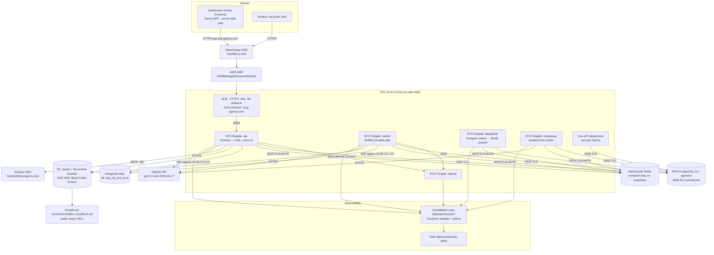

# Production Architecture

> Verified against the deployed stacks 2026-08-03. Both environments share
> this shape; names below use production. Staging differs only in sizing and
> hostnames — see [Environments](environments.md).

## Diagram

## Request path, in words

1. A client resolves `api.dxg-agency.com` (Namecheap CNAME → the ALB's DNS
   name). TLS terminates at the ALB using the ACM wildcard certificate for
   `*.dxg-agency.com`; port 80 issues a permanent 301 to HTTPS.
2. AWS WAF (`AWSManagedCommonRuleSet`, REGIONAL scope on the ALB) filters the
   request.
3. The ALB forwards to the single `api` task on port 8000 (health check:
   `GET /health`, healthy = HTTP 200, 15s interval). ALB idle timeout is
   **180s** — deliberately long because the assistant's SSE stream can be
   silent for up to 120s.
4. The API talks to: MongoDB Atlas (authoritative proposal/user data, via the
   NAT gateway — the NAT's Elastic IP is allowlisted in Atlas), RDS Postgres
   (AI domain: runs, evidence, knowledge, outbox, audit — row-level security
   by tenant), Redis (BullMQ queues and rate limits, reference-only
   payloads), S3 (file storage), SES (email), and OpenAI (live AI).

## Asynchronous work

- The API (and other services) write **outbox events to Postgres** in the
  same transaction as domain changes.
- The **dispatcher** polls the outbox (`FOR UPDATE SKIP LOCKED`, reclaims
  rows stranded in `publishing`) and publishes job messages to **Redis
  (BullMQ)**. Redis is transport-only: if Redis data is lost, the dispatcher
  republishes from the outbox within ~30s.
- The **worker** consumes queues: `security_scan` (ClamAV), `knowledge_parse`,
  `knowledge_index_release`, `proposal_context_extract`,
  `candidate_application`, `proposal_draft_generate`,
  `vendor_response_analyze`. Live-AI job types call OpenAI.
- The **ai-gateway** service runs the platform assistant's job worker
  (`dist/scripts/startAiGatewayWorker.js`). It only exists in environments
  whose AI release enables `AI_GATEWAY_ENABLED` (currently both).
- **Cron jobs run inside the API task only** (`CRON_ENABLED=true` is set
  solely on `api`) — this is why the API must stay at exactly 1 task; the
  crons are not distributed-lock protected.

## Network layout (per environment)

Defined in [`deploy/aws/lib/network-stack.ts`](../../deploy/aws/lib/network-stack.ts):

- VPC (staging `10.40.0.0/16`, production `10.41.0.0/16`), 2 AZs
  (us-east-2a/b), pinned for deterministic synth.
- Subnets: `public` /24 (ALB, NAT), `private` /20 with egress (all ECS
  tasks), `isolated` /24 (RDS, Redis).
- 1 NAT gateway per environment. Egress IPs (allowlisted in Atlas):
  staging `18.223.236.137`, production `13.58.171.171`.
- VPC endpoints keep S3, ECR (api + docker), CloudWatch Logs, and Secrets
  Manager traffic off the NAT.
- VPC Flow Logs capture **rejected** traffic to CloudWatch.
- Security groups — the entire ingress matrix:
  - internet → ALB `:80`/`:443` only
  - ALB → api `:8000` only
  - api, worker → clamav `:3310` (via ECS Service Connect name `clamav`)
  - api, worker, dispatcher, migrate (and ai-gateway, which reuses the
    dispatcher SG) → RDS `:5432` and Redis `:6379`
  - RDS/Redis SGs allow **no outbound** at all.

⚠️ **Known trap**: the ALB listener's own security-group ingress rules are
rendered **inline in the Network stack's template** at synth time. If you add
HTTPS (a cert context) and only deploy the App stack, port 443 stays closed.
After changing listeners, redeploy `Rfpilot-<env>-Network` with the same
contexts. This bit production on 2026-08-03.

## Trust boundaries

- No long-lived AWS keys anywhere: CI assumes per-environment IAM roles via
  GitHub OIDC, branch-locked (`main` → staging role, `production` → prod role).
- ECS tasks use task roles (S3 access is via the task role, not static keys).
- All secrets are injected from Secrets Manager at task start.
- The frontends call the backend **server-side only** (BFF pattern with
  `BFF_SHARED_SECRET`); the backend CORS allowlist is env-var driven and no
  browser-direct calls are required.
