# Deployment

> How a change travels from a laptop to production. The pipeline itself is
> documented step-by-step in [CI/CD](cicd.md); this page is the lifecycle.

## Flow

```mermaid
flowchart LR
    DEV[Developer branch<br/>off ai-agent] --> PR[PR / merge to ai-agent]
    PR --> MAIN[Merge ai-agent → main<br/>CI only, no deploy]
    MAIN --> PROMOTE[git checkout production<br/>git merge --ff-only main<br/>git push]
    PROMOTE --> CI1[GitHub Actions<br/>Deploy to AWS]
    CI1 --> QG[Quality gates<br/>contracts, lint, types,<br/>migration check, 621 tests, build,<br/>cdk synth --strict + cdk-nag]
    QG --> IMG[Docker build<br/>+ Trivy scan]
    IMG --> ECR[Push immutable<br/>sha-&lt;commit&gt; to ECR]
    ECR --> MIG[One-off migrate task<br/>NEW image, services still old]
    MIG --> CDK[cdk deploy App + Observability<br/>--exclusively]
    CDK --> SMOKE[Smoke checks<br/>GET / and /health via ALB]
    SMOKE --> PROD[(Production live)]
```



## Branch model

| Branch | Role |
|---|---|
| `ai-agent` | Day-to-day development (local dev unchanged) |
| `main` | Integration branch: CI only, deploys nothing |
| `production` | **Is** production: pushing deploys production. Only ever fast-forwarded from `main` |

Promotion command (this is the deploy):

```bash
git fetch origin && git checkout production && git merge --ff-only origin/main && git push origin production && git checkout main
```

Doc-only pushes (`**.md`, `docs/**`) do **not** deploy (`paths-ignore`).

## What a deploy does to running services

- The build produces **one image** for all services; they differ only by
  command. On promotion, the image for that exact commit already exists in
  ECR if that commit was built before, and is **reused** (immutable tags;
  the workflow detects and tolerates this).
- **Migrations run before services roll**, as a one-off ECS task using the
  *new* image — so new migration files ship with the code that needs them,
  while traffic still runs on the old image. The pipeline fails hard if the
  migration task exits non-zero.
- Services then roll: worker/dispatcher/clamav/ai-gateway do rolling
  replacement; **the API is stop-then-start** (min 0% / max 100%) because it
  must never run two tasks — expect **~30–60 seconds of API downtime per
  deploy**. Plan production promotions accordingly.
- ECS **deployment circuit breaker** is on with automatic rollback: if new
  tasks fail health checks, ECS reverts to the previous task definition on
  its own.
- Smoke checks then hit `GET /` and `GET /health` through the ALB and fail
  the run if not 200 within ~5 minutes.

## Verifying a deploy

```bash
# Pipeline status
gh run list --repo BayshoreCommunication/dxg-rfp-tool-backend --workflow "Deploy to AWS" --limit 3

# Health
curl -s https://api.dxg-agency.com/health | jq
# Expect: status OK, database connected, postgres.migrationVersion current, queue.ready true

# What's actually running
AWS_PROFILE=rfpilot aws ecs describe-services --region us-east-2 \
  --cluster rfpilot-production --services api worker dispatcher clamav ai-gateway \
  --query 'services[].{name:serviceName,running:runningCount,taskDef:taskDefinition,rollout:deployments[0].rolloutState}'
```

## First deploy of a brand-new environment

CI cannot bootstrap an environment: its migrate step needs the `migrate`
task definition, which the App stack creates. The first App deploy is
manual — full procedure in
[`deploy/aws/README.md` → One-time bootstrap](https://github.com/BayshoreCommunication/dxg-rfp-tool-backend/blob/main/deploy/aws/README.md),
including the cert/domain contexts and the follow-up Network redeploy for
the 443 listener rule. After that one manual deploy, CI owns the cadence.

## Rollback

See [Rollback](rollback.md). Short version: redeploy the previous image tag
with one CDK command, or let the circuit breaker do it for failed rollouts.
